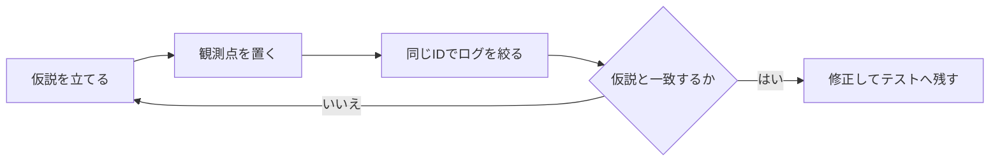

`console.log` を12個並べて、それでも原因が分からなかったことがあります。

出ていたのは大量の事実です。変数の中身も、通った行も、全部見えている。それなのに、どのログを見ても「じゃあ次にどこを調べればいいのか」が一向に浮かんでこなくて、ただスクロールバーだけが短くなっていきました。ログが効くのは、数を増やしたときではありません。調べたい仮説に合わせて、置き場所と中身を決めたときです。

この記事では、注文処理の不具合を追いながらconsoleの使い分けを整理します。目標は、メソッドの暗記ではありません。「どこで何を見れば、次の判断ができるか」をつかむことです。

## 「とりあえず置く」から抜ける

在庫があるはずの商品まで「在庫不足」になるとします。ログを書く前に、確認したい仮説を一文にします。

> 仮説：在庫APIの返却値か、注文数のどちらかが想定と違う。

これだけで、出すべき変数がぐっと減ります。関係のない値を全部出す必要はありません。注文の入口、在庫APIの直後、判定結果。この3か所で足ります。



観測点に書くのは、判断に必要な事実だけ。コードの全行を実況する必要はありません。

## ラベルを付けて、混ざったログを見分ける

非同期処理では、表示順を眺めても処理のまとまりが分かりません。注文が同時に走ると、開始順と完了順が入れ替わるからです。画面には整然と行が並んでいるのに、その3行目と5行目がまったく別の注文の話をしている、ということが平気で起きます。

私はここで一度、別の注文のログを追いかけて30分溶かしました。

対策はひとつです。すべての観測点に、同じ `orderId` と安定したイベント名を付けます。

```js
async function checkout(order) {
  console.info("[checkout:started]", {
    orderId: order.id,
    itemId: order.itemId,
    requested: order.quantity,
  });

  const stock = await fetchStock(order.itemId);
  console.debug("[checkout:stock-loaded]", {
    orderId: order.id,
    stock,
  });

  const enough = stock >= order.quantity;
  console.debug("[checkout:stock-checked]", {
    orderId: order.id,
    requested: order.quantity,
    stock,
    enough,
  });

  if (!enough) {
    console.warn("[checkout:out-of-stock]", { orderId: order.id });
    throw new Error("在庫が不足しています");
  }

  const total = order.unitPrice * order.quantity;
  console.info("[checkout:completed]", { orderId: order.id, total });
  return { orderId: order.id, total };
}
```

`orderId: "order-42"`、注文数3、在庫数2だったとします。3つの観測点はこう読めます。

| 観測点 | 確認できる事実 | 次の判断 |
| --- | --- | --- |
| `checkout:started` | 画面から注文数3が渡った | 画面から処理入口までの値は正しい |
| `checkout:stock-loaded` | 在庫APIが2を返した | 期待が5なら、APIかデータを調べる |
| `checkout:stock-checked` | `3 <= 2` の判定結果が `false` | 分岐は入力どおりに動いている |

この時点で、判定の演算子を疑う理由は消えました。調べるべきは、在庫APIが2を返した理由です。逆に入口の時点で注文数が30になっていたら、APIより先にフォーム値の変換を追います。

次に調べる範囲が狭まった。それなら、その観測点は仕事をしています。

イベント名も少し工夫します。`start` と `end` だけだと、処理順を入れ替えたときに意味が変わってしまう。`stock-loaded` のように「何が起きたか」を名前にしておくと、順番が変わっても読めます。

## `log` と `info`、何が違う？

色や重要度で選ぼうとすると、この2つの境界が毎回あいまいになります。「表示したい情報の形」で選ぶと迷いません。

| 知りたいこと | メソッド | 向いている場面 |
| --- | --- | --- |
| 詳細な途中経過 | `debug` | APIの返却値、計算の中間値 |
| 正常な節目 | `info` | 処理開始、完了 |
| 継続できる異常 | `warn` | 再試行、代替値の採用 |
| 処理の失敗 | `error` | 例外、外部I/Oの失敗 |
| 同じ形の一覧 | `table` | 複数商品の比較 |
| 呼び出し回数 | `count` | 重複実行、イベントの多重登録 |
| 経過時間 | `time` / `timeEnd` | 遅い区間の切り分け |
| 呼び出し元 | `trace` | 意図しない実行経路 |

複数商品の在庫を比べたい。そういうときは、同じ形のオブジェクトを何度も `log` するより `table` です。差が一目で分かります。

```js
const checks = await Promise.all(
  order.items.map(async (item) => ({
    itemId: item.id,
    requested: item.quantity,
    stock: await fetchStock(item.id),
  })),
);

console.table(
  checks.map((item) => ({
    ...item,
    enough: item.stock >= item.requested,
  })),
  ["itemId", "requested", "stock", "enough"],
);
```

ただ、1件を深く見たい場面では `table` よりブレークポイントです。consoleは万能な調査画面ではありません。

## 文字列に潰した瞬間、調べにくくなる

次の2つは、出ている情報量はほぼ同じです。でも調べやすさが違います。

```js
// 型や項目の境界が分かりにくい
console.log("order=" + order.id + " stock=" + stock);

// 項目を展開でき、検索や比較もしやすい
console.log("[checkout:decision]", {
  orderId: order.id,
  requested: order.quantity,
  stock,
  enough: stock >= order.quantity,
});
```

とはいえ、巨大なオブジェクトを丸ごと出すのも困ります。肝心の情報が埋もれる。しかも、あとから追加されたトークンや個人情報まで一緒に記録されかねません。

ログ用の変換関数を挟んで、出してよい項目を明示するほうが安全です。

```js
function toOrderLog(order) {
  return {
    orderId: order.id,
    itemCount: order.items.length,
    total: order.total,
    status: order.status,
  };
}

console.info("[order:loaded]", toOrderLog(order));
```

もうひとつ落とし穴があります。DevToolsでオブジェクトを展開したとき、見えているのは**展開した瞬間の状態**かもしれません。記録時点の値を比べたいなら、必要なプリミティブ値を先に取り出しておいてください。ただ、ログのためだけに全体を複製すると、今度は調査コードのほうが重くなります。さじ加減です。

## `error.message`だけでは原因を追えない

例外は `Error` オブジェクトごと渡します。スタックトレースと `cause` が付いてくるからです。

```js
async function showCheckout(order) {
  try {
    return await checkout(order);
  } catch (error) {
    console.error("[checkout:failed]", {
      orderId: order.id,
      error,
    });

    showMessage("注文を確定できませんでした");
    throw error;
  }
}
```

気をつけたいのは、記録する場所です。各レイヤーで同じ例外を記録すると、1回の失敗が5件のログに見えます。原則、回復する層か、画面・HTTPなどの境界で一度だけ。下位層で情報を足したいときは、元の例外を `cause` に入れて投げ直します。それで足ります。

## ログを増やしても、出てこないもの

ログを足し続ける前に、知りたいことと道具が合っているか確認します。

| 調べたいこと | 使う道具 |
| --- | --- |
| ある瞬間の変数とスコープ | ブレークポイント |
| 誰が関数を呼んだか | Call Stack、`console.trace` |
| HTTPの要求・応答・待ち時間 | Networkパネル |
| 描画や長いタスクの遅さ | Performanceパネル |
| 値を書き換えた箇所 | DOM・XHR/fetch・イベントブレークポイント |
| 同じ不具合の再発防止 | 単体テスト、統合テスト |

console出力は、あくまでその場の事実を知るための観測であって、これから先もその挙動が正しいままであることを保証してくれる仕組みではありません。だから原因を直したら、そのログは消して、代わりに再現テストを残します。

ログは調査の道具。テストは再発防止の道具です。

## 本番のconsoleに出してはいけないもの

アクセストークン、Cookie、パスワード、カード情報、個人情報。ここは例外なしです。ブラウザーのconsoleへ出してはいけません。利用者から見えますし、監査記録としても信頼できないからです。

運用ログで揃えておくと検索しやすいのは、この5つです。

- イベント名
- 日時と重要度
- 注文IDや相関ID
- 判断に必要な少数のフィールド
- スタックを保ったエラー

成功処理の詳細まで全部残すと、保存費用が増えるうえに、肝心の異常が埋もれます。誰が何を判断するためのログなのか。そこを決めてから、保存期間やサンプリングまで含めて設計します。

## 迷子になったら、この順で

1. 期待結果と実際の結果を一文ずつ書く。
2. 確認したい仮説を1つに絞る。
3. 対象を識別するIDを決める。
4. 入口、重要な分岐、外部I/O、出口へ観測点を置く。
5. IDとイベント名で絞り込み、時系列を追う。
6. 状態を詳しく見たくなったらブレークポイントへ切り替える。
7. 修正後に再現テストを追加し、一時ログを削除する。

冒頭の12個のログに戻ります。

あれが効かなかった理由は、数が足りなかったことではありませんでした。仮説を立てないまま「とりあえず全部見えるようにしておこう」と置いたので、どの出力も事実としては正しいのに、そこから次の一手が一つも出てこなかったんです。

ログを増やす前に、一度だけ問い直してみてください。**この出力を見たら、次に何を判断できるのか**。

ここが決まっていれば、3個で足ります。

## 参考資料

- [Console Standard](https://console.spec.whatwg.org/)
- [MDN: console](https://developer.mozilla.org/ja/docs/Web/API/console)
- [Chrome DevTools: Console features reference](https://developer.chrome.com/docs/devtools/console/)
- [MDN: Performance.now()](https://developer.mozilla.org/ja/docs/Web/API/Performance/now)
