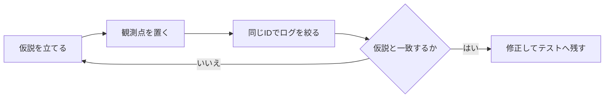

`console.log` を何行追加しても、原因へ近づけるとは限りません。ログが役立つのは、調べたい仮説に合わせて置き場所と内容を決めたときです。

この記事では、注文処理の不具合を追いながら、consoleの使い分けを整理します。メソッドの暗記よりも、「どこで何を観測すれば、次の判断ができるか」をつかむことが目標です。

## デバッグは「仮説→観測→判断」の繰り返し

在庫がある商品まで「在庫不足」になるとします。ログを書く前に、確認したい仮説を一文にします。

> 仮説：在庫APIの返却値か、注文数のどちらかが想定と違う。

この仮説なら、関係のない変数をすべて出す必要はありません。注文の入口、在庫APIの直後、判定結果の3か所を見れば十分です。



観測点には、判断に必要な事実だけを記録します。コードの全行を実況する必要はありません。

## 入口・分岐・I/O・出口を同じIDでつなぐ

非同期処理では、ログの表示順だけを見ても処理のまとまりが分かりません。複数の注文が同時に走ると、開始順と完了順が入れ替わるからです。

そこで、すべての観測点へ同じ `orderId` と安定したイベント名を付けます。

```js
async function checkout(order) {
  console.info("[checkout:started]", {
    orderId: order.id,
    itemId: order.itemId,
    requested: order.quantity,
  });

  const stock = await fetchStock(order.itemId);
  console.debug("[checkout:stock-loaded]", {
    orderId: order.id,
    stock,
  });

  const enough = stock >= order.quantity;
  console.debug("[checkout:stock-checked]", {
    orderId: order.id,
    requested: order.quantity,
    stock,
    enough,
  });

  if (!enough) {
    console.warn("[checkout:out-of-stock]", { orderId: order.id });
    throw new Error("在庫が不足しています");
  }

  const total = order.unitPrice * order.quantity;
  console.info("[checkout:completed]", { orderId: order.id, total });
  return { orderId: order.id, total };
}
```

たとえば、`orderId: "order-42"`、注文数3、在庫数2だった場合は、3つの観測点を次のように読みます。

| 観測点 | 確認できる事実 | 次の判断 |
| --- | --- | --- |
| `checkout:started` | 画面から注文数3が渡った | 画面から処理入口までの値は正しい |
| `checkout:stock-loaded` | 在庫APIが2を返した | 期待が5なら、APIかデータを調べる |
| `checkout:stock-checked` | `3 <= 2` の判定結果が `false` | 分岐は入力どおりに動いている |

この結果なら、在庫判定の演算子を疑うより、在庫APIが2を返した理由へ調査を進めます。反対に、入口ですでに注文数が30になっていれば、APIを調べる前にフォーム値の変換を追います。ログから次に調べる範囲を狭められれば、観測点は役割を果たしています。

この形なら、DevToolsで `checkout` または注文IDを検索するだけで、1件の処理を追えます。`start` や `end` だけでなく、`stock-loaded` のように「何が起きたか」をイベント名にすると、処理順を変更しても意味が残ります。

## consoleメソッドは「知りたいこと」で選ぶ

色や重要度だけでメソッドを選ぶと、`log` と `info` の違いが曖昧になります。次の表のように、表示したい情報の形で選ぶと迷いません。

| 知りたいこと | メソッド | 向いている場面 |
| --- | --- | --- |
| 詳細な途中経過 | `debug` | APIの返却値、計算の中間値 |
| 正常な節目 | `info` | 処理開始、完了 |
| 継続できる異常 | `warn` | 再試行、代替値の採用 |
| 処理の失敗 | `error` | 例外、外部I/Oの失敗 |
| 同じ形の一覧 | `table` | 複数商品の比較 |
| 呼び出し回数 | `count` | 重複実行、イベントの多重登録 |
| 経過時間 | `time` / `timeEnd` | 遅い区間の切り分け |
| 呼び出し元 | `trace` | 意図しない実行経路 |

たとえば複数商品の在庫を比べるなら、同じ形のオブジェクトを何度も `log` するより `table` の方が差を見つけやすくなります。

```js
const checks = await Promise.all(
  order.items.map(async (item) => ({
    itemId: item.id,
    requested: item.quantity,
    stock: await fetchStock(item.id),
  })),
);

console.table(
  checks.map((item) => ({
    ...item,
    enough: item.stock >= item.requested,
  })),
  ["itemId", "requested", "stock", "enough"],
);
```

反対に、値を1件ずつ詳しく調べる場面では `table` よりブレークポイントが適しています。consoleは万能な調査画面ではありません。

## 文字列へ潰さず、構造を保って出す

次の2つは、表示される情報量が似ていても調べやすさが違います。

```js
// 型や項目の境界が分かりにくい
console.log("order=" + order.id + " stock=" + stock);

// 項目を展開でき、検索や比較もしやすい
console.log("[checkout:decision]", {
  orderId: order.id,
  requested: order.quantity,
  stock,
  enough: stock >= order.quantity,
});
```

ただし、巨大なオブジェクトを丸ごと出すと必要な情報が埋もれます。後から追加されたトークンや個人情報まで記録される危険もあります。ログ用の変換関数を用意し、出してよい項目を明示する方が安全です。

```js
function toOrderLog(order) {
  return {
    orderId: order.id,
    itemCount: order.items.length,
    total: order.total,
    status: order.status,
  };
}

console.info("[order:loaded]", toOrderLog(order));
```

ブラウザーのDevToolsでは、オブジェクトを展開した時点の状態が見える場合があります。記録時点の値を比較したいなら、必要なプリミティブ値を取り出してください。ログのためだけにオブジェクト全体を複製すると、今度は調査コードが重くなります。

## Errorは文字列にせず、調査できる形で残す

例外は `error.message` だけでなく、`Error` オブジェクト自体を渡します。スタックトレースや `cause` を確認できるためです。

```js
async function showCheckout(order) {
  try {
    return await checkout(order);
  } catch (error) {
    console.error("[checkout:failed]", {
      orderId: order.id,
      error,
    });

    showMessage("注文を確定できませんでした");
    throw error;
  }
}
```

同じ例外を各レイヤーで記録すると、1回の失敗が何件ものログに見えます。原則として、回復する層か、画面・HTTPなどの境界で一度だけ記録します。下位層で説明を補いたいときは、元の例外を `cause` に残して投げ直します。

## consoleで分からないことは、別の道具へ切り替える

ログを追加し続ける前に、知りたいことと道具が合っているかを確認します。

| 調べたいこと | 使う道具 |
| --- | --- |
| ある瞬間の変数とスコープ | ブレークポイント |
| 誰が関数を呼んだか | Call Stack、`console.trace` |
| HTTPの要求・応答・待ち時間 | Networkパネル |
| 描画や長いタスクの遅さ | Performanceパネル |
| 値を書き換えた箇所 | DOM・XHR/fetch・イベントブレークポイント |
| 同じ不具合の再発防止 | 単体テスト、統合テスト |

console出力は、その場の事実を知るための観測です。将来も正しいことを保証する仕組みではないため、原因を直したら再現テストへ置き換えます。

## 本番ログは検索性と安全性を優先する

ブラウザーconsoleへ、アクセストークン、Cookie、パスワード、カード情報、個人情報を出してはいけません。利用者から見える可能性があり、監査記録としても信頼できないからです。

運用ログでは、次の項目を揃えると検索しやすくなります。

- イベント名
- 日時と重要度
- 注文IDや相関ID
- 判断に必要な少数のフィールド
- スタックを保ったエラー

成功処理の詳細をすべて残すと、保存費用が増え、異常も埋もれます。誰が何を判断するために使うログかを決め、保存期間やサンプリングも含めて設計します。

## 調査が迷走したときの確認順

1. 期待結果と実際の結果を一文ずつ書く。
2. 確認したい仮説を1つに絞る。
3. 対象を識別するIDを決める。
4. 入口、重要な分岐、外部I/O、出口へ観測点を置く。
5. IDとイベント名で絞り込み、時系列を追う。
6. 状態を詳しく見たくなったらブレークポイントへ切り替える。
7. 修正後に再現テストを追加し、一時ログを削除する。

consoleデバッグの要点は、メソッドを何個知っているかではありません。仮説に必要な事実を、同じ処理IDでつなげられるかどうかです。ログを増やす前に、「この出力を見たら次に何を判断できるか」と問い直すと、調査の焦点がぶれにくくなります。

## 参考資料

- [Console Standard](https://console.spec.whatwg.org/)
- [MDN: console](https://developer.mozilla.org/ja/docs/Web/API/console)
- [Chrome DevTools: Console features reference](https://developer.chrome.com/docs/devtools/console/)
- [MDN: Performance.now()](https://developer.mozilla.org/ja/docs/Web/API/Performance/now)
