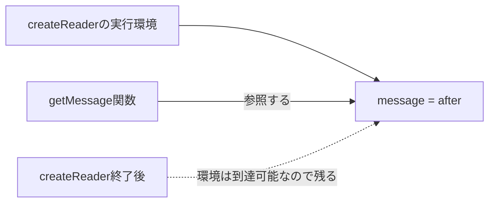

「クロージャは、関数が外側の変数を覚えている仕組みです」

私はこの説明を何度も読んで、何度も分かった気になりました。そして毎回、実際のコードで裏切られました。原因は「覚えている」という言葉です。これを聞くと、関数がその瞬間の値をコピーしてポケットに入れているように聞こえてしまうんですが、実際に持っているのはコピーではなく、外側の変数までたどり着くための道順のほうなんです。

だから、関数を作ったあとに変数が書き換わっていれば、呼び出したときに見えるのは新しい値になります。

ここさえ押さえれば、状態管理もコールバックもキャッシュも、同じ一つの仕組みで説明できます。

## コピーじゃない、という証拠

`getMessage` を作ったあとに、外側の `message` を書き換えてみます。

```js
function createReader() {
  let message = "before";

  const getMessage = () => message;
  message = "after";

  return getMessage;
}

const read = createReader();
console.log(read()); // "after"
```

もし `getMessage` が文字列 `"before"` のコピーを抱えていたなら、答えは `"before"` のはずです。返ってきたのは `"after"` でした。参照している証拠です。



外側の関数はもう終わっています。それでも、返した関数からその変数へたどり着ける間は、環境のほうが残ってくれる。この組み合わせをクロージャと呼びます。

## 同じ関数から作っても、中身は別

クロージャを読むときは、関数の定義だけを見ていても足りません。**どの呼び出しで作られたか**まで見る必要があります。

```js
function createCounter(initial = 0) {
  let count = initial;

  return {
    increment() {
      count += 1;
      return count;
    },
    current() {
      return count;
    },
  };
}

const first = createCounter(0);
const second = createCounter(10);

first.increment();
first.increment();

console.log(first.current());  // 2
console.log(second.current()); // 10
```

`first` と `second` は、同じ `createCounter` から生まれた双子です。でも参照している `count` は別物でした。`createCounter()` を呼ぶたびに、新しい実行環境がまるごと作られるからです。

| 見る対象 | `first` | `second` |
| --- | --- | --- |
| 作られた呼び出し | `createCounter(0)` | `createCounter(10)` |
| 初期値 | 0 | 10 |
| 現在値 | 2 | 10 |
| 状態の共有 | しない | しない |

この性質のおかげで、モジュール全体に変数をばらまかず、関係のある操作だけに状態を触らせられます。

## 隠すだけだと、価値は半分

状態を見えなくする。それだけで満足してしまいがちですが、本当においしいのは次の一手です。更新処理も一緒に閉じ込めると、壊れた状態そのものを作れなくできます。

```js
function createInventory(initialStock) {
  let stock = initialStock;

  return {
    reserve(quantity) {
      if (!Number.isInteger(quantity) || quantity <= 0) {
        throw new TypeError("quantityには正の整数が必要です");
      }
      if (quantity > stock) {
        return { ok: false, reason: "out-of-stock" };
      }

      stock -= quantity;
      return { ok: true, remaining: stock };
    },
    getStock() {
      return stock;
    },
  };
}
```

利用側は `stock = -100` と書けません。在庫を減らす経路が `reserve` の一本に絞られているので、「在庫は0未満にならない」という約束を1か所で守りきれます。

ひとつだけ注意です。クロージャはセキュリティ境界ではありません。うっかりミスを防ぐための設計手段であって、同じプロセスでコードを走らせられる相手から秘密を守る仕組みではないので、そこは期待しないでください。

## 設定を毎回渡すのが面倒になったら

クロージャに閉じ込めるのは、書き換わる状態だけとは限りません。作った時点で決まる設定も入れられます。

```js
function createApiClient({ baseUrl, getToken }) {
  return async function request(path, options = {}) {
    const response = await fetch(`${baseUrl}${path}`, {
      ...options,
      headers: {
        ...options.headers,
        Authorization: `Bearer ${getToken()}`,
      },
    });

    if (!response.ok) {
      throw new Error(`HTTP ${response.status}`);
    }
    return response.json();
  };
}

const request = createApiClient({
  baseUrl: "/api",
  getToken: () => sessionStorage.getItem("token"),
});

const order = await request("/orders/order-42");
```

ここで閉じ込めたのは、トークンの文字列そのものではありません。`getToken` という関数のほうです。だから呼び出すたびに、そのときの最新トークンを読みにいきます。

固定値を閉じ込めるか、取得関数を閉じ込めるか。ここで挙動が変わります。

## 非同期で壊れたら、共有している変数を疑う

「クロージャのせいでバグった」と思う場面のほとんどは、実は複数の非同期処理が同じ変数を分け合っていただけ、というパターンです。

```js
function createSearch(load) {
  let latestRequestId = 0;

  return async function search(query) {
    const requestId = ++latestRequestId;
    const result = await load(query);

    if (requestId !== latestRequestId) {
      return { status: "stale" };
    }
    return { status: "current", result };
  };
}
```

検索Aを投げて、続けて検索Bを投げる。そのあとにAだけが遅れて返ってきた、という場面を考えてみてください。AもBも同じ `latestRequestId` を見ているので、Aは「自分はもう古い」と気づけます。

一方で、各呼び出しの中にある `requestId` は完全に別物です。

**呼び出し間で共有される変数**と、**その呼び出しだけの変数**。この2つを見分けられるようになると、競合の原因追跡がぐっと楽になります。

## 「あれ、値が変わらない」の正体

### `var` のループ

`var` はブロックスコープを作りません。だから、全部のコールバックが同じ `i` を見ています。

```js
const handlers = [];

for (var i = 0; i < 3; i += 1) {
  handlers.push(() => i);
}

console.log(handlers.map((handler) => handler())); // [3, 3, 3]
```

`let` に変えれば、反復ごとに別の束縛が作られます。結果を決めているのは「どの変数を参照したか」だけ。それ以上でも以下でもありません。

### 古い値が固まって見える

作成時に計算してしまった文字列や数値は、そのあと更新されません。オブジェクトを参照し続ける場合とは、まったく挙動が違います。

```js
function createStatus(user) {
  const label = `${user.name}: ${user.score}`;
  return () => label;
}
```

あとから `user.score` を変えても `label` は知らんぷりです。最新値がほしいなら、返す関数の**中で** `${user.name}: ${user.score}` を組み立てます。

## メモリは「まだ手が届くか」で考える

クロージャがある変数を参照している間は、その変数から先にぶら下がっている値もメモリに残り続けます。大きな配列やDOM要素を抱えた関数を、ページが生きている限り外れないイベントリスナーに登録したとき、これが効いてきます。

見るべきは3点です。

- その関数はどこから参照され続けているか
- 関数が参照する環境に大きな値がないか
- イベント解除やタイマー停止で参照を切れるか

クロージャ自体がリークなのではありません。もう要らない値に手が届く経路を、残したままにしていることが問題です。

## クラスとモジュールと、どう使い分ける？

| 手段 | 向いている状態 | 特徴 |
| --- | --- | --- |
| クロージャ | 小さな関数群だけで共有する状態 | 状態と操作を狭い範囲へ閉じ込めやすい |
| `class` | 複数の操作を持つ明確なオブジェクト | 型やインスタンスとして追いやすい |
| ES Modules | アプリ全体・機能全体で共有する状態 | モジュール単位で1つの状態になりやすい |
| `#private` フィールド | クラスの内部状態 | 実行時にも外部アクセスを拒否する |

常に正解の一つがあるわけではありません。判断材料は、状態の寿命・共有範囲・操作の数の3つです。クロージャで書いていて読みにくくなってきたら、どの関数がどの変数を共有しているかを一度紙に描いてみて、状態の持ち主を1つのオブジェクトとして立てたほうが素直じゃないか、と考え直してみてください。

---

冒頭の「覚えている」に戻ります。この言葉を、次の3つの質問に置き換えてしまうのが一番確実でした。

1. その関数はどこで作られたか。
2. どの外側の変数を参照しているか。
3. その関数はどこから、いつまで参照されるか。

独立した状態も、古い値も、非同期の競合も、メモリ保持も、全部これで説明がつきます。覚えているのではありません。指さしているだけ。そう読み替えてください。

## 参考資料

- [MDN: Closures](https://developer.mozilla.org/ja/docs/Web/JavaScript/Guide/Closures)
- [ECMAScript: Lexical Environments](https://tc39.es/ecma262/multipage/executable-code-and-execution-contexts.html#sec-lexical-environments)
- [ECMAScript: For-in/of body evaluation](https://tc39.es/ecma262/multipage/ecmascript-language-statements-and-declarations.html#sec-runtime-semantics-forin-div-ofbodyevaluation-lhs-stmt-iterator-lhskind-labelset)
