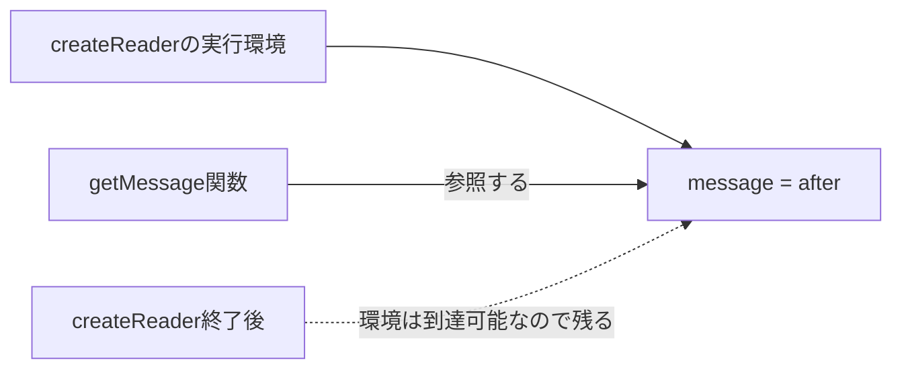

クロージャは「関数が外側の変数を覚える仕組み」と説明されます。ただし、この言い方だけでは、値のコピーを保存しているようにも聞こえます。

実際に関数が保持するのは、外側の変数へたどり着くための参照です。そのため、関数を作った後に変数が変われば、呼び出し時には新しい値が見えます。まずはこの一点を押さえると、状態管理、コールバック、キャッシュの挙動を同じ仕組みとして理解できます。

## 関数は作られた場所の変数を参照する

次の例では、`getMessage` の外側にある `message` を後から変更しています。

```js
function createReader() {
  let message = "before";

  const getMessage = () => message;
  message = "after";

  return getMessage;
}

const read = createReader();
console.log(read()); // "after"
```

`getMessage` が保存しているのが文字列 `"before"` のコピーなら、結果は `"before"` になるはずです。しかし、実際には変数 `message` を参照しているため、更新後の `"after"` が返ります。



外側の関数が終了しても、返した関数から変数へ到達できる間は、その環境が残ります。この組み合わせをクロージャと呼びます。

## 呼び出しごとに別の環境が作られる

クロージャを理解するには、関数定義だけでなく「どの呼び出しで作られたか」を見る必要があります。

```js
function createCounter(initial = 0) {
  let count = initial;

  return {
    increment() {
      count += 1;
      return count;
    },
    current() {
      return count;
    },
  };
}

const first = createCounter(0);
const second = createCounter(10);

first.increment();
first.increment();

console.log(first.current());  // 2
console.log(second.current()); // 10
```

`first` と `second` は同じ関数から作られていますが、参照する `count` は別です。`createCounter()` を呼ぶたびに新しい実行環境が作られるためです。

| 見る対象 | `first` | `second` |
| --- | --- | --- |
| 作られた呼び出し | `createCounter(0)` | `createCounter(10)` |
| 初期値 | 0 | 10 |
| 現在値 | 2 | 10 |
| 状態の共有 | しない | しない |

この性質を使うと、モジュール全体へ変数を公開せず、関係する操作だけに状態を触らせられます。

## 隠すだけでなく、不正な状態を作らせない

状態を見えなくするだけでは設計上の価値は半分です。更新処理も一緒に閉じ込めると、不変条件を守れます。

```js
function createInventory(initialStock) {
  let stock = initialStock;

  return {
    reserve(quantity) {
      if (!Number.isInteger(quantity) || quantity <= 0) {
        throw new TypeError("quantityには正の整数が必要です");
      }
      if (quantity > stock) {
        return { ok: false, reason: "out-of-stock" };
      }

      stock -= quantity;
      return { ok: true, remaining: stock };
    },
    getStock() {
      return stock;
    },
  };
}
```

利用側は `stock = -100` のような変更を直接行えません。在庫を減らす経路を `reserve` に限定したため、「在庫は0未満にならない」という規則を1か所で守れます。

ただし、クロージャはセキュリティ境界ではありません。意図しない変更を防ぐための設計手段であり、同じプロセスでコードを実行できる相手から秘密情報を完全に守るものではありません。

## 設定を一度だけ受け取り、関数へ埋め込む

クロージャは可変状態だけでなく、作成時に決まる設定にも使えます。次の `createApiClient` は、呼び出しごとに `baseUrl` とトークンを渡す手間を省きます。

```js
function createApiClient({ baseUrl, getToken }) {
  return async function request(path, options = {}) {
    const response = await fetch(`${baseUrl}${path}`, {
      ...options,
      headers: {
        ...options.headers,
        Authorization: `Bearer ${getToken()}`,
      },
    });

    if (!response.ok) {
      throw new Error(`HTTP ${response.status}`);
    }
    return response.json();
  };
}

const request = createApiClient({
  baseUrl: "/api",
  getToken: () => sessionStorage.getItem("token"),
});

const order = await request("/orders/order-42");
```

ここで閉じ込めているのは `getToken` 関数です。そのため、呼び出し時点の最新トークンを読めます。固定値と取得関数のどちらを閉じ込めるかで、更新時の挙動が変わります。

## 非同期処理では、共有している可変状態を確認する

クロージャが原因に見える不具合の多くは、複数の非同期処理が同じ変数を共有していることから起きます。

```js
function createSearch(load) {
  let latestRequestId = 0;

  return async function search(query) {
    const requestId = ++latestRequestId;
    const result = await load(query);

    if (requestId !== latestRequestId) {
      return { status: "stale" };
    }
    return { status: "current", result };
  };
}
```

検索Aの後に検索Bを始め、Aが遅れて完了した場合を考えます。両方の呼び出しは同じ `latestRequestId` を参照するため、Aの結果が古いと判定できます。

一方、各呼び出しのローカル変数 `requestId` は別々です。「作成した関数の呼び出し間で共有される変数」と「その呼び出しだけの変数」を区別すると、競合を追いやすくなります。

## よくあるつまずきは参照先を図にする

### `var` を使ったループ

`var` はブロックスコープを作らないため、各コールバックが同じ `i` を参照します。

```js
const handlers = [];

for (var i = 0; i < 3; i += 1) {
  handlers.push(() => i);
}

console.log(handlers.map((handler) => handler())); // [3, 3, 3]
```

`let` を使うと、反復ごとに別の束縛が作られます。結果を決めるのは、各クロージャがどの変数を参照したかです。

### 古い値を閉じ込めたように見える

作成時に計算した文字列や数値を閉じ込めると、その値は更新されません。元のオブジェクトを参照し続ける場合とは挙動が異なります。

```js
function createStatus(user) {
  const label = `${user.name}: ${user.score}`;
  return () => label;
}
```

後で `user.score` を変えても `label` は再計算されません。最新値が必要なら、返す関数の中で `${user.name}: ${user.score}` を組み立てます。

## メモリは「到達できるか」で考える

クロージャが変数を参照している間、その変数から到達できる値もメモリに残り得ます。大きな配列やDOM要素を閉じ込めた関数を、長寿命のイベントリスナーへ登録すると影響が大きくなります。

参照関係を調べる観点は3つあります。

- その関数はどこから参照され続けているか
- 関数が参照する環境に大きな値がないか
- イベント解除やタイマー停止で参照を切れるか

クロージャそのものがリークなのではありません。不要になった値へ到達できる経路を残し続けることが問題です。

## クラス・モジュール・クロージャを使い分ける

| 手段 | 向いている状態 | 特徴 |
| --- | --- | --- |
| クロージャ | 小さな関数群だけで共有する状態 | 状態と操作を狭い範囲へ閉じ込めやすい |
| `class` | 複数の操作を持つ明確なオブジェクト | 型やインスタンスとして追いやすい |
| ES Modules | アプリ全体・機能全体で共有する状態 | モジュール単位で1つの状態になりやすい |
| `#private` フィールド | クラスの内部状態 | 実行時にも外部アクセスを拒否する |

どれが常に優れているわけでもありません。状態の寿命、共有範囲、操作の数が選択基準です。クロージャが読みにくくなったら、どの関数がどの変数を共有しているかを図にし、状態の所有者を1つのオブジェクトとして表した方がよいか検討します。

クロージャを読むときは、次の3点を順に確認してください。曖昧な「覚えている」という表現を、参照関係へ置き換えられます。

1. その関数はどこで作られたか。
2. どの外側の変数を参照しているか。
3. その関数はどこから、いつまで参照されるか。

この順で追えば、独立した状態、古い値、非同期処理の競合、メモリ保持を同じモデルで説明できます。

## 参考資料

- [MDN: Closures](https://developer.mozilla.org/ja/docs/Web/JavaScript/Guide/Closures)
- [ECMAScript: Lexical Environments](https://tc39.es/ecma262/multipage/executable-code-and-execution-contexts.html#sec-lexical-environments)
- [ECMAScript: For-in/of body evaluation](https://tc39.es/ecma262/multipage/ecmascript-language-statements-and-declarations.html#sec-runtime-semantics-forin-div-ofbodyevaluation-lhs-stmt-iterator-lhskind-labelset)
