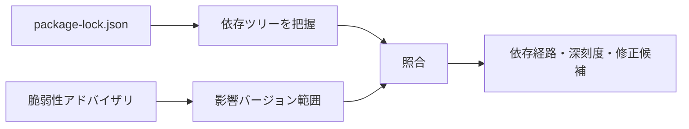
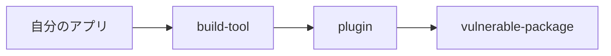
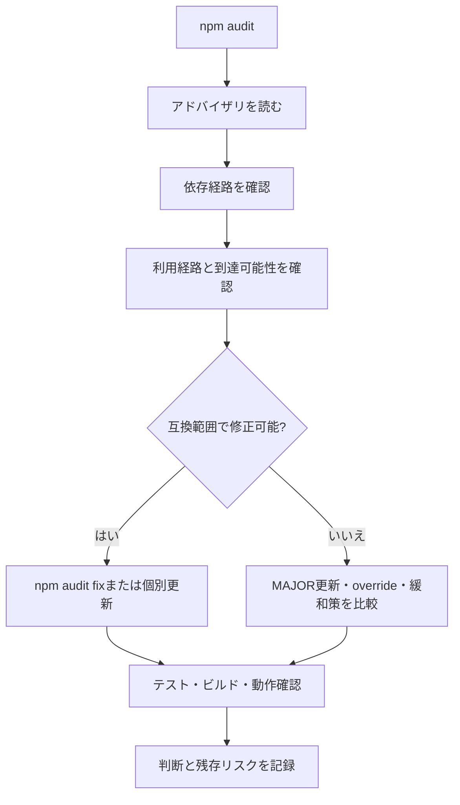

`npm install` の後に脆弱性が表示されると、すぐ `npm audit fix --force` を実行したくなります。しかし、`--force` は「安全に直す」オプションではありません。`package.json` の許容範囲を越えた更新を含め、破壊的変更を受け入れて修正を試すオプションです。

脆弱性対応の目的は、表示件数を0にすることではありません。自分のアプリケーションが影響を受ける経路を理解し、機能を壊さず、残るリスクも説明できる状態にすることです。

## `npm audit` は依存ツリーとアドバイザリを照合する

`npm audit` は、ロックファイルなどから現在の依存ツリーを読み、既知の脆弱性情報と照合します。



```sh
npm audit
npm audit --json
```

結果には、影響を受けるパッケージ、深刻度、依存経路、修正版の有無などが表示されます。ただし、監査結果だけでは「自分のアプリで攻撃可能か」までは分かりません。脆弱な処理を実際に使っているか、外部入力がその処理へ届くかは、アプリ側で確認します。

また、監査データベースに未登録の問題や、自作コードの脆弱性は検出できません。`0 vulnerabilities` は、確認時点のアドバイザリと現在の依存ツリーに一致がなかったという意味です。安全性全体の証明ではありません。

## `npm audit fix` が行うのは依存更新

```sh
npm audit fix
```

このコマンドは特別なパッチをソースコードへ当てるのではなく、脆弱性のないバージョンへ依存ツリーを更新できるか試します。通常は `package.json` で許可された範囲内の変更を中心に行い、`package-lock.json` や `node_modules` が変わります。

修正後は通常の依存更新と同じく、差分と動作を確認する必要があります。

```sh
git diff -- package.json package-lock.json
npm test
npm run build
```

監査表示が消えたかだけでなく、型検査、テスト、ビルド、主要画面やAPIの動作が保たれているかを見ます。

## `--force` は `package.json` の範囲外も候補にする

```sh
npm audit fix --force
```

`--force` を付けると、SemVer上の `MAJOR` 更新など、現在の依存指定が許可しない変更を提案・適用する可能性があります。

| 実行 | 更新の考え方 | 主なリスク |
| --- | --- | --- |
| `npm audit fix` | 互換範囲内を中心に解決 | ロックファイルの変化、推移的依存の更新 |
| `npm audit fix --force` | 範囲外の更新も許可 | API変更、設定変更、ランタイム要件変更 |

たとえばビルドツールの `MAJOR` バージョンが上がれば、設定ファイル、プラグイン、Node.js要件まで変わることがあります。脆弱性を1件消す代わりにビルドが壊れれば、修正は完了していません。

`--force` を使うこと自体が常に誤りではありません。変更内容と移行を理解し、通常の `MAJOR` 更新として扱える場合に限って使います。

## 深刻度だけで優先順位を決めない

CriticalやHighは重要なシグナルですが、対応順には利用状況も含めます。

| 確認軸 | 質問 |
| --- | --- |
| 実行環境 | 本番用の依存パッケージか、開発時だけか |
| 到達可能性 | 脆弱な関数やコード パスを使っているか |
| 入力経路 | 攻撃者が値を制御できるか |
| 権限 | 成功時に何へアクセスできるか |
| 公開範囲 | インターネット公開か、内部ツールか |
| 修正版 | 互換バージョンに修正があるか |

開発依存パッケージでも、インストールスクリプトやビルドサーバーを通じてリスクになる場合があります。反対に、本番用の依存パッケージでも脆弱な機能を使っておらず、外部入力が届かないことがあります。

「開発時の依存だから無視」「Criticalだから即 `--force`」という一行判断を避け、アドバイザリの攻撃条件と自分の利用経路をつなげて考えます。

## 最初に依存経路を確認する

問題のパッケージを直接インストールしたとは限りません。別パッケージが内部で使う推移的依存かもしれません。

```sh
npm explain vulnerable-package
npm ls vulnerable-package
```

依存経路を図にすると、修正すべき対象が見えます。



この場合、`vulnerable-package` を直接依存パッケージへ追加しても、プラグインが使うバージョンを安全に置き換えられるとは限りません。上位の `build-tool` や `plugin` を更新する、メンテナーの対応を待つ、互換性を確認してオーバーライドする、といった選択になります。

## 変更前に `dry-run` と差分の基準を作る

作業を始める前に、現在の状態をコミットするか、少なくとも作業ツリーがクリーンか確認します。監査修正と他の機能変更が混ざると、ロックファイル差分の原因を追えません。

```sh
git status --short
npm audit fix --dry-run
```

ドライランでは、変更候補を実際のインストール前に確認できます。パッケージマネージャーのバージョンや依存状況によって出力は変わるため、最終的な差分確認の代わりにはなりません。

確認したいのは次の点です。

- 直接依存のどれが更新されるか。
- `MAJOR` バージョンが変わるか。
- `package.json` の範囲が変わるか。
- ロックファイルで対象外のパッケージまで大きく変わらないか。
- Node.jsやフレームワークの対応バージョンが変わらないか。

## 安全な対応手順



### 1. 監査結果の事実を読む

パッケージ名、影響バージョン、脆弱性の種類、攻撃条件、修正版を確認します。npmの要約だけで判断せず、リンクされたアドバイザリや上流パッケージのリリース情報まで読みます。

### 2. 自分の依存経路を特定する

`npm explain` で、どの直接依存から入ったかを確認します。複数経路がある場合、1つの上位パッケージを更新しても別経路が残ることがあります。

### 3. 実際の利用状況を調べる

脆弱なAPIを `import` しているか、設定で有効になっているか、外部入力が届くかをコードと実行環境から確認します。到達しないと判断した場合も、根拠を残します。

### 4. 互換範囲内の修正を先に試す

```sh
npm audit fix
```

または、原因となる直接依存を個別に更新します。

```sh
npm install direct-package@compatible-version
```

個別更新の方が変更意図と差分を小さく保ちやすい場合があります。

### 5. 契約を検証する

自動テストだけでなく、そのパッケージが担当する主要な動作を確認します。ビルドツールなら本番ビルド、ルーターなら画面遷移、認証ライブラリならログインと権限制御、といった具合です。

### 6. 残るリスクと期限を記録する

すぐ修正できない場合、影響範囲、緩和策、担当者、再確認日をIssueやセキュリティ記録へ残します。「後で対応」だけでは忘れられます。

## 推移的依存には `overrides` を使える場合がある

上位パッケージが古い依存を固定している場合、npmの `overrides` でバージョンを指定できます。

```json
{
  "overrides": {
    "vulnerable-package": "3.2.1"
  }
}
```

これは強力ですが、上位パッケージがそのバージョンを想定していない可能性があります。型が通るだけでなく、該当機能のテストが必要です。

オーバーライドを恒久的な解決にしないため、追加理由、確認した互換性、削除条件を記録します。上流パッケージが正式に更新されたらオーバーライドを外し、通常の依存解決へ戻します。

## `--force` を使うなら `MAJOR` 更新として扱う

次の条件を満たす場合、`--force` が現実的な選択になることがあります。

- 修正版が範囲外にしかない。
- 脆弱性の到達可能性と影響が高い。
- 移行ガイドを確認した。
- 変更対象を分離したブランチで試せる。
- 十分な自動テストと手動確認がある。
- ロールバック方法を用意できる。

実行前後のレポートと差分を保存します。

```sh
npm audit --json > audit-before.json
npm audit fix --force
git diff -- package.json package-lock.json
npm test
npm run build
npm audit --json > audit-after.json
```

監査JSONは作業記録として扱い、リポジトリへ残す必要がなければ適切に削除します。件数が減ったことと、アプリが正しく動くことは別々に検証します。

## 修正版がない場合の選択肢

修正版が公開されていない、または上位パッケージが追従していない場合、選択肢は1つではありません。

| 選択肢 | 確認すること |
| --- | --- |
| 該当機能を無効化 | 攻撃経路を本当に閉じられるか |
| 入力制限・権限制限 | 緩和策を迂回できないか |
| 代替パッケージへ移行 | 保守状況、互換性、移行コスト |
| 上流の修正を待つ | 期限、監視方法、暫定策 |
| フォーク / パッチ | 自分たちが保守を引き受けられるか |
| リスクを受容 | 根拠、承認、再評価日 |

無視することと、リスクを評価して期限付きで受容することは違います。後者は、何が変わったら判断を見直すかまで含みます。

## 脆弱性は件数より到達経路で判断する

`npm audit` の出力は、調査の開始地点です。対応完了を「表示が0件になった」とだけ定義すると、不要な破壊的更新を選んだり、修正版のない重要なリスクを放置したりします。

修正版へ更新できる場合は、依存差分と主要機能の契約を検証できた時点で完了です。すぐ更新できない場合でも、攻撃経路を閉じる緩和策、担当者、再確認日を記録できれば、管理された残存リスクとして扱えます。どちらの場合も、アドバイザリから自分のコードまでの到達経路を説明できることが判断の土台です。

`--force` は最後に押す特別なボタンではなく、通常の `MAJOR` 更新と同じ準備が必要な手段です。自動化へ判断を任せず、何が変わり、どの契約を確認したかまで説明できる状態で使ってください。

## 参考資料

- [npm Docs: npm audit](https://docs.npmjs.com/cli/commands/npm-audit)
- [npm Docs: npm audit signatures](https://docs.npmjs.com/cli/commands/npm-audit#audit-signatures)
- [npm Docs: package.json overrides](https://docs.npmjs.com/cli/configuring-npm/package-json#overrides)
- [GitHub Advisory Database](https://github.com/advisories)
- [OWASP: Vulnerable and Outdated Components](https://owasp.org/Top10/A06_2021-Vulnerable_and_Outdated_Components/)
