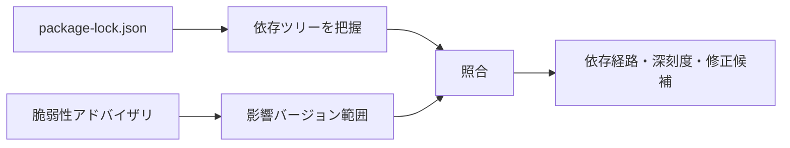
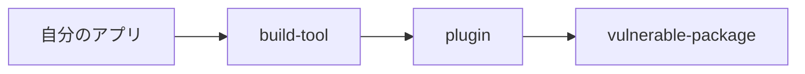
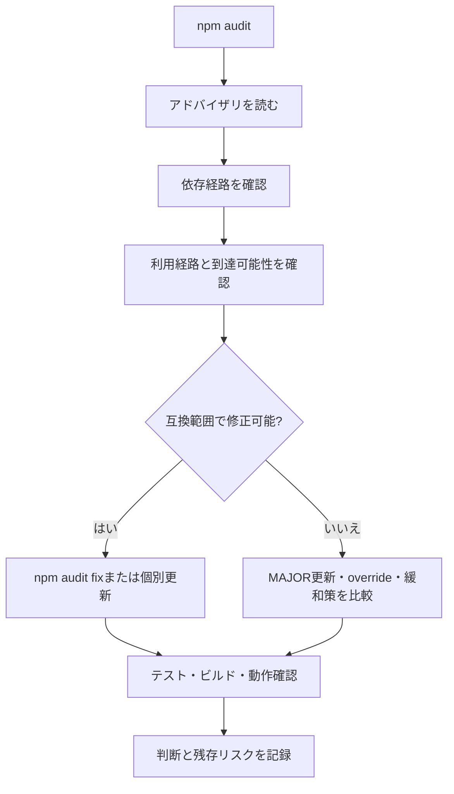

```
23 vulnerabilities (4 high, 2 critical)
```

`npm install` のあとにこれが出ると、指が勝手に `npm audit fix --force` を打ちに行きませんか。私は行きます。赤い文字を消したい。それだけの理由で。

ただ `--force` は「安全に直してくれる」オプションではありません。`package.json` で許した範囲を飛び越えた更新も含めて、破壊的変更を受け入れたうえで修正を試す。そういうオプションです。

脆弱性対応のゴールは、この数字を0にすることではありません。自分のアプリがどの経路で影響を受けるのかを理解して、機能を壊さず、残ったリスクを人に説明できる状態にすること。ここを取り違えると、`--force` はただの時限爆弾になります。

## そもそも何と何を突き合わせているのか

`npm audit` がやっているのは、照合です。ロックファイルなどから今の依存ツリーを読み、既知の脆弱性情報と突き合わせます。



```sh
npm audit
npm audit --json
```

出てくるのは、影響を受けるパッケージ、深刻度、依存経路、修正版の有無。ここまでです。

**「自分のアプリで攻撃が成立するか」までは分かりません。** 脆弱な処理を実際に呼んでいるのか、外部入力がそこまで届くのか。それはアプリ側でしか確認できません。

もうひとつ。データベースに未登録の問題や、自分で書いたコードの穴は検出されません。`0 vulnerabilities` の意味は「確認した時点のアドバイザリと、今の依存ツリーに一致がなかった」であって、安全の証明ではないんです。

## `npm audit fix`が自動で直せる範囲は限られる

```sh
npm audit fix
```

このコマンド、ソースコードに特別なパッチを当てているように見えますが、やっているのは地味な作業です。脆弱性のないバージョンへ依存ツリーを更新できるか、試しているだけ。ふつうは `package.json` が許した範囲内での変更が中心で、変わるのは `package-lock.json` と `node_modules` です。

つまり、これはただの依存更新です。だったら確認することも、いつもの依存更新と同じになります。

```sh
git diff -- package.json package-lock.json
npm test
npm run build
```

見るのは監査表示が消えたかどうかだけではありません。型検査、テスト、ビルド、主要な画面とAPI。ここまで通って、はじめて終わりです。

## `--force` が踏み越えていく線

```sh
npm audit fix --force
```

`--force` を付けると、SemVerの `MAJOR` 更新のように、いまの依存指定が許可していない変更まで候補に入ります。

| 実行 | 更新の考え方 | 主なリスク |
| --- | --- | --- |
| `npm audit fix` | 互換範囲内を中心に解決 | ロックファイルの変化、推移的依存の更新 |
| `npm audit fix --force` | 範囲外の更新も許可 | API変更、設定変更、ランタイム要件変更 |

たとえばビルドツールのメジャーが1つ上がると、設定ファイルの書式が変わり、プラグインが軒並み非対応になり、要求されるNode.jsのバージョンまで動くことがあります。脆弱性を1件消した代償にビルドが通らなくなったなら、それは修正が終わっていません。

とはいえ、`--force` が常に悪だとは思いません。変更内容と移行手順を理解したうえで、**ふつうのメジャーアップデートとして扱える**なら、使っていい手段です。

## Criticalだから最優先、とは限らない

CriticalやHighは大事なシグナルです。ただ、対応順を決めるのはそれだけではありません。

| 確認軸 | 質問 |
| --- | --- |
| 実行環境 | 本番用の依存パッケージか、開発時だけか |
| 到達可能性 | 脆弱な関数やコードパスを使っているか |
| 入力経路 | 攻撃者が値を制御できるか |
| 権限 | 成功時に何へアクセスできるか |
| 公開範囲 | インターネット公開か、内部ツールか |
| 修正版 | 互換バージョンに修正があるか |

開発用の依存だから無害、とも言い切れません。インストールスクリプトやビルドサーバー経由で刺さることがあります。逆に、本番の依存でも脆弱な機能をまったく使っておらず、外部入力が一生届かないケースもあります。

「開発依存だから無視」も「Criticalだから即 `--force`」も、どちらも一行で片付けすぎです。アドバイザリに書かれた攻撃条件と、自分のコードの利用経路。この2つを線でつないでから決めます。

## まず、どこから入ってきたのかを見る

そのパッケージ、自分で入れた覚えがありますか。

たいてい、ないです。別のパッケージが内部で使っている推移的依存であることのほうが多い。

```sh
npm explain vulnerable-package
npm ls vulnerable-package
```

経路を図にすると、直すべき対象が見えてきます。



この形のとき、`vulnerable-package` を自分の直接依存に足しても解決するとは限りません。プラグインが使うバージョンを置き換えられる保証がないからです。現実的な選択肢は、上位の `build-tool` や `plugin` を更新する、メンテナーの対応を待つ、互換性を確かめたうえでオーバーライドする、あたりになります。

## 差分が読める状態を先に作る

作業前に、いまの状態をコミットしておくか、少なくとも作業ツリーがクリーンなことを確認します。

これを飛ばすと痛い目を見ます。監査修正と機能変更が混ざったロックファイルの差分は、もう誰にも読めません。

```sh
git status --short
npm audit fix --dry-run
```

ドライランなら、インストール前に変更候補を覗けます。ただしパッケージマネージャーのバージョンや依存状況で出力が変わるので、最終的な差分確認の代わりにはなりません。

見るのはこの5点です。

- 直接依存のどれが更新されるか。
- `MAJOR` バージョンが変わるか。
- `package.json` の範囲が変わるか。
- ロックファイルで対象外のパッケージまで大きく変わらないか。
- Node.jsやフレームワークの対応バージョンが変わらないか。

## 実際の手順



### 1. 事実だけを読む

パッケージ名、影響バージョン、脆弱性の種類、攻撃条件、修正版。npmの要約だけで決めず、リンク先のアドバイザリと上流のリリースノートまで開きます。

### 2. 経路を特定する

`npm explain` で、どの直接依存から入ったのかを見ます。経路が複数あるときは要注意です。上位パッケージを1つ更新しても、別の経路が生き残ります。

### 3. 本当に使っているか調べる

脆弱なAPIを `import` しているか。設定で有効になっているか。外部入力がそこへ届くか。コードと実行環境の両方から確認します。「届かない」と判断したときも、その根拠は残しておいてください。

### 4. 互換範囲から試す

```sh
npm audit fix
```

あるいは、原因になっている直接依存を名指しで更新します。

```sh
npm install direct-package@compatible-version
```

個別更新のほうが、変更の意図が差分に残りやすいです。

### 5. 契約を検証する

自動テストを通すだけでは足りません。そのパッケージが担当している主要な動作を、実際に触ります。ビルドツールなら本番ビルド、ルーターなら画面遷移、認証ライブラリならログインと権限制御。

### 6. 残ったものを書き留める

すぐ直せないときは、影響範囲・緩和策・担当者・再確認日をIssueかセキュリティ記録に残します。「あとで対応」は、忘れるという意味です。

## `overrides`で間接依存のバージョンを指定する

上位パッケージが古い依存を握って離さないとき、npmの `overrides` でバージョンを指定できます。

```json
{
  "overrides": {
    "vulnerable-package": "3.2.1"
  }
}
```

強力です。強力なぶん、上位パッケージがそのバージョンを想定していない可能性を背負います。型が通っただけで安心せず、該当機能のテストまでやってください。

そして、これを永住させないこと。追加した理由、確認した互換性、外す条件をセットで書き残します。上流が正式に更新されたらオーバーライドを削除して、ふつうの依存解決に戻します。

## それでも `--force` を使うなら

次の条件が揃っているなら、現実的な選択肢になります。

- 修正版が範囲外にしかない。
- 脆弱性の到達可能性と影響が高い。
- 移行ガイドを確認した。
- 変更対象を分離したブランチで試せる。
- 十分な自動テストと手動確認がある。
- ロールバック方法を用意できる。

実行の前後で、レポートと差分を保存しておきます。

```sh
npm audit --json > audit-before.json
npm audit fix --force
git diff -- package.json package-lock.json
npm test
npm run build
npm audit --json > audit-after.json
```

監査JSONは作業記録です。リポジトリに残す必要がなければ、あとで消してください。件数が減ったことと、アプリがちゃんと動くこと。この2つは別々に検証します。

## 修正版が、そもそも無いとき

上流が対応していない。上位パッケージも追従していない。よくあります。

打つ手は1つではありません。

| 選択肢 | 確認すること |
| --- | --- |
| 該当機能を無効化 | 攻撃経路を本当に閉じられるか |
| 入力制限・権限制限 | 緩和策を迂回できないか |
| 代替パッケージへ移行 | 保守状況、互換性、移行コスト |
| 上流の修正を待つ | 期限、監視方法、暫定策 |
| フォーク / パッチ | 自分たちが保守を引き受けられるか |
| リスクを受容 | 根拠、承認、再評価日 |

無視することと、評価したうえで期限付きに受け入れることは、まったく別の行為です。後者には「何が変わったら判断を見直すか」まで含まれます。

## 結局、数字ではなく経路

`npm audit` の出力はゴールではなく、調査のスタート地点でした。

完了の定義を「表示が0件」に置いた瞬間、要らない破壊的更新を選んでしまったり、修正版のない本当に危ないものを放置してしまったりします。

更新できるなら、依存差分と主要機能の契約を確認できた時点で完了。すぐ更新できないなら、攻撃経路を閉じる緩和策と担当者と再確認日を書き残せた時点で、管理された残存リスクになります。どちらにしても土台は同じで、アドバイザリから自分のコードまでの到達経路を、自分の言葉で説明できるかどうかです。

冒頭の指に戻ります。`--force` は最後に押す特別な赤いボタンではありません。ふつうのメジャーアップデートと同じ準備が要る、ただの手段です。

## 参考資料

- [npm Docs: npm audit](https://docs.npmjs.com/cli/commands/npm-audit)
- [npm Docs: npm audit signatures](https://docs.npmjs.com/cli/commands/npm-audit#audit-signatures)
- [npm Docs: package.json overrides](https://docs.npmjs.com/cli/configuring-npm/package-json#overrides)
- [GitHub Advisory Database](https://github.com/advisories)
- [OWASP: Vulnerable and Outdated Components](https://owasp.org/Top10/A06_2021-Vulnerable_and_Outdated_Components/)
