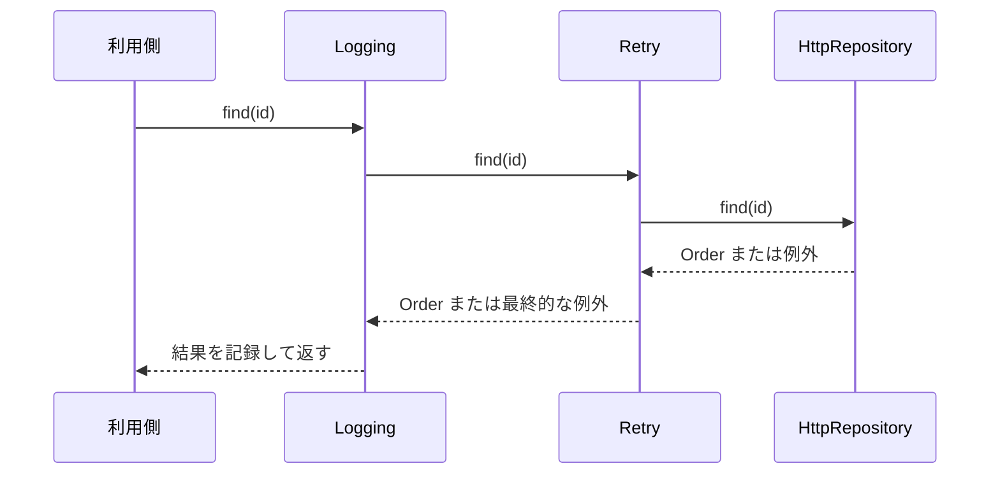

ログ、再試行、計測、キャッシュなどは、多くの処理へ横断的に加えたくなる機能です。元のクラスへ直接書き足すと、本来の処理が補助機能に埋もれます。継承で組み合わせようとすると、必要な組み合わせごとにサブクラスが増えます。

Decoratorパターンは、元と同じ契約を持つオブジェクトで外側から包み、呼び出しの前後へ責務を追加します。包んだ後も同じ型として使えることが中心です。

以下のコード例は設計上の役割へ焦点を当てた抜粋です。`Order` や `Logger` など、題意と直接関係しない型と補助関数の定義は省略しています。

## 横断処理が本体へ混ざると、主な流れが読めない

```ts
class HttpOrderRepository implements OrderRepository {
  async find(id: string): Promise<Order> {
    const startedAt = performance.now();
    console.info("find:start", { id });

    try {
      for (let attempt = 1; attempt <= 3; attempt += 1) {
        try {
          const response = await fetch(`/api/orders/${id}`);
          if (!response.ok) throw new Error(`HTTP ${response.status}`);
          return await response.json();
        } catch (error) {
          if (attempt === 3) throw error;
        }
      }
      throw new Error("unreachable");
    } finally {
      console.info("find:end", {
        id,
        durationMs: performance.now() - startedAt,
      });
    }
  }
}
```

このメソッドには、HTTP取得、ログ、計測、再試行が同じ深さで並んでいます。どの責務を変更しても同じクラスを編集するため、テストも複雑になります。

Decoratorで分けると、呼び出しは外側から内側へ進み、結果またはエラーは内側から外側へ戻ります。



矢印の向きが途中で反転する点が重要です。呼び出しは利用側から `Logging`、`Retry`、`HttpRepository` の順に内側へ進みます。戻り値と例外は逆順に外側へ戻るため、各Decoratorは自分が担当する前処理と後処理だけを追加できます。

## 元と同じ契約を保つ

```ts
interface OrderRepository {
  find(id: string): Promise<Order>;
}

class LoggingOrderRepository implements OrderRepository {
  constructor(
    private readonly inner: OrderRepository,
    private readonly logger: Logger,
  ) {}

  async find(id: string): Promise<Order> {
    const startedAt = performance.now();
    this.logger.info("order.find.started", { id });

    try {
      const order = await this.inner.find(id);
      this.logger.info("order.find.completed", {
        id,
        durationMs: performance.now() - startedAt,
      });
      return order;
    } catch (error) {
      this.logger.error("order.find.failed", error, { id });
      throw error;
    }
  }
}
```

`LoggingOrderRepository` は `OrderRepository` を受け取り、自身も `OrderRepository` として振る舞います。利用側は、中身がHTTP実装か、ログ付きかを知る必要がありません。

`find` の中を順に追うと、まず開始ログを記録し、`this.inner.find(id)` で内側へ処理を渡します。内側が注文を返した場合だけ完了ログを記録して同じ注文を返します。内側が例外を投げた場合は `catch` へ進み、失敗ログを残して同じ例外を再び投げます。成功値も失敗も別の意味へ変えていないため、ログを追加しても利用側の分岐は変わりません。

この性質を「透過性」として捉えると、Decoratorの良し悪しを判断しやすくなります。元の実装をDecoratorへ置き換えても、利用側のコードと期待する契約が変わらないことが理想です。ただしオブジェクトの同一性比較や `constructor` 名まで同じになるわけではないため、契約に含める範囲は明確にします。

また、Decoratorは内側のオブジェクトを所有するとは限りません。同じリポジトリを複数のDecorator構成で共有する場合、接続の破棄をどの層が担当するか決める必要があります。呼び出しの委譲だけでなく、リソースのライフサイクルも元の契約に含まれることがあります。

例外を記録した後に再 `throw` しているのは、元の「失敗する可能性がある」という契約を保つためです。ログを追加しただけなのに `undefined` を返して成功扱いにすると、Decoratorが元の意味を変えてしまいます。

## 再試行は「何を再実行してよいか」まで決める

```ts
class RetryingOrderRepository implements OrderRepository {
  private readonly maxAttempts: number;

  constructor(
    private readonly inner: OrderRepository,
    maxAttempts = 3,
  ) {
    if (!Number.isInteger(maxAttempts) || maxAttempts < 1) {
      throw new TypeError("maxAttemptsには正の整数が必要です");
    }
    this.maxAttempts = maxAttempts;
  }

  async find(id: string): Promise<Order> {
    let lastError: unknown;

    for (let attempt = 1; attempt <= this.maxAttempts; attempt += 1) {
      try {
        return await this.inner.find(id);
      } catch (error) {
        lastError = error;
        if (!isRetryable(error) || attempt === this.maxAttempts) break;
        await wait(100 * 2 ** (attempt - 1));
      }
    }

    throw lastError;
  }
}
```

再試行Decoratorは便利ですが、読み取り処理と書き込み処理を同じ規則で包めません。注文作成を無条件で再実行すると、1回目がサーバーで成功して応答だけ失われた場合に二重注文を作る可能性があります。

再試行を付ける前に、次を決めます。

- 再試行してよいエラーの種類
- 最大回数と待機時間
- 処理が冪等か、冪等性キーを使えるか
- キャンセルや全体の期限をどう扱うか

Decoratorは責務を分離しますが、追加する責務の業務上の安全性まで保証してくれるわけではありません。

## 包む順序で観測される振る舞いが変わる

次の2つは同じDecoratorを使っていますが、ログの件数が変わります。

```ts
const base = new HttpOrderRepository();

const logWholeOperation = new LoggingOrderRepository(
  new RetryingOrderRepository(base, 3),
  logger,
);

const logEachAttempt = new RetryingOrderRepository(
  new LoggingOrderRepository(base, logger),
  3,
);
```

| 構成 | ログが表す範囲 |
| --- | --- |
| `Logging(Retry(base))` | 再試行全体を1回の操作として記録 |
| `Retry(Logging(base))` | 各試行をそれぞれ記録 |

順序は実装上の細部ではなく、システムの振る舞いです。キャッシュを再試行処理の内側へ置くか外側へ置くか、タイムアウトをどの範囲へかけるかでも意味が変わります。

コードレビューでは、Decorator名の一覧だけでなく、外側から内側へ順に読みます。外側はすべての試行をまとめて観測し、内側は1回の試行だけを観測します。この読み方を共有しておくと、長い `constructor` 式でも「ログが何回出るか」「タイムアウトがどこまで含むか」を予測できます。

組み立て場所に名前を付け、順序の意図を残すと追いやすくなります。

```ts
function createOrderRepository(): OrderRepository {
  const http = new HttpOrderRepository();
  const retrying = new RetryingOrderRepository(http, 3);
  return new LoggingOrderRepository(retrying, logger);
}
```

## タイムアウトは処理を止めるとは限らない

`Promise.race` でタイムアウトを作ると、利用側には早く失敗を返せます。しかし、負けた通信や処理が自動で止まるわけではありません。

```ts
class TimeoutOrderRepository implements OrderRepository {
  constructor(
    private readonly inner: OrderRepository,
    private readonly timeoutMs: number,
  ) {}

  find(id: string): Promise<Order> {
    return Promise.race([
      this.inner.find(id),
      rejectAfter(this.timeoutMs),
    ]);
  }
}
```

中止まで必要なら、契約へ `AbortSignal` を追加し、最も内側のHTTP処理まで渡します。外側のDecoratorだけでキャンセルを完結できるとは限りません。

タイムアウトには2つの意味があります。各試行に3秒を与えるのか、再試行を含む操作全体に3秒を与えるのかです。包む順序と同じく、どの範囲を制限するかを先に言葉で決めます。

## 関数も同じ考え方で包める

Decoratorはオブジェクトだけのパターンではありません。同じ関数型を受け取り、同じ関数型を返せば、関数にも適用できます。

```ts
type RequestHandler<I, O> = (input: I) => Promise<O>;

function withLogging<I, O>(
  handler: RequestHandler<I, O>,
  logger: Logger,
): RequestHandler<I, O> {
  return async (input) => {
    logger.info("handler.started");
    try {
      return await handler(input);
    } catch (error) {
      logger.error("handler.failed", error);
      throw error;
    }
  };
}
```

Webフレームワークのミドルウェア、RxJSの演算子、Reduxのミドルウェアや `meta-reducer` にも、入力と出力の契約を保ちながら責務を重ねる発想が見られます。ただし、各ライブラリ固有の実行順とエラー規則を確認する必要があります。

## 設定フラグとの違い

元のクラスへ `enableLogging`、`retryCount`、`cacheEnabled` を追加する方法もあります。組み合わせが少ないうちは、その方が簡単です。

Decoratorが有効になるのは、責務を独立して組み合わせたい場合です。

| フラグが向く | Decoratorが向く |
| --- | --- |
| 設定が1〜2個で固定 | 組み合わせが複数ある |
| 本体と一緒に変更される | 各責務が独立して変更される |
| テストも本体と一体でよい | 責務ごとに単体テストしたい |
| 順序に意味がない | 包む順序で振る舞いが変わる |

## 失敗しやすい設計

- Decoratorが元と異なる戻り値やエラー規則を持つ。
- 内側へ委譲せず、実処理まで複製する。
- 包む順序がコンポジションルートの長い式に埋もれる。
- タイムアウトで背後の処理も止まったと思い込む。
- 1つのDecoratorへログ、再試行、キャッシュを再び詰め込む。

Decoratorパターンは、機能を増やすための装飾ではありません。元の契約を保ったまま、呼び出しの前後へ責務を追加する方法です。導入時は「何を足すか」だけでなく、「元の意味を変えていないか」「順序は何を意味するか」「失敗とキャンセルをどう伝えるか」を確認してください。

## 参考資料

- [Refactoring.Guru: Decorator](https://refactoring.guru/design-patterns/decorator)
- [RxJS: Operators](https://rxjs.dev/guide/operators)
