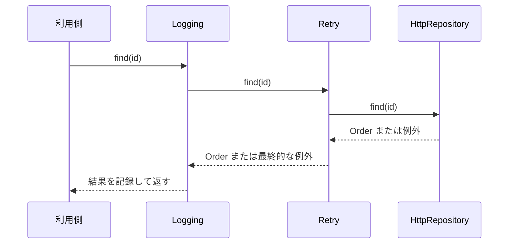

ログを入れたい。計測もしたい。ついでに再試行も。

一つずつは小さな要望なんですが、これを元のクラスに全部書き足すと、本来やりたかった処理が補助機能に埋もれます。かといって継承で組み合わせようとすると、今度は「ログあり再試行なし」「ログなしキャッシュあり」みたいなサブクラスが組み合わせの数だけ増えていく。

Decoratorパターンは、この板挟みから抜ける方法です。元と同じ契約を持つオブジェクトで外側から包んで、呼び出しの前後に責務を足します。

肝は、包んだあとも**同じ型のまま使える**ことです。

以下のコードは設計上の役割に絞った抜粋で、`Order` や `Logger` など題意に関係ない型や補助関数の定義は省いています。

## 主役が脇役に埋もれている例

```ts
class HttpOrderRepository implements OrderRepository {
  async find(id: string): Promise<Order> {
    const startedAt = performance.now();
    console.info("find:start", { id });

    try {
      for (let attempt = 1; attempt <= 3; attempt += 1) {
        try {
          const response = await fetch(`/api/orders/${id}`);
          if (!response.ok) throw new Error(`HTTP ${response.status}`);
          return await response.json();
        } catch (error) {
          if (attempt === 3) throw error;
        }
      }
      throw new Error("unreachable");
    } finally {
      console.info("find:end", {
        id,
        durationMs: performance.now() - startedAt,
      });
    }
  }
}
```

このメソッドの中で、HTTP取得・ログ・計測・再試行が全部同じ深さに並んでいます。本当にやりたいのは真ん中の `fetch` 一行なのに、探さないと見つからない。

しかもどの責務を直すときも、このクラスを開くことになります。テストも当然、面倒になります。

Decoratorで分けると、呼び出しは外から内へ、結果とエラーは内から外へ流れます。



矢印の向きが途中でひっくり返っているのが見えますか。ここが全部です。呼び出しは利用側から `Logging`、`Retry`、`HttpRepository` の順に潜っていき、戻り値と例外は逆順に浮かび上がってきます。だから各Decoratorは、自分の担当ぶんの前処理と後処理だけを書けば済みます。

## 包んでも、同じ顔をしていること

```ts
interface OrderRepository {
  find(id: string): Promise<Order>;
}

class LoggingOrderRepository implements OrderRepository {
  constructor(
    private readonly inner: OrderRepository,
    private readonly logger: Logger,
  ) {}

  async find(id: string): Promise<Order> {
    const startedAt = performance.now();
    this.logger.info("order.find.started", { id });

    try {
      const order = await this.inner.find(id);
      this.logger.info("order.find.completed", {
        id,
        durationMs: performance.now() - startedAt,
      });
      return order;
    } catch (error) {
      this.logger.error("order.find.failed", error, { id });
      throw error;
    }
  }
}
```

`LoggingOrderRepository` は `OrderRepository` を受け取って、自分も `OrderRepository` として振る舞います。利用側は、手に持っているのが素のHTTP実装なのかログ付きなのかを知らなくていい。

`find` の中を上から追ってみます。開始ログを書いて、`this.inner.find(id)` で内側にバトンを渡す。無事に注文が返ってきたときだけ完了ログを書いて、**同じ注文をそのまま**返します。内側がこけたら `catch` に落ちて、失敗ログを書いて、**同じ例外をそのまま**投げ直します。

成功も失敗も、意味を書き換えていません。だからログを足しても利用側の分岐は1行も変わりません。

この性質を「透過性」と呼んで判断基準にすると、Decoratorの良し悪しが見えてきます。元の実装をDecoratorに差し替えても、利用側のコードと期待する契約が変わらない。これが理想形です。とはいえオブジェクトの同一性比較や `constructor` 名まで一致するわけではないので、どこまでを契約に含めるかは決めておいてください。

もうひとつ見落としやすい点があります。Decoratorは内側のオブジェクトを所有しているとは限りません。同じリポジトリを複数のDecorator構成で共有するなら、接続の破棄をどの層が引き受けるのかを決める必要があります。委譲するのは呼び出しだけではなく、リソースの寿命も契約のうちです。

例外を記録したあとに再 `throw` しているのも同じ理由です。「失敗しうる」という契約を保つため。ログを足しただけのつもりで `undefined` を返して成功扱いにしたら、その時点でDecoratorが元の意味を壊しています。

## 再試行は、便利すぎて危ない

```ts
class RetryingOrderRepository implements OrderRepository {
  private readonly maxAttempts: number;

  constructor(
    private readonly inner: OrderRepository,
    maxAttempts = 3,
  ) {
    if (!Number.isInteger(maxAttempts) || maxAttempts < 1) {
      throw new TypeError("maxAttemptsには正の整数が必要です");
    }
    this.maxAttempts = maxAttempts;
  }

  async find(id: string): Promise<Order> {
    let lastError: unknown;

    for (let attempt = 1; attempt <= this.maxAttempts; attempt += 1) {
      try {
        return await this.inner.find(id);
      } catch (error) {
        lastError = error;
        if (!isRetryable(error) || attempt === this.maxAttempts) break;
        await wait(100 * 2 ** (attempt - 1));
      }
    }

    throw lastError;
  }
}
```

読み取りと書き込みを、同じ規則で包んではいけません。

注文作成を無条件でリトライしたとします。1回目がサーバー側では成功していて、応答だけがネットワークの都合で消えていた。その場合、二重注文が生まれます。

再試行を付ける前に、この4つを決めます。

- 再試行してよいエラーの種類
- 最大回数と待機時間
- 処理が冪等か、冪等性キーを使えるか
- キャンセルや全体の期限をどう扱うか

Decoratorは責務をきれいに分けてくれますが、その責務が業務的に安全かどうかまでは面倒を見てくれません。

## 順番を変えると、意味が変わる

次の2つ。使っているDecoratorは同じです。でもログの件数が違います。

```ts
const base = new HttpOrderRepository();

const logWholeOperation = new LoggingOrderRepository(
  new RetryingOrderRepository(base, 3),
  logger,
);

const logEachAttempt = new RetryingOrderRepository(
  new LoggingOrderRepository(base, logger),
  3,
);
```

| 構成 | ログが表す範囲 |
| --- | --- |
| `Logging(Retry(base))` | 再試行全体を1回の操作として記録 |
| `Retry(Logging(base))` | 各試行をそれぞれ記録 |

順序は実装の細部ではありません。システムの振る舞いそのものです。キャッシュを再試行の内側に置くか外側に置くか、タイムアウトをどこまでの範囲にかけるかでも、同じことが起きます。

レビューのときは、Decoratorの名前を眺めるだけでなく、外側から内側へ順に読んでください。外側は全試行をまとめて観測していて、内側は1回ぶんだけを観測している。この読み方をチームで共有しておくと、長い `constructor` の入れ子でも「ログは何回出るのか」「タイムアウトはどこまで含むのか」が予測できます。

組み立て場所に名前を付けておくと、もっと楽です。

```ts
function createOrderRepository(): OrderRepository {
  const http = new HttpOrderRepository();
  const retrying = new RetryingOrderRepository(http, 3);
  return new LoggingOrderRepository(retrying, logger);
}
```

## タイムアウトしても、裏では走り続けている

`Promise.race` でタイムアウトを作ると、利用側には素早く失敗を返せます。ただ、レースに負けたほうの通信が自動で止まるわけではありません。ここ、勘違いしやすいところです。

```ts
class TimeoutOrderRepository implements OrderRepository {
  constructor(
    private readonly inner: OrderRepository,
    private readonly timeoutMs: number,
  ) {}

  find(id: string): Promise<Order> {
    return Promise.race([
      this.inner.find(id),
      rejectAfter(this.timeoutMs),
    ]);
  }
}
```

本当に止めたいなら、契約に `AbortSignal` を足して、いちばん内側のHTTP処理まで運びます。外側のDecoratorだけでキャンセルを完結させるのは無理な相談です。

そしてタイムアウトには2つの意味があります。各試行に3秒ずつ与えるのか、再試行を含む操作全体で3秒なのか。包む順序と同じで、どの範囲を縛るのかを先に言葉で決めておきます。

## 関数でも、まったく同じ

Decoratorはオブジェクト専用のパターンではありません。同じ関数型を受け取って同じ関数型を返せば、それでDecoratorです。

```ts
type RequestHandler<I, O> = (input: I) => Promise<O>;

function withLogging<I, O>(
  handler: RequestHandler<I, O>,
  logger: Logger,
): RequestHandler<I, O> {
  return async (input) => {
    logger.info("handler.started");
    try {
      return await handler(input);
    } catch (error) {
      logger.error("handler.failed", error);
      throw error;
    }
  };
}
```

Webフレームワークのミドルウェア、RxJSの演算子、Reduxのミドルウェアや `meta-reducer`。どれも「入出力の契約を保ったまま責務を重ねる」という同じ発想でできています。ただし実行順とエラー規則はライブラリごとに違うので、そこは個別に確認してください。

## フラグで足りるなら、フラグでいい

元のクラスに `enableLogging`、`retryCount`、`cacheEnabled` を生やす手もあります。組み合わせが少ないうちは、正直そのほうが読みやすいです。

Decoratorが効いてくるのは、責務を独立して組み替えたくなってからです。

| フラグが向く | Decoratorが向く |
| --- | --- |
| 設定が1〜2個で固定 | 組み合わせが複数ある |
| 本体と一緒に変更される | 各責務が独立して変更される |
| テストも本体と一体でよい | 責務ごとに単体テストしたい |
| 順序に意味がない | 包む順序で振る舞いが変わる |

## やらかしがちなパターン

- Decoratorが元と違う戻り値やエラー規則を持ってしまう。
- 内側へ委譲せず、実処理まで書き写す。
- 包む順序が、コンポジションルートの長い式の中に埋もれる。
- タイムアウトで背後の処理も止まったと思い込む。
- 1つのDecoratorに、ログと再試行とキャッシュをまた詰め直す。

---

冒頭の「ログも計測も再試行も」に戻ります。

Decoratorは、機能を盛るための装飾ではありませんでした。元の契約を保ったまま、呼び出しの前後に責務を足す方法です。だから導入するときに確認すべきなのは「何を足すか」ではなく、この3つになります。

元の意味を変えていないか。順序は何を意味するか。失敗とキャンセルをどう伝えるか。

## 参考資料

- [Refactoring.Guru: Decorator](https://refactoring.guru/design-patterns/decorator)
- [RxJS: Operators](https://rxjs.dev/guide/operators)
