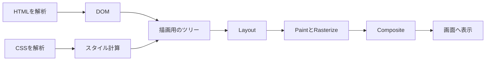
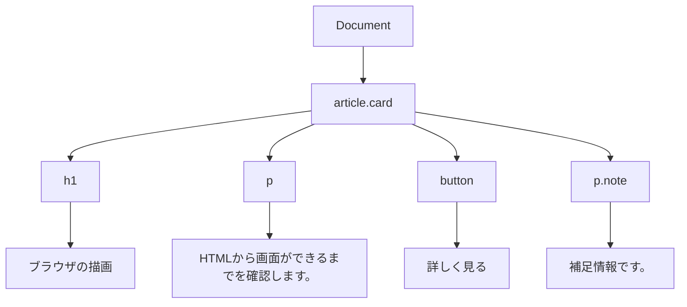
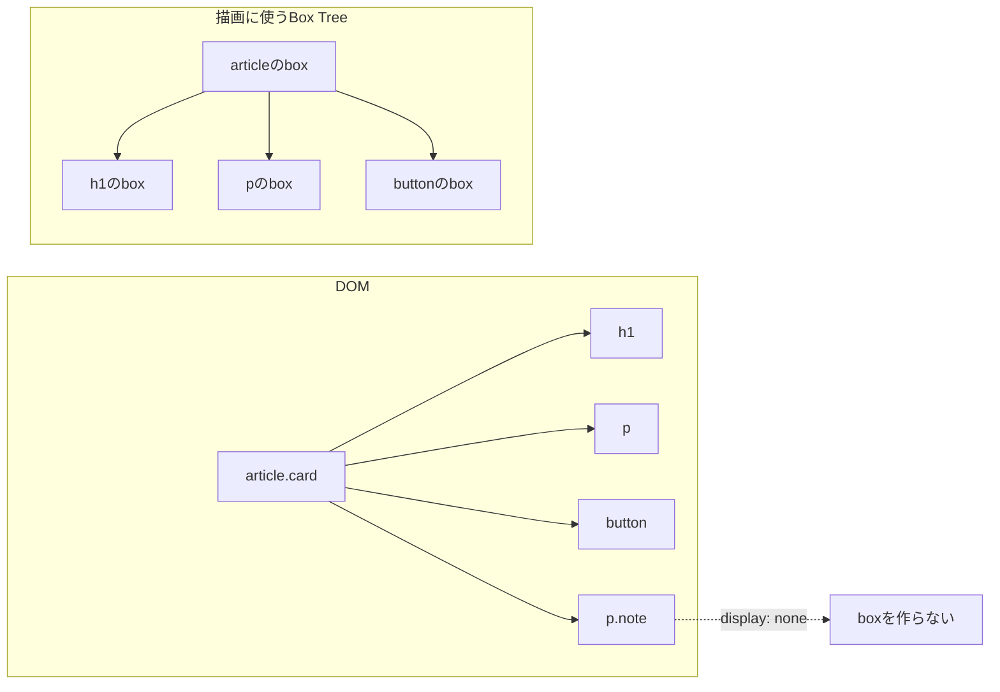
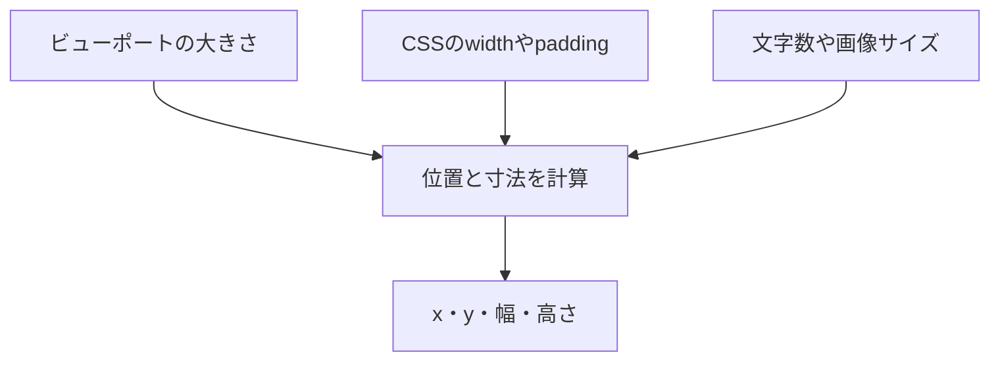
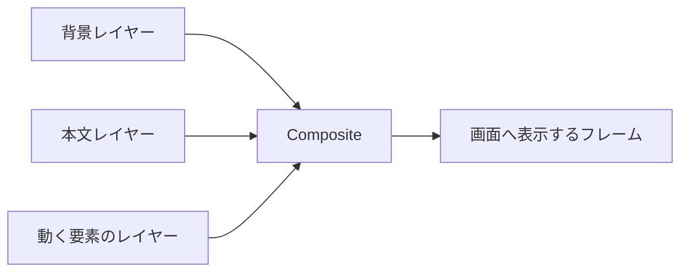

HTMLとCSSを書いてブラウザで開くと、文字やボタンが画面に現れます。普段は当たり前に見える動きですが、ブラウザはHTMLをそのまま画像へ変換しているわけではありません。

ブラウザはHTMLから文書の構造を作り、CSSを照合し、各要素の位置と大きさを計算します。続いて背景や文字を描き、複数のレイヤーを重ねて、ようやく画面へ表示します。

この流れを知っていると、DOMを書き換えたときに何が起きるか、なぜCSSアニメーションが重くなることがあるのかを考えやすくなります。この記事では、HTMLとCSSを受け取った後から、画面にピクセルが現れるまでを順番に追います。

## ブラウザは段階的に画面を組み立てる

細かな実装はChrome、Firefox、Safariで異なりますが、Web開発者から見た大きな流れは次のように整理できます。



大きく分けると、次の処理が進みます。

1. HTMLを解析してDOMを作る
2. CSSを解析し、各要素に適用するスタイルを計算する
3. 描画に必要な要素から、レイアウト用の構造を作る
4. Layoutで位置と大きさを計算する
5. Paintで描画順を決め、Rasterizeでピクセルにする
6. Compositeでレイヤーを重ねて表示する

この一連の処理は、初回表示で一度だけ動くものではありません。JavaScriptやCSSによって見た目が変われば、ブラウザは必要な工程を再び実行します。

順番が分かれば、重い場所も切り分けられます。

## HTMLは解析されてDOMになる

次のHTMLを例にします。

```html
<article class="card">
  <h1>ブラウザの描画</h1>
  <p>HTMLから画面ができるまでを確認します。</p>
  <button>詳しく見る</button>
  <p class="note">補足情報です。</p>
</article>
```

ブラウザのHTMLパーサーは、受け取った文字列をタグやテキストなどのトークンへ分けます。そのトークンを使って、文書をノードの木として表したDOM（Document Object Model）を組み立てます。



まだ、画面には何も出ていません。

DOMは、元のHTMLをコピーした文字列ではありません。JavaScriptから要素を探したり、属性を変更したりできる、メモリ上のオブジェクトです。

```js
const card = document.querySelector(".card");
card.setAttribute("data-state", "ready");
```

HTMLに多少の誤りがあっても、ブラウザはHTML仕様の解析規則に従ってDOMを構築します。そのため、DevToolsで確認したDOMがソースの字面と一致しない場合があります。

`async`や`defer`のない通常の`<script>`に出会うと、HTMLパーサーはスクリプトの取得と実行を待つことがあります。スクリプトが解析途中のDOMを変更できるためです。画面の描画はHTML、CSS、JavaScriptが独立して進む単純な流れではなく、途中で互いに影響します。

## CSSの規則から各要素の最終スタイルを決める

先ほどのHTMLへ、次のCSSを適用します。

```css
.card {
  width: 320px;
  padding: 24px;
  color: #1f2937;
  background: #f3f4f6;
  border-radius: 12px;
}

.card h1 {
  font-size: 24px;
}

.note {
  display: none;
}
```

次はCSSです。

解析されたセレクターと宣言は、ブラウザが扱える形になります。JavaScriptから`document.styleSheets`や`CSSStyleRule`を通してスタイルシートへアクセスする仕組みがCSSOM（CSS Object Model）です。

描画時には、セレクターに一致する規則を探し、カスケード、詳細度、継承、初期値などを考慮して各要素のスタイルを計算します。たとえば`.card`には`width: 320px`が適用され、子孫の文字色には継承した`#1f2937`が使われます。

解説では「CSSからCSSOMツリーを作る」と表現されることがあります。ただし、CSSOMはブラウザ内部の描画データ構造を一つに定める仕様ではありません。ここでは、**解析済みのCSS規則をもとに、DOM上の各要素のスタイルを決める**と捉えると十分です。

## DOM上の要素がすべて描画されるわけではない

DOMには、文書として存在するノードが含まれています。その中からCSSによるボックス生成の規則を適用し、レイアウトと描画に使う構造を組み立てます。

先ほどの`.note`には`display: none`が指定されています。`p.note`はDOMに残りますが、自身と子孫のボックスは生成されません。画面上の場所も取りません。

DOMから消えたわけではありません。



反対に、`::before`や`::marker`のような疑似要素はDOMノードではありませんが、表示用のボックスを生成する場合があります。DOMツリーと画面上のボックスは一対一ではありません。

この描画用の構造は、入門記事ではRender Treeと呼ばれることが多いものです。CSS Display仕様では`box tree`、Chromiumの解説では`layout tree`など、扱う段階に応じた名前が使われます。

:::message
この記事では全体を説明するときに「描画用のツリー」と呼びます。Render Treeという単一の標準データ構造が、すべてのブラウザへ同じ形で実装されているわけではありません。
:::

`visibility: hidden`は`display: none`と挙動が異なります。`visibility: hidden`を指定した要素は見えなくなりますが、通常はボックスが残るため、レイアウト上の場所も残ります。

## Layoutは要素の位置と大きさを計算する

描画するボックスが決まっても、まだ画面上の座標は分かりません。Layoutでは、ビューポートの大きさやCSSの指定をもとに、各ボックスの位置と寸法を計算します。ここで座標が決まります。Reflowと呼ばれることもあります。

`.card`の幅は`320px`ですが、実際に必要な横幅は`padding`や`border`、`box-sizing`にも左右されます。段落の幅が決まれば、文字をどこで折り返すかが決まり、その結果から段落の高さが決まります。親要素の大きさが子要素へ影響し、子要素の内容が親要素の高さへ影響することもあります。



ウィンドウの幅を変えると文章の折り返し位置が変わり、後続要素の位置も動きます。こうした変更では、影響する範囲のLayoutが再計算されます。常にページ全体を計算し直すとは限りません。変更された箇所や依存関係をもとに、処理範囲が絞られます。

## Paintは描画命令を作り、Rasterizeはピクセルへ変える

Layoutによって「どこに、どの大きさで置くか」が決まりました。次は、背景、文字、枠線、影などをどの順番で描くかを決めます。この工程がPaintです。

たとえばカードなら、背景を塗り、その上へ見出しと本文を描き、最後にボタンの背景や文字を描く、といった描画命令が作られます。要素が重なっている場合は、スタッキングコンテキストや`z-index`も描画順へ影響します。

Paintは、説明上「ピクセルを塗る処理」とまとめられることがあります。内部では、描画命令を記録する処理と、その命令から実際のピクセルを作るRasterize（ラスタライズ）を分けて考えます。ここで初めて、色の付いたピクセルができます。Chromiumでは、ラスタライズの一部をメインスレッドとは別のワーカースレッドで進める場合があります。

位置が変わらなくても、`background-color`や`box-shadow`が変われば見た目は変わります。この場合、Layoutを省略できても、該当領域のPaintが必要になることがあります。

## Compositeは複数のレイヤーを重ねて画面を作る

ページは一枚の大きな画像としてだけ描かれるとは限りません。必要に応じて、内容は複数のレイヤーへ分けられます。Compositeは、描画済みのレイヤーを正しい位置と順序で重ね、最終的なフレームを作る工程です。

これが最後の仕上げです。



レイヤーの内容を描き直さず、位置や透明度だけを変えて再合成できれば、LayoutやPaintを省ける場合があります。`transform`と`opacity`がアニメーションでよく使われるのは、この経路に乗せやすいためです。

ただし、`transform`を指定すれば必ず専用レイヤーになり、GPUだけで処理されるとは限りません。レイヤー化はブラウザが要素の状態や端末の資源を見て判断します。`will-change`で大量の要素をレイヤー化すると、メモリ消費や合成処理が増え、かえって遅くなることもあります。

## DOMやCSSの変更後は、必要な工程がもう一度動く

ボタンを押したときにカードを広げる処理を考えます。

```js
const card = document.querySelector(".card");
const button = card.querySelector("button");

button.addEventListener("click", () => {
  card.classList.toggle("card--expanded");
});
```

```css
.card--expanded {
  width: 480px;
}
```

クリックイベントの処理中にクラスを変更しても、その行で即座に画面のピクセルが更新されるわけではありません。JavaScriptのタスクが終わり、描画できるタイミングになると、スタイル計算やLayoutなどが進みます。同じタスク内のDOM変更をまとめて処理できる場合もあります。

どこから処理し直すかは、変更した内容によって変わります。

| 変更例 | 主に必要になる工程 |
| --- | --- |
| `width`、`height`、`padding` | Style → Layout → Paint → Composite |
| `color`、`background`、`box-shadow` | Style → Paint → Composite |
| `transform`、`opacity` | 条件が整えばStyle → Composite |

この表は処理を予測するための目安です。同じプロパティでも、ブラウザの実装、要素の重なり、レイヤーの状態によって実際の処理は変わります。

## 寸法の読み書きを交互に行うとLayoutが増える

変更をまとめて処理できる場合でも、JavaScriptが最新の寸法を要求すると、その場でLayoutが必要になることがあります。

```js
const items = document.querySelectorAll(".item");

for (const item of items) {
  item.style.width = "200px";
  console.log(item.offsetWidth);
}
```

`width`を書き換えた直後に`offsetWidth`を読むには、ブラウザが最新の幅を確定しなければなりません。ループのたびに書き込みと読み取りを繰り返すと、同期的なLayoutが何度も発生する可能性があります。これはForced Synchronous Layoutと呼ばれ、同じ形が繰り返される状態はLayout Thrashingとも呼ばれます。

寸法を先にまとめて読み、その後で書き換えると、処理をまとめやすくなります。

```js
const items = [...document.querySelectorAll(".item")];
const currentWidths = items.map((item) => item.offsetWidth);

items.forEach((item, index) => {
  item.style.width = `${currentWidths[index] + 20}px`;
});
```

すべてのDOM操作を恐れる必要はありません。まず避けたいのは、計測せずに細かな最適化を重ねることです。Layoutの回数や対象範囲が本当に問題になっているかを確認してから直します。

## DevToolsで描画に使った時間を確認する

Chrome DevToolsのPerformanceパネルを使うと、ページがどの処理に時間を使ったか確認できます。

1. DevToolsのPerformanceパネルを開く
2. 記録を開始する
3. ボタンのクリックやスクロールなど、調べたい操作を行う
4. 記録を止め、Mainトラックを確認する

描画に関係する代表的なイベントは次のとおりです。

| イベント | 確認できること |
| --- | --- |
| `Recalculate Style` | 要素のスタイルを再計算した |
| `Layout` | 要素の位置や寸法を計算した |
| `Paint` | 画面の一部を描画した |
| `Composite Layers` | レイヤーを合成した |

`Layout`を選択すると、影響したノード数やLayoutを発生させたコードを追える場合があります。Renderingパネルの`Paint flashing`を有効にすると、再描画された領域が緑色に点滅します。想定より広い範囲が光るなら、Paintの対象が広がっている手掛かりになります。

プロパティ名だけを見て速いか遅いかを決めるより、実際の操作を記録した方が原因へ近づけます。

## 画面は構造、寸法、描画、合成の順に作られる

HTMLとCSSは、直接ピクセルへ置き換えられるわけではありません。

1. HTMLからDOMを作る
2. CSSの規則を解析してスタイルを計算する
3. 描画に使うボックスの構造を作る
4. Layoutで位置と大きさを決める
5. PaintとRasterizeで見た目をピクセルにする
6. Compositeでレイヤーを重ねる

DOMやCSSを変更すると、ブラウザは変更内容に応じて必要な工程を再実行します。画面が重いときは、「JavaScriptが長い」で一括りにせず、Style、Layout、Paint、Compositeのどこで時間を使っているかを確認します。描画の流れが分かれば、CSSプロパティの選び方やDOM操作が画面へ与える影響を予測しやすくなります。

## 参考資料

- [HTML Standard: Parsing HTML documents](https://html.spec.whatwg.org/multipage/parsing.html)
- [CSS Object Model (CSSOM) Module Level 1](https://drafts.csswg.org/cssom/)
- [CSS Display Module Level 3](https://drafts.csswg.org/css-display/)
- [RenderingNG architecture](https://developer.chrome.com/docs/chromium/renderingng-architecture)
- [Rendering performance](https://web.dev/articles/rendering-performance)
- [Chrome DevTools: Timeline event reference](https://developer.chrome.com/docs/devtools/performance/timeline-reference)
- [Chrome DevTools: Performance features reference](https://developer.chrome.com/docs/devtools/performance/reference)
