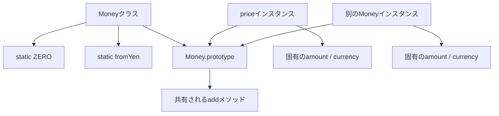
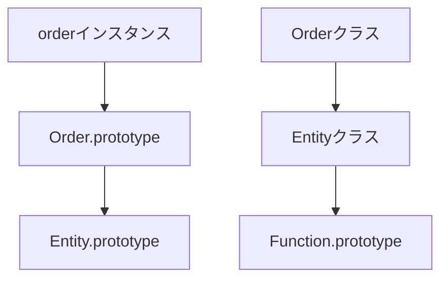

「これ、いろんなところから使うから `static` にしとくか」

私はこの一言で、何度かグローバル状態を生み出しました。テストが実行順で落ちるようになって、初めて気づくやつです。

`static` を付けたメンバーは、インスタンスではなくクラス自身に属します。構文はそれだけ。ただ「共通で使うから」という理由だけで選ぶと、書き換え可能なグローバル状態と、差し替えのきかない依存がじわじわ増えていきます。

判断の軸は、共有の便利さではありません。**その処理や値を、個々のインスタンスとクラスのどちらが持つのが自然か**です。

## 置き場所が2つある、という話

```ts
class Money {
  static readonly ZERO = new Money(0, "JPY");

  constructor(
    readonly amount: number,
    readonly currency: string,
  ) {}

  add(other: Money): Money {
    if (this.currency !== other.currency) {
      throw new Error("通貨が一致しません");
    }
    return new Money(this.amount + other.amount, this.currency);
  }

  static fromYen(amount: number): Money {
    return new Money(amount, "JPY");
  }
}

const price = Money.fromYen(1_000);
console.log(price.add(Money.ZERO));
```

`price.add()` は、目の前の1つの金額に対する操作です。`Money.fromYen()` のほうは、そもそも既存のインスタンスを必要としません。新しい金額を生み出す側です。



| 置き場所 | 呼び出し例 | 所有するもの |
| --- | --- | --- |
| インスタンスメンバー | `price.add(...)` | 個体の状態と、その状態を使う操作 |
| `static` メンバー | `Money.fromYen(...)` | 型全体の生成規則、定数、補助操作 |

判断に迷ったら、呼び出しを声に出して読んでみてください。

`price.add(tax)` は「この価格に加える」。`Money.fromYen(1000)` は「まだ対象はないけど、Money型の作り方を使う」。どちらが業務の言い方として自然か。だいたいこれで決まります。

ところで、「全インスタンスで共通だから `static`」という説明。あれは正確ではありません。インスタンスメソッドだって、関数の実体は `prototype` 経由で共有されています。それでもインスタンスメソッドと呼ぶのは、実行時に個々の `this` を必要とするからです。

分ける基準になるのは、共有される関数オブジェクトの数ではありません。**処理がどの状態を使うか**でした。

## `constructor` に真偽値を足す前に

`constructor` がいろんな入力形式を受け付け始めると、中に分岐が増えて、何を渡せば何ができるのかが曖昧になっていきます。`static` factoryなら、形式ごとに名前を付けられます。

```ts
class UserId {
  private constructor(readonly value: string) {}

  static parse(input: string): UserId {
    const value = input.trim();
    if (!/^user-[a-z0-9]+(?:-[a-z0-9]+)*$/.test(value)) {
      throw new TypeError(`Invalid UserId: ${input}`);
    }
    return new UserId(value);
  }

  static generate(randomUUID: () => string): UserId {
    return new UserId(`user-${randomUUID()}`);
  }
}
```

`parse` は外から来た文字列を検証して変換する。`generate` は新しいIDを発行する。同じ `constructor` に `isNew: boolean` を足すのに比べて、呼び出し側に意図が残ります。

## `static` の中の `this` は、あなたが思うクラスとは限らない

```ts
class Entity {
  static prefix = "entity";

  static createId(sequence: number): string {
    return `${this.prefix}-${sequence}`;
  }
}

class Order extends Entity {
  static prefix = "order";
}

console.log(Entity.createId(1)); // "entity-1"
console.log(Order.createId(1));  // "order-1"
```

継承先から呼ぶと `this === Order` になります。同じメソッドなのに、結果が変わる。

この動的な振る舞いが欲しくないなら、`this` をやめてクラス名を直接書きます。そのほうが意図は固定されます。

## `static` にも継承の連鎖がある

クラスを継承すると、インスタンス側と `static` 側に、それぞれ別の探索経路ができます。



だから基底クラスの `static` メソッドは継承先から呼べますし、上書きした `static` から `super.method()` も呼べます。

```ts
class BaseSerializer {
  static serialize(value: unknown): string {
    return JSON.stringify(value);
  }
}

class PrettySerializer extends BaseSerializer {
  static serialize(value: unknown): string {
    const compact = super.serialize(value);
    return JSON.stringify(JSON.parse(compact), null, 2);
  }
}
```

便利です。ただ、`static` 継承を重ねていくと、いまどのクラスの状態を見ているのかが追えなくなります。型ごとの差し替えが本当に要るときだけにして、ただのユーティリティなら普通の関数で十分じゃないかを一度考えてください。

とくに危ないのが、`static` メソッドの中で `this` を使っている場合です。継承先から呼ばれた瞬間に参照先が変わるので、「基底クラスの固定処理」だと思って読むと結果を読み違えます。拡張を意図しているならテストで継承先の挙動を固定する。意図していないならクラス名を直接参照する。どちらかに倒しておきます。

## `#private static` は、宣言したクラスだけのもの

`#field` は、ふつうのプロパティ名とは別枠の `private` 要素です。継承先からも直接は触れません。

```js
class TokenStore {
  static #token = null;

  static set(token) {
    this.#token = token;
  }

  static get() {
    return this.#token;
  }
}
```

継承先から `this.#token` に触れると、`private` brandの違いでエラーになることがあります。

そもそも `private static` な状態を継承階層で共有したくなっている時点で、所有者が曖昧になっているサインです。基底クラスの明示的なAPIに閉じ込めるか、いっそ別オブジェクトに切り出します。

## `static` 初期化ブロック

`static` フィールドの初期化に複数行かかるとき、専用のブロックが使えます。

```js
class MimeTypes {
  static byExtension = new Map();

  static {
    this.byExtension.set("json", "application/json");
    this.byExtension.set("txt", "text/plain");
  }
}
```

クラス評価時に一度だけ走ります。ここに外部I/Oや環境依存の重い処理を書くと、`import` しただけで副作用が起きるので避けてください。ただの定数なら、`static` フィールドだけで足ります。

ひとつ落とし穴があります。この `Map` は、あとから中身を足せます。読み取り専用にしたいなら、`Map` そのものを外に出さず、検索用の `static` メソッドだけを公開してください。`Object.freeze()` は `Map` へのエントリー追加までは止めてくれません。

## ここが本題です

```ts
class AppConfig {
  static currentLocale = "ja-JP";
}
```

どこからでも書き換えられる `static` フィールドは、名前が違うだけのグローバル変数です。テストの実行順、SSRでのリクエスト間の共有、並行処理。刺さるところは全部刺さります。

| 問題 | 起きる理由 |
| --- | --- |
| テストが順序依存になる | 前のテストの値が残る |
| SSRで利用者の状態が混ざる | プロセス内で1つを共有する |
| 変更元を追えない | どこからでも代入できる |
| 複数設定を同時に使えない | クラス側に1つしかない |

設定やサービスを複数箇所で使いたいだけなら、コンポジションルートでインスタンスを作って渡すほうが、寿命も共有範囲も自分で決められます。

このパターンが本当に厄介なのは、値の置き場所の話ではありません。**変更の入口が見えなくなる**ことです。関数の引数なら呼び出し元をたどれます。`static` フィールドは、まったく関係ない場所から代入できてしまう。

読み取り専用の定数と、実行中に変わる状態。この2つを同じ `static` という言葉でまとめないでください。

## そもそもクラスが要らないこともある

```ts
export function formatYen(amount: number): string {
  return new Intl.NumberFormat("ja-JP", {
    style: "currency",
    currency: "JPY",
  }).format(amount);
}
```

この処理、特定クラスの状態を1ミリも使っていません。`Formatter.formatYen()` と書きたいがためだけにクラスを立てるのは、名前空間を作っているだけです。ES Modulesでは、`export` した関数そのものが整理の単位になります。

## `static` を書く前の4つの質問

1. その処理は、特定インスタンスの状態を必要とするか。
2. 型全体の生成規則や定数として読めるか。
3. 変更可能な状態を置こうとしていないか。
4. クラスとの結び付きがなければ、通常関数の方が単純ではないか。

冒頭の「いろんなところから使うから」に戻ります。あれは `static` を選ぶ理由になっていませんでした。

`static` は便利な置き場所ではありません。個々のインスタンスから独立した、型全体の責務を置く場所です。生成規則や固定定数とは相性がいい。ただし書き換わる共有状態を置くときだけは、グローバル変数を1本生やすのと同じ覚悟で書いてください。

## 参考資料

- [ECMAScript: Class Definitions](https://tc39.es/ecma262/multipage/ecmascript-language-functions-and-classes.html#sec-class-definitions)
- [ECMAScript: Class Static Initialization Blocks](https://tc39.es/ecma262/multipage/ecmascript-language-functions-and-classes.html#sec-class-static-blocks)
- [MDN: static](https://developer.mozilla.org/ja/docs/Web/JavaScript/Reference/Classes/static)
- [TypeScript: Classes](https://www.typescriptlang.org/docs/handbook/2/classes.html)
