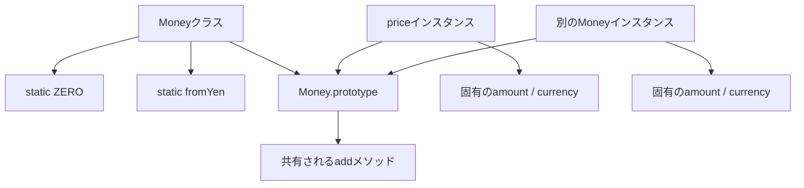
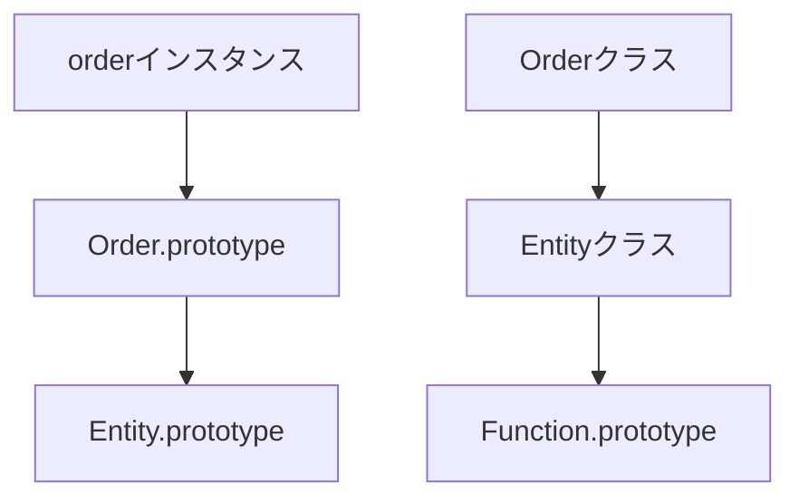

`static` を付けたメンバーは、インスタンスではなくクラス自身に属します。構文は単純ですが、「共通で使うから `static`」とだけ考えると、変更可能なグローバル状態やテストしにくい依存を作りがちです。

判断の軸は共有の便利さではありません。その処理や値を、個々のインスタンスとクラスのどちらが所有するのが自然かです。

## インスタンス側とクラス側は別の場所にある

```ts
class Money {
  static readonly ZERO = new Money(0, "JPY");

  constructor(
    readonly amount: number,
    readonly currency: string,
  ) {}

  add(other: Money): Money {
    if (this.currency !== other.currency) {
      throw new Error("通貨が一致しません");
    }
    return new Money(this.amount + other.amount, this.currency);
  }

  static fromYen(amount: number): Money {
    return new Money(amount, "JPY");
  }
}

const price = Money.fromYen(1_000);
console.log(price.add(Money.ZERO));
```

`price.add()` は1つの金額に対する操作です。`Money.fromYen()` は既存のインスタンスを必要とせず、新しい金額を作ります。



| 置き場所 | 呼び出し例 | 所有するもの |
| --- | --- | --- |
| インスタンスメンバー | `price.add(...)` | 個体の状態と、その状態を使う操作 |
| `static` メンバー | `Money.fromYen(...)` | 型全体の生成規則、定数、補助操作 |

呼び出し表記も設計の説明になります。`price.add(tax)` は「この価格へ加える」と読めます。`Money.fromYen(1000)` は、まだ対象インスタンスがなく、Money型の生成規則を使うと読めます。`static` を選ぶときは、どちらの文が業務上自然かを声に出すと判断しやすくなります。

「すべてのインスタンスで共通」という説明だけでは不十分です。インスタンスメソッドも `prototype` 経由で関数自体は共有されています。それでもインスタンスメソッドと呼ぶのは、実行時に個々の `this` を必要とするからです。共有される関数オブジェクトの数ではなく、処理がどの状態を使うかで分けます。

## `static` factoryは名前付き `constructor` として使える

`constructor` が複数の入力形式を受け始めると、分岐が増えて契約が曖昧になります。`static` factoryなら、入力形式ごとに名前を付けられます。

```ts
class UserId {
  private constructor(readonly value: string) {}

  static parse(input: string): UserId {
    const value = input.trim();
    if (!/^user-[a-z0-9]+(?:-[a-z0-9]+)*$/.test(value)) {
      throw new TypeError(`Invalid UserId: ${input}`);
    }
    return new UserId(value);
  }

  static generate(randomUUID: () => string): UserId {
    return new UserId(`user-${randomUUID()}`);
  }
}
```

`parse` は外部文字列を検証して変換し、`generate` は新しいIDを発行します。同じ `constructor` へboolean引数を追加するより、意図が呼び出し側に残ります。

## `static` メソッドの `this` は呼び出したクラス

`static` メソッド内の `this` は、通常、そのメソッドを呼び出したクラスを指します。

```ts
class Entity {
  static prefix = "entity";

  static createId(sequence: number): string {
    return `${this.prefix}-${sequence}`;
  }
}

class Order extends Entity {
  static prefix = "order";
}

console.log(Entity.createId(1)); // "entity-1"
console.log(Order.createId(1));  // "order-1"
```

継承先から呼ぶと `this === Order` です。この動的な振る舞いが不要なら、クラス名を明示して参照する方が意図は固定されます。

## `static` 側にも継承の連鎖がある

クラス継承では、インスタンス側と `static` 側に別々の探索経路ができます。



そのため、基底クラスの `static` メソッドは継承先から呼べます。上書きした `static` メソッドから `super.method()` を呼ぶこともできます。

```ts
class BaseSerializer {
  static serialize(value: unknown): string {
    return JSON.stringify(value);
  }
}

class PrettySerializer extends BaseSerializer {
  static serialize(value: unknown): string {
    const compact = super.serialize(value);
    return JSON.stringify(JSON.parse(compact), null, 2);
  }
}
```

`static` 継承を多用すると、どのクラスの状態やメソッドを使うか追いにくくなります。型ごとの差し替えが本当に必要な場合だけ使い、単なるユーティリティ関数なら通常関数も検討します。

とくに `static` メソッド内で `this` を使う場合、継承先から呼ぶと参照先が変わります。基底クラスだけの固定処理だと思って読むと、実行結果を誤ります。拡張を意図するならテストで継承先の挙動を固定し、意図しないならクラス名を直接参照して動的な差し替えを避けます。

## `private` `static` フィールドは宣言したクラスだけが使える

`#field` は通常のプロパティ名とは異なる `private` 要素です。継承先からも直接アクセスできません。

```js
class TokenStore {
  static #token = null;

  static set(token) {
    this.#token = token;
  }

  static get() {
    return this.#token;
  }
}
```

ここで `this.#token` を継承先から呼ぶと、`private` brandの違いによりエラーになる場合があります。`private` `static` 状態を継承階層で共有したい設計は、所有者が曖昧になりやすい兆候です。基底クラスの明示的なAPIに閉じ込めるか、別オブジェクトへ切り出します。

## `static` 初期化ブロックは初期化を1か所へまとめる

`static` フィールドの初期化に複数行の処理が必要な場合、`static` 初期化ブロックを使えます。

```js
class MimeTypes {
  static byExtension = new Map();

  static {
    this.byExtension.set("json", "application/json");
    this.byExtension.set("txt", "text/plain");
  }
}
```

クラス評価時に一度だけ実行されます。外部I/Oや環境依存の重い処理を入れると、`import` しただけで副作用が発生するため避けます。単純な定数なら、通常の `static` フィールドだけで十分です。

この例の `Map` は後から変更できます。読み取り専用にしたいなら、外部へ `Map` そのものを公開せず、検索用の `static` メソッドだけを提供します。`Object.freeze()` は `Map` 内部のエントリー追加まで禁止しないため、immutable化の代わりにはなりません。

## 変更可能な `static` 状態はグローバル状態と同じ問題を持つ

```ts
class AppConfig {
  static currentLocale = "ja-JP";
}
```

どこからでも書き換えられる `static` フィールドは、実質的にグローバル状態です。テストの実行順、SSRのリクエスト間共有、並行処理で問題になります。

| 問題 | 起きる理由 |
| --- | --- |
| テストが順序依存になる | 前のテストの値が残る |
| SSRで利用者の状態が混ざる | プロセス内で1つを共有する |
| 変更元を追えない | どこからでも代入できる |
| 複数設定を同時に使えない | クラス側に1つしかない |

設定やサービスを複数の処理で使いたいだけなら、コンポジションルートでインスタンスを作り、必要な場所へ渡す方が寿命と共有範囲を制御できます。

変更可能な `static` 状態が難しいのは、値の存在場所より、変更の入口が見えなくなるためです。関数の引数なら呼び出し元をたどれますが、`static` フィールドは離れたコードから書き換えられます。読み取り専用の定数と、実行中に変わる状態を同じ「`static`」にまとめないでください。

## 通常関数の方が自然な処理もある

```ts
export function formatYen(amount: number): string {
  return new Intl.NumberFormat("ja-JP", {
    style: "currency",
    currency: "JPY",
  }).format(amount);
}
```

この処理は特定クラスの状態を必要としません。`Formatter.formatYen()` とするためだけのクラスは、名前空間を作っているだけです。ES Modulesでは `export` した関数自体が整理単位になります。

## `static` を選ぶ前の4つの質問

1. その処理は、特定インスタンスの状態を必要とするか。
2. 型全体の生成規則や定数として読めるか。
3. 変更可能な状態を置こうとしていないか。
4. クラスとの結び付きがなければ、通常関数の方が単純ではないか。

`static` は「どこからでも呼べる便利な置き場所」ではありません。個々のインスタンスから独立した、型全体の責務を表す場所です。生成規則や固定定数にはよく合いますが、変更可能な共有状態を置くときは、グローバル状態を導入するのと同じ慎重さが必要です。

## 参考資料

- [ECMAScript: Class Definitions](https://tc39.es/ecma262/multipage/ecmascript-language-functions-and-classes.html#sec-class-definitions)
- [ECMAScript: Class Static Initialization Blocks](https://tc39.es/ecma262/multipage/ecmascript-language-functions-and-classes.html#sec-class-static-blocks)
- [MDN: static](https://developer.mozilla.org/ja/docs/Web/JavaScript/Reference/Classes/static)
- [TypeScript: Classes](https://www.typescriptlang.org/docs/handbook/2/classes.html)
