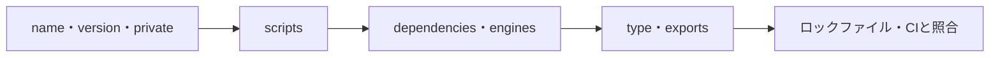
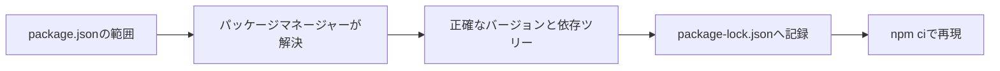

新しいプロジェクトに入って、最初に開くファイル。だいたい `package.json` だと思います。

そして私は毎回、`dependencies` だけ眺めて閉じていました。「Reactか、なるほど」で終わり。ほかの項目は、必要になったときに調べればいいと思っていたんです。

でもこのファイル、依存の一覧表ではありません。プロジェクトの名前、実行コマンド、使うNode.js、公開するファイル、モジュールの入口まで書いてある**パッケージの契約書**です。

項目を上から順に暗記するのは無理があります。「誰が読む設定なのか」で束ねると、一気に見通しがよくなりました。この記事では、既存プロジェクトに参加したときに私が見る順で並べます。

## 4つのかたまりに分ける



左から順に、「何のプロジェクトか」「どう操作するか」「何が必要か」「何を公開するか」「同じ環境を再現できるか」。段階的に分かります。最初から全フィールドを追う必要はありません。

| 役割 | 主な項目 | 主に読むもの |
| --- | --- | --- |
| 識別 | `name`, `version`, `private` | npm、開発者 |
| 開発フロー | `scripts` | npm、開発者、CI |
| 依存と環境 | `dependencies`, `engines`, `packageManager` | パッケージマネージャー、CI |
| 公開と解決 | `type`, `exports`, `files`, `bin` | Node.js、バンドラー、利用者 |

アプリと公開ライブラリでは、重要な項目が違います。アプリなら `private`・`scripts`・依存関係。ライブラリなら `exports`・型定義・公開ファイルが、そのまま利用者の互換性に直結します。

## 最初に名前・バージョン・公開範囲を見る

```json
{
  "name": "@example/order-web",
  "version": "1.4.2",
  "private": true
}
```

`name` はパッケージの識別子です。`@example/order-web` のような形はスコープ付きパッケージで、頭の `@example` が組織名にあたります。ワークスペースでは、内部パッケージを参照するときの名前としても使われます。

`version` は公開パッケージの版で、ふつうはSemVerの `MAJOR.MINOR.PATCH` です。非公開アプリでもリリースや監視でビルドの識別に使うことがありますが、デプロイ番号と同じとは限りません。

そして `private: true`。これは安全装置です。うっかりnpmレジストリへ公開してしまう事故を防ぎます。公開しないアプリやワークスペースのルートでは、付いているかどうかを必ず見ます。

## `scripts` は、チームの操作パネル

```json
{
  "scripts": {
    "dev": "vite",
    "build": "tsc -b && vite build",
    "test": "vitest run",
    "lint": "eslint .",
    "check": "npm run lint && npm test && npm run build"
  }
}
```

`npm run build` と打つと、npmは対応する文字列をシェルに投げます。開発者もCIも同じコマンドを叩けるので、READMEに長い手順を書き連ねるより再現性があります。

既存プロジェクトなら、まず `dev`・`build`・`test`・`lint` の4つ。どのツールを使っていて、何が品質チェックに入っているかが分かります。`check` や `ci` があれば、プルリク前に何を通すべきかもそこに書いてあります。

### 書いていない処理が動くことがある

`prebuild`、`build`、`postbuild` が並んでいると、`npm run build` はこの3つを順に実行します。

```json
{
  "scripts": {
    "prebuild": "node scripts/generate.mjs",
    "build": "vite build",
    "postbuild": "node scripts/check-output.mjs"
  }
}
```

便利です。ただ `build` の行だけ読んでも、実際に何が走るのかは分かりません。「なぜかビルド中にネットワークへ出ている」「ファイルが勝手に増えている」を調べるときは、`pre` / `post` も一緒に開いてください。

インストール時に動くライフサイクルスクリプトもあります。第三者のパッケージが手元でコードを実行するということなので、依存を1つ足すときは、ロックファイルだけでなくスクリプトの有無も信頼境界として考えます。

## `dependencies`と`devDependencies`は実行時に必要かで分ける

```json
{
  "dependencies": {
    "react": "^19.0.0",
    "zod": "^4.0.0"
  },
  "devDependencies": {
    "typescript": "^5.8.0",
    "vitest": "^3.0.0"
  }
}
```

基準はシンプルで、そのパッケージが**動くために**必要なら `dependencies`、開発・テスト・ビルドで使うだけなら `devDependencies` です。

ただしフロントエンドアプリだと話がややこしくなります。バンドラーがビルド時に依存を成果物へ取り込むので、「本番サーバーの `node_modules` にあるか」と「どちらに書くか」は別の質問になるんです。パッケージマネージャーやデプロイ環境が、どちらの区分をインストールするのかも確認してください。

公開ライブラリでは、間違えると利用者に刺さります。実行時に `import` するパッケージを `devDependencies` にだけ置くと、利用者の環境で「見つかりません」になります。

## `peerDependencies` は「そっちのを使わせて」

プラグインやUIライブラリは、Reactのようなホストを自分専用にインストールしたくありません。利用側が持っているものと同じインスタンスを使いたい。

```json
{
  "peerDependencies": {
    "react": ">=18 <20"
  }
}
```

これは「このライブラリはReact 18以上20未満で動きます」という互換性の宣言です。パッケージマネージャーによっては自動でインストールしてくれますが、範囲を決める責任はこちらに残ります。

| 依存区分 | 誰が主に必要とするか | 例 |
| --- | --- | --- |
| `dependencies` | パッケージの実行時 | 検証、ランタイムライブラリ |
| `devDependencies` | パッケージの開発時 | コンパイラー、テストランナー |
| `peerDependencies` | パッケージと利用側の両方 | ReactプラグインのReact |
| `optionalDependencies` | なくても代替可能 | OS固有の高速化モジュール |

`optionalDependencies` は、インストールに失敗しても全体が止まるとは限りません。だからコード側にも「無かった場合」の道を書いておく必要があります。

## 範囲を書く場所と、結果を書く場所

`package.json` の `^1.4.2` は、許可する**範囲**です。`package-lock.json` は、実際に解決した**結果**です。役割がまったく違います。



`package.json` だけだと、同じ範囲の中で後から公開された別バージョンが選ばれることがあります。再現できるインストールには、ロックファイルが要ります。アプリなら両方コミットするのがふつうです。

依存更新のレビューでは、この2つを分けて見てください。直接依存を1つ上げただけのつもりでも、推移的依存が10個動いていることがあります。

## `engines` と `packageManager`

```json
{
  "engines": {
    "node": ">=22 <25"
  },
  "packageManager": "npm@11.4.2"
}
```

`engines` は、対応するNode.jsやnpmの範囲です。環境によっては警告が出るだけで強制されないので、CIやバージョン管理ツールの設定と揃えて、実際に同じバージョンが使われる状態にします。

`packageManager` は宣言です。npmとpnpmとYarnが混ざると、ロックファイルと `node_modules` の構造が食い違って、原因不明の差分が生まれます。README・CI・ロックファイル・この指定。4つが一致しているかを見てください。

## `type` の一行が効く範囲は広い

```json
{
  "type": "module"
}
```

この1行で、パッケージ内の `.js` をES Modulesとして読むかCommonJSとして読むかが決まります。`type: "module"` なら `.js` はESM、指定がなければ多くの場合CommonJSです。`.mjs` と `.cjs` は拡張子で明示できます。

軽い気持ちで変えないでください。`import` / `export`、`require`、`__dirname`、設定ファイルの読まれ方まで一斉に影響します。フォーマッターの設定とはわけが違うので、ビルドツールとランタイムの両方で確認します。

## ライブラリなら、`exports` が玄関

```json
{
  "name": "@example/math",
  "type": "module",
  "exports": {
    ".": {
      "types": "./dist/index.d.ts",
      "import": "./dist/index.js"
    },
    "./currency": {
      "types": "./dist/currency.d.ts",
      "import": "./dist/currency.js"
    }
  }
}
```

`exports` は、利用者が `import` できる入口を決めます。この例だと、パッケージ本体と `@example/math/currency` の2つ。`dist/internal.js` が存在していても、ここに書かなければ公式の入口にはなりません。

内部ファイルを閉じておくと、あとからディレクトリ構成を変えやすくなります。逆に、すでに公開しているパッケージへ後から `exports` を足すと、利用者が使っていた非公式パスを壊します。互換性のある変更ではないので、そのつもりで扱ってください。

`main` は歴史的にCommonJSなどの主入口を指すフィールドです。ツール互換のため併記されることはありますが、Node.jsの条件付きエントリーを表す主役は `exports` です。

## 目的がはっきりしたときだけ読む項目

| 項目 | 役割 |
| --- | --- |
| `files` | 公開へ含めるファイルを絞る |
| `bin` | インストール後に使えるCLIコマンドを公開する |
| `browser` | ブラウザー向けの置換をツールへ伝える場合がある |
| `workspaces` | 複数パッケージを1つのリポジトリで管理する |
| `overrides` | 推移的依存のバージョンを上書きする |

`overrides` は脆弱性対応で活躍しますが、上流が想定していないバージョンに差し替える行為でもあります。理由・期限・テスト結果を残して、上流が直ったら外せるようにしておいてください。

ワークスペースでは、ルートと各パッケージの両方に `package.json` があります。依存がどちらに宣言されているか、スクリプトがどのワークスペースで走るか。ここを確認せず、ルートの `devDependencies` がたまたま見えているだけの状態に寄りかかると、個別パッケージの公開やビルドで転びます。

## 私が見ている順番

1. `private` と `workspaces` で、アプリか公開パッケージか、モノレポかを確認する。
2. `packageManager` と `engines` で、使うツールチェーンを合わせる。
3. `scripts` で、開発・テスト・ビルドの入口を知る。
4. 依存パッケージの区分から、ランタイムと開発ツールを分ける。
5. `type` と `exports` で、モジュールの入口と公開範囲を確認する。
6. ロックファイルとCIを見て、インストール方法が一致しているか確認する。

冒頭の「`dependencies` だけ見て閉じる」に戻ります。

あれで見落としていたのは、そのプロジェクトをどう開発し、どの環境で動かし、利用者に何を渡すのかという情報でした。全項目を暗記する必要はありません。「誰が読む契約か」で分類する癖さえ付けば、知らないフィールドが出てきても、どこを調べればいいか見当がつきます。

## 参考資料

- [npm Docs: package.json](https://docs.npmjs.com/cli/configuring-npm/package-json)
- [npm Docs: scripts](https://docs.npmjs.com/cli/using-npm/scripts)
- [Node.js: Packages](https://nodejs.org/api/packages.html)
- [npm Docs: workspaces](https://docs.npmjs.com/cli/using-npm/workspaces)
- [Semantic Versioning](https://semver.org/)
