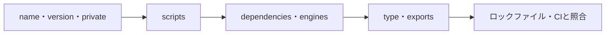
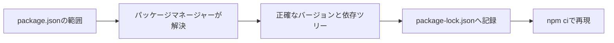

`package.json` は、単なる依存パッケージ一覧ではありません。プロジェクトの名前、実行コマンド、利用するNode.js、公開するファイル、モジュールの入口まで含む「パッケージの契約」です。

項目を上から順に暗記するより、誰が読む設定なのかで分けると理解しやすくなります。この記事では、既存プロジェクトへ参加したときに確認する順序で説明します。

## まず4つの役割に分ける



左から順に読むと、「何のプロジェクトか」「どう操作するか」「何が必要か」「何を公開するか」「同じ環境を再現できるか」を段階的につかめます。最初から全フィールドを細かく追う必要はありません。

| 役割 | 主な項目 | 主に読むもの |
| --- | --- | --- |
| 識別 | `name`, `version`, `private` | npm、開発者 |
| 開発フロー | `scripts` | npm、開発者、CI |
| 依存と環境 | `dependencies`, `engines`, `packageManager` | パッケージマネージャー、CI |
| 公開と解決 | `type`, `exports`, `files`, `bin` | Node.js、バンドラー、利用者 |

アプリケーションと公開ライブラリでは重要項目が違います。アプリでは `private`、`scripts`、依存関係が中心です。ライブラリでは `exports`、型定義、公開ファイルが利用者の互換性に直結します。

## 最初に `name`・`version`・`private` を見る

```json
{
  "name": "@example/order-web",
  "version": "1.4.2",
  "private": true
}
```

`name` はパッケージの識別子です。`@example/order-web` のような形はスコープ付きパッケージで、組織名にあたるスコープを含みます。ワークスペースでは、内部パッケージを参照するときの名前にも使われます。

`version` は公開パッケージの版を表します。通常はSemVerの `MAJOR.MINOR.PATCH` です。非公開アプリでも、リリースや監視でビルドの識別に使う場合がありますが、必ずしもデプロイ番号と同じではありません。

`private: true` は、誤ってnpmレジストリへ公開するのを防ぎます。公開しないアプリケーションやワークスペースのルートでは、安全装置として確認したい項目です。

## `scripts` はチーム共通の操作入口

```json
{
  "scripts": {
    "dev": "vite",
    "build": "tsc -b && vite build",
    "test": "vitest run",
    "lint": "eslint .",
    "check": "npm run lint && npm test && npm run build"
  }
}
```

`npm run build` のように呼ぶと、npmは対応する文字列をシェルで実行します。開発者やCIが同じコマンドを使えるため、READMEへ長い手順を直接書くより再現しやすくなります。

既存プロジェクトを読むときは、まず `dev`、`build`、`test`、`lint` を確認してください。どのツールを使い、何が品質チェックに含まれるかが分かります。`check` や `ci` があれば、プルリクエスト前に何を実行すべきかも見えます。

### `pre`・`post` スクリプトは暗黙に実行される

`prebuild`、`build`、`postbuild` がある場合、`npm run build` は順に実行します。

```json
{
  "scripts": {
    "prebuild": "node scripts/generate.mjs",
    "build": "vite build",
    "postbuild": "node scripts/check-output.mjs"
  }
}
```

便利ですが、`build` の行だけ見ても全処理が分かりません。意図しないネットワークアクセスやファイル変更を調べるときは、関連する `pre` / `post` スクリプトも確認します。

パッケージのインストール時に動くライフサイクルスクリプトもあります。第三者パッケージのスクリプトはローカル環境でコードを実行するため、依存追加時にはロックファイルだけでなくスクリプトの有無も信頼境界として考えます。

## `dependencies` と `devDependencies` は実行時に必要かで分ける

```json
{
  "dependencies": {
    "react": "^19.0.0",
    "zod": "^4.0.0"
  },
  "devDependencies": {
    "typescript": "^5.8.0",
    "vitest": "^3.0.0"
  }
}
```

`dependencies` は、そのパッケージが動くために必要な依存です。`devDependencies` は開発、テスト、ビルドで使うツールを置きます。

ただし、フロントエンドアプリではビルド時にバンドラーが依存を成果物へ取り込むため、「本番サーバーの `node_modules` に存在するか」と「依存パッケージへ置くか」は同じ質問ではありません。パッケージマネージャーやデプロイ環境がどの区分をインストールするかも確認します。

公開ライブラリでは区分を誤ると利用者へ影響します。実行時に `import` するパッケージをdevDependenciesだけへ置くと、利用者環境で見つからない可能性があります。

## `peerDependencies` は「利用側と同じものを使う」契約

プラグインやUIライブラリは、Reactのようなホストライブラリを自分専用にインストールするより、利用側と共有したい場合があります。

```json
{
  "peerDependencies": {
    "react": ">=18 <20"
  }
}
```

これは「このライブラリはReact 18以上20未満の環境で使う」という互換性の宣言です。パッケージマネージャーによってはpeer dependencyを自動インストールしますが、互換範囲を決める責任は残ります。

| 依存区分 | 誰が主に必要とするか | 例 |
| --- | --- | --- |
| `dependencies` | パッケージの実行時 | 検証、ランタイムライブラリ |
| `devDependencies` | パッケージの開発時 | コンパイラー、テストランナー |
| `peerDependencies` | パッケージと利用側の両方 | ReactプラグインのReact |
| `optionalDependencies` | なくても代替可能 | OS固有の高速化モジュール |

`optionalDependencies` はインストール失敗が必ず全体の失敗になるとは限りません。コード側にも「存在しない場合」の処理が必要です。

## バージョン範囲とロックファイルは役割が違う

`package.json` の `^1.4.2` は、許可するバージョンの範囲です。`package-lock.json` は、実際に解決したバージョンと依存ツリーを記録します。



`package.json` だけでは、同じ範囲内で後から公開された別バージョンが選ばれる可能性があります。再現可能なインストールにはロックファイルが必要です。アプリケーションでは通常、`package.json` とロックファイルを一緒にコミットします。

依存更新のレビューでは、`package.json` の範囲変更とロックファイルの解決結果を別々に見ます。直接依存を1つ上げただけでも、推移的依存が複数変わることがあります。

## `engines` と `packageManager` でツールチェーンの前提を示す

```json
{
  "engines": {
    "node": ">=22 <25"
  },
  "packageManager": "npm@11.4.2"
}
```

`engines` は対応するNode.jsやnpmの範囲を示します。環境によっては警告だけで、強制されない場合があります。CIやバージョン管理ツールの設定と合わせて、実際に同じバージョンを使えるようにします。

`packageManager` は、利用するパッケージマネージャーとバージョンを宣言します。npm、pnpm、Yarnを混ぜると、ロックファイルと `node_modules` の構造が食い違います。README、CI、ロックファイル、`packageManager` の指定が一致しているか確認してください。

## `type` は `.js` をES Modulesとして読むか決める

```json
{
  "type": "module"
}
```

Node.jsでは、パッケージスコープ内の `.js` をES Modulesとして扱うかCommonJSとして扱うかに影響します。`type: "module"` なら `.js` はES Modules、指定がなければ多くの場合CommonJSとして扱われます。`.mjs` と `.cjs` は拡張子で明示できます。

この項目を変更すると、`import` / `export`、`require`、`__dirname`、設定ファイルの読み方へ影響します。単なるフォーマッター設定のように変更せず、ビルドツールとランタイムの両方で確認します。

## 公開ライブラリでは `exports` が入口を決める

```json
{
  "name": "@example/math",
  "type": "module",
  "exports": {
    ".": {
      "types": "./dist/index.d.ts",
      "import": "./dist/index.js"
    },
    "./currency": {
      "types": "./dist/currency.d.ts",
      "import": "./dist/currency.js"
    }
  }
}
```

`exports` は、利用者が `import` できる公開入口を制御します。上の例なら、パッケージ本体と `@example/math/currency` を公開します。`dist/internal.js` が存在しても、`exports` に含めなければ公式の入口にはなりません。

内部ファイルを非公開にして直接 `import` できないようにすると、ディレクトリ構成を変更しやすくなります。一方、既存パッケージへ後から `exports` を追加すると、利用者が使っていた非公式パスを壊す可能性があります。公開済みパッケージでは互換性変更として扱います。

`main` は歴史的にCommonJSなどの主入口を示します。現代のパッケージでもツール互換性のため併記される場合がありますが、Node.jsの条件付きエントリーを表すには `exports` が中心です。

## `files`・`bin`・`workspaces` は目的が明確なとき読む

| 項目 | 役割 |
| --- | --- |
| `files` | 公開へ含めるファイルを絞る |
| `bin` | インストール後に使えるCLIコマンドを公開する |
| `browser` | ブラウザー向けの置換をツールへ伝える場合がある |
| `workspaces` | 複数パッケージを1つのリポジトリで管理する |
| `overrides` | 推移的依存のバージョンを上書きする |

`overrides` は脆弱性対応などに使えますが、上流パッケージが想定していないバージョンへ差し替える可能性があります。理由、期限、テスト結果を残し、上流が修正されたら外せるようにします。

ワークスペースではルートと各パッケージに `package.json` があります。依存がどちらに宣言されているか、スクリプトがどのワークスペースで実行されるかを確認します。ルートの `devDependencies` が偶然見えているだけの状態へ依存すると、個別パッケージの公開やビルドで壊れます。

## 既存プロジェクトではこの順で読む

1. `private` と `workspaces` で、アプリか公開パッケージか、モノレポかを確認する。
2. `packageManager` と `engines` で、使うツールチェーンを合わせる。
3. `scripts` で、開発・テスト・ビルドの入口を知る。
4. 依存パッケージの区分から、ランタイムと開発ツールを分ける。
5. `type` と `exports` で、モジュールの入口と公開範囲を確認する。
6. ロックファイルとCIを見て、インストール方法が一致しているか確認する。

`package.json` を読む目的は、全項目を覚えることではありません。そのパッケージをどう開発し、何に依存し、どの環境で動かし、利用者へ何を公開するかをつかむことです。項目を「誰が読む契約か」で分類すると、未知のフィールドがあっても役割を調べやすくなります。

## 参考資料

- [npm Docs: package.json](https://docs.npmjs.com/cli/configuring-npm/package-json)
- [npm Docs: scripts](https://docs.npmjs.com/cli/using-npm/scripts)
- [Node.js: Packages](https://nodejs.org/api/packages.html)
- [npm Docs: workspaces](https://docs.npmjs.com/cli/using-npm/workspaces)
- [Semantic Versioning](https://semver.org/)
