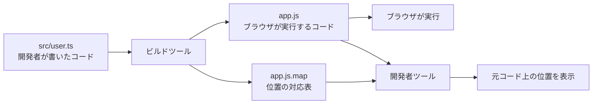

ブラウザのコンソールに、次のようなエラーが出たとします。

```text
TypeError: Cannot read properties of undefined (reading 'name')
    at printUserName (app-By31Kz.js:1:18542)
```

`app-By31Kz.js`はビルドによって生成されたファイルです。コードは1行に圧縮されているため、目で追うのは困難です。エラー位置が1行目の18,542文字目と分かっても、自分が書いたTypeScriptのどこを直せばよいのかは判断できません。

この距離を埋めるのが**Source Map**です。

一言でいえば、位置の対応表です。ブラウザが実行するコードの位置と、開発者が書いたコードの位置を結びます。この対応表があれば、先ほどの位置を次のように読み替えられます。

```text
app-By31Kz.js:1:18542
        ↓ Source Mapで変換
src/user.ts:6:28
```

ブラウザは変換後のJavaScriptを実行したままです。Chrome DevToolsなどの開発者ツールがSource Mapを読み、元のTypeScript上でエラー位置や実行位置を見せています。

## ビルドすると、書いたコードと実行されるコードが離れていく

現在のフロントエンド開発では、書いたコードがそのままブラウザへ届くとは限らず、配信されるまでにいくつもの変換を通ります。

- TypeScriptの型を取り除いてJavaScriptへ変換する
- 新しいJavaScript構文を対象ブラウザ向けに変換する
- 複数のモジュールを少数のファイルへまとめる
- 不要なコードを削除する
- 空白や改行を消し、変数名を短くする

たとえば、開発者が次のTypeScriptを書いたとします。

```ts
type User = {
  profile?: { name: string };
};

function printUserName(user: User) {
  console.log(user.profile!.name.toUpperCase());
}

printUserName({});
```

ビルドと圧縮を経たJavaScriptは、概念上、次のような形になります。

```js
function printUserName(e){console.log(e.profile.name.toUpperCase())}printUserName({});
```

型定義は消えました。改行もありません。引数の`user`は`e`に変わり、ほかのファイルと結合されれば、元の6行目が生成後の何文字目にあるかを目で追うのは困難です。

変換自体は、配信サイズやブラウザ互換性、開発体験のために必要です。ただし、変換するほど生成コードと元コードの位置関係は分かりにくくなります。そこでビルドツールは、生成コードと一緒に対応表を出力します。



## Source Mapは行と列の対応関係を持っている

実体はJSONです。一般的には、生成されたJavaScriptとは別の`.map`ファイルとして出力されます。

次は説明用に内容を単純化した例です。

```json
{
  "version": 3,
  "file": "app.js",
  "sources": ["../src/user.ts"],
  "sourcesContent": ["type User = { /* ... */ };\n\nfunction printUserName(/* ... */) {\n  /* ... */\n}"],
  "names": ["printUserName", "user", "console", "log"],
  "mappings": "AAAA;AAIA,SAASA..."
}
```

各フィールドには、次の情報が入ります。

| フィールド | 主な内容 |
| --- | --- |
| `version` | Source Map形式のバージョン |
| `file` | 対応する生成ファイル |
| `sources` | 変換元ファイルのパス |
| `sourcesContent` | 変換元ファイルの内容。省略される場合もある |
| `names` | マッピングから参照される識別子名 |
| `mappings` | 生成位置と元の位置の対応関係 |

中心は`mappings`です。ここに生成コードの行・列と元ファイルの行・列との対応が、ファイルサイズを抑えるために符号化されて入ります。人が直接読むものではありません。

元のプログラムを推測して作り直しているわけではありません。変換を行ったツールが、その途中で把握している位置関係を記録します。TypeScript、Babel、Vite、webpack、esbuild、圧縮ツールなど、変換を担当する側がSource Mapを生成する理由です。

## `sourceMappingURL`がJavaScriptとSource Mapを結びつける

生成されたJavaScriptの末尾には、対応するSource Mapの場所がコメントで記録されます。

```js
//# sourceMappingURL=app.js.map
```

開発者ツールはこのコメントを手掛かりに`app.js.map`を取得します。HTTPの`SourceMap`レスポンスヘッダーで場所を指定する方法もあります。

別ファイルにせず、Data URLとして生成コードへ埋め込む形式もあります。

```js
//# sourceMappingURL=data:application/json;base64,eyJ2ZXJzaW9uIjozLC4uLg==
```

埋め込み形式はファイルを分けずに済みますが、生成されるJavaScriptそのものが大きくなります。開発時には便利でも、本番配信では使い方を選びます。

## 開発者ツールは元コードと生成コードを行き来する

Chrome DevToolsは、このデータを読み込むと元コードと生成コードを対応づけて表示します。

先ほどのプログラムで`user.profile`が`undefined`だった場合、JavaScriptエンジンが認識している場所は`app.js`の位置です。DevToolsはその位置をSource Mapで引き直し、`src/user.ts`の該当箇所をコンソールやコールスタックへ表示します。

```text
Source Mapなし
  at printUserName (app.js:1:39)

Source Mapあり
  at printUserName (src/user.ts:6:28)
```

位置の変換は逆方向にも使われます。開発者がTypeScriptの6行目へブレークポイントを置くと、DevToolsは対応する生成コードの位置を探し、JavaScriptの実行をそこで止めます。

これにより、開発者は次の操作を元コード上で行えます。

- エラーが起きたファイルと行を開く
- TypeScriptにブレークポイントを置く
- ステップ実行で処理の流れを追う
- コールスタックを元の関数名やファイル名で確認する

エラー監視サービスでも役割は同じです。ブラウザから届くスタックトレースが圧縮後の位置を指していても、デプロイしたコードと一致するSource Mapがあれば、元ファイルの位置へ変換して表示できます。

## Pretty printでは元のTypeScriptに戻れない

開発者ツールには、圧縮されたJavaScriptへ改行やインデントを付けるPretty print機能があります。1行のコードを眺めるよりは読みやすくなりますが、Source Mapとは役割が違います。

Pretty printが整形するのは、配信されたJavaScriptです。削除されたTypeScriptの型や元のファイル構成は戻りません。短縮された変数名も、整形しただけでは元に戻せません。

一方、ビルド時に記録した対応関係を使うのがSource Mapです。元のファイル名や位置、識別子名を参照できるため、「生成コードを読みやすくする」より一歩進み、「自分が書いたコード上で調べる」ために使えます。

## Source Mapはアプリの実行内容を変えない

役割はデバッグの補助です。JavaScriptとして実行されるファイルではありません。なくても、生成済みのアプリは動きます。

ここから、いくつかの性質が分かります。

- Source Mapを追加しても、プログラムの不具合そのものは直らない
- Source Mapが壊れていても、生成されたJavaScriptが正常ならアプリは実行できる
- 外部`.map`ファイルを配信しなくても、JavaScriptの処理結果は変わらない
- インライン形式では、Source Mapの分だけJavaScriptの転送サイズが増える

「Source Mapの読み込みに失敗した」というDevToolsの警告が出ても、画面が動いていることがあるのはこのためです。困るのはアプリの実行より、その後の原因調査です。

## 本番では「生成するか」と「公開するか」を分けて考える

開発環境ではSource Mapを使える状態にしておくと、調査が楽になります。本番環境では、生成の有無に加えて、誰が取得できるかを決めます。

| 方法 | ブラウザからの取得 | 特徴 |
| --- | --- | --- |
| 公開する | できる | 利用者のブラウザでも元コードに近い形でデバッグできる |
| エラー監視だけに渡す | できない構成にする | 運用側は元の位置を確認でき、一般公開は避けられる |
| 生成しない | できない | 配布は単純だが、本番エラーの調査が難しくなる |

たとえばViteでは、`build.sourcemap`で本番用Source Mapの生成方法を選べます。

```ts
import { defineConfig } from "vite";

export default defineConfig({
  build: {
    sourcemap: "hidden",
  },
});
```

`"hidden"`は、別ファイルのSource Mapを生成しつつ、生成JavaScriptへ`sourceMappingURL`コメントを付けない設定です。エラー監視サービスへSource Mapをアップロードするときに使えます。

ただし、`hidden`という名前だけで非公開になるわけではありません。`.map`ファイルを生成物と一緒に公開ディレクトリへ置けば、URLを知っている人から取得される可能性があります。アップロード後に`.map`ファイルを配信対象から除外するところまで、デプロイ手順に含めます。

また、Source MapとJavaScriptは同じビルドで作られた組み合わせでなければなりません。古いSource Mapへ新しいJavaScriptの位置を渡すと、誤った行を指したり、変換に失敗したりします。ファイル名のハッシュやリリースIDを使い、デプロイした生成物とSource Mapを対応づけます。

## 公開するSource Mapには元コードが含まれることがある

`sourcesContent`が入っているSource Mapには、変換元ファイルの内容が埋め込まれています。ブラウザから取得できれば、第三者もその内容を読めます。

`sourcesContent`がなくても、Source Mapにはファイルパス、識別子名、位置関係などが含まれる場合があります。配信されたJavaScriptだけを見る場合より、コードの構造を理解しやすくなる可能性があります。

これは「Source Mapを公開してはいけない」という一律の話ではありません。公開ライブラリなら、利用者がデバッグしやすいことを優先する場合があります。Webアプリでは、エラー監視へだけアップロードする構成も選べます。コードの性質と運用方法から決めます。

一方、APIキーやパスワードを隠す目的でSource Mapを無効にするのは対策になりません。ブラウザへ送ったJavaScriptは利用者が取得できます。秘密情報はSource Mapの設定に関係なく、フロントエンドへ埋め込まないことが原則です。

## Source Mapが効かないときは対応関係を順に確認する

有効にしたはずなのに、生成コードの位置しか表示されないことがあります。その場合は、次の順で確認します。

1. ビルド結果に`.map`ファイルが生成されているか
2. `sourceMappingURL`または`SourceMap`ヘッダーが正しい場所を指しているか
3. 開発者ツールが`.map`ファイルを取得できているか
4. 開発者ツールのJavaScript Source Map設定が有効か
5. JavaScriptとSource Mapが同じビルドから作られているか

Chrome DevToolsでは、Developer ResourcesパネルからSource Mapの読み込み状況を確認できます。404、URLの誤り、解析エラーなどが表示されるため、まず「Source Mapが生成されていない」のか「生成されたが読み込めない」のかを分けます。

## Source Mapは「人が書くコード」と「実行されるコード」の橋渡しになる

Source Mapは、生成コードの位置と元コードの位置を結ぶ対応表です。ブラウザは生成されたJavaScriptを実行し、開発者ツールやエラー監視サービスがSource Mapを使って元の位置を表示します。

役割を短く整理すると、次のようになります。

```text
JavaScript         アプリを実行する
Source Map         元コード上でのデバッグを助ける
```

開発環境では、Source Mapを使えるようにして調査時間を減らします。本番環境では、生成するか、誰が取得できるようにするか、エラー監視へどう渡すかを分けて決めます。

ビルド設定で`sourcemap`という項目を見つけたら、「必要か不要か」だけを見るのでは足りません。デバッグに使う人と、Source Mapを置く場所まで考えると、その設定の意味が見えてきます。

## 参考資料

- [ECMA-426: Source map format specification](https://ecma-international.org/publications-and-standards/standards/ecma-426/)
- [Chrome DevTools: Debug your original code instead of deployed with source maps](https://developer.chrome.com/docs/devtools/javascript/source-maps)
- [MDN: SourceMap header](https://developer.mozilla.org/en-US/docs/Web/HTTP/Reference/Headers/SourceMap)
- [TypeScript: TSConfig Option — sourceMap](https://www.typescriptlang.org/tsconfig/sourceMap.html)
- [Vite: Build Options — build.sourcemap](https://vite.dev/config/build-options.html#build-sourcemap)
- [Sentry: Upload source maps with the Sentry esbuild Plugin](https://docs.sentry.io/platforms/javascript/guides/tanstackstart-react/sourcemaps/uploading/esbuild/)
