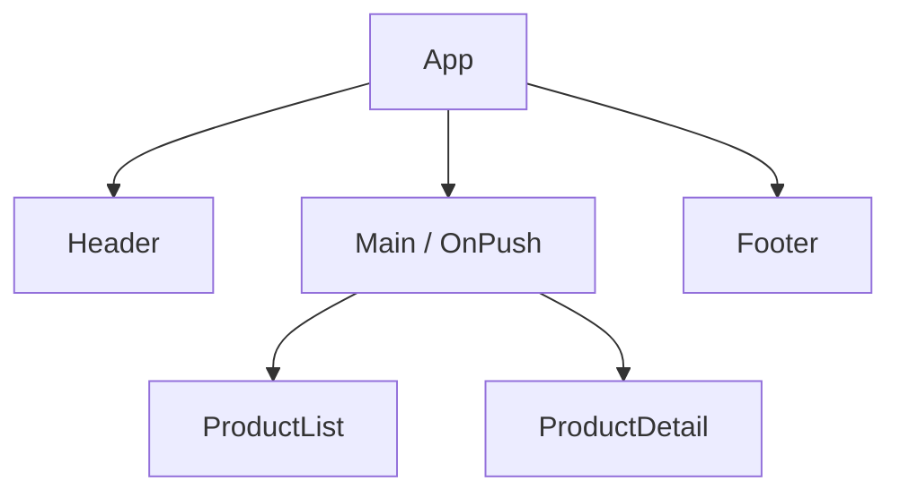
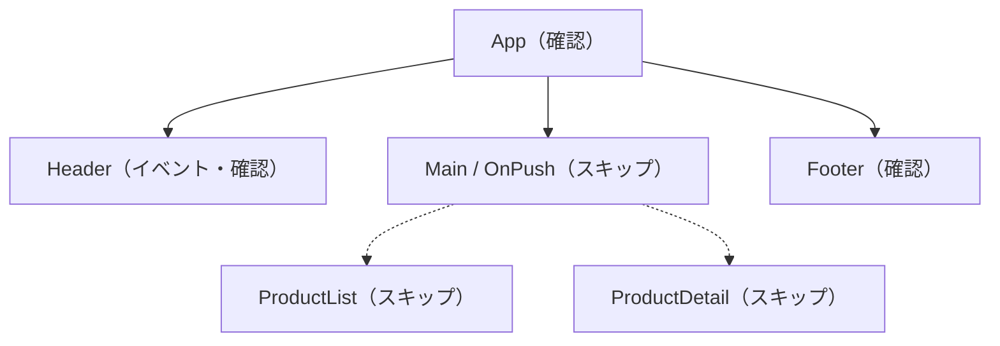
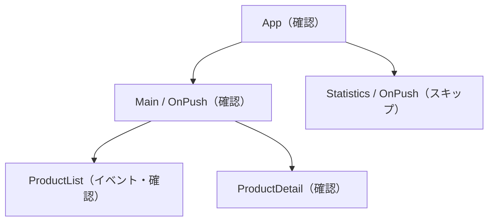

Angularのコンポーネントで、次の指定を見たことはないでしょうか。

```ts
@Component({
  changeDetection: ChangeDetectionStrategy.OnPush,
  // ...
})
export class ProductList {}
```

「OnPushにすると速くなる」と説明されることがあります。では、Angularのどの処理が減るのでしょうか。処理が動かなくなるのか、DOMの描画回数が減るのか、それとも別の仕事が省かれるのでしょうか。

答えは、確認範囲です。**OnPushは、変更のないコンポーネントのサブツリーをチェック対象から外します**。サブツリーとは、あるコンポーネントと、その下に連なる子孫のまとまりです。同期処理そのものを止める機能ではありません。変更検知が始まっても、確認する必要がない範囲へ入らずに済むため、1回あたりの処理が軽くなります。

この記事では、Angularがコンポーネントツリーを確認する流れから、OnPushでパフォーマンスが上がる理由をたどります。入力オブジェクトを変更したのに画面へ反映されない問題や、RxJS・Signalsと組み合わせる方法も扱います。

:::message
この記事はAngular 22を前提にしています。Angular 22以降ではOnPushが既定の変更検知戦略です。従来の常時確認する戦略は`Eager`と呼ばれ、`Default`は`Eager`の非推奨な別名になりました。

本文では仕組みを明確にするため、サンプルコードに`ChangeDetectionStrategy.OnPush`を明示しています。Angular 21以前や既存のコードを読むときにも、考え方は同じです。
:::

## OnPushが省くのは、変更検知で確認する範囲

Angularの変更検知は、アプリケーションの状態とDOMを同期する仕組みです。変更検知が走ると、Angularはコンポーネントツリーをたどり、テンプレートのバインディングを評価します。前回と値が違えば、対応するDOMを更新します。

ここで区別したい処理が2つあります。

1. テンプレートの値を評価し、前回の値と比べる
2. 値が変わっていた箇所のDOMを更新する

常時確認する`Eager`でも、毎回すべてのDOMを書き直すわけではありません。値が変わっていなければDOMはそのままです。ただし、変わっていないと判断するには、テンプレートを評価して前回の値と比べる必要があります。

DOM更新は、その後です。

OnPushは、この比較より前の段階で仕事を減らします。変更されていないと判断できるコンポーネントでは、テンプレートの確認に入らず、その子孫もまとめてスキップします。



このツリーで`Main`をスキップできれば、`ProductList`と`ProductDetail`へ進む必要もありません。OnPushを指定したコンポーネント1つだけではなく、その下に連なるサブツリー全体の処理を省けます。

子孫も対象外です。

Angular公式ドキュメントも、OnPushを「変更されていないコンポーネントのサブツリーをスキップする」ための仕組みとして説明しています。

https://angular.dev/best-practices/skipping-subtrees

## 変更検知の開始と、実際に確認される範囲は別に決まる

OnPushを理解するときは、次の2つを分けて考えると整理しやすくなります。

- 何をきっかけに変更検知が始まるか
- 始まった変更検知が、どのコンポーネントを確認するか

利用者のクリックや入力、Signalの更新などによって、Angularは画面を同期する処理を始めます。しかし、変更検知が始まったからといって、すべてのコンポーネントを確認するとは限りません。OnPushのサブツリーは、更新が必要だと判断できる条件を満たしていなければスキップされます。

たとえば、次のツリーで`Header`のボタンが押されたとします。`Main`には新しい入力がなく、内部でもイベントが起きていません。



同期処理は始まりますが、`Main`以下へは入りません。全体を見るわけではありません。Headerの操作と無関係な商品一覧や商品詳細を確認せずに済みます。

一方、`ProductList`の中でイベントが処理された場合は、そのコンポーネントを含むOnPushのサブツリーが確認対象になります。イベントが起きた場所の祖先も、画面を正しく同期するために確認されます。外側にある別のOnPushサブツリーは、条件を満たしていなければ引き続きスキップされます。



OnPushは「このコンポーネントを二度と確認しない」という指定ではありません。更新の可能性がある場所だけを確認する境界です。

## OnPushは1回の変更検知で行う仕事を減らす

1回の変更検知にかかる処理を単純化すると、次のように捉えられます。

```text
変更検知のコスト
≒ 確認するコンポーネント数
  × 各コンポーネントの確認コスト
  × 変更検知の実行回数
```

OnPushが主に減らすのは、1つ目の「確認するコンポーネント数」です。スキップしたサブツリーでは、各コンポーネントのテンプレートを評価せず、さらに子孫をたどる処理も省けます。

OnPushは、この式の左端を小さくします。

起動回数は別の軸です。

効果は、コンポーネント1個分で終わりません。更新頻度が低い画面領域の根元にOnPushの境界があれば、その下にある多数のコンポーネントをまとめて確認対象から外せます。コンポーネントツリーが大きく、画面内で互いに独立した領域が多いほど、スキップできる範囲も大きくなります。

反対に、小さな画面でテンプレートの処理も軽ければ、差はほとんど見えないかもしれません。操作のたびに全コンポーネントの状態が変わる画面も、スキップできる範囲が少ないため効果は限られます。

OnPushが減らすのは、あくまで変更検知の範囲です。範囲外の遅さは残ります。

- API通信や画像読み込みの遅さ
- 初期バンドルサイズ
- 非効率な検索や集計処理
- 大量のDOM生成
- リスト描画における不適切な`track`や`trackBy`

OnPushを指定しても、重い計算を毎回更新されるコンポーネントのテンプレートに置けば、その計算は繰り返されます。値をSignalから導けるなら`computed()`へ移すなど、計算自体の見直しも必要です。

## OnPushコンポーネントが再び確認される条件

OnPushのサブツリーは、必要なときだけ確認されます。更新には、Angularへの合図が要ります。代表的な合図は5つです。

| 条件 | 具体例 |
| --- | --- |
| テンプレートバインディングから新しい入力を受け取る | 親から渡す`[user]`が新しいオブジェクトになる |
| 自身または子孫でイベントが処理される | `(click)`、`output()`、`@HostListener` |
| テンプレートで読んでいるSignalが更新される | `count.set(1)`、`count.update(...)` |
| 明示的に確認対象として印を付ける | `ChangeDetectorRef.markForCheck()` |
| `AsyncPipe`が新しい値を受け取る | `user$ | async` |

入力値について、Angularは前回と今回の値を比較します。数値や文字列なら値の違いを判定できます。オブジェクトや配列では、同じインスタンスを指している限り参照は変わりません。ここが落とし穴です。

`markForCheck()`は、そのビューを次回の変更検知で確認できるようにします。似たAPIの`detectChanges()`は、その場で対象のビューと子を確認します。通常のデータフローでは、入力、Signal、`AsyncPipe`で更新を伝えられるため、手動APIが必要になる場面は多くありません。

https://angular.dev/api/core/ChangeDetectorRef

## 同じオブジェクトを変更しても、新しい入力にはならない

商品の担当者名を表示する`UserCard`を例に考えます。子コンポーネントはOnPushで、親から`user`を受け取ります。

```ts:src/app/user-card.ts
import {
  ChangeDetectionStrategy,
  Component,
  input,
} from '@angular/core';

export type User = {
  name: string;
};

@Component({
  selector: 'app-user-card',
  changeDetection: ChangeDetectionStrategy.OnPush,
  template: `<p>担当者: {{ user().name }}</p>`,
})
export class UserCard {
  readonly user = input.required<User>();
}
```

親では、ボタンを押したときに担当者名を変更します。最初は、オブジェクトのプロパティを直接書き換えてみます。

```ts:src/app/product-page.ts
import { Component } from '@angular/core';
import { User, UserCard } from './user-card';

@Component({
  selector: 'app-product-page',
  imports: [UserCard],
  template: `
    <button (click)="renameMutably()">担当者を変更</button>
    <app-user-card [user]="user" />
  `,
})
export class ProductPage {
  protected user: User = { name: '佐藤' };

  protected renameMutably(): void {
    this.user.name = '鈴木';
  }
}
```

クリックは親の`ProductPage`で処理されるため、親のテンプレートは確認されます。しかし、`[user]`が指すオブジェクトは変更前と同じです。参照が変わっていません。`UserCard`には新しい入力が渡されていないと判断され、ほかに確認対象となるきっかけがなければスキップされます。その結果、データ上の名前は変わっていても、表示が「佐藤」のまま残ることがあります。

原因は参照です。

新しいオブジェクトへ差し替えると、入力の参照が変わります。

```ts
protected renameImmutably(): void {
  this.user = {
    ...this.user,
    name: '鈴木',
  };
}
```

これなら`UserCard`が新しい入力を受け取り、テンプレートが確認されます。配列も同じです。`push()`で既存の配列を変更するより、スプレッド構文や`map()`、`filter()`を使って新しい配列を作ると、変更を参照の違いとして伝えられます。

```ts
// 参照が変わらない
this.items.push(newItem);

// 新しい参照になる
this.items = [...this.items, newItem];
```

OnPushで不変な更新が好まれるのは、新旧の値を参照で判定しやすくなるためです。ただし「すべての値を必ず不変にしなければならない」という意味ではありません。Signalや`markForCheck()`など、変更をAngularへ伝える別の経路もあります。どの経路で通知するかをコードから読み取れる状態にします。

## RxJSはAsyncPipe、ローカル状態はSignalsで通知できる

OnPushを使うために、Observableをやめる必要はありません。テンプレートでは`AsyncPipe`が新しい値を受け取るたびに、対象のコンポーネントを確認できる状態にします。

```ts:src/app/user-profile.ts
import { AsyncPipe } from '@angular/common';
import { ChangeDetectionStrategy, Component, inject } from '@angular/core';
import { UserService } from './user.service';

@Component({
  selector: 'app-user-profile',
  imports: [AsyncPipe],
  changeDetection: ChangeDetectionStrategy.OnPush,
  template: `
    @if (user$ | async; as user) {
      <p>{{ user.name }}</p>
    }
  `,
})
export class UserProfile {
  private readonly userService = inject(UserService);
  protected readonly user$ = this.userService.getCurrentUser();
}
```

コンポーネント内で手動`subscribe()`し、通常のフィールドへ代入するだけでは、その代入がOnPushコンポーネントの確認条件にならないことがあります。テンプレートで使う値なら、まず`AsyncPipe`を検討してください。購読と破棄もパイプへ任せられます。

ObservableをSignalへ変換する方法もあります。

```ts
import { toSignal } from '@angular/core/rxjs-interop';

protected readonly user = toSignal(this.userService.getCurrentUser(), {
  initialValue: null,
});
```

SignalをOnPushコンポーネントのテンプレートから読むと、AngularはそのSignalをコンポーネントの依存として記録します。値が変わるとコンポーネントが確認対象になります。

```ts:src/app/counter.ts
import { ChangeDetectionStrategy, Component, signal } from '@angular/core';

@Component({
  selector: 'app-counter',
  changeDetection: ChangeDetectionStrategy.OnPush,
  template: `
    <p>{{ count() }}</p>
    <button (click)="increment()">増やす</button>
  `,
})
export class Counter {
  protected readonly count = signal(0);

  protected increment(): void {
    this.count.update((value) => value + 1);
  }
}
```

この例は、入力の参照変更に頼っていません。`count`の更新そのものが通知になります。OnPushとSignalsの相性がよいのは、Angularが「どの状態が、どのテンプレートで使われているか」を追跡できるためです。

Signalにも同じ注意が必要です。オブジェクトや配列の中身だけを直接変更しても通知されません。`set()`や`update()`で新しい値を設定します。

通知は、このAPIから飛びます。

```ts
protected readonly profile = signal<User>({ name: '佐藤' });

// Signalへ変更が通知されない
this.profile().name = '鈴木';

// 新しい値として通知される
this.profile.update((current) => ({
  ...current,
  name: '鈴木',
}));
```

https://angular.dev/guide/signals#reading-signals-in-onpush-components

## OnPushの効果はProfilerで確認する

OnPushは、指定しただけで必ず体感できるほど速くなる機能ではありません。まず測ります。Profilerでボトルネックを確かめてから、確認範囲を見直します。

[Angular DevToolsのProfiler](https://angular.dev/tools/devtools/profiler)では、変更検知のサイクルと、各コンポーネントの処理時間を確認できます。開発ビルドのアプリケーションを開き、次の手順で記録します。

1. Angular DevToolsの`Profiler`タブを開く
2. 記録を開始する
3. 調べたいクリックや入力操作を行う
4. 記録を止め、対象の変更検知サイクルを選ぶ
5. フレームグラフで確認されたコンポーネントを見る

Profilerには、変更検知を通ったコンポーネントだけを強調する表示があります。スキップされたOnPushコンポーネントは灰色で表示されるため、意図したサブツリーが対象外になっているかを目で確かめられます。

比較するときは、同じ画面、同じデータ件数、同じ操作を使います。開発者ツールや`console.log`の出力自体も計測へ影響するため、テンプレートから呼ぶメソッドへ大量のログを追加する方法は避けたほうがよいでしょう。

Chrome DevToolsのPerformanceパネルにも、Angular固有のトラックを表示できます。JavaScript、テンプレート、変更検知の処理をブラウザ側のレイアウトや描画と並べて確認したい場合に向いています。

https://angular.dev/best-practices/profiling-with-chrome-devtools

## OnPushが効く場所を選ぶ

OnPushの効果は、更新される範囲とコンポーネントツリーの形で決まります。

| 効果が出やすい | 効果が限られる |
| --- | --- |
| 大きなコンポーネントツリー | 小規模で軽い画面 |
| 入力が変わるまで表示が安定している子 | 操作のたびに全体が更新される画面 |
| 複数の独立した画面領域 | コンポーネントの境界が状態の境界と合っていない構成 |
| 無関係なイベントが頻繁に起きる画面 | 変更検知以外がボトルネックの画面 |

既存のEager／Defaultアプリケーションへ導入する場合は、まず入力を受け取って表示するコンポーネントから試すと、更新の境界を把握しやすくなります。入力値を直接変更している箇所が多いなら、先に更新方法を整理します。

Angular 22以降の新しいコンポーネントではOnPushが既定です。そのため、現在は「どこへOnPushを追加するか」よりも、「OnPushで正しく更新を通知できるデータフローになっているか」を確認する意味合いが強くなっています。

導入や見直しの際は、次の順番で確認できます。

1. Profilerで変更検知がボトルネックか調べる
2. コンポーネント間の入力を直接変更していないか探す
3. Observableは`AsyncPipe`、ローカル状態はSignalsで通知する
4. 重いテンプレート式を`computed()`や事前計算へ移す
5. 操作後の表示をコンポーネントテストで確かめる
6. 同じ操作を再計測し、確認範囲と処理時間を比較する

## OnPushは「必要な場所だけ確認する」ための境界

OnPushでパフォーマンスが上がる理由は、DOMを特別な方法で高速に描画するからではありません。変更の可能性がないコンポーネントのサブツリーへ入らず、テンプレートの評価と子孫の走査を省けるからです。

押さえておきたい点は3つです。

- 変更検知が始まっても、OnPushのサブツリーは条件次第でスキップされる
- 新しい入力、イベント、Signals、`AsyncPipe`などが確認のきっかけになる
- オブジェクトや配列は、新しい参照へ差し替えると入力の変化を伝えやすい

OnPushを単なる高速化の設定として覚えると、画面が更新されないときに原因を追えません。「このコンポーネントは、何をきっかけに確認対象になるのか」と考えると、パフォーマンスと表示更新の両方を同じ仕組みから説明できるようになります。

## 参考資料

- [Skipping component subtrees](https://angular.dev/best-practices/skipping-subtrees)
- [Advanced component configuration](https://angular.dev/guide/components/advanced-configuration)
- [ChangeDetectorRef](https://angular.dev/api/core/ChangeDetectorRef)
- [Signals](https://angular.dev/guide/signals)
- [Angular DevTools Profiler](https://angular.dev/tools/devtools/profiler)
