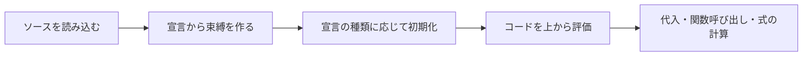
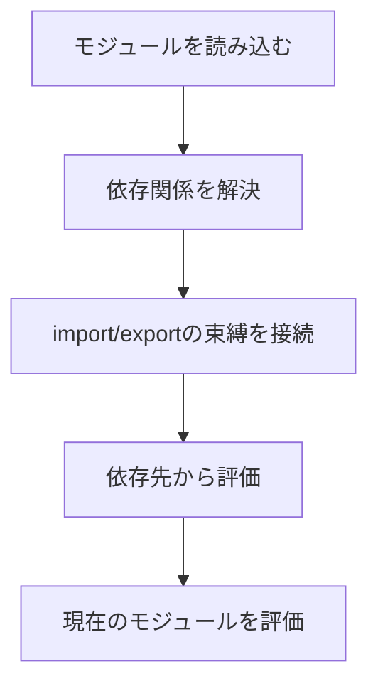

「宣言がコードの先頭に移動するんです」

巻き上げの説明で、いちばんよく見る一文です。分かりやすい。分かりやすいんですが、この絵を信じたまま `let` を使うと、思っていたのと違うエラーで足を止めることになります。

実際には、ソースコードが並べ替えられているわけではありません。**実行が始まる前に、宣言から変数や関数の置き場所だけが先に作られる**。そのあとで、コードが上から評価されていきます。この「名前と、その名前が指す値を結び付ける仕組み」を束縛と呼びます。

そして何が事前に用意されるのか、いつ値を触れるようになるのかが、`var`、`let`、`const`、関数宣言、`class` で全部違います。

## 先に答えを置きます

| 宣言 | 宣言前の読み取り | 初期化される値 | 主なスコープ |
| --- | --- | --- | --- |
| `var` | できる | `undefined` | 関数 |
| `let` | `ReferenceError` | 宣言行で初期化 | ブロック |
| `const` | `ReferenceError` | 宣言行で値が必要 | ブロック |
| 関数宣言 | 呼び出せる | 関数オブジェクト | ブロックまたは関数 |
| `class` 宣言 | `ReferenceError` | 宣言の評価後 | ブロック |

「巻き上がる／巻き上がらない」の二択で覚えると、必ずどこかで詰まります。全部の宣言が同じ準備をされているわけではないからです。



## `var`：読めてしまうのが困る

次のコードはエラーになりません。`undefined` が出ます。

```js
console.log(total); // undefined
var total = 1_000;
console.log(total); // 1000
```

頭の中で分解すると、こういう順序に近い動きです。

```js
var total;          // 実行前に束縛が作られ、undefinedで初期化
console.log(total);
total = 1_000;      // 代入はこの行を評価したとき
console.log(total);
```

これ、便利でしょうか。私はそうは思いません。

宣言し忘れているように見えるコードがエラーで止まってくれず、`undefined` を抱えたまま計算に突っ込んでいくからです。バグが顕在化するのは、ずっと下流になります。新しく書くなら、再代入しない値は `const`、する値は `let`。そのほうが意図が読めます。

## `let` と `const`：名前はあるのに、触れない

`let` と `const` の束縛も、ブロックの評価前に作られています。ここは `var` と同じ。違うのは、**宣言行に到達するまで初期化されない**ことです。

この区間をTemporal Dead Zone、TDZと呼びます。

```js
{
  // ここから price のTDZ
  console.log(price); // ReferenceError
  const price = 1_000;
  console.log(price); // 1000
}
```

TDZがあるおかげで、外側に同じ名前の変数があっても、宣言前にそっちへフォールバックすることはありません。

```js
const status = "outer";

{
  console.log(status); // ReferenceError
  const status = "inner";
}
```

内側の `status` は、ブロックが始まった瞬間から外側の名前を隠しています。隠しているけれど、宣言行までは値を読ませない。

一見きびしい仕様ですが、これのおかげで「スコープ内のどの変数を参照しているか」が途中で入れ替わらずに済んでいます。

## 関数宣言：これだけは先に呼べる

関数宣言は、本体の評価が始まる前に関数オブジェクトで初期化されます。だから、宣言より上から呼べます。

```js
console.log(calculateTax(1_000)); // 100

function calculateTax(price) {
  return price * 0.1;
}
```

一方、関数式とアロー関数は、代入先の変数のルールに従います。

```js
calculateTax(1_000); // ReferenceError

const calculateTax = (price) => price * 0.1;
```

ここで大事なのは、エラーの理由です。**アロー関数だから呼べないのではありません。** `const calculateTax` が宣言行までTDZにいるから呼べないんです。

### どっちで書くか

関数宣言は、ファイル上部に主要な処理を置いて、補助関数を下にぶら下げる構成に向いています。関数式は、関数を値として渡すときや、定義前に使われるのを防ぎたいときに素直です。

巻き上げの有無だけで統一しないでください。読み手が処理の入口を見つけやすいほう、で選びます。

## `class` も先には使えない

`class` 宣言も `let` や `const` と同じくTDZを持ちます。

```js
const order = new Order("order-42"); // ReferenceError

class Order {
  constructor(id) {
    this.id = id;
  }
}
```

クラス同士が互いを宣言前に必要とし始めたら、要注意です。並び順をいじれば動くこともありますが、それは循環した設計にフタをしているだけかもしれません。共通の契約を切り出す、生成処理を関数に移す、モジュール境界を引き直す。順番より先に、そちらを疑ってください。

## `import` は「移動」では説明しきれない

`import` 宣言を「ファイル先頭に移動する」と理解すると、循環参照でつまずきます。JavaScriptのモジュールには、依存をつなぐリンクの段階と、各モジュールを実行する評価の段階があるからです。



循環していると、相手がまだ評価の途中で、読もうとした値が初期化されていないことがあります。「`import` は巻き上がる」で止めず、初期化のタイミングまで見てください。

## デフォルト引数にも順番がある

デフォルト引数は、呼び出し時に左から右へ評価されます。だから前の引数を後ろのデフォルト値から参照できます。逆はできません。

```js
function createRange(start = 0, end = start + 10) {
  return { start, end };
}

console.log(createRange());    // { start: 0, end: 10 }
console.log(createRange(5));   // { start: 5, end: 15 }
```

ただ、ここに複雑な依存を詰め込むと、本文より先に引数リストを解読する羽目になります。単純な既定値を超えるなら、関数本体で組み立てたほうが親切です。

## エラー文が状態を教えてくれる

似たようなコードでも、エラーの種類で原因はかなり絞れます。

| 結果 | よくある状態 |
| --- | --- |
| `undefined` | `var` は初期化済みだが、代入前 |
| `ReferenceError: Cannot access ... before initialization` | `let`、`const`、`class` のTDZ |
| `ReferenceError: ... is not defined` | 現在のスコープに束縛自体がない |
| `TypeError: ... is not a function` | 名前は読めたが、呼び出せる値ではない |

全部まとめて「巻き上げのせい」にしないこと。束縛が存在するか、初期化されているか、期待した値が入っているか。この3段階で切り分けます。

## 実務では、仕様より読みやすさで置く

仕様上は先に呼べる関数でも、40行下に定義があったら追うのは大変です。この5つを守るだけで、巻き上げに寄りかかった読みにくさはかなり減ります。

- 変数は使う場所の近くで宣言する。
- `const` を基本にし、再代入が必要なときだけ `let` を使う。
- 主要な処理の流れを先に見せるためなら、補助関数を下へ置いてもよい。
- ブロック内の関数宣言に環境差を期待しない。
- 循環したモジュールは、実行順の調整より依存関係の整理を優先する。

---

冒頭の「先頭へ移動する」に戻ります。

巻き上げの正体は、コードの移動ではありませんでした。実行前に束縛を用意して、宣言ごとのルールで初期化してから、コードを評価する。それだけの仕組みです。

だから見るべき質問も「宣言前に使えるか」ではなく、2つに分かれます。その時点で**束縛は存在するか**。そして、**初期化されているか**。

## 参考資料

- [ECMAScript: Execution Contexts](https://tc39.es/ecma262/multipage/executable-code-and-execution-contexts.html)
- [ECMAScript: GlobalDeclarationInstantiation](https://tc39.es/ecma262/multipage/global-object.html#sec-globaldeclarationinstantiation)
- [ECMAScript: BlockDeclarationInstantiation](https://tc39.es/ecma262/multipage/ecmascript-language-statements-and-declarations.html#sec-blockdeclarationinstantiation)
- [MDN: Hoisting](https://developer.mozilla.org/ja/docs/Glossary/Hoisting)
- [MDN: Temporal dead zone](https://developer.mozilla.org/ja/docs/Web/JavaScript/Reference/Statements/let#temporal_dead_zone_tdz)
