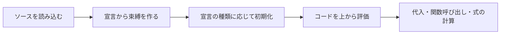
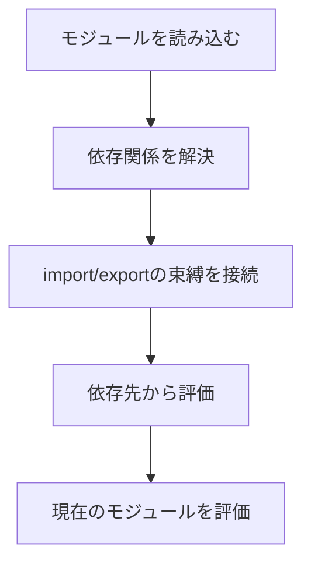

JavaScriptの巻き上げは、「宣言がコードの先頭へ移動する」と説明されがちです。しかし、実際にソースコードが並べ替えられるわけではありません。

実行前に宣言から変数や関数の置き場所が作られ、その後でコードが上から評価されます。この「変数名と、その名前が指す値を結び付ける仕組み」を束縛と呼びます。何が事前に用意され、いつ値を使えるようになるかは、`var`、`let`、`const`、関数宣言、`class` で異なります。

## 先に結論：宣言ごとに初期状態が違う

| 宣言 | 宣言前の読み取り | 初期化される値 | 主なスコープ |
| --- | --- | --- | --- |
| `var` | できる | `undefined` | 関数 |
| `let` | `ReferenceError` | 宣言行で初期化 | ブロック |
| `const` | `ReferenceError` | 宣言行で値が必要 | ブロック |
| 関数宣言 | 呼び出せる | 関数オブジェクト | ブロックまたは関数 |
| `class` 宣言 | `ReferenceError` | 宣言の評価後 | ブロック |

「巻き上がるか、巻き上がらないか」の二択で覚えると混乱します。すべての宣言が同じ準備をされるわけではないからです。



## `var` は宣言前でも読めるが、値は `undefined`

次のコードはエラーにならず、`undefined` を表示します。

```js
console.log(total); // undefined
var total = 1_000;
console.log(total); // 1000
```

理解のために分けて書くと、次の順序に近い動きです。

```js
var total;          // 実行前に束縛が作られ、undefinedで初期化
console.log(total);
total = 1_000;      // 代入はこの行を評価したとき
console.log(total);
```

この挙動は便利というより、バグを発見しにくくします。宣言漏れのように見えるコードがエラーにならず、`undefined` のまま計算へ進むからです。新しいコードでは、再代入しない値に `const`、再代入する値に `let` を使う方が意図を表しやすくなります。

## `let` と `const` は宣言行まで使えない

`let` と `const` の束縛も、ブロックの評価前に作られます。ただし、宣言行へ到達するまで初期化されません。この区間をTemporal Dead Zone（TDZ）と呼びます。

```js
{
  // ここから price のTDZ
  console.log(price); // ReferenceError
  const price = 1_000;
  console.log(price); // 1000
}
```

TDZがあるため、外側に同名変数があっても宣言前にそちらへ戻ることはありません。

```js
const status = "outer";

{
  console.log(status); // ReferenceError
  const status = "inner";
}
```

内側の `status` はブロック開始時点から名前を隠しています。ただし、宣言行までは値を読めません。この挙動は、スコープ内のどの変数を参照しているかを一定に保ちます。

## 関数宣言は本体まで先に利用できる

関数宣言は、コード本体の評価前に関数オブジェクトで初期化されます。そのため、宣言より前から呼び出せます。

```js
console.log(calculateTax(1_000)); // 100

function calculateTax(price) {
  return price * 0.1;
}
```

一方、関数式とアロー関数は、代入先の変数の規則に従います。

```js
calculateTax(1_000); // ReferenceError

const calculateTax = (price) => price * 0.1;
```

ここで先に使えない理由は、アロー関数だからではありません。`const calculateTax` が宣言行までTDZにあるためです。

### どちらの書き方を選ぶか

関数宣言は、ファイルの上部に主要処理を書き、補助関数を下へ置く構成に向きます。関数式は、関数を値として渡すときや、定義前の利用を防ぎたいときに自然です。巻き上げの有無だけで統一せず、読み手が処理の入口を見つけやすい方を選びます。

## `class` も宣言前には使えない

`class` 宣言は `let` や `const` と同じくTDZを持ちます。

```js
const order = new Order("order-42"); // ReferenceError

class Order {
  constructor(id) {
    this.id = id;
  }
}
```

クラス同士が互いを宣言前に必要とする場合、並び順を変えるだけでは循環した設計を隠すことがあります。共通の契約を分ける、生成処理を関数へ移す、モジュール境界を見直す、といった設計上の解決も検討してください。

## `import` はモジュールのリンクと評価で考える

`import` 宣言は単純な「ファイル先頭への移動」では説明しきれません。JavaScriptモジュールは、依存関係をつなぐリンクと、各モジュールを実行する評価の段階を持つからです。



循環参照があると、相手のモジュールがまだ評価途中で、読み取ろうとした値が初期化されていない場合があります。「`import` は巻き上がる」とだけ覚えず、初期化のタイミングを確認します。

## デフォルト引数にも評価順がある

デフォルト引数は、呼び出し時に左から右へ評価されます。前の引数を後ろのデフォルト値から参照できますが、その逆はできません。

```js
function createRange(start = 0, end = start + 10) {
  return { start, end };
}

console.log(createRange());    // { start: 0, end: 10 }
console.log(createRange(5));   // { start: 5, end: 15 }
```

複雑な依存をデフォルト引数へ詰め込むと、本文より先に読解が必要になります。単純な既定値を超えるなら、関数本体で明示的に組み立てる方が追いやすくなります。

## エラー文から「今どの状態か」を読む

似たコードでも、エラーの種類から原因を絞れます。

| 結果 | よくある状態 |
| --- | --- |
| `undefined` | `var` は初期化済みだが、代入前 |
| `ReferenceError: Cannot access ... before initialization` | `let`、`const`、`class` のTDZ |
| `ReferenceError: ... is not defined` | 現在のスコープに束縛自体がない |
| `TypeError: ... is not a function` | 名前は読めたが、呼び出せる値ではない |

エラーを「巻き上げの問題」で一括りにせず、束縛が存在するか、初期化済みか、期待した値が代入済みかの順に確認します。

## 実務では宣言位置を読みやすさで決める

仕様上先に呼べる関数でも、何十行も下に定義されていると追跡が難しくなります。次の基準で配置すると、巻き上げへ依存した読みにくさを減らせます。

- 変数は使う場所の近くで宣言する。
- `const` を基本にし、再代入が必要なときだけ `let` を使う。
- 主要な処理の流れを先に見せるためなら、補助関数を下へ置いてもよい。
- ブロック内の関数宣言に環境差を期待しない。
- 循環したモジュールは、実行順の調整より依存関係の整理を優先する。

巻き上げの正体は、コードの移動ではありません。実行前に束縛を準備し、宣言ごとの規則で初期化してから、コードを評価する仕組みです。「宣言前に使えるか」だけでなく、「その時点で束縛は存在するか」「初期化されているか」を分けて考えると、挙動を予測できます。

## 参考資料

- [ECMAScript: Execution Contexts](https://tc39.es/ecma262/multipage/executable-code-and-execution-contexts.html)
- [ECMAScript: GlobalDeclarationInstantiation](https://tc39.es/ecma262/multipage/global-object.html#sec-globaldeclarationinstantiation)
- [ECMAScript: BlockDeclarationInstantiation](https://tc39.es/ecma262/multipage/ecmascript-language-statements-and-declarations.html#sec-blockdeclarationinstantiation)
- [MDN: Hoisting](https://developer.mozilla.org/ja/docs/Glossary/Hoisting)
- [MDN: Temporal dead zone](https://developer.mozilla.org/ja/docs/Web/JavaScript/Reference/Statements/let#temporal_dead_zone_tdz)
