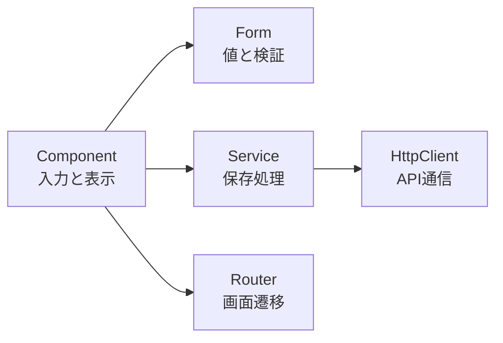

このフレームワークの話をすると、だいたい二つの反応が返ってきます。

「重い」「難しい」。

どちらも間違っていません。覚えることは多いし、小さな画面を作るだけなら大げさに見えます。プロジェクトが育てば、ビルドやテストの待ち時間も無視できなくなります。

それでも、私はAngularを選ぶ理由があります。

コードを最短で書けるからでも、どんな用途にも合うからでもありません。**Angularは、開発の初期にコストを払い、その後の迷いを減らすフレームワークです。**

特に効くのは、複数人で一つのアプリケーションを長く育てる場面です。この記事ではAngular 22を前提に、私が感じている良さと、その裏側にある弱点をまとめます。

## Angularの一番の良さは、迷いを減らせること

フロントエンドの開発では、機能を作る前に多くの選択が発生します。

ルーティングに何を使うか。フォームをどう管理するか。HTTP通信をどこへ置くか。状態をどう共有するか。テスト環境をどう組むか。ビルド設定を誰が保守するか。

Angularには、これらを扱う公式の仕組みが一通りそろっています。

| やりたいこと | Angularの仕組み |
| --- | --- |
| 画面を部品へ分ける | Component |
| 処理や状態を共有する | ServiceとDI |
| URLと画面を結び付ける | Angular Router |
| 入力と検証を管理する | Angular Forms |
| APIと通信する | HttpClient |
| 作成・ビルド・更新を行う | Angular CLI |

[Angularの公式サイト](https://angular.dev/overview)も、Component、Signals、SSR、DI、Router、Forms、CLIを一つの開発基盤として紹介しています。

選択肢があること自体は悪くありません。ただ、選定には時間がかかります。採用したライブラリ同士をつなぎ、更新方針を決め、チーム内で使い方をそろえる作業も必要です。

Angularでは、その判断の多くをフレームワーク側へ預けられます。もちろん、状態管理やUIライブラリなど、プロジェクトごとに選ぶものは残ります。アプリケーションの骨格から毎回決め直す必要はありません。

私にとってAngularの「全部入り」は、機能数の多さを競う言葉ではありません。設計会議で決める項目を減らせることに価値があります。

## 責務を分けやすいから、書く場所に迷いにくい

たとえば、入力フォームからユーザー情報を保存する画面を考えます。

Componentは入力を受け取り、画面の状態を表示する。Formは入力値と検証状態を管理する。Serviceは保存処理を引き受ける。保存後の画面遷移はRouterが扱う。



現実のコードは、これほどきれいに分かれないこともあります。Component内にしか意味のない処理を、何でもServiceへ移せばよいわけでもありません。役割を考えるための出発点は用意されています。

ここでいう書きやすさは、記述量の少なさより「この処理をどこへ置くか」を決めやすい点にあります。

依存関係も同じです。ComponentがServiceを自分で生成せず、必要なものを外から受け取るDIが標準で組み込まれています。通信処理を偽物へ差し替える、機能ごとにServiceの共有範囲を変える、といった設計も同じ仕組みの上で扱えます。

[AngularのDIガイド](https://angular.dev/guide/di)では、責務の分離、再利用、テストのしやすさがDIの利点として挙げられています。DIを採用するかどうかから議論する必要がなく、最初から共通の前提として使えるのがAngularらしいところです。

## 書き方がそろうと、他人のコードを読みやすくなる

書きやすさと読みやすさは、似ているようで別の話です。

自由度の高い環境では、書いた本人にとって扱いやすいコードを作れます。一方、別の人が同じ判断をするとは限りません。状態をComponentに置く人もいれば、専用ライブラリへ集める人もいる。API通信の置き場所やファイルの分け方も変わります。

Angularにも設計の幅はあります。ただし、Component、Service、Provider、Guard、Interceptorといった共通の語彙があります。知らないプロジェクトを開いたときも、それぞれの名前から役割を推測できます。

探す範囲が狭まります。

TypeScriptの型がクラスの中だけで終わらない点も大きな利点です。テンプレート型検査は、HTMLから参照しているプロパティ、イベント、入力値まで確認します。`strictTemplates`を有効にすれば、HTML側の型の食い違いもビルド時に見つけられます。

https://angular.dev/tools/cli/template-typecheck

画面を開いて初めて気付く間違いが、エディターやCIで分かる。これは実行速度とは違う種類の速さです。修正が必要な場所へ早くたどり着けます。

規約があるから、すべてのコードが自動的に読みやすくなるわけではありません。巨大なComponentも作れますし、Serviceへ何でも詰め込むこともできます。少なくともレビューでは、同じ言葉を使って責務を議論できます。

個人の好みを説明する時間が減り、コードの役割や変更の影響へ話を進めやすくなります。

## サーバーサイド出身者が設計を理解しやすい

Angularは「サーバー言語に似ている」と表現されることがあります。正確には、Java/SpringやC#/.NETなど、サーバーサイドのフレームワークと設計思想が近いのだと思います。

クラスとデコレーターで役割を宣言し、DIコンテナへ依存の生成を任せる。共通処理をServiceへ置き、通信の前後へInterceptorを差し込む。画面へ入れるかどうかをGuardで判定する。

もちろん、ブラウザとサーバーでは実行環境が違います。画面の状態、イベント、非同期処理、描画のタイミングはフロントエンド特有です。依存関係を明示し、役割ごとにクラスを分ける考え方は共通しています。

バックエンドを経験した人がフロントエンドへ移るとき、すべてを新しい考え方として覚え直さなくてよい。既に知っている設計を足場にできます。

この学習コストは、誰にとっても同じ高さではありません。DIやレイヤー分割になじみがあるチームでは、最初の理解が速くなることがあります。

## Angularの性能は、実行時・初期表示・ビルドに分けて考える

Angularについて「速い」「遅い」とだけ言っても、あまり意味がありません。少なくとも三つに分ける必要があります。

| 観点 | 見ているもの | Angularで使える手段 |
| --- | --- | --- |
| 実行時性能 | 操作後に画面が反応するまで | Signals、Zoneless、OnPush |
| 読み込み性能 | 最初に表示・操作できるまで | 遅延ルート、`@defer`、SSR、Hydration |
| 開発時性能 | ビルドや再ビルドの待ち時間 | esbuild、Vite、事前バンドル |

現在のAngularには、変更のない範囲を確認対象から外すOnPush、必要な更新を細かく追跡するSignals、ZoneJSに依存しないZoneless変更検知があります。読み込み側にも、ルート単位の遅延読み込みや`@defer`、SSRとHydrationが用意されています。

これらは外部ライブラリを寄せ集めたものではなく、Angularのコンパイラー、Router、変更検知とつながっています。性能改善の方法が公式の設計としてそろっている点を、私は評価しています。

公式の[Performanceガイド](https://angular.dev/best-practices/performance)も、読み込み性能と実行時性能を分けたうえで、計測してから改善するよう案内しています。Angularだから無条件に速くなるわけではありません。重いテンプレート処理や大きな依存を入れれば、当然遅くなります。

### 小さなアプリでは、基礎コストが目立つ

配信するJavaScriptには、アプリケーションのコードに加えて、Componentの描画、DI、変更検知などを動かす基礎部分が含まれます。遅延読み込みやTree Shakingで減らせても、ゼロにはなりません。

画面が一つしかないアプリでは、この基礎コストが相対的に大きく見えます。機能をほとんど使わなくても、フレームワークを動かす土台は必要になるからです。

「Angular Coreが大きい」と感じるのは、ここだと思います。ただし、npm上の`@angular/core`パッケージ容量と、ブラウザへ実際に配信するJavaScriptの容量は同じではありません。比較するなら、本番ビルド後の初期チャンクを測る必要があります。

### ビルドが遅いという評価には、世代差もある

ビルドが遅いという印象には、webpackを使っていた時代の経験も混ざっています。現在の新しいビルドシステムはesbuildを使い、開発サーバーにはViteが組み込まれています。Angular公式も、初回ビルドと差分ビルドの高速化を新システムの利点として挙げています。

https://angular.dev/tools/cli/build-system-migration

だから、ビルド時間の問題が消えたとは言いません。Component、テンプレート、型検査、テスト対象が増えれば待ち時間は伸びます。カスタムビルダーや古い設定を抱えたプロジェクトでは、新しいビルドシステムへの移行自体が仕事になります。

待ち時間は、実際のプロジェクトで測るべきです。「Angularだから遅い」と決めるのも、「esbuildになったから問題ない」と片付けるのも、どちらも雑だと思います。

## アップグレードに移行手段まで含まれている

長く使ううえで、私が特に安心できるのはアップグレードです。

更新は避けられません。

Angular CLIには、パッケージの更新とコードの移行を行う`ng update`があります。

```bash
ng update @angular/cli @angular/core
```

単に`package.json`のバージョンを書き換えるだけではありません。更新対象にマイグレーションが用意されていれば、設定やコードも変換します。手作業が残る場合は、現在と移行先のバージョンに合わせたUpdate Guideを確認できます。

https://angular.dev/cli/update

Angular 22からメジャーリリースは原則年1回となり、各メジャーは通常24か月サポートされます。安定APIを非推奨にしてから削除候補になるまでにも、最低1メジャーの猶予があります。更新の時期と、変更へ対応する時間を見積もりやすい方針です。

https://angular.dev/reference/releases

アップグレードが常に簡単だ、という意味ではありません。何世代も飛ばした一括更新には対応しておらず、基本的にはメジャーを一つずつ上げます。独自のビルド設定や非公開APIへの依存があれば、自動変換だけでは終わりません。

フレームワーク本体が「新しいAPIを出したので、あとは各自で直してください」という立場を取らず、移行ツールまで製品の一部として持っている。この姿勢は、中長期の保守で効いてきます。

## 良さの代わりに引き受けるものも多い

ここまで書いてきた長所は、見方を変えるとAngularの短所になります。

### 学習コストは、構文の暗記だけでは終わらない

Componentを一つ表示するだけなら、Angularも難しくありません。難しさが出るのは、アプリケーションらしい機能を作り始めてからです。

TypeScript、テンプレート構文、DI、Signals、RxJS、変更検知、Router、Forms。仕組み同士がつながっているぶん、一つの不具合を理解するために複数の概念が必要になることがあります。

さらに、Angularは長く使われているフレームワークです。検索すると、NgModule中心の構成、Standalone Component、古い構造Directive、新しい制御フローなど、異なる世代の情報が見つかります。コードが間違っていなくても、いま採用したい書き方かどうかは別に判断しなければなりません。

### 抽象化が厚いと、問題の場所が見えにくい

Angularは多くの処理を引き受けます。DIがインスタンスを作り、変更検知が画面を更新し、RouterがComponentを読み込み、Formが入力状態を管理します。

正常に動いている間は便利です。壊れたときは、どの層で問題が起きたのかを切り分ける知識が要ります。値が変わっていないのか、変更が通知されていないのか、Componentが確認対象になっていないのか。表面上は「画面が変わらない」という一つの現象でも、原因は複数あります。

Angular固有の知識へ投資する割合は、どうしても大きくなります。

### サードパーティの対応が後回しになることがある

外部のSDKやUIライブラリでは、React向けのサンプルが先に用意され、Angular向けの実装や説明が遅れることがあります。公式対応がなく、JavaScript向けSDKをAngularのライフサイクルへ自分で組み込む場面もあります。

Angular本体の更新手段が整っていても、周辺ライブラリの対応までは保証されません。アップグレードで最後に詰まるのが、サードパーティ製パッケージの`peerDependencies`ということもあります。

ライブラリを採用するときは、機能だけでなく、Angularの現行バージョンへの対応速度と保守状況まで確認する必要があります。

### 小さなプロダクトには、単純に大げさなことがある

数画面で終わるサイト、短期間の試作、埋め込み用の小さなウィジェット。こうした用途では、Angularの規約や公式機能を使い切れません。

将来の変更へ備えた構造を作るより、いま必要な画面を早く配るほうが大切なプロダクトもあります。そこへAngularを持ち込むと、初期設定、学習、配信サイズの負担ばかりが目立ちます。

「大規模開発に耐えられる」と「小規模開発にも最適」は同じ意味ではありません。

## Angularが向いているチーム

私がAngularを選びやすいのは、次のような条件が重なるときです。

- 数年単位で運用する
- 複数人が同じコードを触る
- 画面、入力フォーム、権限制御が多い
- メンバーの参加や交代がある
- バックエンド経験者が多い
- ライブラリ選定の自由より、設計の一貫性を優先したい

業務アプリケーションは、この条件に当てはまりやすいと思います。長く使われ、画面が増え、入力と権限が複雑になり、開発者も入れ替わります。そこで初期コストを回収できます。

反対に、小さなLP、短期の試作、特定のReact向けライブラリが前提のプロダクト、開発者ごとの設計の自由を重視するチームには向きにくいでしょう。

技術選定で見るべきなのは、最初のComponentを何行で書けるかだけではありません。半年後に機能を追加する人、二年後に更新する人、初めてリポジトリを開く人まで含めて考える必要があります。

## Angularは、長く迷わず直すための選択肢

Angularは重い。難しい。小さなアプリには過剰で、周辺ライブラリの対応に困ることもあります。

それでも、責務を分けるための土台があり、チーム内の書き方をそろえやすく、性能改善とアップグレードに公式の道筋があります。サーバーサイドの設計になじみがある人なら、既に持っている考え方も生かせます。

Angularの良さは、最初の一歩の軽さにはありません。アプリケーションが大きくなり、最初に決めた人がいなくなったあとも、同じ言葉と構造で変更を続けられることです。

私はAngularを、速く書き始めるための道具より、**長く迷わず直すための道具**として選びます。
