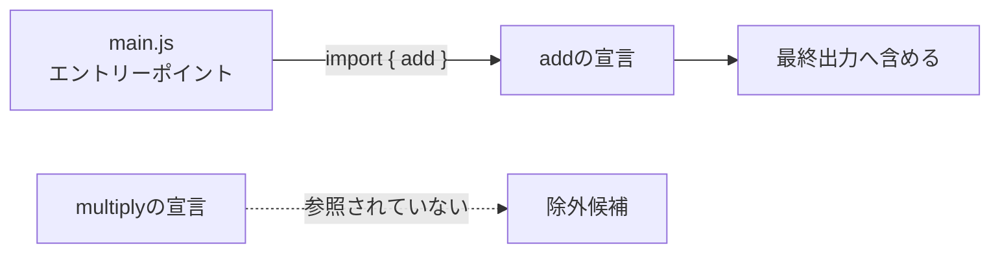

JavaScriptのバンドルサイズを小さくする方法として、Tree Shakingという言葉をよく見かけます。

説明するときは「使っていない関数を消す仕組み」と言われがちです。たしかに、次の`multiply()`をimportしなければ、本番用の出力から消えることがあります。

```js:math.js
export function add(a, b) {
  return a + b;
}

export function multiply(a, b) {
  return a * b;
}
```

しかし、実際には関数だけを探して消しているわけではありません。ファイル単位とも限りません。使っていないように見えるコードが残る場合もあります。

Tree Shakingが最終出力から除外するのは、**エントリーポイントから依存関係をたどり、実行に不要だと静的に判断できたコード**です。反対に、副作用があるかもしれないコードは安全のため残します。

この記事では小さなビルド結果を追いながら、何が消えて、なぜ残るのかを見ていきます。

## 使われていないexportは最終出力から消える

先ほどの`math.js`から、`add()`だけを使います。

```js:main.js
import { add } from "./math.js";

console.log(add(1, 2));
```

例ではesbuildを使います。Tree Shakingの細かな実装はツールごとに異なりますが、判断の軸を観察しやすいためです。

```sh
npx esbuild main.js --bundle --format=esm --outfile=dist.js
```

生成された`dist.js`は、読みやすいようにコメントと空行を除くと次の形になります。

```js:dist.js
function add(a, b) {
  return a + b;
}

console.log(add(1, 2));
```

`multiply()`は出力されていません。一方、`math.js`で定義した`add()`は残っています。

ここで起きたことを「`math.js`というファイルを残した」と考えると、少し実態から外れます。バンドル後は元のファイル境界が保たれるとは限りません。バンドラーはモジュールを解析し、必要な宣言を最終出力へ組み立てています。

[esbuildの公式ドキュメント](https://esbuild.github.io/api/#tree-shaking)では、esbuildにおけるTree Shakingを宣言単位のデッドコード削除と説明しています。今回消えたのはファイル全体ではありません。`multiply`という関数宣言です。

## バンドラーはエントリーポイントから必要なコードをたどる

ビルドには解析を始める入口があります。これがエントリーポイントです。先ほどのコマンドでは`main.js`が該当します。

バンドラーは`main.js`を読み、`math.js`から`add`をimportしていることを見つけます。次に`add`の定義と、そこから参照されるコードをたどります。どこからも必要とされなかった`multiply`は、出力候補から外れます。



この依存関係を木に見立て、使われていない枝を揺すり落とすイメージがTree Shakingという名前の由来です。

ただし、「エントリーポイントから参照されていないなら必ず消える」という理解では足りません。JavaScriptでは、値が使われなくても実行する意味を持つコードがあるからです。

## 副作用があるコードは使われていなくても残る

`math.js`の先頭にログを追加します。

```js:math.js
console.log("math.jsを読み込みました");

export function add(a, b) {
  return a + b;
}

export function multiply(a, b) {
  return a * b;
}
```

`main.js`は変えずに、もう一度ビルドします。今度の出力には`console.log()`が残ります。

```js:dist.js
console.log("math.jsを読み込みました");

function add(a, b) {
  return a + b;
}

console.log(add(1, 2));
```

`multiply()`は引き続き消えています。`console.log()`は、戻り値が利用されなくてもコンソールへ文字を表示します。削除するとプログラムの挙動が変わるため、バンドラーは残します。

式の値とは別に、外部の状態や観測できる挙動を変える処理を副作用と呼びます。たとえば、次の処理には副作用があります。

- グローバル変数やDOMを書き換える
- カスタム要素やプラグインを登録する
- イベントリスナーを設定する
- Polyfillを読み込み、組み込みオブジェクトを拡張する
- CSSをimportしてページへスタイルを適用する

次の`plugin`をどこからも利用していなくても、`registerPlugin()`の呼び出しまで捨てられるとは限りません。

```js
export const plugin = registerPlugin();
```

関数呼び出しの中で何が起こるか分からなければ、削除して安全だとは判断できないからです。ツールによっては未使用の変数やexportだけを消し、必要な呼び出しを残すこともあります。

JavaScriptには、見た目だけでは純粋だと断定しにくい式もあります。たとえば`object.value`というプロパティ参照は、getterを実行する可能性があります。文字列との加算では、オブジェクトの文字列変換処理が呼ばれるかもしれません。

そのためTree Shakingの副作用判定は保守的です。副作用が見つかれば残します。副作用がないと確信できない場合も残す、と考えた方が実態に近くなります。

## ES Modulesは依存関係を実行前に調べやすい

Tree Shakingは、コードを実行せずに構造を調べる静的解析を利用します。次のES Modulesの記述では、`math.js`の`add`を使うことが構文から分かります。

```js
import { add } from "./math.js";
```

`import`と`export`はモジュールのトップレベルに記述され、名前の対応も明示されます。バンドラーはプログラムを実行しなくても、モジュール間のつながりを組み立てられます。

CommonJSでは、次のように利用するプロパティを実行時に決められます。

```js
const math = require("./math.js");
const operation = getOperationName();

console.log(math[operation](1, 2));
```

`operation`に`"add"`と`"multiply"`のどちらが入るのかは、実行しなければ分かりません。現在のバンドラーにはCommonJSを部分的に最適化できるものもありますが、ES Modulesより解析が難しくなりやすい理由はここにあります。

ES Modulesを使えば必ず細かく消せるわけでもありません。名前空間importのプロパティを動的に選ぶと、同じ問題が起こります。

```js
import * as math from "./math.js";

const operation = location.hash.slice(1);
console.log(math[operation](1, 2));
```

ビルド時に`operation`の値が確定しないため、バンドラーは`math`の複数のexportを残す可能性があります。判断の決め手は、**利用する名前を静的に特定できる書き方か**です。

## Tree Shakingが消す単位は一つではない

ここまでの例を、コードの粒度ごとに整理します。

| コードの状態 | 最終出力で起こり得ること |
| --- | --- |
| 使われていないexport | 対応する宣言が消える |
| 使われていない宣言からしか参照されないコード | まとめて消える |
| exportが一つも使われず、副作用もないモジュール | モジュール全体や依存する一群が消える |
| 未使用の値を作る、副作用のある式 | 値や変数は消えても式の実行は残る |
| モジュール読み込み時に実行される副作用 | 利用するexportがなくても残る |

したがって、「Tree Shakingは何を消しているのか」への答えは、未使用の関数でも未使用のファイルでもありません。どちらも対象になり得ますが、より正確には、**最終的な実行に不要であり、削除しても挙動が変わらないと判断できたコード**です。

バンドラーがコードを別の場所へ移動したり、式をインライン化したりする場合もあります。元のソースコードの一部を、そのまま文字列として切り取っているとは限りません。

## `sideEffects`はモジュールを捨ててよいか伝える

パッケージの中身を外部のバンドラーが解析するとき、すべての副作用を完全に見抜くのは困難です。そこで、パッケージ作者が副作用の有無を伝えるために使われるのが`package.json`の`sideEffects`フィールドです。

```json:package.json
{
  "sideEffects": false
}
```

これは、そのパッケージ内のファイルに、importしただけで発生する副作用がないと伝える設定です。あるモジュールのexportが一つも使われていなければ、バンドラーはモジュールとその依存関係を大きな単位で除外しやすくなります。

CSSや初期化用スクリプトに副作用があるなら、除外してはいけないファイルを列挙します。

```json:package.json
{
  "sideEffects": [
    "**/*.css",
    "./src/register-elements.js"
  ]
}
```

`sideEffects: false`はバンドラーによる事実確認の結果ではありません。パッケージ作者からの申告です。実際には副作用があるのに`false`と設定すると、必要なCSS、Polyfill、登録処理などが本番ビルドから消え、アプリケーションが壊れる可能性があります。

[webpackのTree Shakingガイド](https://webpack.js.org/guides/tree-shaking/)でも、CSSなど副作用のあるファイルを正しく指定する必要があると説明されています。バンドルサイズを小さくするためだけに、確認せず`sideEffects: false`を追加するのは危険です。

関数呼び出し単位では、`/*#__PURE__*/`という注釈が使われることもあります。

```js
const logger = /*#__PURE__*/ createLogger("debug");
```

この注釈は、呼び出し自体に副作用がないとバンドラーやminifierへ伝えます。`logger`が使われていなければ、呼び出しも削除候補になります。これも開発者による申告なので、副作用のある関数へ誤って付けてはいけません。

## Tree Shakingとデッドコード削除とminifyは重なっている

Tree Shakingを調べると、デッドコード削除やminifyという言葉も出てきます。厳密な処理の分け方はツールによって異なりますが、役割を次のように捉えると整理できます。

| 処理 | 主に見るもの | 例 |
| --- | --- | --- |
| Tree Shaking | モジュール間の利用関係や宣言 | importされていないexportを除外する |
| デッドコード削除 | 制御フローや値の利用状況 | 到達しない分岐を除外する |
| minify | 出力コードの表現 | 空白を消す、変数名を短くする |

たとえば、次の`if`文はimportとexportの関係とは無関係です。

```js
if (false) {
  console.log("ここには到達しない");
}
```

この分岐を消す処理は、一般にはデッドコード削除として説明されます。一方、Tree Shakingも広い意味ではデッドコード削除の一種です。esbuildのようにTree Shakingを宣言単位の削除として定義するツールもあれば、webpackのようにexportの利用状況を記録し、minifierと連携して最終的にコードを落とすツールもあります。

つまり、三つの工程には重なる部分があります。「この1行はTree Shakingとminifyのどちらが消したのか」を、すべてのツールに共通する境界で分類することはできません。

理解するときは、次の二段階に分けると見通しがよくなります。

1. 静的解析で、実行に必要なモジュールや宣言を見つける
2. 不要だと分かったコードを除外し、残った出力を小さくする

Tree Shakingは主に1段階目の判断を指します。ただし、実装上は2段階目まで一体になっていることがあります。

## Tree Shakingが効かないときは「消せない理由」を探す

バンドルに不要そうなコードが残っていても、すぐにバンドラーの不具合とは限りません。まず、次の点を確認します。

### importとexportが静的に追えるか

バンドラーへ渡る前にES ModulesがCommonJSへ変換されていないか確認します。名前空間オブジェクトの動的なプロパティ参照や、実行時に決まるモジュールパスも解析を難しくします。

### トップレベルで処理を実行していないか

モジュールをimportした時点でログ出力、登録処理、グローバルな書き換えなどが起きると、その実行を保つためにコードが残ります。未使用のexportだけを見ず、ファイル全体のトップレベルを確認します。

### パッケージの`sideEffects`が正しいか

外部パッケージなら、`package.json`の`sideEffects`を確認します。指定がないからといって、利用側で安易に`false`へ上書きするのは避けます。パッケージが意図している初期化処理まで消すおそれがあります。

### 最終的なビルド結果を見ているか

開発用ビルドはデバッグしやすさやビルド速度を優先し、最適化の設定が本番用と異なる場合があります。使っているツールの設定を確認し、デプロイに使う条件で比較します。

出力を調べるときは、一度minifyを外すと追いやすくなります。確認したい関数へ一時的に固有の文字列を入れ、生成物を検索する方法もあります。バンドル解析機能があるツールなら、どのモジュールがどれだけ含まれたかも確認できます。

ファイルサイズだけで判断すると、圧縮、インライン化、共通チャンクへの移動など、別の変化と区別できません。「どの宣言が残ったか」と「なぜ実行が必要なのか」を見る方が、原因へ近づけます。

## Tree Shakingは安全に消せるコードだけを消している

Tree Shakingが消しているのは、単に「書いたけれど使わなかった関数」ではありません。

エントリーポイントからモジュールの依存関係をたどり、参照されるexportや宣言を見つけます。そのうえで、使われておらず、副作用もないと判断できたコードを最終出力から除外します。条件がそろえば、宣言一つからモジュール全体、その先の依存関係まで消えます。

逆に、コードが残ったときには理由があります。実行時にしか利用先が決まらない、副作用がある、あるいは副作用がないと証明できない。そのどれかかもしれません。

Tree Shakingを「不要なコードを積極的に消す機能」ではなく、**安全に不要だと証明できたコードを出力しない仕組み**と考えると、消えるコードと残るコードの違いを説明しやすくなります。
