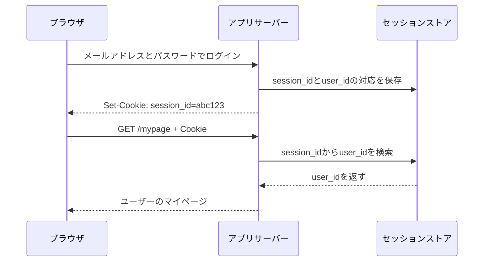
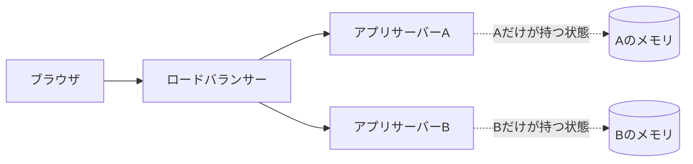
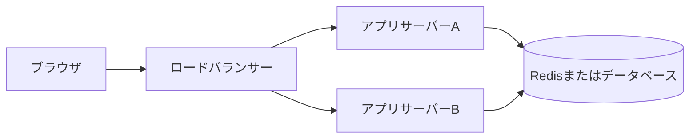

Webアプリケーションの説明では、「このサーバーは状態を持つ」「アプリケーションサーバーはステートレスにする」といった表現がよく出てきます。

ここでいう状態とは、**過去のやり取りから生まれ、後の処理にも影響する情報**です。ログイン中のユーザー、買い物かごの中身、ゲームのスコアなどが当てはまります。

サーバーで状態を持つとは、この情報をサーバー側のメモリやデータベースなどへ保存し、リクエストをまたいで使うことです。ただし、状態を持つ場所によって、再起動したときやサーバーを増やしたときの挙動が変わります。

ログインとNode.jsのカウンターを例に、状態の意味、メモリ・Redis・データベースの違いを順に整理します。読了後には、「何を、どこに、いつまで持つか」を基準に保存先を判断できます。

## 状態は「次のリクエストへ持ち越す情報」

ブラウザからサーバーへ送るHTTPリクエストは、一つひとつ独立しています。サーバーは、前回のリクエストを自動的に覚えているわけではありません。

たとえば、次のリクエストを受け取ったとします。

```http
GET /mypage HTTP/1.1
Host: example.com
```

これだけでは、誰のマイページを返せばよいのか分かりません。サーバーが判断するには、ログインしたユーザーを特定できる情報が必要です。

そこで実際のWebアプリケーションでは、Cookie（ブラウザが保存し、次回以降のリクエストへ付ける小さなデータ）や、認証情報を運ぶ`Authorization`ヘッダーを使い、利用者を識別できる情報をリクエストへ加えます。サーバーはその情報を手がかりに、保存してあるログイン状態やユーザーデータを読み取ります。

```http
GET /mypage HTTP/1.1
Host: example.com
Cookie: session_id=abc123
```

ログイン前とログイン後で同じURLを開いても、表示結果が変わります。過去にログインしたという情報が、後から送られたリクエストの処理に影響するからです。リクエストをまたいで持ち越される、この情報が状態です。

代表的な状態には、次のようなものがあります。

- ログインしているユーザー
- 買い物かごに入れた商品
- ゲームのスコアや現在位置
- フォームへ入力している途中の内容
- APIを一定時間に呼び出した回数
- 作成済みのユーザーや注文

残す期間は情報ごとに異なります。ログイン状態は30分で失効させる一方、注文はサービスが続く限り残すかもしれません。一口に状態といっても、数秒だけ使う値から長期間保存するデータまで含まれます。

## メモリ上のカウンターも状態を持っている

状態を目で確認するために、アクセス回数を返すサーバーを作ってみます。Node.jsの標準モジュールだけを使った例です。

```js:server.js
import { createServer } from 'node:http';

let count = 0;

const server = createServer((_request, response) => {
  count += 1;

  response.writeHead(200, {
    'Content-Type': 'text/plain; charset=utf-8',
  });
  response.end(`count: ${count}\n`);
});

server.listen(3000);
```

このサーバーへ3回アクセスすると、数字が増えていきます。

```console
$ curl http://localhost:3000
count: 1

$ curl http://localhost:3000
count: 2

$ curl http://localhost:3000
count: 3
```

リクエストを処理する関数は、前回の`count`を読み、その値へ1を足しています。2回目の結果を返すには、1回目の処理後に残った値が必要です。これが状態です。`count`には、過去のアクセス回数が残っています。

この値が置かれているのは、Node.jsプロセスのメモリです。プロセスを終了するとそのメモリも破棄されるため、次に起動した`count`は再び`0`から始まります。

```console
# サーバーを再起動した後
$ curl http://localhost:3000
count: 1
```

メモリ上の状態は高速に読み書きできますが、プロセスと寿命を共有します。再起動後も必要なデータの保存先には向きません。

## 状態はブラウザ、メモリ、共有ストレージに置ける

状態の保存先は、アプリケーションサーバーのメモリだけではありません。Webアプリケーションでは、性質に応じていくつかの場所を使い分けます。

| 保存先 | 例 | 性質 |
| --- | --- | --- |
| ブラウザ | Cookie、`localStorage` | サーバーを再起動しても残せるが、利用者による変更を前提に検証が必要 |
| アプリケーションのメモリ | 変数、インメモリキャッシュ | 読み書きは速いが、再起動で消え、ほかのプロセスとは共有されない |
| 共有ストレージ | Redis、セッションストア | 複数のアプリケーションサーバーから参照でき、有効期限も設定しやすい |
| データベース | ユーザー、商品、注文 | 再起動後も必要なデータを保存し、検索や更新を管理できる |

Redisは、複数のプロセスからネットワーク越しに使えるインメモリデータストアです。セッションや短期間のキャッシュを共有する用途でよく使われます。

ブラウザに保存したからといって、その値を正しいものとして扱えるとは限りません。たとえば買い物かごの商品IDはブラウザへ保存できますが、利用者が値を変更する可能性があるため、価格や在庫は購入時にサーバー側で確認します。

反対に、すべてをデータベースへ保存する必要もありません。消えても作り直せるキャッシュや、現在のリクエストでしか使わない計算途中の値なら、メモリに置く方が単純です。

保存先は「サーバーかブラウザか」という二択ではありません。消えて困るか、複数のサーバーで共有するか、どのくらいの期間残すかによって決まります。

## ログイン状態はブラウザとサーバーで分けて持つ

セッションとは、ログイン状態などを一定期間保つための一時的なデータです。セッションを使ったログインでは、一つの状態をブラウザとサーバーへ分けて保存します。



ブラウザが持つのは、セッションを識別するためのIDです。サーバー側では、そのIDがどのユーザーに対応するかを保存します。2回目以降のリクエストでは、ブラウザがCookieを送り、サーバーがセッションストアを確認します。

この場合、「ログイン中のユーザー」という状態の本体はサーバー側にあります。ブラウザのCookieは、その状態を探すための手がかりです。サーバー側のセッションを削除すれば、同じCookieが届いてもログイン済みとは判断されません。

セッションを一台のアプリケーションサーバーのメモリへ保存する実装も作れます。小さな開発環境なら動きますが、サーバーを増やしたところで問題が表面化します。

## 一台のメモリに状態を置くと、サーバーを増やしにくい

アクセスの増加に合わせて、アプリケーションサーバーを二台に増やしたとします。ロードバランサーと呼ばれる振り分け役が、届いたリクエストをAかBへ送ります。

ログイン処理がAへ届き、セッションがAのメモリに保存された直後に、マイページへのアクセスがBへ届くかもしれません。Aはセッションを知っています。Bは知りません。利用者から見ると、ログインした直後なのにログイン画面へ戻されたように見えます。



同じ利用者のリクエストを常に同じサーバーへ送る「スティッキーセッション」で回避する方法はあります。ただし、そのサーバーが停止すると状態を失います。負荷の偏りや、デプロイ時の切り替えも考えなければなりません。

複数台で使う状態は、どのサーバーからも参照できる場所へ置くと扱いやすくなります。



セッションを共有ストレージへ移せば、ログインとマイページへのアクセスを別のサーバーが処理しても、同じ状態を読み取れます。アプリケーションサーバーを追加、交換、再起動しやすい構成です。

状態を外へ出したことで、管理が不要になるわけではありません。共有ストレージの障害対策、読み書きの負荷、有効期限、同時更新など、新しい設計事項が生まれます。それでも、状態の置き場所が明示されるため、一台のプロセスへ隠れている状態より制御しやすくなります。

## ステートレスでもシステムから状態は消えない

ここまで来ると、「アプリケーションサーバーをステートレスにする」という表現を具体的に読めます。

ステートフルなアプリケーションサーバーは、以前のリクエストから自分のメモリへ残した情報を使って、次のリクエストを処理します。そのサーバーへ接続しなければ処理できない状況が生まれます。

ステートレスなアプリケーションサーバーは、次のリクエストを正しく処理するために必要な利用者ごとの情報を、自分のメモリへ残しません。リクエストに含まれるセッションIDやユーザーIDを使い、必要な状態を共有ストレージから読み取るため、同じ設定と接続先を持つサーバーならどのインスタンスでも処理できます。消えても結果へ影響しない一時キャッシュまで禁止する、という意味ではありません。

| 観点 | ステートフル | ステートレス |
| --- | --- | --- |
| 前回の情報 | 同じサーバーのメモリなどへ残す | サーバー自身には残さない |
| 次のリクエスト | 特定のサーバーが必要になりやすい | どのサーバーでも処理しやすい |
| 再起動 | ローカルな状態を失う可能性がある | 共有ストレージに残した状態を読み直せる |
| 台数の増減 | 状態の移動や振り分けが必要 | 比較的増減しやすい |

ここで対象にしているのは、アプリケーションサーバーです。システム全体から状態がなくなったわけではありません。ユーザーや注文はデータベースに、セッションはRedisなどに残っています。

```text
ステートレスなアプリサーバー + 状態を持つデータベース
```

これは矛盾ではありません。「どの範囲について状態がないと言っているのか」が違います。ステートレスという言葉を見たら、ブラウザ、アプリケーションサーバー、データベース、システム全体のどれを指しているか確認すると、話を整理できます。

HTTPがステートレスであることと、Webアプリケーションがログイン状態を扱えることも両立します。HTTPは過去のリクエストを自動的に関連付けません。アプリケーションがCookieやヘッダーを使って識別情報を運び、保存済みの状態と結び付けています。

## 状態そのものは悪者ではない

注文履歴を残さないECサイトや、スコアを覚えないゲームは役に立ちません。多くのアプリケーションにとって、状態は機能そのものです。

問題になりやすいのは、状態があることより、置き場所や寿命が決まっていないことです。サーバーを再起動したら消えるのか、複数台で共有されるのか、古いデータはいつ削除されるのかが曖昧だと、開発環境では動いても本番環境で不具合が起きます。

状態の保存先を決めるときは、次の順で考えます。

1. リクエストが終わった後も必要か
2. プロセスを再起動しても残す必要があるか
3. 複数のサーバーや端末から共有するか
4. いつ失効または削除するか
5. 同時に更新されたとき、どの値を正しいとするか
6. 利用者に見られたり変更されたりしても問題ないか

用途ごとの目安は次のとおりです。

| 状態 | 保存先の例 | 理由 |
| --- | --- | --- |
| 現在のリクエストだけで使う計算結果 | ローカル変数 | リクエスト後に残す必要がない |
| 消えても再計算できるキャッシュ | プロセスのメモリ、Redis | 速度を優先し、消失を許容できる |
| ログインセッション | Redis、データベース | 複数台から共有し、有効期限を管理したい |
| 買い物かご | ブラウザ、Redis、データベース | ログインの有無や、端末間で共有するかによって変わる |
| ユーザーや注文 | データベース | 再起動後も失ってはいけない |

どの保存先にも代償があります。メモリは速い代わりに消えます。共有ストレージは複数台から使える代わりに、ネットワーク越しの読み書きと運用が増えます。ブラウザへ置けばサーバー側の保存量を減らせますが、改ざんを前提に検証しなければなりません。

「状態を持つか」と考えるだけでは、答えは出ません。**何を、どこに、いつまで持つか**まで決めて、初めて実装へ落とし込めます。

## 状態は「何を、どこに、いつまで持つか」で設計する

状態とは、過去のやり取りから生まれ、後の処理にも影響する情報です。サーバーで状態を持つとは、その情報をメモリや共有ストレージ、データベースなどへ保存し、リクエストをまたいで使うことを指します。

アプリケーションサーバーのメモリへ置くと実装は簡単ですが、再起動で消え、複数台では共有できません。複数台から必要になる状態はRedisやデータベースへ移すことで、どのアプリケーションサーバーでも処理しやすくなります。

ステートレスな構成でも、状態は消えていません。置き場所が変わっただけです。たとえば、処理がアプリサーバーAからBへ移っても、Redisに保存した同じセッションを読み直せます。設計やコードを読むときは、次の三つを確認すると「状態を持つ」の意味が見えるようになります。

- 何の状態を持っているか
- どこに保存しているか
- いつまで残るか

## 参考資料

- [RFC 9110: HTTP Semantics](https://www.rfc-editor.org/rfc/rfc9110)
- [RFC 6265: HTTP State Management Mechanism](https://www.rfc-editor.org/rfc/rfc6265)
- [Node.js: HTTP](https://nodejs.org/api/http.html)
