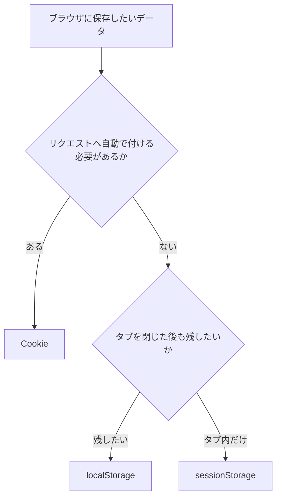

Webアプリケーションでは、ブラウザにデータを残したい場面がよくあります。

- ダークモードの設定を次回も使いたい
- 入力途中のフォームを、再読み込み後も復元したい
- ログイン中であることをサーバーへ伝えたい

候補に挙がるのが`localStorage`、`sessionStorage`、Cookieです。いずれもブラウザにデータを保存できますが、同じ目的で使えるわけではありません。

違いを見分ける軸は、**保存期間・共有範囲・サーバーへの送信**の3つです。この記事では、それぞれの仕組みと使い分けをコード例とともに整理します。

## 3つの違いは保存期間・共有範囲・通信に表れる

最初に全体像を確認します。

| 比較項目 | localStorage | sessionStorage | Cookie |
| --- | --- | --- | --- |
| 主な保存期間 | ブラウザを閉じても残る | タブを閉じるまで | セッション中、または指定した期限まで |
| 主な共有範囲 | 同じオリジン | 同じオリジンかつ同じタブ | Domain、Pathなどの条件に合う範囲 |
| サーバーへの自動送信 | しない | しない | 条件に合うHTTPリクエストへ送る |
| JavaScriptからの操作 | できる | できる | `HttpOnly`がなければできる |
| データ形式 | 文字列のキーと値 | 文字列のキーと値 | 名前と値、属性 |
| 主な用途 | テーマや表示設定 | タブ内の一時的な入力状態 | セッションIDなど、サーバーと共有する小さな状態 |

`localStorage`と`sessionStorage`は、Web Storage APIという同じ仕組みに属します。どちらもJavaScriptから似たコードで操作できます。一方、CookieはHTTPの仕組みです。保存したCookieは、条件に合うリクエストへブラウザが自動で付けます。

ここが一番大きな違いです。

## localStorageはブラウザを閉じても残したい設定に向いている

`localStorage`へ保存したデータには、有効期限を指定する機能がありません。タブやブラウザを閉じても残り、次に同じオリジンのページを開いたときも読み出せます。

オリジンとは、URLのスキーム、ホスト、ポートを組み合わせた範囲です。次のURLは、それぞれ異なるオリジンになります。

```text
https://example.com
http://example.com
https://example.com:8443
```

同じオリジンのページであれば、別のタブからも同じ`localStorage`へアクセスできます。URLのパスが`/settings`と`/users`に分かれていても、オリジンが同じなら保存領域は共通です。

### 基本操作はsetItemとgetItemで足りる

たとえば、画面のテーマを保存するコードは次のようになります。

```js
localStorage.setItem("theme", "dark");

const theme = localStorage.getItem("theme");
console.log(theme); // "dark"
```

特定の値を削除するときは`removeItem`、すべて削除するときは`clear`を使います。

```js
localStorage.removeItem("theme");
localStorage.clear();
```

保存できる値は文字列です。オブジェクトをそのまま渡すと、意図した形では保存されません。JSONへ変換してから保存します。

```js
const preferences = {
  theme: "dark",
  itemsPerPage: 20,
};

localStorage.setItem("preferences", JSON.stringify(preferences));

const saved = localStorage.getItem("preferences");
const restored = saved === null ? null : JSON.parse(saved);

console.log(restored?.theme); // "dark"
```

保存したJSONが壊れている可能性もあるため、実際のアプリケーションでは`JSON.parse`の失敗を処理し、復元した値の型も検証します。ブラウザ内の値は、利用者や同じオリジンで動くスクリプトから変更できるためです。

### 永久保存ではない

`localStorage`には自動で切れる有効期限がないだけで、データの永続性が保証されるわけではありません。利用者が閲覧データを削除した場合や、ブラウザの保存方針によって削除された場合は失われます。プライベートブラウジングでも、通常とは異なる扱いになることがあります。

消えると困るデータは、サーバーなど別の場所にも保存します。`localStorage`は、テーマや一覧の表示件数といった、失われても復元できる設定に向いています。

[HTML Living StandardのWeb Storage](https://html.spec.whatwg.org/multipage/webstorage.html)でも、`localStorage`はオリジンに対応する保存領域として定義されています。

## sessionStorageはひとつのタブで完結する一時データに向いている

`sessionStorage`のAPIは`localStorage`とほぼ同じです。違うのは保存領域の寿命と共有範囲です。

```js
sessionStorage.setItem("checkoutStep", "payment");

const step = sessionStorage.getItem("checkoutStep");
console.log(step); // "payment"
```

ページを再読み込みしても値は残ります。同じタブで別のページへ移動した場合も、移動先が同じオリジンなら読み出せます。タブを閉じると、そのタブのページセッションとともに保存領域も破棄されます。

別のタブで同じURLを開いた場合、基本的には別の`sessionStorage`を使います。そのため、次のような「ひとつのタブ内で続いてほしいが、別の作業へ混ざってほしくない状態」に向いています。

- 複数画面にまたがるフォームの入力途中の値
- 購入手続きで現在開いているステップ
- 検索画面から詳細画面へ移動したときの一時的な検索条件

厳密には、`window.open`などで新しい閲覧コンテキストを作ったとき、作成元の`sessionStorage`が最初にコピーされる場合があります。その後の変更は別々です。タブ間の厳密な分離をセキュリティ境界として利用しないでください。

名前に「session」とありますが、ログインセッションを管理するための専用機能ではありません。ブラウザ上の一時的な保存領域です。サーバーは`sessionStorage`の値を自動では受け取れません。

## Cookieは条件に合うHTTPリクエストへ自動で付く

Cookieは、HTTPをまたいで状態をやり取りする仕組みです。サーバーはレスポンスの`Set-Cookie`ヘッダーを使って、ブラウザへCookieの保存を依頼できます。

```http
HTTP/1.1 200 OK
Set-Cookie: __Host-session=abc123; Path=/; Max-Age=1800; Secure; HttpOnly; SameSite=Lax
```

ブラウザは、保存されたCookieの期限や送信先を確認します。条件に合う次回のリクエストには、`Cookie`ヘッダーを自動で付けます。

```http
GET /account HTTP/1.1
Host: example.com
Cookie: __Host-session=abc123
```

サーバーは`abc123`というセッションIDから、対応するログイン状態を探せます。リクエストを送るたびにJavaScriptで値を付ける必要はありません。

Cookieの基本動作は[RFC 6265](https://www.rfc-editor.org/rfc/rfc6265.html)で定義されています。

Cookieは一般的なデータ保存場所には向きません。条件に合うリクエストのたびに送られるため、値を増やすと通信量も増えます。保存できる大きさや個数の上限はブラウザ実装に依存しますが、小さな状態をやり取りする仕組みと考えるのが安全です。

### 属性によって期限と送信条件を決める

Cookieには、値と一緒に属性を設定できます。

| 属性 | 役割 |
| --- | --- |
| `Expires` | 失効する日時を指定する |
| `Max-Age` | 失効までの秒数を指定する |
| `Domain` | Cookieを送るホストの範囲を指定する |
| `Path` | Cookieを送るURLパスの範囲を指定する |
| `Secure` | HTTPSなどの安全な通信に送信を限定する |
| `HttpOnly` | JavaScriptの`document.cookie`から読めなくする |
| `SameSite` | クロスサイトのリクエストで送る条件を制限する |

`Expires`と`Max-Age`のどちらもないCookieは、セッションCookieとして扱われます。ブラウザが定めるセッションの終了時に削除されるものです。有効期限を指定すると、ブラウザを閉じた後も残せます。

つまり、Cookieという名前だけでは保存期間は決まりません。設定した属性によって、一時保存にも期限付きの保存にもなります。

`SameSite`には`Strict`、`Lax`、`None`があります。送信範囲が異なるため、認証方式や画面遷移に合わせて選びます。現在の仕様化が進められている[IETFのCookie仕様案](https://datatracker.ietf.org/doc/draft-ietf-httpbis-rfc6265bis/)に詳しい動作がまとめられています。

### JavaScriptからも設定できるが、HttpOnlyは付けられない

JavaScriptでは`document.cookie`を通してCookieを設定できます。

```js
document.cookie = "theme=dark; Path=/; Max-Age=2592000; SameSite=Lax; Secure";
```

ただし、`document.cookie`は同じ条件で見えるCookieをひとつの文字列として返すAPIです。`localStorage.getItem()`のように、キーを指定して直接取得する形ではありません。

さらに、JavaScriptから`HttpOnly`属性は設定できません。`HttpOnly`は、サーバーが`Set-Cookie`ヘッダーで指定します。セッションIDをJavaScriptから隠したい場合、この違いが重要になります。

## 実際にタブを開いて違いを確かめる

自分の開発用ページを`http://localhost`などで配信し、DevToolsのConsoleで次のコードを実行します。公開サイトの保存領域を変更しないようにしてください。

```js
localStorage.setItem("local-demo", "localStorageの値");
sessionStorage.setItem("session-demo", "sessionStorageの値");
document.cookie = "cookie-demo=cookie-value; Path=/; SameSite=Lax";
```

保存後、次の順番で確認します。

| 操作 | localStorage | sessionStorage | Cookie |
| --- | --- | --- | --- |
| ページを再読み込みする | 残る | 残る | 残る |
| 同じURLを別タブで直接開く | 読める | 基本的に読めない | 読める |
| タブを閉じて開き直す | 残る | 消える | 期限の設定による |
| 同じオリジンへHTTPリクエストを送る | 自動送信しない | 自動送信しない | 条件に合えば自動送信する |

Chrome DevToolsではApplicationパネル、Firefox DevToolsではStorageパネルから保存内容を確認できます。コードだけを見るより、保存領域を表示したままタブを開閉すると違いがつかみやすくなります。

## 保存先はサーバーへ送る必要があるかで絞り込める

用途から逆算すると、候補を選びやすくなります。



たとえば、ダークモードの設定はサーバーへ毎回送る必要がなければ`localStorage`で十分です。購入フォームの途中経過をタブごとに分けたい場合は、`sessionStorage`が合います。

サーバー管理のログインセッションでは、セッションIDをCookieに保存する構成がよく使われます。その場合は、用途に合わせて`Secure`、`HttpOnly`、`SameSite`などの属性を設定します。

大量のデータや検索可能な構造化データを扱う場合は、この3つだけで決めません。`localStorage`と`sessionStorage`は同期APIなので、大きなデータの読み書きはJavaScriptの実行を止める要因になります。非同期で扱えるIndexedDBなども候補に入ります。

## 認証情報は保存期間だけで決めない

アクセストークンやセッションIDの保存先を「長く残したいから`localStorage`」と決めるのは危険です。`localStorage`と`sessionStorage`は、同じオリジンで実行されるJavaScriptから読み出せます。クロスサイトスクリプティング（XSS）の脆弱性を突かれた場合、保存した認証情報も盗まれるおそれがあります。

`HttpOnly`を付けたCookieなら、JavaScriptからCookieの値を直接読めません。ただし、XSSそのものを防ぐ機能ではありません。攻撃者のスクリプトがそのページ上で動けば、Cookieの値を読めなくても、利用者の権限でリクエストを送れる可能性があります。

Cookieはリクエストへ自動で付くため、クロスサイトリクエストフォージェリ（CSRF）への対策も必要です。`SameSite`は対策のひとつですが、アプリケーションの要件に応じてCSRFトークンやリクエスト元の検証などを組み合わせます。

[OWASPのHTML5 Security Cheat Sheet](https://cheatsheetseries.owasp.org/cheatsheets/HTML5_Security_Cheat_Sheet.html)では、セッション識別子を`localStorage`へ保存しないよう勧めています。認証情報はフロントエンドだけで決めず、サーバー側のセッション管理やXSS・CSRF対策を含めて設計します。

## 保存した値は信用せず、消える前提も持つ

3つの保存先には共通点もあります。利用者はDevToolsから値を書き換えたり削除したりできます。ブラウザの設定によって保存が拒否される場合もあり、容量を超えた`localStorage`や`sessionStorage`への書き込みは`QuotaExceededError`になります。

そのため、次の前提で扱います。

- 保存した値は入力値と同じように検証する
- 値が存在しない場合の初期値を用意する
- 書き込みが失敗する可能性を考慮する
- 消失すると困るデータの唯一の保存先にしない
- パスワードや秘密鍵などの機密情報を置かない

クライアント側の保存領域は、信頼できるデータベースではありません。画面を使いやすくしたり、サーバーとのセッションをつないだりするための仕組みとして使います。

## 迷ったら3つの質問で決める

`localStorage`、`sessionStorage`、Cookieの違いは、次の3つに集約できます。

1. タブやブラウザを閉じた後も残したいか
2. 同じオリジンの別タブと共有したいか
3. HTTPリクエストへ自動で付けたいか

ブラウザを閉じた後も使う設定なら`localStorage`、ひとつのタブで完結する一時データなら`sessionStorage`が候補です。サーバーと状態を共有し、リクエストへ自動で付ける必要があるならCookieを検討します。

最後に、保存期間が要件に合っていても、認証情報や大量のデータには別の判断が必要です。データの機密性、XSS・CSRFの影響、同期処理の負荷まで確認して保存先を選びましょう。
