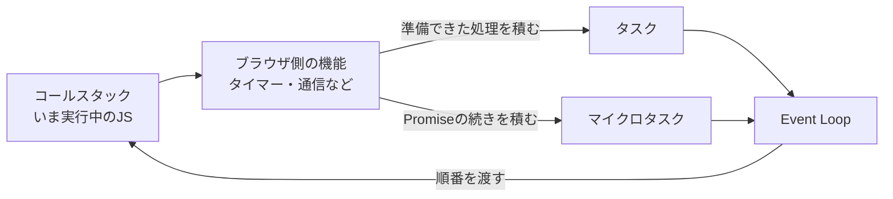
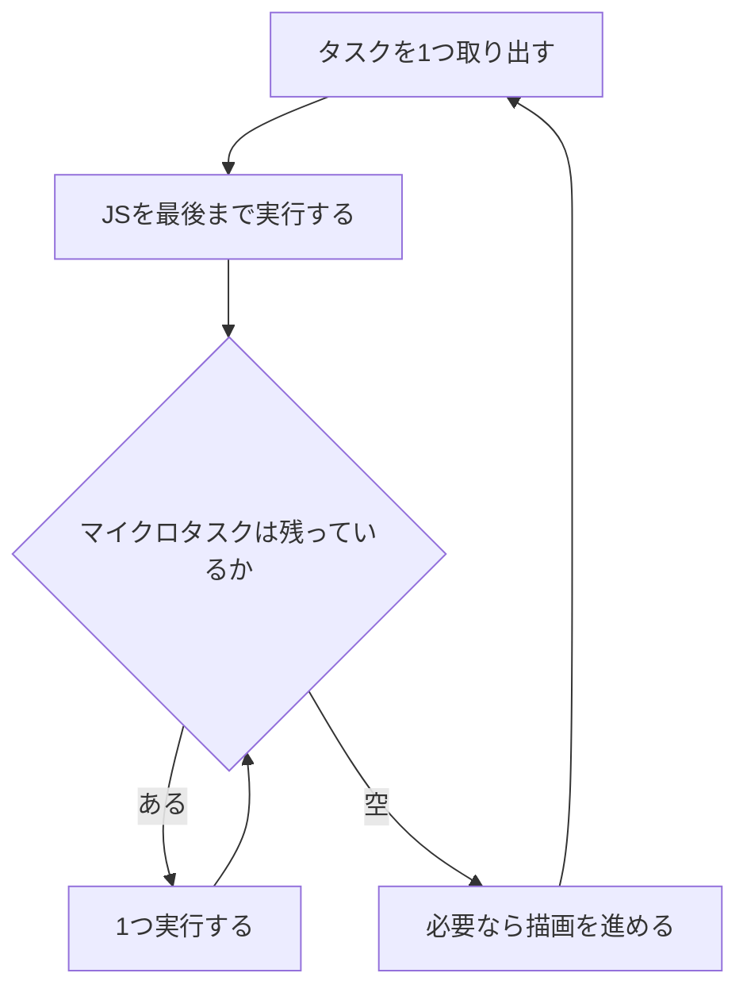

`setTimeout`の待ち時間を0ミリ秒にしても、コールバックはすぐに実行されません。`Promise.then()`と一緒に使うと、コードに書いた順とも違う結果になります。

```js
console.log("A");

setTimeout(() => console.log("B"), 0);

Promise.resolve().then(() => console.log("C"));

console.log("D");
```

出力は `A → D → C → B` です。この順番を決める仕組みが、Event Loopです。

ここではブラウザ上のJavaScriptを対象に、タスクとマイクロタスクがいつ実行されるのかを追います。ログの出力順と、重い処理で画面が固まる理由を、同じ仕組みから説明できることがゴールです。

## Event Loopは、実行する仕事の順番を調整する

先に結論を書きます。

Event Loopは、非同期処理を実行してくれる装置ではありません。実行できる状態になった仕事に対して、**いつ実行の順番を渡すか**を決めているだけです。

ここで混同しやすいのが、タイマーや通信までEvent Loopが実行しているという理解です。`setTimeout`の時間を数えたり、`fetch`の通信を進めたりする役割は、Event Loopにはありません。

実際には、時間を数えるのも通信するのもブラウザの別の機能です。Event Loopの仕事は、それらが「終わりました」と持ってきた処理を、どういう順番でJavaScriptへ渡すかの調整だけ。

そしてブラウザのメインスレッドでは、JavaScriptの実行、クリックへの反応、画面の描画が、この1本の順番待ちを共有しています。だから冒頭の出力順と、重い処理で画面が固まる現象は、同じ仕組みから説明がつきます。

## 実行順を理解するための登場人物は4つ

順番を追うために、登場人物を4つに絞ります。



いま実行しているJavaScriptが積まれる場所を、コールスタックと呼びます。関数を呼ぶと積まれ、`return`すると外れます。ここが空でない間、ほかの処理は割り込めません。

時間を数えたり通信したりするのは、ブラウザ側の機能です。`setTimeout(fn, 1000)`と書いたとき、1000ミリ秒を数えているのはJavaScriptではありません。

数え終わった機能は、実行してほしい処理を2つの置き場のどちらかへ積みます。タイマーやクリックイベントが積まれるほうがタスク、`Promise`の続きが積まれるほうがマイクロタスクです。

覚えてほしいのは名前ではありません。処理を待つ場所と、コードを実行する場所が別々にある。ここだけです。待っている処理は、コールスタックが空になるまでスタート地点で足止めされます。

## 1回の流れは「タスク1つ、マイクロタスク、次の仕事」

ここが記事の中心です。Event Loopが1周する間に何が起きるかを、順に並べます。

1. 実行できるタスクを1つ選ぶ
2. そのタスクに含まれるJavaScriptを、最後まで実行する
3. たまったマイクロタスクを、空になるまで実行する
4. ブラウザが必要に応じて描画などを進める
5. 次のタスクへ進む



タスクとマイクロタスクの扱いが、はっきり違います。タスクは1周につき1つだけ。マイクロタスクは空になるまで全部です。

この差が、冒頭の`C`が`B`より先に出た理由です。

実際に確かめてみます。

```js
setTimeout(() => console.log("task 1"), 0);
setTimeout(() => console.log("task 2"), 0);

Promise.resolve().then(() => console.log("micro 1"));
Promise.resolve().then(() => console.log("micro 2"));
Promise.resolve().then(() => console.log("micro 3"));

console.log("sync");
```

```
sync
micro 1
micro 2
micro 3
task 1
task 2
```

マイクロタスクが3つとも片付いてから、ようやくタスクへ移っています。タスクの間に割り込んでいるわけではありません。

「空になるまで」には、もう一段あります。マイクロタスクの中で新しいマイクロタスクを足した場合、それも同じ回で処理されます。

```js
Promise.resolve().then(() => {
  console.log("micro A");
  Promise.resolve().then(() => console.log("micro A-1"));
});

setTimeout(() => console.log("task"), 0);
```

```
micro A
micro A-1
task
```

`micro A-1`が積まれたのは`micro A`の実行中、つまり`task`より後です。それでも`task`より先に出ました。次のタスクへ進む条件が「マイクロタスクが空であること」だからです。

なお、ここで示した2つの置き場は概念モデルです。仕様上のタスクの置き場は、タイマー用・ユーザー操作用というように種類ごとに分かれています。実行順を追うぶんには、1つにまとめて考えて差し支えありません。

描画についても一言添えておきます。4番目の工程は、毎周かならず走るわけではありません。ブラウザが描画すべきだと判断したときに進みます。

## コードを一行ずつ追うと、出力順が決まる

冒頭のコードへ戻ります。

```js
console.log("A");

setTimeout(() => console.log("B"), 0);

Promise.resolve().then(() => console.log("C"));

console.log("D");
```

「現在の処理」「タスク」「マイクロタスク」「出力」の4列で、状態の移り変わりを書き出します。

| 時点 | 現在の処理 | タスク | マイクロタスク | 出力 |
| --- | --- | --- | --- | --- |
| 1行目 | スクリプト本体 | — | — | `A` |
| 3行目 | スクリプト本体 | `B` | — | |
| 5行目 | スクリプト本体 | `B` | `C` | |
| 7行目 | スクリプト本体 | `B` | `C` | `D` |
| 本体の終わり | なし | `B` | `C` | |
| マイクロタスク | `C` | `B` | — | `C` |
| 次のタスク | `B` | — | — | `B` |

`A`と`D`が先に出るのは、どちらもスクリプト本体という1つのタスクの中にいるからです。`setTimeout`と`Promise.resolve().then()`は、この時点では実行されません。登録するだけで、その行はすぐ次へ進みます。

本体を最後まで実行し終えて、コールスタックが空になったところが分岐点です。ここでマイクロタスクの`C`が実行され、それが空になってから、次のタスクの`B`へ移ります。

読み解く順番はいつも同じです。まず、いま実行中のコードを最後まで読む。次に、その間に積まれたマイクロタスクを読む。最後にタスクを1つ読む。

## `setTimeout(0)`は「今すぐ実行」という指定ではない

`setTimeout(fn, 0)`と書いたとき、実際には2段階の待ちが入ります。

1段目が待ち時間です。0ミリ秒なら、この段はほぼ通過します。

2段目が順番待ちです。待ち時間を満たした処理は、実行できるタスクとして積まれるだけで、その場では動きません。動くのは、いま実行中のJavaScriptが終わり、マイクロタスクも片付いてからです。

2段目の存在は、簡単に確かめられます。

```js
const t0 = performance.now();

setTimeout(() => {
  console.log(`setTimeout(0)の実行は ${Math.round(performance.now() - t0)}ms 後`);
}, 0);

const until = performance.now() + 200;
while (performance.now() < until) {}

console.log(`同期処理の終了は ${Math.round(performance.now() - t0)}ms 後`);
```

```
同期処理の終了は 200ms 後
setTimeout(0)の実行は 202ms 後
```

0ミリ秒と書いたのに、実行されたのは200ミリ秒を過ぎてからでした。待ち時間そのものはすぐ満たされていて、あとはずっと順番待ちです。手元の環境によって末尾の数値は前後します。

つまり`setTimeout`の第2引数は、実行時刻の予約ではありません。**最短でもこれだけ待つ**という下限の指定です。上限は誰も約束していません。

## `await`の後ろもマイクロタスクとして再開する

`async`/`await`も、新しい仕組みではありません。ここまでの話でそのまま説明できます。

```js
async function run() {
  console.log("1. awaitより前は同期");
  await null;
  console.log("3. awaitの後ろ");
}

run();
console.log("2. run()の呼び出し直後");
```

```
1. awaitより前は同期
2. run()の呼び出し直後
3. awaitの後ろ
```

`await`より前は、ふつうの同期処理です。だから`1`が最初に出ます。

`await`に到達すると、`run`はそこでいったん中断し、呼び出し元へ制御が戻ります。だから`2`が先に出ます。

そして待っていた値が確定すると、続きが実行できる状態になります。ここが要点です。続きはその場で割り込まず、マイクロタスクとして積まれます。積まれた続きが動くのは、いま実行中のコードが終わってからです。

`await`は処理を止める命令に見えますが、止まっているのはその関数だけです。メインスレッド全体は動き続けています。

## 長い処理が続くと、画面へ順番が回らない

ここまでの仕組みが、実務でいちばん効いてくる場面です。

さきほどの計測では、200ミリ秒の同期処理が、0ミリ秒指定のタイマーをそのぶん押しやりました。押しやられるのはタイマーだけではありません。クリックへの反応も、画面の描画も、同じ順番待ちに並んでいます。

Event Loopは、実行中のJavaScriptを途中で止められません。1つのタスクが長く居座れば、その間ずっとほかの仕事は待たされます。これが「画面が固まる」の中身です。ボタンを押しても反応しないのは、押されたことに気づいていないからではなく、反応する順番が回ってこないからです。

厄介なのは、マイクロタスクでも同じことが起きる点です。

```js
let n = 0;

setTimeout(() => console.log("タイマーがようやく実行された"), 0);

function loop() {
  if (++n < 100000) Promise.resolve().then(loop);
  else console.log(`マイクロタスクを${n}回連鎖させ終えた`);
}

Promise.resolve().then(loop);
```

```
マイクロタスクを100000回連鎖させ終えた
タイマーがようやく実行された
```

マイクロタスクは空になるまで処理されます。中で新しいマイクロタスクを足し続ければ、いつまでも空になりません。タイマーも描画も、その間ずっと順番待ちのままです。

そしてもう一点。`async`を付けても`Promise`で包んでも、計算そのものは軽くなりません。非同期の構文は順番を整えるための道具であって、CPUの仕事を減らす道具ではないからです。

計算をメインスレッドから本当に外したいなら、置き場所を変える必要があります。詳しくは別記事『なぜ重い処理をWorkerに逃がすの？』で扱っています。

## Node.jsのEvent Loopは同じ図だけで説明し切れない

同じ質問がNode.jsでも出ますが、こちらには固有の事情があります。

Node.jsのEvent Loopは、タイマー、I/Oのコールバック、`setImmediate`といった段階に分かれて動きます。段階ごとに処理するものが決まっているため、ブラウザの図をそのまま当てはめると説明が合わなくなる場面があります。

一方で、「実行中のJavaScriptが終わってからマイクロタスクを処理する」という関係は共通です。この記事の範囲では、そこまでにしておきます。

## 迷ったら、3つの場所へ処理を書き分ける

出力順に迷ったときは、目の前の処理を3つのどれかに振り分けてみてください。

いま実行しているJavaScriptなら、書いた順にそのまま動きます。

マイクロタスクなら、いまの処理が終わった直後、次のタスクより前に動きます。`Promise`の続きと`await`の後ろがここです。

タスクなら、マイクロタスクが空になってから動きます。`setTimeout`とイベントがここです。

冒頭の`A → D → C → B`に戻ります。

`A`と`D`はいま実行しているJavaScript。`C`はマイクロタスク。`B`はタスク。この3つに振り分けた時点で、順番はもう決まっていました。

Event Loopは、非同期処理を実行する装置ではありませんでした。実行できる状態になった仕事へ、いつ順番を渡すかを調整する仕組みです。だから同じ1本の説明で、ログの出力順も、押しても反応しないボタンも読み解けます。

順番待ちの列は1本しかない。そう思って眺めると、非同期の挙動はかなり素直に見えてきます。

## 参考資料

- [HTML Standard: Event loops](https://html.spec.whatwg.org/multipage/webappapis.html#event-loops)
- [ECMAScript Language Specification: Jobs and Host Operations to Enqueue Jobs](https://tc39.es/ecma262/multipage/executable-code-and-execution-contexts.html#sec-jobs-and-host-operations-to-enqueue-jobs)
- [MDN: The event loop](https://developer.mozilla.org/ja/docs/Web/JavaScript/Reference/Execution_model)
- [Node.js: The Node.js Event Loop](https://nodejs.org/en/learn/asynchronous-work/event-loop-timers-and-nexttick)
