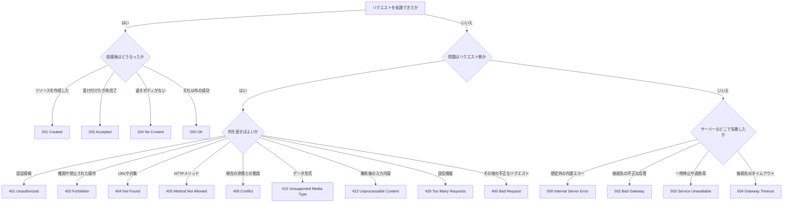

APIを作っていると、レスポンスのステータスコードで手が止まることがあります。

- 作成に成功したら`200`と`201`のどちらを返すのか
- ログインしていない場合は`401`か`403`か
- 入力値が正しくない場合は`400`か`422`か
- サーバー側のエラーはすべて`500`でよいのか

HTTPステータスコードは、すべて暗記する必要はありません。役割は、**処理結果を分類し、次に誰が何を直すべきか伝えること**です。この判断軸があれば、初めて見るコードも役割を推測できます。

この記事では、WebアプリケーションやHTTP APIでよく使うコードに絞り、迷いやすい組み合わせを整理します。仕様の基準には[RFC 9110](https://www.rfc-editor.org/rfc/rfc9110.html#name-status-codes)を使います。

## ステータスコードは処理結果を3桁で要約する

HTTPレスポンスは、主にステータスコード、レスポンスヘッダー、レスポンスボディからできています。

```http
HTTP/1.1 200 OK
Content-Type: application/json

{"id":"user_123","name":"Taro"}
```

この例の`200`がステータスコードです。リクエストが成功したことを、クライアント、ブラウザ、プロキシ、監視システムなどへ伝えます。

ただし、`200`だけでは、どのユーザーを取得したのかまでは分かりません。ステータスコードは結果の大分類を担い、個別のデータやエラーの詳細はヘッダーとボディが補います。

ステータスコードは、先頭の数字によって5種類に分かれます。

| 範囲 | 分類 | 意味 | 次の動き |
| --- | --- | --- | --- |
| `1xx` | 情報 | 処理の途中経過 | 最終レスポンスを待つ |
| `2xx` | 成功 | リクエストを処理できた | 結果を利用する |
| `3xx` | リダイレクト | 別の場所や保存済みデータを参照する | 指示された参照先を確認する |
| `4xx` | クライアントエラー | リクエスト側に問題がある | URL、入力、認証情報などを直す |
| `5xx` | サーバーエラー | サーバー側で処理できない | 復旧を待つか、サーバー側を直す |

`1xx`は最終結果の前に送る中間レスポンスです。通常のアプリケーション開発では、HTTPサーバーやライブラリが扱うことが多いため、この記事では`2xx`以降を中心に見ていきます。

RFC 9110では、クライアントが個々のコードを知らなくても、先頭の数字による分類は理解するよう定めています。たとえば未知の`471`を受け取っても、`4xx`なのでリクエスト側の問題として扱えます。**細かな番号を選ぶ前に、まず分類を決める**。この順番なら候補を絞れます。

## 2xxは成功後の状態で選ぶ

成功時に使う代表的なコードは、`200`、`201`、`202`、`204`です。HTTPメソッドだけで機械的に決めず、リクエストを処理した後の状態から選びます。

### `200 OK`は結果を返す一般的な成功

GETでデータを取得したときや、更新後のデータをボディで返すときは`200 OK`を使います。リクエストが成功したことを示す、一般的なコードです。

```http
HTTP/1.1 200 OK
Content-Type: application/json

{
  "id": "user_123",
  "name": "Taro"
}
```

`200`の意味は、リクエストに使ったHTTPメソッドによって変わります。GETなら対象を取得できた結果、POSTなら処理を実行できた結果です。「成功したら何でも`200`」という意味ではありません。

### `201 Created`は新しいリソースを作成した成功

リクエストが成功し、新しいリソースを作成した場合は`201 Created`です。ユーザー、記事、注文などの新規作成が当てはまります。

```http
HTTP/1.1 201 Created
Location: /users/user_123
Content-Type: application/json

{
  "id": "user_123",
  "name": "Taro"
}
```

`Location`ヘッダーを付けると、作成したリソースの場所も伝えられます。POSTに成功しても、既存リソースに対する処理を実行しただけなら`201`とは限りません。**新しいリソースが作られたか**で判断します。

### `202 Accepted`は受け付けたが完了していない

リクエストの受付と実処理を分けたいときは`202 Accepted`を使います。動画の変換、レポートの生成、大量メールの配信など、別のワーカーが後から実行する処理に向いています。

```http
HTTP/1.1 202 Accepted
Content-Type: application/json

{
  "jobId": "job_456",
  "status": "queued",
  "statusUrl": "/jobs/job_456"
}
```

注意したいのは、`202`が最終的な成功を保証しないことです。受け付けた後に処理が失敗する可能性もあります。そのため、処理状況を確認するURLやジョブIDを返すと、クライアントが完了を追跡しやすくなります。

### `204 No Content`は成功したが返すボディがない

処理には成功したものの、レスポンスボディで返す内容がない場合は`204 No Content`です。

```http
HTTP/1.1 204 No Content
```

削除や、更新結果をクライアントが受け取る必要のない処理でよく使われます。`204`のレスポンスにはボディを含めません。削除後の情報やメッセージをJSONで返したいなら、`200`のほうが自然です。

成功時は、次の順番で考えると選びやすくなります。

| 処理後の状態 | コード |
| --- | --- |
| 新しいリソースを作成した | `201 Created` |
| 処理を受け付けたが、まだ終わっていない | `202 Accepted` |
| 成功し、返すボディがない | `204 No Content` |
| それ以外の成功 | `200 OK` |

DELETEだから必ず`204`、POSTだから必ず`201`という対応ではありません。同じDELETEでも、削除した内容を返すなら`200`、非同期で削除するなら`202`を選べます。

## 3xxは移動の期間とHTTPメソッドの扱いで選ぶ

元のリクエストだけではレスポンスが完結せず、別の場所やキャッシュを参照するときに`3xx`を使います。URLの移動に使うコードは、「移動が恒久的か」と「転送後もHTTPメソッドを維持するか」で整理できます。

| コード | 移動 | 転送後のメソッド |
| --- | --- | --- |
| `301 Moved Permanently` | 恒久的 | POSTがGETへ変わる場合がある |
| `302 Found` | 一時的 | POSTがGETへ変わる場合がある |
| `303 See Other` | 一時的 | GETまたはHEADで取得する |
| `307 Temporary Redirect` | 一時的 | 元のメソッドとボディを維持する |
| `308 Permanent Redirect` | 恒久的 | 元のメソッドとボディを維持する |

`301`と`302`には歴史的な経緯があり、クライアントがPOSTをGETへ変更する場合があります。メソッドとボディを確実に維持したい場合は、一時的な移動なら`307`、恒久的な移動なら`308`を選びます。

たとえば、POST先のAPIを一時的に別のURLへ移し、同じPOSTをそのまま送り直してほしい場合は`307`です。

```http
HTTP/1.1 307 Temporary Redirect
Location: https://api.example.com/v2/orders
```

フォームをPOSTした後、結果ページをGETで開いてほしい場合は`303`が合います。

```http
HTTP/1.1 303 See Other
Location: /orders/order_123
```

### `304 Not Modified`はURLを移動するコードではない

`304 Not Modified`も`3xx`ですが、別のURLへ転送するためのコードではありません。クライアントが持つキャッシュと比べて対象が変更されていないとき、保存済みのレスポンスを再利用できることを伝えます。

```http
GET /users/user_123 HTTP/1.1
If-None-Match: "v7"
```

```http
HTTP/1.1 304 Not Modified
ETag: "v7"
```

この場合、サーバーは同じデータをもう一度ボディに入れて返しません。クライアントは手元のデータを使います。「`3xx`はすべて別URLへのリダイレクト」と覚えると、`304`で混乱するので注意してください。

## 4xxはクライアントが直す内容で選ぶ

サーバーがリクエスト側に問題があると判断した場合は`4xx`です。ここでいうクライアントは、ブラウザを操作する利用者だけではありません。フロントエンド、モバイルアプリ、別のAPIサーバーなど、HTTPリクエストを送った側を指します。

代表的なコードを「何を直せばよいか」で並べると、違いが見えてきます。

| コード | 問題 | クライアントが直すもの |
| --- | --- | --- |
| `400 Bad Request` | リクエストを正しく処理できない | 構文やリクエスト全体 |
| `401 Unauthorized` | 有効な認証情報がない | ログイン状態やトークン |
| `403 Forbidden` | サーバーが処理を拒否した | 権限や操作対象 |
| `404 Not Found` | 対象が見つからない | URLやリソースID |
| `405 Method Not Allowed` | HTTPメソッドに対応していない | GET、POSTなどのメソッド |
| `409 Conflict` | 現在のリソース状態と衝突する | 操作の前提やタイミング |
| `413 Content Too Large` | リクエストボディが大きすぎる | 送信サイズ |
| `415 Unsupported Media Type` | データ形式に対応していない | `Content-Type`やデータ形式 |
| `422 Unprocessable Content` | 構文は正しいが内容を処理できない | 入力値や指示内容 |
| `429 Too Many Requests` | 一定時間の送信回数が多すぎる | リクエスト頻度 |

### `400`と`422`は構文まで読めたかで分ける

JSONの閉じ括弧がなく、サーバーがボディを解析できない場合は`400 Bad Request`が合います。

```http
POST /users HTTP/1.1
Content-Type: application/json

{"name":"Taro"
```

一方、JSONとしては正しく読めても、値がAPIの条件を満たさない場合は`422 Unprocessable Content`を使えます。

```json
{
  "name": "",
  "age": -1
}
```

この例では、JSONの構文も`Content-Type`も正しいものの、空の名前や負の年齢をユーザー情報として処理できません。

ただし、RFC 9110の`400`は意味が広く、入力値の問題を含むクライアントエラー全般に使えます。バリデーションエラーに`400`を採用するAPIもあります。`400`と`422`のどちらか一方だけが常に正解なのではありません。

API内で細かく区別するなら「解析できない場合は`400`、解析後に内容を受理できない場合は`422`」と決めます。区別しないなら`400`へ統一し、APIドキュメントに方針を残します。

### `401`は未認証、`403`は要求を拒否した状態

`401 Unauthorized`という名前を見ると、「権限がない」と読みたくなります。しかし、仕様上は対象へアクセスするための**有効な認証情報がない状態**です。未ログイン、期限切れのアクセストークン、不正な認証情報などが該当します。

```http
HTTP/1.1 401 Unauthorized
WWW-Authenticate: Bearer
```

`401`を返すサーバーは、利用できる認証方式を`WWW-Authenticate`ヘッダーで示します。

サーバーがリクエストを理解したうえで処理を拒否した状態は、`403 Forbidden`で表します。実務では、認証済みの一般ユーザーが管理者専用APIを呼び出した場合などに使います。

| 状況 | コード |
| --- | --- |
| ログインしていない | `401` |
| トークンが期限切れ、または不正 | `401` |
| ログイン済みだが管理者権限がない | `403` |
| 操作を禁止する別の理由がある | `403` |

つまり、`401`を受け取ったクライアントは再認証を試せます。認証情報を変えずに`403`のリクエストを送り直しても、通常は結果が変わりません。

### `403`の代わりに`404`を返す場合もある

現在の対象が見つからない場合に使うコードが`404 Not Found`です。仕様上は、対象が存在することをサーバーが明かしたくない場合にも`404`を返せます。

たとえば、他人だけが閲覧できる非公開ファイルに対して`403`を返すと、そのURLにファイルが存在することは伝わります。存在自体を隠したいなら、権限がない利用者へ`404`を返す設計ができます。

これは、どちらかが常に正しいという話ではありません。

- 存在を伝えてよく、権限不足を明示したいなら`403`
- 存在を知られたくないなら`404`

同じサービスの中で場当たり的に変えず、情報公開の方針として決めます。なお、対象が恒久的に削除されたと分かっている場合は、`410 Gone`でその状態を明示できます。`404`だけでは、一時的に見つからないのか、今後も戻らないのかまでは分かりません。

### `405`はURLではなくHTTPメソッドが違う

対象のURLは存在するものの、そのHTTPメソッドを受け付けていない場合は`405 Method Not Allowed`です。

```http
DELETE /users/user_123 HTTP/1.1
```

```http
HTTP/1.1 405 Method Not Allowed
Allow: GET, PATCH
```

`405`のレスポンスでは、利用できるメソッドを`Allow`ヘッダーで伝えます。URLそのものが存在しない`404`とは、直す場所が異なります。

### `409`と`422`は現在の状態との衝突かで分ける

リクエストがリソースの現在の状態と衝突し、処理を完了できない場合は`409 Conflict`です。

たとえば、すでに発送済みの注文をキャンセルしようとした場合です。キャンセルという操作自体は理解できますが、注文の現在の状態では実行できません。同時編集で更新対象のバージョンが変わっていた場合も、`409`の候補です。

実務上の目安は次のとおりです。

- 送った内容そのものが条件を満たさないなら`422`
- サーバーに保存された現在の状態とぶつかるなら`409`

メールアドレスの重複登録は境界にあります。既存ユーザーとの競合として扱えば`409`、入力フィールドの制約違反として扱えば`422`と設計できます。このような境界では、コード単体の厳密さよりも、同じ種類のエラーへ同じコードを返す一貫性が重要です。

### `415`は内容ではなくデータ形式に対応していない

JSONだけを受け取るAPIへ`text/plain`を送った場合は、`415 Unsupported Media Type`を使えます。

```http
POST /users HTTP/1.1
Content-Type: text/plain

name=Taro
```

サーバーが`text/plain`を扱えないため、内容を検証する段階まで進めません。JSONとして解析しようとして失敗した`400`、JSONを解析した後に値を受理できなかった`422`と分けて考えます。

### `429`は待ってから送り直せる

一定時間内に送られたリクエストが多すぎる場合は、`429 Too Many Requests`を返します。APIのレート制限に達した場合が典型です。

```http
HTTP/1.1 429 Too Many Requests
Retry-After: 60
Content-Type: application/json

{"message":"60秒後にもう一度お試しください"}
```

`Retry-After`ヘッダーを付けると、再試行まで待つ時間を伝えられます。クライアントは即座に同じリクエストを繰り返さず、指定された時間やバックオフ方針に従います。

## 5xxはサーバーのどこで失敗したかを表す

リクエストを処理する責任がサーバー側にあるものの、エラーや機能不足によって完了できなかった場合は`5xx`です。

| コード | 状況 | 例 |
| --- | --- | --- |
| `500 Internal Server Error` | 予期しない問題が起きた | 未処理の例外、想定外のデータ不整合 |
| `501 Not Implemented` | 必要な機能をサーバーがサポートしていない | HTTPメソッド自体を認識・提供できない |
| `502 Bad Gateway` | 接続先から不正な応答を受け取った | 上流APIが壊れたレスポンスを返した |
| `503 Service Unavailable` | 一時的にリクエストを処理できない | メンテナンス、過負荷 |
| `504 Gateway Timeout` | 接続先が時間内に応答しなかった | 上流APIのタイムアウト |

### `500`は想定外の失敗に使う

アプリケーションで未処理の例外が発生し、適切なコードへ分類できない場合は`500 Internal Server Error`です。

一方、「在庫が足りない」「同じメールアドレスが登録済み」といった業務上想定している失敗は、通常`500`ではありません。クライアントが入力や操作を変えられるなら、`409`や`422`などの`4xx`で表現します。

`500`のボディへスタックトレース、SQL、ファイルパスなどをそのまま含めると、内部構造や機密情報が漏れるおそれがあります。利用者には安全な説明と問い合わせ用IDを返し、詳しい原因はサーバー側のログへ記録します。

```http
HTTP/1.1 500 Internal Server Error
Content-Type: application/json

{
  "message": "処理中に問題が発生しました",
  "requestId": "req_789"
}
```

### `502`と`504`は接続先の応答で分ける

APIゲートウェイやリバースプロキシが、別のサーバーへ処理を依頼する構成を考えます。


ゲートウェイが接続先から不正な応答を受け取った場合は`502 Bad Gateway`です。時間内に応答そのものを受け取れなかった場合は`504 Gateway Timeout`です。

- 応答は来たが、ゲートウェイとして正常に扱えないなら`502`
- 待っても応答が来なかったなら`504`

どちらも、クライアントから見ればサーバー側の問題です。

### `503`は一時的に利用できないことを伝える

一時的な過負荷や計画メンテナンスなどでリクエストを処理できない場合は、`503 Service Unavailable`です。復旧予定を示せるなら、`Retry-After`ヘッダーも返せます。

```http
HTTP/1.1 503 Service Unavailable
Retry-After: 300
```

`500`が予期しない内部エラーを表すのに対し、`503`は「今は利用できないが、時間がたてば回復する見込みがある」という性質を伝えられます。

## 一つのユーザーAPIに当てはめると違いが見える

ここまでのコードを、架空のユーザーAPIへ当てはめます。

| リクエストと結果 | コード | 理由 |
| --- | --- | --- |
| `GET /users/user_123`でユーザーを取得した | `200` | 取得に成功し、データを返す |
| `POST /users`でユーザーを作成した | `201` | 新しいリソースを作成した |
| `POST /exports`でエクスポートを予約した | `202` | 処理は後から実行される |
| `DELETE /users/user_123`で削除した | `204` | 成功し、返すボディがない |
| JSONの構文が壊れている | `400` | リクエストボディを解析できない |
| アクセストークンがない | `401` | 有効な認証情報がない |
| 一般ユーザーが管理画面を開いた | `403` | リクエストを理解したが許可しない |
| 指定したユーザーが存在しない | `404` | 対象のリソースが見つからない |
| GET専用URLへPOSTした | `405` | URLはあるがメソッドが違う |
| 更新前に別の利用者がデータを変更した | `409` | 現在の状態と更新の前提が衝突する |
| JSON APIへテキストを送った | `415` | データ形式に対応していない |
| 名前が空、年齢が負の値 | `422` | JSONは読めるが内容を処理できない |
| APIの呼び出し上限を超えた | `429` | 一定時間のリクエストが多すぎる |
| 未処理の例外が発生した | `500` | サーバー内部で想定外の問題が起きた |
| メンテナンス中 | `503` | 一時的にサービスを利用できない |

表へ当てはまらない状況でも、最初に`2xx`、`4xx`、`5xx`のどれかを決め、その後で近い意味のコードを探せば候補を絞れます。

## 詳しいエラー内容はレスポンスボディで伝える

ステータスコードは結果を分類するものなので、`422`だけを返しても、どの入力値が間違っていたのかは伝わりません。クライアントが問題を修正できるよう、レスポンスボディで詳細を補います。

独自のエラー形式を一から決めたくない場合は、[RFC 9457](https://www.rfc-editor.org/rfc/rfc9457.html)のProblem Detailsを利用できます。JSONでは`application/problem+json`というメディアタイプを使います。

```http
HTTP/1.1 422 Unprocessable Content
Content-Type: application/problem+json

{
  "type": "https://api.example.com/problems/validation-error",
  "title": "入力内容を確認してください",
  "status": 422,
  "detail": "2件の入力エラーがあります",
  "errors": [
    {
      "pointer": "#/name",
      "detail": "1文字以上で入力してください"
    },
    {
      "pointer": "#/age",
      "detail": "0以上の整数を指定してください"
    }
  ]
}
```

この例では、HTTPクライアントが`422`を見て入力エラーとして扱い、アプリケーションは`errors`を見て各入力欄へメッセージを表示できます。

反対に、次のようにHTTP上は`200`を返し、ボディだけで失敗を表す設計は避けたほうがよいでしょう。

```http
HTTP/1.1 200 OK
Content-Type: application/json

{
  "success": false,
  "error": "user_not_found"
}
```

HTTPクライアント、プロキシ、アクセスログ、監視システムからは成功に見えてしまいます。独自のアプリケーションプロトコルで別の規則が定められている場合を除き、HTTPの結果はステータスコードにも反映させます。

## 受け取る側は分類と個別コードの両方を見る

クライアントは、知っているコードを個別に処理し、それ以外を先頭の分類で扱うと堅牢になります。

```js
const response = await fetch('/api/profile');

if (response.status === 401) {
  // ログイン画面へ案内する
} else if (response.status === 403) {
  // 権限がないことを表示する
} else if (response.status === 429) {
  // Retry-Afterを確認して再試行を待つ
} else if (response.status >= 500) {
  // 一時的な障害として案内する
} else if (!response.ok) {
  // その他の4xxを処理する
}
```

`429`や`503`を受け取ったからといって、無条件に再試行するのは危険です。GETのように同じリクエストを繰り返しても結果への副作用がない操作と、注文作成のように重複実行が問題になる操作では扱いが異なります。`Retry-After`、HTTPメソッド、API側の冪等性の仕組みを確認してから再試行します。

## 迷ったときはこの順番で決める

ステータスコードを選ぶときは、番号の一覧を上から探すより、処理結果から段階的に絞ります。



実際には、サービスの要件や利用するフレームワークによって境界が変わる場面もあります。迷ったときは次の3点を確認します。

1. 同じ種類の結果へ、すでに何を返しているか
2. クライアントはそのコードを見て、適切な次の行動を選べるか
3. 選択理由をAPIドキュメントで説明できるか

## 番号ではなく次の行動を伝える

HTTPステータスコードは、細かな番号から考え始めると迷います。まず、成功なら`2xx`、リクエスト側の問題なら`4xx`、サーバー側の問題なら`5xx`と分類してください。

その後、成功時は「作成したか」「処理中か」「返すボディがあるか」、クライアントエラーでは「認証、権限、対象、入力、現在の状態のどこを直すか」、サーバーエラーでは「内部、接続先、一時停止のどこで失敗したか」を見ます。

最後に、コードだけでは足りない詳細をレスポンスボディとヘッダーで補います。これで、クライアントは失敗を表示するだけでなく、再認証する、入力欄を直す、時間を置いて再試行するといった次の行動を選べます。

## 参考資料

- [RFC 9110: HTTP Semantics](https://www.rfc-editor.org/rfc/rfc9110.html)
- [RFC 9111: HTTP Caching](https://www.rfc-editor.org/rfc/rfc9111.html)
- [RFC 6585: Additional HTTP Status Codes](https://www.rfc-editor.org/rfc/rfc6585.html)
- [RFC 9457: Problem Details for HTTP APIs](https://www.rfc-editor.org/rfc/rfc9457.html)
- [IANA: Hypertext Transfer Protocol Status Code Registry](https://www.iana.org/assignments/http-status-codes/http-status-codes.xhtml)
