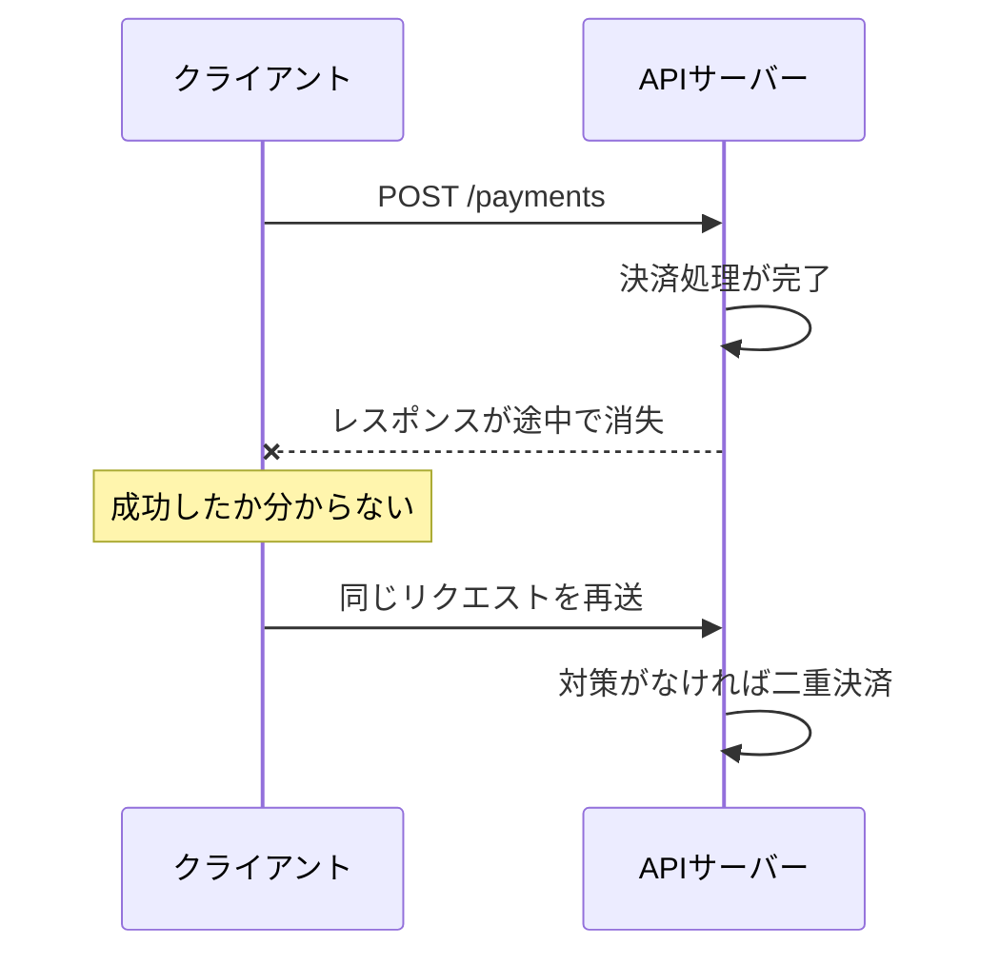
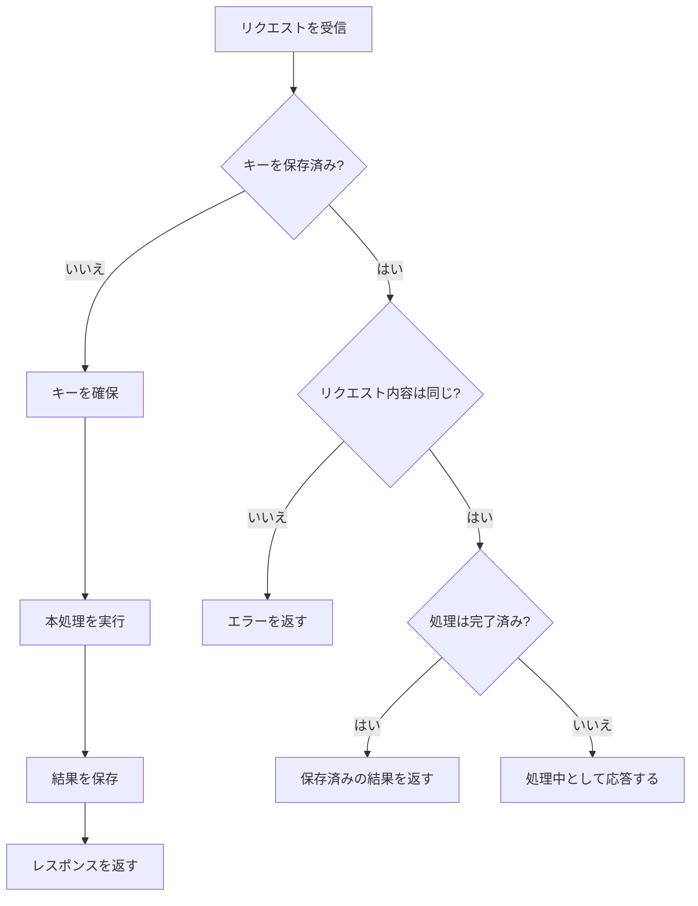

決済APIへリクエストを送ったところ、レスポンスが返らないままタイムアウトしました。再送しないのも危険です。しかし、再送が安全とは限りません。最初の決済がすでに完了していれば、二重決済が起こります。

もう一度送ってよいのでしょうか。

この問題に対処する性質が**冪等性（べきとうせい）**です。回数は問いません。同じ操作を複数回実行しても、サーバーに対する意図した効果が1回実行したときと変わらないことを指します。

問題は、通信障害そのものだけではありません。クライアントから処理結果が見えなくなることです。

## 冪等性では、操作を重ねても追加の変化が起きない

数学では、ある関数 `f` に対して次の関係が成り立つとき、その関数は冪等だと表します。

```text
f(f(x)) = f(x)
```

身近な例は「照明を消す」という操作です。一度で消灯します。その後、消す操作を何度繰り返しても状態は変わりません。

一方、「明るさを10%上げる」は冪等ではありません。実行するたびに10%ずつ明るくなり、回数によって最終状態が変わります。

違いは操作の形です。APIでも、「目標の状態にする」のか「現在の状態へ変化を加える」のかを区別します。

```text
ユーザーを無効にする     何度実行しても「無効」
残高へ1,000円を加える    実行するたびに残高が増える
```

判断の軸はリクエストの回数ではなく、その操作がサーバーへどのような効果を与えるかです。

## レスポンスが同じでなくても冪等になる

レスポンスは別問題です。毎回同じステータスコードやレスポンスボディを返す必要はありません。

たとえば、次のDELETEリクエストを考えます。

```http
DELETE /users/42
```

1回目のリクエストではユーザーを削除して`204 No Content`を返し、同じリクエストを送った2回目は、対象が存在しないため`404 Not Found`を返すかもしれません。

レスポンスは異なります。それでも、このDELETEは冪等です。「`/users/42`に対応するユーザーが存在しない」という意図した効果は変わらないからです。

アクセスログや監査ログがリクエストごとに増える場合もあります。HTTPが定める冪等性は、クライアントが要求した効果についての性質です。サーバー内部のあらゆる値が完全に同じであり続けることまでは求めません。

## 処理結果を確認できないからリトライが必要になる

タイムアウトが起きたとき、実際の処理は次のいずれかにあります。

1. リクエストがサーバーへ届いていない
2. サーバーが処理している途中で通信が切れた
3. 処理は完了したが、レスポンスだけ届かなかった

見えるのはタイムアウトだけです。通信が切れた位置までは分かりません。

結果は不明です。



ネットワーク障害だけでなく、ロードバランサーやAPIクライアントのタイムアウトでも同じ状況が起こり、クライアントは結果が不明なまま諦めるか、重複を覚悟して再送するかを迫られます。

操作が冪等なら、最初のリクエストが成功していた場合でも安全に再送できます。通信エラーが起きたときにリトライできることが、APIで冪等性を設計する主な理由です。

## HTTPメソッドには冪等性が定義されている

HTTPでは、メソッドごとに「安全」と「冪等」という性質が定義されています。

安全とは、そのメソッドの意図が読み取り専用であることです。冪等は効果の性質です。同じリクエストを複数回送っても、意図した効果が1回の場合と変わりません。

二つは別の性質です。

| メソッド | 安全 | 冪等 | 代表的な使い方 |
| --- | --- | --- | --- |
| GET | はい | はい | リソースを取得する |
| PUT | いいえ | はい | 指定した内容で置き換える |
| DELETE | いいえ | はい | リソースを削除する |
| POST | いいえ | 保証されない | 新しいリソースや処理を作る |
| PATCH | いいえ | 保証されない | リソースの一部を変更する |

PUTは状態を変えます。そのため安全ではありません。同じURIへ同じ内容を繰り返しPUTした場合、置き換え後の状態は同じです。

つまり、PUTは冪等です。

```http
PUT /users/42/settings
Content-Type: application/json

{
  "emailNotification": true
}
```

POSTは、送信するたびに新しいリソースを作る可能性があります。

```http
POST /orders
Content-Type: application/json

{
  "productId": "book-123",
  "quantity": 1
}
```

対策がなければ、2回の送信で注文も2件。HTTPのPOSTそのものには、冪等性が保証されていません。

PATCHは変更内容によって結果が変わります。「名前をAkiに置き換える」なら、繰り返しても同じ状態です。「ポイントを100加算する」なら、実行するたびに値が増えます。PATCHを使っただけでは、安全に再送できるとは判断できません。

メソッドの性質は、API実装が守るべき契約です。メソッド名は免罪符ではありません。GETの内部で注文を確定するようなAPIを作れば、安全という契約を破っています。

## POSTはIdempotency Keyで同じ操作を識別する

注文作成や決済にはPOSTを使いたい一方、通信エラー時にはリトライも必要です。このようなAPIでよく使われるのが`Idempotency-Key`です。

操作ごとに一意なキーを作ります。タイムアウト後に再送するときも新しいキーは作らず、最初と同じキーを付けます。

```http
POST /orders
Idempotency-Key: 6fbc0ac2-1ab7-4ad7-a7f2-03f08076b3a5
Content-Type: application/json

{
  "productId": "book-123",
  "quantity": 1
}
```

サーバーはキーを受け取ると、過去に同じキーを処理したか調べます。初回なら注文を作成してキーと処理結果を保存し、再送なら注文を増やさず、保存済みの結果を返します。



ここでのキーは「同じHTTPリクエスト」より、「利用者が行った同じ操作」を識別しています。購入ボタン1回につき1キーです。その操作を再送する間は同じキーを使います。

再購入なら別のキーです。

`Idempotency-Key`という名前は複数のAPIで使われています。ただし、仕様はAPIごとに違います。保存期間やエラー時の扱いを文書で定め、クライアントとサーバーの双方が同じ契約を実装して初めて機能します。

## 同じキーで異なる内容を送ってはいけない

キーだけを比較すると、別の操作を誤って同じものと判断する可能性があります。

```text
1回目: key=abc, productId=book-123, quantity=1
2回目: key=abc, productId=book-999, quantity=3
```

2回目を単なる再送として扱うと、クライアントが期待した内容と保存済みの結果が食い違います。キーだけでは足りません。サーバーはリクエストボディからハッシュ値などのフィンガープリントを作り、キーと一緒に保存します。同じキーで内容が異なる場合は、処理を続けずエラーを返します。

キーの検索範囲も決めます。全体でキーだけを検索するのは危険です。別の利用者が偶然同じ値を送った場合に、他人の処理結果を返しかねません。

一意性は複合で持ちます。たとえば`利用者ID + エンドポイント + Idempotency Key`の組み合わせなら、利用者と操作の種類をまたいだ衝突を避けられます。

キーにはUUIDなど、十分に衝突しにくい値を使います。メールアドレスや注文内容をそのままキーへ含める必要はありません。

## 同時に届く2件は一意制約で止める

次のように「検索して、なければ保存する」だけでは競合が起こります。

```text
リクエストA: キーを検索 → まだない
リクエストB: キーを検索 → まだない
リクエストA: 注文を作成
リクエストB: 注文を作成
```

両方が検索を終えてから保存へ進むと、同じキーでも注文を2件作れます。

条件分岐だけでは防げません。

データベースには、キーの検索範囲に合わせた一意制約を置きます。

```sql
UNIQUE (user_id, endpoint, idempotency_key)
```

リクエストを受けたら、まず「処理中」のレコードを挿入してキーを確保します。同じキーを使う別のリクエストは一意制約に当たるため、保存済みの状態を確認する側へ回せます。

概念をTypeScript風の疑似コードで表すと、次のようになります。

```ts
async function createOrder(request: Request) {
  const userId = requireUserId(request);
  const key = requireHeader(request, "Idempotency-Key");
  const input = await request.json();
  const fingerprint = hashCanonicalJson(input);

  return db.transaction(async (tx) => {
    const record = await tx.idempotencyKeys.reserve({
      userId,
      endpoint: "POST /orders",
      key,
      fingerprint,
    });

    if (record.fingerprint !== fingerprint) {
      return response(422, { error: "Idempotency Key was reused" });
    }

    if (record.status === "completed") {
      return response(record.responseStatus, record.responseBody);
    }

    if (!record.reservedByThisRequest) {
      return response(409, { error: "Request is still processing" });
    }

    const order = await tx.orders.create(input);
    const body = { id: order.id, status: order.status };

    await tx.idempotencyKeys.complete(record.id, {
      responseStatus: 201,
      responseBody: body,
    });

    return response(201, body);
  });
}
```

`reserve`は、一意制約を使ってキーを確保する処理を表しています。決めることは残ります。実際のエラーコード、処理中のリクエストを待たせるかエラーにするか、どの失敗結果を保存するかは、APIの契約に含めます。

この例では、注文作成と処理結果の保存を同じデータベーストランザクションに含めています。途中で失敗したら両方をロールバックします。これで「注文だけ作られ、キーが残らない」という状態を防げます。

## 外部サービスへの副作用は別に守る

データベーストランザクションだけでは、外部の決済APIやメール送信まで巻き戻せません。

```text
1. 外部の決済APIは成功した
2. 自分のデータベースへ結果を保存する前に停止した
3. リトライで決済APIをもう一度呼んだ
```

ここが境界です。自分のAPIにIdempotency Keyを実装していても、この経路では二重決済が起こりえます。外部APIの仕様も確認します。冪等性の仕組みがあるなら、受け取った操作IDに対応する同じキーを渡します。

外部送信をデータベース処理から切り離すには、Outboxパターンも選択肢です。業務データと送信予定を同じトランザクションで保存してから、別のワーカーが送信します。

ただし、Outboxだけで重複送信が消えるわけではありません。送信先APIへ同じ操作IDを渡すか、受信側でイベントIDを保存し、同じイベントを複数回受け取っても業務処理を重ねないようにします。

1つのエンドポイントだけを守っても、後段の副作用から重複が漏れます。見るのは経路全体です。重複すると困る場所ごとに、識別子と一意制約を置きます。

## Idempotency Keyには有効期限がある

処理済みのキーを永久に保存すると、データ量は増え続けます。実際のAPIでは、キーを保持する期間を定め、期限を過ぎたレコードを削除します。

期限後に同じキーが届いた場合、サーバーは新しい操作として処理する可能性があります。クライアントは、APIが公開する保持期間を超えて古いリクエストを再送してはいけません。

判断材料は、リトライの最大期間、業務上重複を許せない期間、保存コストの三つ。「24時間なら常に正しい」といった共通の答えはありません。決済や注文では、業務上の操作IDを長く保持する場合もあります。

## 冪等性は「必ず一度だけ実行する」という保証ではない

Idempotency Keyがあっても、コードは再実行されます。失敗箇所や保存期間、外部サービスとの境界によっては、内部の一部を繰り返すからです。

目指すのは、再実行が起きても、利用者から見た意図した効果を重ねないことです。いわゆる「Exactly Once」をヘッダー1つで実現する仕組みではありません。

設計時には、次の5点を決めます。

1. 何を同じ操作と見なすか
2. 重複を識別するキーを誰が作るか
3. どの結果を保存し、再送時に何を返すか
4. キーをどの範囲で、いつまで保持するか
5. データベース外の副作用をどう守るか

HTTPメソッドの暗記だけでは、重複リクエストを防げません。決めるのは操作の境界です。タイムアウト後に同じ操作が届くことを前提に、保存する結果まで設計します。

同じリクエストを再送できれば、クライアントは結果不明のまま処理を諦めずに済みます。問いは一つです。「失敗したら再送してよいか」を考えると、APIを呼ぶ側でも作る側でも、冪等性が必要な場所を見つけられます。

## 参考資料

- [RFC 9110: HTTP Semantics - Safe Methods](https://www.rfc-editor.org/rfc/rfc9110.html#section-9.2.1)
- [RFC 9110: HTTP Semantics - Idempotent Methods](https://www.rfc-editor.org/rfc/rfc9110.html#section-9.2.2)
- [RFC 5789: PATCH Method for HTTP](https://www.rfc-editor.org/rfc/rfc5789.html#section-2)
- [Stripe API Reference: Idempotent requests](https://docs.stripe.com/api/idempotent_requests)
