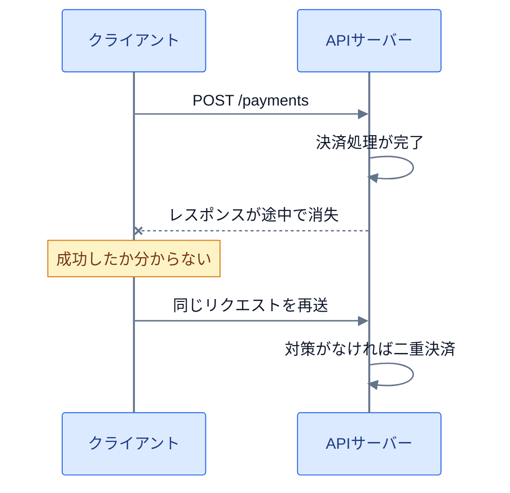
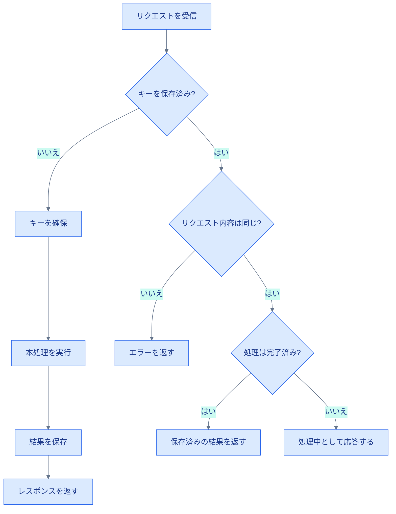

決済APIへリクエストを送ったものの、レスポンスが返らないままタイムアウトしたとします。最初の決済がすでに完了していれば、再送すると二重決済になりかねません。しかし、リクエストが届いていなかったのなら、再送しない限り注文は完了しません。

処理結果が分からなくなったとき、安全に再送できるようにする性質が冪等性（べきとうせい）です。同じ操作を何度実行しても、サーバーに対する意図した効果が、1回だけ実行した場合と変わらないことを指します。

冪等性が必要になるのは、通信障害が起きたときだけではありません。クライアントから処理結果を確認できない場合に備えるためです。この記事では、HTTPにおける冪等性の意味を整理し、POSTリクエストを安全に再送するための設計まで説明します。

## 冪等性では、操作を重ねても追加の変化が起きない

数学では、ある関数 `f` に対して次の関係が成り立つとき、その関数は冪等だと表します。

```text
f(f(x)) = f(x)
```

身近な例は「照明を消す」という操作です。一度消灯した後は、同じ操作を何度繰り返しても消えた状態が続きます。

一方、「明るさを10%上げる」は冪等ではありません。実行するたびに10%ずつ明るくなり、回数によって最終状態が変わります。

両者の違いは、操作が「目標の状態にする」のか、「現在の状態へ変化を加える」のかにあります。APIを設計するときも、この区別が判断の軸になります。

```text
ユーザーを無効にする     何度実行しても「無効」
残高へ1,000円を加える    実行するたびに残高が増える
```

リクエストや内部処理が複数回発生したかどうかではなく、操作による最終的な効果が重なるかどうかを見ます。

## レスポンスが同じでなくても冪等になる

冪等性は効果についての性質なので、毎回同じステータスコードやレスポンスボディを返す必要はありません。

たとえば、次のDELETEリクエストを考えます。

```http
DELETE /users/42
```

1回目のリクエストではユーザーを削除して`204 No Content`を返し、同じリクエストを送った2回目は、対象が存在しないため`404 Not Found`を返すかもしれません。

2回のレスポンスは異なりますが、このDELETEは冪等です。どちらの場合も、操作後は「`/users/42`に対応するユーザーが存在しない」という状態になるからです。

アクセスログや監査ログがリクエストごとに増える場合もあります。HTTPが定める冪等性は、クライアントが要求した効果についての性質です。サーバー内部のあらゆる値が完全に同じであり続けることまでは求めません。

## 処理結果を確認できないからリトライが必要になる

タイムアウトが起きたとき、実際の処理は次のいずれかにあります。

1. リクエストがサーバーへ届いていない
2. サーバーが処理している途中で通信が切れた
3. 処理は完了したが、レスポンスだけ届かなかった

クライアントから見えるのはタイムアウトだけで、どの段階で通信が切れたのかは分かりません。つまり、処理結果は不明です。



同じ状況は、ネットワーク障害に限らず、ロードバランサーやAPIクライアントのタイムアウトでも起こります。対策がなければ、クライアントは結果が分からないまま諦めるか、重複を覚悟して再送するしかありません。

操作が冪等なら、最初のリクエストが成功していた場合でも安全に再送できます。通信エラーが起きたときにリトライできることが、APIで冪等性を設計する主な理由です。

## HTTPメソッドには冪等性が定義されている

HTTPでは、メソッドごとに「安全」と「冪等」という性質が定義されています。

「安全」とは、クライアントがサーバーの状態変更を要求しないことです。一方、冪等性は操作を繰り返したときの効果を表します。状態を変更する操作でも、繰り返した結果が変わらなければ冪等です。

| メソッド | 安全 | 冪等 | 代表的な使い方 |
| --- | --- | --- | --- |
| GET | はい | はい | リソースを取得する |
| PUT | いいえ | はい | 指定した内容で置き換える |
| DELETE | いいえ | はい | リソースを削除する |
| POST | いいえ | 保証されない | 新しいリソースや処理を作る |
| PATCH | いいえ | 保証されない | リソースの一部を変更する |

PUTはサーバーの状態を変えるため、安全ではありません。ただし、同じURIへ同じ内容を繰り返しPUTしても置き換え後の状態は変わらないため、冪等です。

```http
PUT /users/42/settings
Content-Type: application/json

{
  "emailNotification": true
}
```

POSTは、送信するたびに新しいリソースを作る可能性があります。

```http
POST /orders
Content-Type: application/json

{
  "productId": "book-123",
  "quantity": 1
}
```

対策がなければ、2回送信すると注文も2件作られます。HTTPのPOSTそのものには、冪等性が保証されていません。

PATCHは変更内容によって結果が変わります。「名前をAkiに置き換える」なら、繰り返しても同じ状態です。「ポイントを100加算する」なら、実行するたびに値が増えます。PATCHを使っただけでは、安全に再送できるとは判断できません。

これらは、API実装が守るべき契約です。メソッドを選ぶだけで性質が自動的に備わるわけではありません。たとえば、GETの内部で注文を確定するAPIは、GETに求められる安全性を破っています。

## POSTはIdempotency Keyで同じ操作を識別する

注文作成や決済にはPOSTを使いたい一方、通信エラー時にはリトライも必要です。このようなAPIでよく使われるのが`Idempotency-Key`です。

`Idempotency-Key`は、複数のリクエストが同じ操作を表していることをサーバーへ伝える識別子です。クライアントは操作ごとに一意なキーを作り、タイムアウト後に再送するときも最初と同じキーを付けます。

```http
POST /orders
Idempotency-Key: 6fbc0ac2-1ab7-4ad7-a7f2-03f08076b3a5
Content-Type: application/json

{
  "productId": "book-123",
  "quantity": 1
}
```

サーバーはキーを受け取ると、過去に同じキーを処理したか調べます。初回なら注文を作成してキーと処理結果を保存し、再送なら注文を増やさず、保存済みの結果を返します。



ここで識別したいのは、同じHTTPリクエストというより「利用者が行った同じ操作」です。購入ボタンを1回押した操作には1つのキーを割り当て、その操作を再送する間は同じキーを使います。利用者が改めて購入した場合は、別のキーを発行します。

`Idempotency-Key`という名前は複数のAPIで使われています。ただし、仕様はAPIごとに違います。保存期間やエラー時の扱いを文書で定め、クライアントとサーバーの双方が同じ契約を実装して初めて機能します。

## 同じキーで異なる内容を送ってはいけない

キーだけを比較すると、別の操作を誤って同じものと判断する可能性があります。

```text
1回目: key=abc, productId=book-123, quantity=1
2回目: key=abc, productId=book-999, quantity=3
```

2回目を単なる再送として扱うと、クライアントが期待した内容と保存済みの結果が食い違います。キーだけでは足りません。サーバーはリクエストボディからハッシュ値などのフィンガープリントを作り、キーと一緒に保存します。同じキーで内容が異なる場合は、処理を続けずエラーを返します。

キーの検索範囲も決めます。全体でキーだけを検索するのは危険です。別の利用者が偶然同じ値を送った場合に、他人の処理結果を返しかねません。

そこで、キーの一意性は複数の値を組み合わせて保証します。たとえば、`利用者ID + エンドポイント + Idempotency Key`を一意にすれば、利用者や操作の種類をまたいだ衝突を避けられます。

キーにはUUIDなど、十分に衝突しにくい値を使います。メールアドレスや注文内容をそのままキーへ含める必要はありません。

## 同時に届く2件は一意制約で止める

次のように「検索して、なければ保存する」だけでは競合が起こります。

```text
リクエストA: キーを検索 → まだない
リクエストB: キーを検索 → まだない
リクエストA: 注文を作成
リクエストB: 注文を作成
```

両方が検索を終えてから保存へ進むと、同じキーでも注文を2件作れてしまいます。この競合は、アプリケーションコードの条件分岐だけでは防げません。

データベースには、キーの検索範囲に合わせた一意制約を置きます。

```sql
UNIQUE (user_id, endpoint, idempotency_key)
```

リクエストを受けたら、まず「処理中」のレコードを挿入してキーを確保します。同じキーを使う別のリクエストは一意制約に当たるため、保存済みの状態を確認する側へ回せます。

概念をTypeScript風の疑似コードで表すと、次のようになります。

```ts
async function createOrder(request: Request) {
  const userId = requireUserId(request);
  const key = requireHeader(request, "Idempotency-Key");
  const input = await request.json();
  const fingerprint = hashCanonicalJson(input);

  return db.transaction(async (tx) => {
    const record = await tx.idempotencyKeys.reserve({
      userId,
      endpoint: "POST /orders",
      key,
      fingerprint,
    });

    if (record.fingerprint !== fingerprint) {
      return response(422, { error: "Idempotency Key was reused" });
    }

    if (record.status === "completed") {
      return response(record.responseStatus, record.responseBody);
    }

    if (!record.reservedByThisRequest) {
      return response(409, { error: "Request is still processing" });
    }

    const order = await tx.orders.create(input);
    const body = { id: order.id, status: order.status };

    await tx.idempotencyKeys.complete(record.id, {
      responseStatus: 201,
      responseBody: body,
    });

    return response(201, body);
  });
}
```

`reserve`は、一意制約を使ってキーを確保する処理を表しています。ただし、この疑似コードだけではAPIの契約は決まりません。実際のエラーコード、処理中のリクエストを待たせるかエラーにするか、どの失敗結果を保存するかは、APIごとに定める必要があります。

この例では、注文作成と処理結果の保存を同じデータベーストランザクションに含めています。途中で失敗したら両方をロールバックします。これで「注文だけ作られ、キーが残らない」という状態を防げます。

## 外部サービスへの副作用は別に守る

データベーストランザクションだけでは、外部の決済APIやメール送信まで巻き戻せません。

```text
1. 外部の決済APIは成功した
2. 自分のデータベースへ結果を保存する前に停止した
3. リトライで決済APIをもう一度呼んだ
```

自分のAPIにIdempotency Keyを実装していても、外部サービスとの境界を越えた時点で、データベースだけでは二重決済を防げません。外部APIにも冪等性の仕組みがあるなら、自分のAPIが受け取った操作IDに対応する同じキーを渡します。

外部送信をデータベース処理から切り離すには、Outboxパターンも選択肢です。業務データと送信予定を同じトランザクションで保存してから、別のワーカーが送信します。

ただし、Outboxだけで重複送信が消えるわけではありません。送信先APIへ同じ操作IDを渡すか、受信側でイベントIDを保存し、同じイベントを複数回受け取っても業務処理を重ねないようにします。

1つのエンドポイントだけを守っても、後段の処理から重複が漏れる可能性は残ります。リクエストを受け取ってから外部サービスへ到達するまでの経路全体を追い、重複すると困る場所ごとに識別子と一意制約を置きます。

## Idempotency Keyには有効期限がある

処理済みのキーを永久に保存すると、データ量は増え続けます。実際のAPIでは、キーを保持する期間を定め、期限を過ぎたレコードを削除します。

期限後に同じキーが届いた場合、サーバーは新しい操作として処理する可能性があります。クライアントは、APIが公開する保持期間を超えて古いリクエストを再送してはいけません。

保持期間は、リトライが起こり得る期間、業務上重複を許せない期間、保存コストの三つを基に決めます。「24時間なら常に正しい」といった共通の答えはありません。決済や注文では、Idempotency Keyとは別に、業務上の操作IDをより長く保持する設計も考えられます。

## 冪等性は「必ず一度だけ実行する」という保証ではない

Idempotency Keyがあっても、コードの実行回数が必ず1回になるわけではありません。失敗した箇所やキーの保存期間、外部サービスとの境界によっては、内部処理の一部が繰り返されます。

目指すのは、再実行が起きても、利用者から見た意図した効果を重ねないことです。`Idempotency-Key`ヘッダーを付けるだけで、いわゆる「Exactly Once（必ず一度だけの実行）」を実現できるわけではありません。

設計時には、次の5点を決めます。

1. 何を同じ操作と見なすか
2. 重複を識別するキーを誰が作るか
3. どの結果を保存し、再送時に何を返すか
4. キーをどの範囲で、いつまで保持するか
5. データベース外の副作用をどう守るか

HTTPメソッドの性質を覚えるだけでは、重複リクエストを防げません。何を同じ操作と見なすのかを決め、タイムアウト後に同じ操作が届くことを前提として、キーの一意性や保存する結果、外部サービスへの伝播まで設計する必要があります。

設計を確認するときは、「この処理が失敗したように見えたら、同じ操作を安全に再送できるか」と問いかけてみてください。答えが曖昧な場所には、結果不明のまま処理を諦めるか、重複を受け入れるかという問題が残っています。

## 参考資料

- [RFC 9110: HTTP Semantics - Safe Methods](https://www.rfc-editor.org/rfc/rfc9110.html#section-9.2.1)
- [RFC 9110: HTTP Semantics - Idempotent Methods](https://www.rfc-editor.org/rfc/rfc9110.html#section-9.2.2)
- [RFC 5789: PATCH Method for HTTP](https://www.rfc-editor.org/rfc/rfc5789.html#section-2)
- [Stripe API Reference: Idempotent requests](https://docs.stripe.com/api/idempotent_requests)
