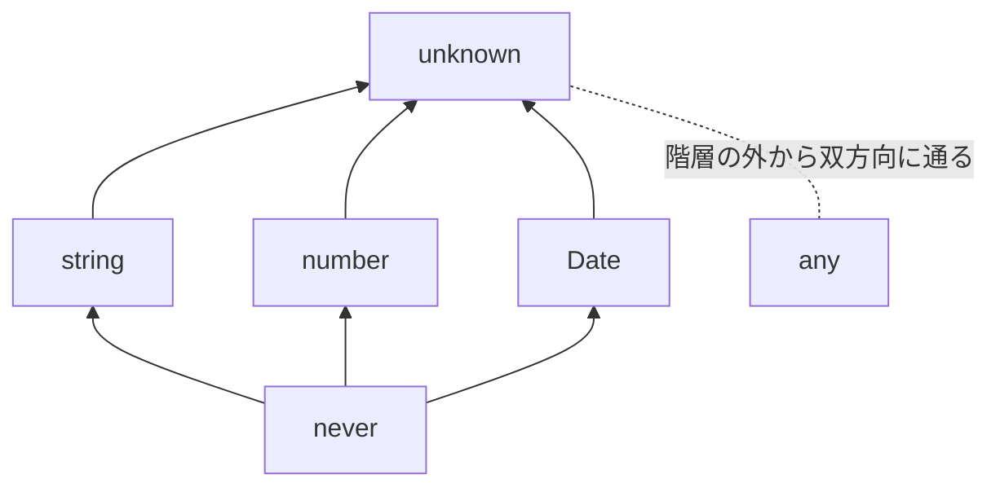

```ts
const data: any = await response.json();
console.log(data.user.profile.name);
```

型エラーはゼロでした。動かしたら `Cannot read properties of undefined (reading 'profile')` で落ちました。

レスポンスに `profile` がなかった、という話ではあります。ただ、それを実行時まで知らなかった原因は1行目にあります。

私は `any` を「何でも入る型」だと思っていました。何でも入るという意味では、`unknown` も同じです。違うのは、入れたあとに何ができるかでした。

`any`、`unknown`、そして絞り込みの終点にいる `never`。この3つは、値の種類を表す型ではありません。型検査をどこまで働かせるかを決める型です。

## 入口は同じで、出口が違う

代入だけ見ていると、この2つは区別がつきません。

```ts
let a: any = 1;
a = "text";
a = { nested: { value: true } };

let u: unknown = 1;
u = "text";
u = { nested: { value: true } };
```

差が出るのは、値を使うときです。

```ts
a.toUpperCase(); // 型エラーなし。実行時に落ちる
u.toUpperCase(); // 'u' is of type 'unknown'.
```

他の型に渡すときも同じです。

```ts
const n1: number = a; // 通る
const n2: number = u; // Type 'unknown' is not assignable to type 'number'.
```

表にすると、`any` の行だけ全部「できる」になります。

| 値の型 | `unknown` へ代入 | `number` へ代入 | プロパティを読む | 関数として呼ぶ |
| --- | --- | --- | --- | --- |
| `any` | できる | できる | できる | できる |
| `unknown` | できる | できない | できない | できない |

**「何でも入る」は共通で、`any` にだけ出口があります。**

## `unknown` は頂点、`any` は階層の外

型には代入できる向きの上下関係があって、`unknown` はその頂点にいます。



矢印は「代入できる向き」です。`string` の値は `unknown` の変数に入れられるけれど、逆はできない。だから `unknown` が上。すべての型を受け取れる型、いわゆるトップ型です。

反対の端が `never` です。どの型にも代入できますが、値がひとつも存在しません。`unknown` が「まだ何も分かっていない」なら、`never` は「もう何も残っていない」。この型は後半でもう一度出てきます。

`any` はこの上下関係に参加していません。点線で示したように、どの型との間も両方向に通り抜けます。例外は `never` の1つだけで、`any` の値も `never` の変数には入れられません。入る値が存在しない型だからです。

この出口の自由が、次の問題になります。

## `any` は1行で終わらない

```ts
const config: any = JSON.parse(raw);

const timeout = config.timeout; // any
const ms = timeout * 1000; // any
const list: number[] = [];
list.push(ms); // 通る
const total = list.reduce((x, y) => x + y, 0);
```

`config` に付けた `any` は、そこから取り出した値にも、それを使った計算にも受け継がれます。`config.timeout` が `any` になり、`any * 1000` も `any` になる。

`ms` の中身が `"30s"` という文字列でも、`number[]` に入ります。型の上では `number[]` なのに、中身に文字列が混ざった配列ができあがる。`total` は `"030s"` です。

効いているのは、`any` から `number` への代入が通ることでした。入口ではなく出口の話です。

`unknown` なら、最初の1行で止まります。

```ts
const config: unknown = JSON.parse(raw);
const timeout = config.timeout; // 'config' is of type 'unknown'.
```

エラーの場所が、値の出どころと一致します。

**`any` はエラーを消しますが、エラーの原因は消しません。原因が見つかる場所を、遠くへ動かすだけです。**

そして `JSON.parse` の戻り値は `any` で、`response.json()` は `Promise<any>` を返します。そのまま受けると、外から来たデータが `any` のまま内側を流れていきます。境界に置く型は、ライブラリの戻り値まかせにせず、自分で決められます。

## `unknown` は確かめてから使わせる

`unknown` の値は、絞り込まないと使えません。裏を返せば、絞り込めば使えます。

```ts
function describe(value: unknown): string {
  if (typeof value === "string") {
    return value.toUpperCase(); // string
  }
  if (typeof value === "number") {
    return value.toFixed(2); // number
  }
  if (value instanceof Date) {
    return value.toISOString(); // Date
  }
  return String(value);
}
```

`typeof` と `instanceof` で分岐すると、そのブロックの中では具体的な型になります。`any` にすればこの分岐を書かずに済みますが、実行時に要る確認が消えるわけではありません。書かなくてもコンパイルが通るようになるだけです。

オブジェクトの中身を見るときは、手数が増えます。

```ts
function getName(value: unknown): string | null {
  if (typeof value === "object" && value !== null && "name" in value) {
    return typeof value.name === "string" ? value.name : null;
  }
  return null;
}
```

条件が3つ並んでいます。`typeof value === "object"` だけでは `null` が残る（`typeof null` は `"object"`）ので `value !== null` が必要で、そのあと `in` でプロパティの存在を確かめる。`in` で絞り込んだ先の `value.name` を読めるのは、TypeScript 4.9以降です。

同じ確認を何度も書くなら、型述語（type predicate）に切り出します。

```ts
type User = { id: number; name: string };

function isUser(value: unknown): value is User {
  return (
    typeof value === "object" &&
    value !== null &&
    "id" in value &&
    typeof value.id === "number" &&
    "name" in value &&
    typeof value.name === "string"
  );
}
```

戻り値の位置に書いた `value is User` が、「この関数が `true` を返したら、引数は `User` として扱ってよい」という宣言です。呼び出し側の `if (isUser(value))` の中で `value.name` が読めるようになります。

ただし、その宣言の中身が本当に `User` を確かめているかを、TypeScriptは検証しません。

```ts
function isUser(value: unknown): value is User {
  return true; // これも通る
}
```

型述語は、検査をあなたに委譲する仕組みです。検査を代わりに作ってくれる仕組みではありません。だから中身と型定義がずれた瞬間、`unknown` から始めた意味がなくなります。`User` にプロパティを1つ足したとき、この関数を直し忘れる可能性がどれくらいあるか、考えてみてください。

手で書くのが辛くなってきたら、スキーマから型を導く方向に切り替えます。zodやvalibotなら、宣言と検査が同じ1か所から出てくるのでずれません。

```ts
import { z } from "zod";

const UserSchema = z.object({ id: z.number(), name: z.string() });

const user = UserSchema.parse(JSON.parse(raw)); // 形が違えば例外
```

## `Array.isArray` は `any[]` に絞る

小さい話ですが、知らないと踏みます。

```ts
function sum(value: unknown): number {
  if (Array.isArray(value)) {
    // value は unknown[] ではなく any[]
    return value.reduce((acc, v) => acc + v, 0); // 型エラーなし
  }
  return 0;
}
```

標準ライブラリでの宣言が `isArray(arg: any): arg is any[]` なので、絞り込んだ結果の要素は `any` です。配列だと分かった時点で、中身についてはノーチェックに戻ります。

要素の型まで確かめるなら、自分で書きます。

```ts
function isNumberArray(value: unknown): value is number[] {
  return Array.isArray(value) && value.every((v) => typeof v === "number");
}
```

## 絞り込みの終点は `never`

分岐で可能性を消していくと、最後には何も残らなくなります。その状態を表す型が `never` です。

```ts
function format(value: string | number): string {
  if (typeof value === "string") {
    return value.toUpperCase();
  }
  if (typeof value === "number") {
    return value.toFixed(2);
  }
  const remaining: never = value;
  throw new Error(`想定外の値: ${String(remaining)}`);
}
```

`string` と `number` の両方を消したので、最後の行に届く値はありません。TypeScriptはそれを `never` として扱います。

効いてくるのは、あとから選択肢が増えたときです。

```ts
type AppEvent =
  | { type: "click"; x: number; y: number }
  | { type: "keydown"; key: string };

function handle(event: AppEvent): string {
  switch (event.type) {
    case "click":
      return `click at ${event.x},${event.y}`;
    case "keydown":
      return `key ${event.key}`;
    default: {
      const exhaustive: never = event;
      throw new Error(`未対応のイベント: ${JSON.stringify(exhaustive)}`);
    }
  }
}
```

`AppEvent` に `{ type: "scroll"; top: number }` を足すと、`default` に届く `event` は `never` でなくなります。`never` の変数には入らないので、その行がコンパイルエラーになる。

**型を1つ足したことと、それを処理していない場所が、型検査で結びつきます。**

`any` にすると、この仕組みは動きません。

```ts
function handle(event: any): string {
  switch (event.type) {
    case "click":
      return `click at ${event.x},${event.y}`;
    case "keydown":
      return `key ${event.key}`;
    default: {
      const exhaustive: never = event; // Type 'any' is not assignable to type 'never'.
      throw new Error("未対応のイベント");
    }
  }
}
```

`any` は絞り込んでも `any` のままなので、`default` に届く値も `any` です。そして `any` が代入できない型は `never` だけでした。すべてのケースを処理していても、この行はエラーになる。網羅できているかを型に聞く方法が、なくなります。

`unknown` にも注意点があります。`typeof` が返しうる8種類すべてで分岐を書いても、`never` には届きません。`Type '{}' is not assignable to type 'never'.` と言われます。`unknown` は選択肢が有限なunionではないからです。

網羅をコンパイラに確かめてもらうには、型述語やスキーマでまずunionに落とす。そこから先が `never` の担当になります。

`never` にはもう1つの顔があります。戻り値に書くと、「この関数は正常に戻らない」という意味になります。

```ts
function fail(message: string): never {
  throw new Error(message);
}

function readPort(raw: string | undefined): number {
  if (raw === undefined) {
    fail("PORT is not set");
  }
  return Number(raw);
}
```

`fail()` のあとに `return` も `throw` も書いていないのに、`Number(raw)` の `raw` は `string` に絞られています。`never` を返す関数から先へは進まない、とTypeScriptが分かっているからです。

値が存在しないことを表す型は、こうして制御フローの終わりも示せます。

## `catch` の変数は `unknown` が正しい

```ts
try {
  await save(order);
} catch (error) {
  console.log(error.message);
}
```

この `error` の型は、`tsconfig.json` の `useUnknownInCatchVariables` で決まります。有効なら `unknown`、無効なら `any`。TypeScript 4.4以降、この設定は `strict: true` に含まれています。

`unknown` になっているのは、JavaScriptの `throw` が何でも投げられるからです。`Error` でも、文字列でも、`undefined` でも。依存ライブラリの奥で `throw "timeout"` と書かれていたら、`error.message` は `undefined` になります。

```ts
try {
  await save(order);
} catch (error) {
  const message = error instanceof Error ? error.message : String(error);
  logger.error(message);
}
```

`catch (error: any)` と書けばエラー表示は消えますが、消えるのは表示だけです。

## `strict` は、書いた `any` を止めない

| 設定 | 止まるもの |
| --- | --- |
| `noImplicitAny` | 型注釈がないために暗黙で `any` になった箇所 |
| `useUnknownInCatchVariables` | `catch` 変数の暗黙の `any` |
| `@typescript-eslint/no-explicit-any` | ソースに書いた `any` という文字 |

`strict: true` でも、`const data: any = ...` と自分で書いた `any` についてコンパイラは何も言いません。明示的な `any` はlintの担当です。

`no-explicit-any` を有効にすると、既存プロジェクトでは大量に警告が出ます。全部消そうとせず、外からデータが入ってくる境界から始めてください。`fetch` のレスポンス、`JSON.parse`、`localStorage`、`postMessage`、フォームの入力値。ここを `unknown` に変えるだけで、実行時に落ちる経路がかなり減ります。

## それでも `any` が要る場所

`any` は禁止語ではありません。`unknown` では書けない場面があります。

代表がジェネリクスの制約です。実装は省いて、シグネチャだけ見てください。

```ts
declare function memoize<F extends (...args: any[]) => any>(fn: F): F;

const greet = (name: string): void => console.log(name);
const memoized = memoize(greet); // OK
```

ここを `(...args: unknown[]) => unknown` にすると、`greet` が制約を満たさなくなります。引数の型の互換性は反変（contravariant）に判定されるので、`unknown` を受け取る関数の位置に `string` しか受け取れない関数は置けません。「どんな関数でも受け取る」と書きたいなら、`any[]` が定番です。

もう1つは、JavaScriptからの移行中や、ライブラリの型定義が実装とずれている場面。範囲を最小にして、理由と行き先をコメントに残します。

```ts
// legacy-sdkの型定義が実装とずれている。v3移行で解消 (#1284)
const client = createClient(options) as any;
```

`any` が問題になるのは、それが調査を後回しにするための省略として使われて、範囲も期限も書かれていないときです。

## 迷ったときの選び方

1. 値の出どころが外部なら `unknown`。API、`JSON.parse`、`localStorage`、`postMessage`、フォーム入力。
2. 関数が何でも受け取るなら、引数は `unknown`。中で絞り込む。
3. `catch` の変数は `unknown`。`instanceof Error` で分ける。
4. 中身が決まらない辞書は `Record<string, unknown>`。`Record<string, any>` にすると、取り出した値のチェックが全部消える。
5. unionを分岐で処理するなら、`default` で `never` に代入して網羅を確かめる。
6. ジェネリクスの制約で「関数である」と言いたいだけなら `any` でよい。
7. 型が分からないから `any` にしたくなったら、分かる部分だけ書いて残りを `unknown` にできないか考える。

---

冒頭のコードに戻ります。

```ts
const data: any = await response.json();
```

ここに書くべきだったのは `unknown` でした。書き換えると `data.user.profile.name` が通らなくなって、面倒が増えたように見えます。増えたのは面倒ではなく、確認です。サーバーが本当にその形を返すかを、TypeScriptは知りません。

`any` は型チェックを消す。`unknown` は型チェックを、値を使う直前まで遅らせる。

3つ並べると役割が分かれます。`unknown` は「まだ何も分かっていない」、`never` は「もう何も残っていない」、`any` は「調べるのをやめた」。前の2つはコンパイラに働いてもらうための型で、最後の1つはコンパイラに降りてもらうための型です。

分からないものを分からないと書いておく型が `unknown` で、分からないことを忘れる型が `any` です。実行時まで持ち越さず、いま書いている場所でエラーを受け取りたいなら、選ぶのは `unknown` です。

## 参考資料

- [TypeScript: The unknown type](https://www.typescriptlang.org/docs/handbook/2/functions.html#unknown)
- [TypeScript: any](https://www.typescriptlang.org/docs/handbook/2/everyday-types.html#any)
- [TypeScript: Narrowing](https://www.typescriptlang.org/docs/handbook/2/narrowing.html)
- [TypeScript: The never type](https://www.typescriptlang.org/docs/handbook/2/narrowing.html#the-never-type)
- [TypeScript: Exhaustiveness checking](https://www.typescriptlang.org/docs/handbook/2/narrowing.html#exhaustiveness-checking)
- [TypeScript 3.0: New unknown top type](https://www.typescriptlang.org/docs/handbook/release-notes/typescript-3-0.html#new-unknown-top-type)
- [TypeScript 4.4: useUnknownInCatchVariables](https://www.typescriptlang.org/docs/handbook/release-notes/typescript-4-4.html#defaulting-to-the-unknown-type-in-catch-variables---useunknownincatchvariables)
- [TypeScript 4.9: Unlisted Property Narrowing with the in Operator](https://www.typescriptlang.org/docs/handbook/release-notes/typescript-4-9.html#unlisted-property-narrowing-with-the-in-operator)
- [typescript-eslint: no-explicit-any](https://typescript-eslint.io/rules/no-explicit-any/)
