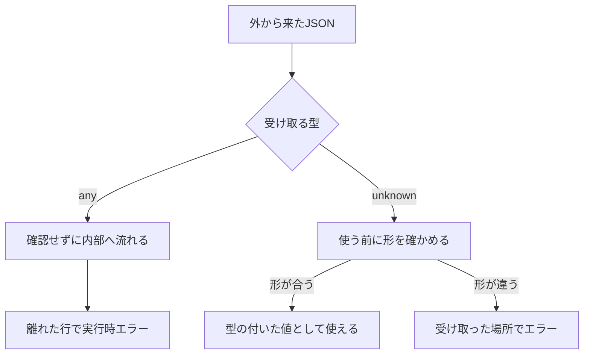

```ts
const data: any = await response.json();
console.log(data.user.profile.name);
```

このコードに型エラーはありません。しかし、レスポンスに`profile`がなければ、実行時に`Cannot read properties of undefined (reading 'name')`で停止します。

原因は、レスポンスに`profile`がなかったことです。それを実行時まで検出できなかったのは、1行目の`any`によってTypeScriptの検査を止めたためです。

では `any` の代わりに何を書くのか。`unknown` です。置き換えるとコンパイルが通らなくなります。通らなくなることが、この型の仕事です。

## `any` は「中身を調べない」と書いている

`any` を付けた値に対して、TypeScriptは確認をやめます。どんな操作でも通ります。

```ts
const data: any = await response.json();

data.user.profile.name; // 通る
data(); // 通る
const count: number = data; // 通る
```

プロパティをいくつ辿っても、関数として呼んでも、数値の変数に入れても、エラーになりません。`data` の中身がオブジェクトだろうと文字列だろうと、結果は同じです。

だから冒頭のコードは通りました。`profile` があるかどうかを、どこでも確認していなかった。

## `any` の影響は、その1行では終わらない

`any` から取り出した値も `any` になります。影響が1行に収まりません。

```ts
const config: any = JSON.parse(raw);

const timeout = config.timeout; // any
const limit = timeout * 1000; // any
const limits: number[] = [];
limits.push(limit); // 通る
```

`config.timeout` が `any` で、`any * 1000` も `any`。そして `any` は `number` の配列に入れられます。

もし `timeout` の中身が `"30s"` という文字列だったら、`limits` は型の上では `number[]` なのに、中身に文字列が混ざった配列になります。`limits.reduce((a, b) => a + b, 0)` は `"030s"` を返す。

不具合に気づくのは、この `reduce` を書いた行です。原因があるのは、`JSON.parse` を `any` で受けた行。**`any` はエラーを消すのではなく、エラーが出る場所を原因から引き離します。**

## `unknown` は「まだ調べていない」と書く型

`unknown` も、どんな値でも受け取ります。違うのは、受け取ったあとに何もさせないことです。

```ts
const data: unknown = await response.json();

console.log(data.user.profile.name);
//          ~~~~ 'data' is of type 'unknown'.
```

プロパティを読もうとした時点で止まります。他の型に渡すこともできません。

```ts
const count: number = data;
//    ~~~~~ Type 'unknown' is not assignable to type 'number'.
```

2つを並べると、差は受け取ったあとだけです。

| | 何でも代入できる | 中身をすぐ使える | 他の型の変数に渡せる |
| --- | --- | --- | --- |
| `any` | できる | できる | できる |
| `unknown` | できる | できない | できない |

**`any` は「調べない」と書くこと、`unknown` は「まだ調べていない」と書くことです。**

`unknown` にするとエラーが増えたように見えます。増えたのはエラーではなく、確認を書く場所です。



その「形を確かめる」の書き方を、次の4つで見ていきます。

## プリミティブなら `typeof` で足りる

文字列か数値かを知りたいだけなら、`typeof` の分岐で済みます。分岐の中では、その型として扱えます。

```ts
function toLabel(value: unknown): string {
  if (typeof value === "string") {
    return value; // ここでは string
  }
  if (typeof value === "number") {
    return value.toFixed(0); // ここでは number
  }
  return "(不明)";
}
```

`if` を抜けた先で `value.toFixed()` を書くとエラーになります。数値だと確かめた範囲の中だけで、数値として使える。

## オブジェクトは `null` とプロパティを順に確かめる

オブジェクトを相手にすると、確認が3つに増えます。`typeof` が `"object"` であること、`null` でないこと、目的のプロパティがあること。

```ts
function getUserName(data: unknown): string | null {
  if (typeof data !== "object" || data === null) {
    return null;
  }
  if (!("name" in data) || typeof data.name !== "string") {
    return null;
  }
  return data.name;
}
```

`null` の確認が要るのは、`typeof null` が `"object"` を返すからです。飛ばすと `in` の行でエラーになります。

```ts
if (typeof data === "object" && "name" in data) {
  //                            ~~~~~~~~~~~~~~
  // data が null の可能性が残っている
}
```

ここまでは手で書けます。ただ `data.user.profile.name` のように階層が深いと、同じ確認を階層ごとに繰り返すことになります。2階層を超えたら手書きはやめたほうが早い。

## 同じ形を何度も使うなら、検査を関数に切り出す

同じ確認を何度も書くなら、関数にまとめられます。戻り値の型に `value is User` と書くと、「この関数が `true` を返したら、引数は `User` として扱ってよい」という意味になります。型述語（type predicate）と呼ばれる書き方です。

```ts
type User = { id: number; name: string };

function isUser(value: unknown): value is User {
  if (typeof value !== "object" || value === null) return false;
  if (!("id" in value) || typeof value.id !== "number") return false;
  if (!("name" in value) || typeof value.name !== "string") return false;
  return true;
}
```

呼び出し側は1行で済みます。

```ts
const data: unknown = await response.json();

if (!isUser(data)) {
  throw new Error("Userの形ではありません");
}
console.log(data.name); // ここでは User
```

ここに落とし穴があります。`value is User` が本当かどうかを、TypeScriptは確認しません。

```ts
function isUser(value: unknown): value is User {
  return true; // これも通る
}
```

`unknown` は確認を書くよう要求する型ですが、型述語はその要求を黙らせる方法にもなります。`User` にプロパティを1つ足したとき、この関数を直すのは書いた人の仕事です。忘れれば、`any` に戻ったのと同じことになります。

## 階層があるならスキーマに任せる

プロパティが増えたり階層が深くなったりしたら、検査を手で書くのをやめます。スキーマから型を導くライブラリに任せると、宣言と検査が1か所にまとまります。

zodならこう書きます。

```ts
import * as z from "zod";

const UserSchema = z.object({
  id: z.number(),
  name: z.string(),
  profile: z.object({
    displayName: z.string(),
  }),
});

const user = UserSchema.parse(await response.json());
console.log(user.profile.displayName);
```

`parse` は形が合えば値を返し、合わなければ例外を投げます。`user` には型が付いているので、その先は普通のオブジェクトとして扱えます。

前のセクションで手で書いた `User` 型と `isUser` 関数も、これ1つに置き換わります。

```ts
type User = z.infer<typeof UserSchema>;
```

冒頭のコードに本当に必要だったのは、これでした。

4つを並べると、選び方は確かめる形の複雑さで決まります。

| 確かめたいもの | 使うもの |
| --- | --- |
| 文字列か数値か | `typeof` |
| プロパティ1〜2個 | `in` で1つずつ |
| 同じ形を何度も使う | 検査関数（型述語） |
| 階層のあるAPIレスポンス | スキーマライブラリ |

## 確かめた型を並べたら、`never` が処理漏れを教える

形が確かめられたら、次は分岐です。ここで効くのが `never` で、「ここに届く値はもう存在しない」を表す型です。

```ts
type Result =
  | { status: "ok"; value: string }
  | { status: "error"; message: string };

function render(result: Result): string {
  switch (result.status) {
    case "ok":
      return result.value;
    case "error":
      return `エラー: ${result.message}`;
    default: {
      const rest: never = result;
      throw new Error(`未対応のstatus: ${JSON.stringify(rest)}`);
    }
  }
}
```

`ok` と `error` を処理し終えると、`default` に残る値はありません。だから `result` を `never` の変数に入れられます。

価値が出るのは、あとから選択肢が増えたときです。

```ts
type Result =
  | { status: "ok"; value: string }
  | { status: "error"; message: string }
  | { status: "loading" };
```

型をこう足すだけで、`default` の行がエラーになります。`loading` が処理されずに残っているからです。**型を1つ足したことと、処理を書き忘れた場所が、その場で結び付きます。**

`any` にすると、この仕組みは動きません。

```ts
function render(result: any): string {
  switch (result.status) {
    case "ok":
      return result.value;
    case "error":
      return `エラー: ${result.message}`;
    default: {
      const rest: never = result;
      //    ~~~~ Type 'any' is not assignable to type 'never'.
      throw new Error("未対応のstatus");
    }
  }
}
```

`any` は絞り込んでも `any` のままなので、`default` に届く値も `any` です。そして `any` を代入できない型は `never` だけです。全部処理していてもエラーになるので、チェックとして使えません。

## `catch` の変数も `unknown` になる

`strict` を有効にしていると、`catch` で受け取る値は `unknown` です。

```ts
try {
  await save(order);
} catch (error) {
  console.log(error.message);
  //          ~~~~~ 'error' is of type 'unknown'.
}
```

理由は、JavaScriptが何でも `throw` できることです。`Error` でも、文字列でも、`undefined` でも投げられます。依存ライブラリの奥で `throw "timeout"` と書かれていたら、`error.message` は `undefined` になる。

定型はこれです。

```ts
try {
  await save(order);
} catch (error) {
  const message = error instanceof Error ? error.message : String(error);
  logger.error(message);
}
```

`catch (error: any)` と書けば赤線は消えます。ただ、文字列が投げられたときに `undefined` をログに書き込む動作は変わりません。

## `any` を書いていい場面

`any` は禁止語ではありません。`unknown` では書けない場所があります。

代表がジェネリクスの制約です。

```ts
declare function memoize<F extends (...args: any[]) => any>(fn: F): F;

const greet = (name: string): void => console.log(name);
const memoized = memoize(greet); // OK
```

ここを `(...args: unknown[]) => unknown` にすると、`greet` を渡せなくなります。引数の型は代入の向きが逆に判定されるので、「`unknown` を受け取る関数」の位置に「`string` しか受け取らない関数」は置けないからです。「関数なら何でも」と書きたいときは `any[]` を使います。

もう1つは、ライブラリの型定義が実装とずれているときの回避です。範囲を最小にして、理由と行き先をコメントに残します。

```ts
// legacy-sdkの型定義が実装とずれている。v3移行で解消 (#1284)
const client = createClient(options) as any;
```

`any` が困るのは、それが調査を後回しにする省略として使われて、範囲も期限も書かれていないときです。

## どこから手を付けるか

既存のコードから `any` を全部消そうとすると終わりません。外から値が入ってくる場所に絞ると、少ない変更で効きます。

- `fetch` のレスポンス（`response.json()` は `any` を返す）
- `JSON.parse`
- `localStorage` から読んだ文字列をパースしたもの
- `postMessage` で受け取るデータ
- フォームの入力値
- 型定義のないライブラリの戻り値

この6か所を `unknown` にすると、確認を書かないかぎりコンパイルが通らなくなります。あとは `typeof` で済むのか、スキーマが要るのかを1つずつ決めるだけです。

いま残っている `any` の一覧が見たいときは、`@typescript-eslint/no-explicit-any` を有効にしてください。`strict: true` が止めるのは暗黙の `any` だけで、自分の手で書いた `any` を見つけるのはlintの仕事です。

---

冒頭のコードに戻ります。

```ts
const data: unknown = await response.json();
```

書き換えただけでは `data.user.profile.name` は動きません。動かすには、`profile` があることを確かめる行が要ります。

面倒が増えたわけではありません。サーバーが本当にその形を返すかは、TypeScriptには分からない。分からないことを分からないと書いておいて、確認を書かせるのが `unknown` の役目です。

3つを並べると、役割が分かれます。

- `unknown`「まだ調べていない」→ 調べさせる
- `never`「もう残っていない」→ 漏れを教える
- `any`「調べない」→ 何も言わない

前の2つはコンパイラに仕事をさせる型で、`any` はコンパイラを黙らせる型です。

型エラーを消したいのか、バグを見つけたいのか。それで選ぶものが変わります。

## 参考資料

- [TypeScript Handbook: unknown](https://www.typescriptlang.org/docs/handbook/2/functions.html#unknown)
- [TypeScript Handbook: any](https://www.typescriptlang.org/docs/handbook/2/everyday-types.html#any)
- [TypeScript Handbook: Narrowing](https://www.typescriptlang.org/docs/handbook/2/narrowing.html)
- [TypeScript Handbook: Using type predicates](https://www.typescriptlang.org/docs/handbook/2/narrowing.html#using-type-predicates)
- [TypeScript Handbook: Exhaustiveness checking](https://www.typescriptlang.org/docs/handbook/2/narrowing.html#exhaustiveness-checking)
- [TSConfig: useUnknownInCatchVariables](https://www.typescriptlang.org/tsconfig#useUnknownInCatchVariables)
- [typescript-eslint: no-explicit-any](https://typescript-eslint.io/rules/no-explicit-any/)
- [Zod: Basic usage](https://zod.dev/basics)
