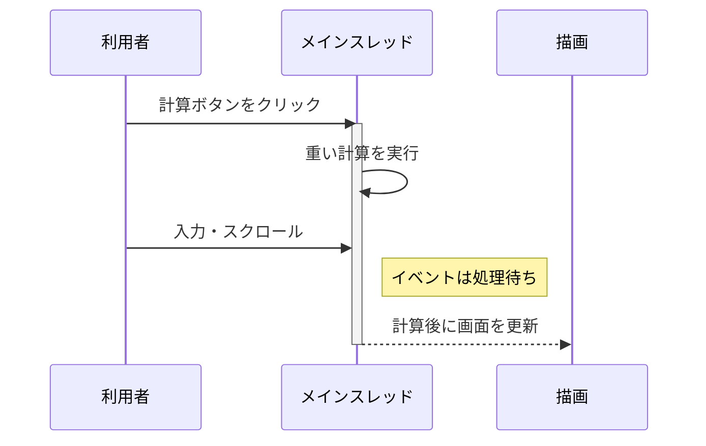

画面上で大量のデータを集計したり、画像を加工したりすると、ボタンを押した直後からページが反応しなくなることがあります。処理結果は正しく返ってくるのに、計算中はスクロールも入力もできません。

このような場面で候補になるのがWeb Workerです。

重い処理をWorkerへ移す一番の目的は、計算時間を短くすることではありません。**画面を担当するメインスレッドを空け、操作への反応を保つこと**です。

この記事ではブラウザのDedicated Workerを使い、同じ計算をメインスレッドとWorkerで実行します。`async/await`との違いや、Workerへ移さない方がよい処理まで見ていきます。

## 重い計算が続く間、メインスレッドは画面を更新できない

ブラウザのメインスレッドは、JavaScriptの実行だけを担当しているわけではありません。クリックやキー入力を受け取り、DOMの変更を反映し、レイアウトや描画を進めます。

メインスレッドが一つのJavaScriptタスクを実行している間、その途中に別のイベント処理を割り込ませることはできません。クリックされても、実行中のタスクが終わるまでイベントは待たされます。DOMを書き換えても、画面へ反映されるのはブラウザが描画へ進めるようになってからです。



Chrome DevToolsなどでは、50ミリ秒を超えるタスクをLong Taskとして確認できます。50ミリ秒は「ここまでは安全」という保証値ではありません。短い停止でも連続すれば操作感は悪くなりますが、メインスレッドを長く占有している場所を探す手掛かりになります。

まずは、指定した上限までに素数がいくつあるか数えるコードを、メインスレッドで動かしてみます。

```html:index.html
<label>
  素数を探す上限
  <input id="limit" type="number" value="5000000" />
</label>
<button id="run">計算する</button>

<label>
  計算中の動作確認
  <input type="text" placeholder="ここへ文字を入力" />
</label>

<p id="status">待機中</p>
<script type="module" src="./main.js"></script>
```

ローカルで試すときは`index.html`を直接開かず、開発サーバーから配信します。Workerのスクリプトも、ページと同じ場所から読み込めるようにします。

```js:main.js
const limitInput = document.querySelector("#limit");
const runButton = document.querySelector("#run");
const status = document.querySelector("#status");

runButton.addEventListener("click", () => {
  const limit = Number(limitInput.value);
  const startedAt = performance.now();

  status.textContent = "計算中...";
  const count = countPrimes(limit);

  const elapsed = Math.round(performance.now() - startedAt);
  status.textContent = `${count}個の素数を発見（${elapsed}ms）`;
});

function countPrimes(limit) {
  let count = 0;

  for (let candidate = 2; candidate <= limit; candidate += 1) {
    let isPrime = true;

    for (
      let divisor = 2;
      divisor * divisor <= candidate;
      divisor += 1
    ) {
      if (candidate % divisor === 0) {
        isPrime = false;
        break;
      }
    }

    if (isPrime) count += 1;
  }

  return count;
}
```

上限を十分に大きくすると、計算中は別の入力欄へ文字を打っても表示されません。`status`へ「計算中...」を代入しているのに、その文字すら見えない場合があります。同じタスク内ですぐ計算を始めるため、ブラウザが描画する番を得られないからです。

計算量は端末によって調整してください。長時間固まる値を試す前に、未保存の入力がないことも確認しておきます。

## `async/await`に変えても、計算場所はメインスレッドのまま

「関数を`async`にすれば固まらないのでは」と考えたくなります。しかし、`async/await`はCPUを使う処理を別スレッドへ移す仕組みではありません。

```js
async function run() {
  await Promise.resolve();

  // この計算は引き続きメインスレッドで動く
  const count = countPrimes(5_000_000);
  return count;
}
```

`await`に到達すると、その関数はいったん中断し、Promiseの完了後に続きを実行します。通信やタイマーのように「待っている間、CPUですることがない処理」には有効です。一方、再開後の`countPrimes()`は同期的な計算です。完了するまでメインスレッドを使い続けます。

非同期と並列は、解決する問題が違います。

| 手段 | 主に解決すること | CPUを使う計算の実行場所 |
| --- | --- | --- |
| `Promise`、`async/await` | 通信などの完了を待ち、後続処理をつなぐ | 通常はメインスレッド |
| 処理の分割 | 計算の途中でイベントや描画へ順番を譲る | メインスレッド |
| Web Worker | UIから独立した処理を別スレッドで動かす | Workerスレッド |

途中結果が必要な処理なら、計算を小さく分けてメインスレッドへ順番を返す方法もあります。ただし、計算全体をUIから切り離せるなら、Workerの方が責務を分けやすくなります。

## Workerへ移すと、計算中もメインスレッドが動ける

Dedicated Workerは、作成元のスクリプトが専用で使うWorkerです。メインスレッドとは別の実行環境を持ち、両者は`postMessage()`でデータを渡します。

:::message
この記事で扱うWorkerはDedicated Workerです。通信の中継やオフライン対応に使うService Workerとは、主な役割とライフサイクルが異なります。
:::

先ほどの`countPrimes()`を`prime.worker.js`へ移します。

```js:prime.worker.js
self.addEventListener("message", (event) => {
  const { limit } = event.data;
  const count = countPrimes(limit);

  self.postMessage({ count });
});

function countPrimes(limit) {
  let count = 0;

  for (let candidate = 2; candidate <= limit; candidate += 1) {
    let isPrime = true;

    for (
      let divisor = 2;
      divisor * divisor <= candidate;
      divisor += 1
    ) {
      if (candidate % divisor === 0) {
        isPrime = false;
        break;
      }
    }

    if (isPrime) count += 1;
  }

  return count;
}
```

メインスレッド側ではWorkerを一度作り、ボタンが押されたら上限値を送ります。

```js:main.js
const limitInput = document.querySelector("#limit");
const runButton = document.querySelector("#run");
const status = document.querySelector("#status");

const worker = new Worker(
  new URL("./prime.worker.js", import.meta.url),
  { type: "module" },
);

let startedAt = 0;

runButton.addEventListener("click", () => {
  const limit = Number(limitInput.value);

  startedAt = performance.now();
  runButton.disabled = true;
  status.textContent = "計算中...";
  worker.postMessage({ limit });
});

worker.addEventListener("message", (event) => {
  const { count } = event.data;
  const elapsed = Math.round(performance.now() - startedAt);

  status.textContent = `${count}個の素数を発見（${elapsed}ms）`;
  runButton.disabled = false;
});

worker.addEventListener("error", () => {
  status.textContent = "計算に失敗しました";
  runButton.disabled = false;
});
```

`worker.postMessage()`は、計算結果が返るまで待ちません。クリックのイベント処理はそこで終わり、メインスレッドは「計算中...」の描画や、別の入力、スクロールを処理できます。素数の計算はWorkerスレッドで進み、完了すると`message`イベントで結果が戻ります。

メインスレッド版より合計時間が短くなるとは限りません。Workerの準備と通信にも時間がかかるからです。それでも計算中に画面を操作できるなら、利用者が感じる待ち時間は変わります。

なお、Worker内から`document.querySelector()`を呼ぶことはできません。Workerはページの`window`やDOMへ直接アクセスできないため、画面の更新は結果を受け取ったメインスレッドが担当します。この制約が、UIと計算の境界にもなります。

## 大きなデータを渡すと、通信コストを無視できない

`postMessage()`で渡したオブジェクトは、多くの場合、構造化クローンアルゴリズムによって複製されます。メインスレッドとWorkerが同じオブジェクトを直接共有するわけではありません。

数値を一つ渡す先ほどの例では、複製コストはほとんど問題になりません。数十MBの画像データや大きな配列を何度も往復させる設計では、計算よりデータの受け渡しに時間がかかる可能性があります。

`ArrayBuffer`など一部のデータは、コピーせず所有権を移すTransferable Objectsとして渡せます。

```js
const buffer = new ArrayBuffer(10 * 1024 * 1024);

worker.postMessage({ buffer }, [buffer]);

console.log(buffer.byteLength); // 0
```

転送後の`buffer`は、送信側で使えません。複製を避けられる代わりに、どちらがデータを所有するのかを明確にする必要があります。

Workerを使うときは、次のコストも見積もります。

- Workerの作成とスクリプトの読み込み
- メッセージを組み立て、受け取る処理
- データの複製または所有権の移動
- エラー、キャンセル、進捗通知の設計
- 複数Workerが同時に動く場合のCPU競合

短い処理のたびにWorkerを作り直すより、同じ種類の計算で再利用する方が起動コストを抑えられます。Workerの数を増やせば、その分だけ速くなるとも限りません。利用できるCPUには上限があり、ほかのタブやアプリとも共有しているためです。

## Workerに向くのは、UIから切り離せる重い処理

Workerへ移しやすいのは、入力を渡せば、DOMを触らずに結果を返せる処理です。

たとえば、次の処理が候補になります。

- 画像の変換や画素ごとのフィルター
- 大量データの検索、並べ替え、集計
- 圧縮と展開
- 暗号化やハッシュ計算
- 構文解析、シミュレーション

反対に、短時間で終わる計算へWorkerを追加しても、コードと通信が増えるだけかもしれません。DOM操作が中心の処理も、そのままではWorkerへ移せません。HTTPレスポンスを待つことが中心なら、まずは`fetch()`と`async/await`で十分です。

| 確認すること | Workerを検討しやすい状態 |
| --- | --- |
| CPUを長く使っているか | PerformanceパネルでLong Taskになっている |
| UIへ影響しているか | 入力、クリック、描画が遅れる |
| DOMから分離できるか | 入力と結果をメッセージで表せる |
| 通信量は妥当か | 計算に比べ、データ転送が小さい |

三つ目まで当てはまれば、Workerへ移す価値があります。四つ目で通信量が大きい場合は、Transferable Objectsやデータ形式も含めて設計します。

最初からWorkerを入れる必要はありません。Chrome DevToolsのPerformanceパネルなどで計測し、メインスレッドを長く占有している処理を特定してから移します。比較では計算の合計時間に加え、実行中に入力や描画が止まっていないかも確認します。

## Workerは高速化装置ではなく、UIを守る分業手段

`async/await`は、待ち時間を扱いやすくします。しかし、CPUを使い続ける計算の実行場所は変えません。計算中も画面を反応させたいなら、処理を小さく分けて順番を譲るか、Workerスレッドへ移す必要があります。

Workerへ移すと、起動や通信のコストが増えます。それでも、重く独立した計算をメインスレッドから外せば、入力や描画を待たせずに済みます。

ブラウザにおいてメインスレッドは、画面を動かすための限られた実行場所です。Workerを使うか迷ったら、「計算が速くなるか」と**その計算中も画面が反応する必要があるか**の両方を考えると判断しやすくなります。

## 参考資料

- [Using Web Workers（MDN）](https://developer.mozilla.org/en-US/docs/Web/API/Web_Workers_API/Using_web_workers)
- [The structured clone algorithm（MDN）](https://developer.mozilla.org/en-US/docs/Web/API/Web_Workers_API/Structured_clone_algorithm)
- [Transferable objects（MDN）](https://developer.mozilla.org/en-US/docs/Web/API/Web_Workers_API/Transferable_objects)
- [Optimize long tasks（web.dev）](https://web.dev/articles/optimize-long-tasks)
- [Web workers（HTML Living Standard）](https://html.spec.whatwg.org/multipage/workers.html)
