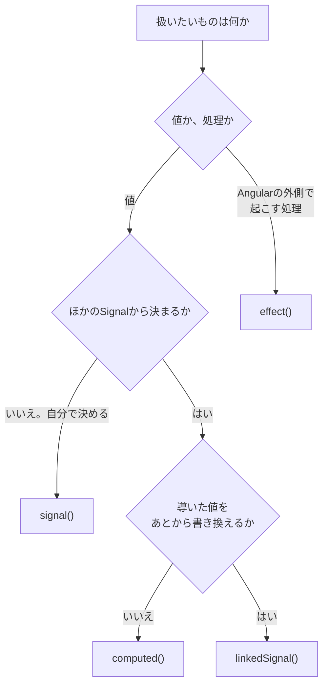

Angularのコンポーネントで数量を持つとき、いまは次のように書きます。

```ts
quantity = signal(1);
```

少し前までは、ただのプロパティでした。

```ts
quantity = 1;
```

違いは`signal()`で包んだかどうか。それだけに見えます。

私も最初は「書き方が変わっただけでしょ」と思っていました。違いました。この2つは、持っている機能そのものが別物です。

`quantity = 1`が持つのは値だけです。書き換えても、そのことは誰にも伝わりません。画面を更新すべきかどうかは、Angularが別の方法で調べます。

`signal(1)`では、値の保持と変化の通知がひとつになっています。テンプレートで`quantity()`と読むと、Angularは「この表示は`quantity`に依存している」と記録します。値が変われば、記録した場所だけを更新できます。

この違いが効いてくるのが、Angular 21以降の新規プロジェクトで既定になったZonelessです。

Zonelessでは、Angularが非同期処理を見張っていません。「ここが変わった」という通知を受け取って、はじめて画面を更新します。そして、その通知を出せるのがSignalです。状態をSignalで持つのが前提になったのは、そういう事情でした。

Signalの基本は3つあります。

- `signal()`は、自分で読み書きする値を持ちます
- `computed()`は、ほかのSignalから値を導きます
- `effect()`は、Signalの変化に合わせて、Angularの外側の処理を動かします

この記事では、Angular 22を前提に、この3つを順に見ていきます。あわせて、3つのどれでもない場面のための`linkedSignal()`と`resource()`にも触れます。読み終えると、目の前の状態をどのAPIで持つべきか、迷わず決められるようになります。

## `signal()`で状態を持つ

もっとも基本的なSignalが`signal()`です。値を保持して、変化を通知します。買い物カゴの単価と数量を持たせてみます。

```ts:src/app/cart.ts
import { Component, signal } from '@angular/core';

@Component({
  selector: 'app-cart',
  template: `
    <p>単価: {{ price() }}円</p>
    <p>数量: {{ quantity() }}個</p>
    <button (click)="increment()">増やす</button>
    <button (click)="reset()">リセット</button>
  `,
})
export class Cart {
  protected readonly price = signal(500);
  protected readonly quantity = signal(1);

  increment(): void {
    this.quantity.update((n) => n + 1);
  }

  reset(): void {
    this.quantity.set(1);
  }
}
```

`signal(500)`と書くと、初期値`500`を持つSignalができます。フィールド自体は`readonly`です。Signalという入れ物を差し替えることはなく、書き換えるのは中の値だけだからです。テンプレートからは`protected`なフィールドも読めるため、コンポーネントの外へ公開する必要がなければ`protected`にしておきます。

### この`()`、ただの飾りじゃない

値を読むときは、関数のように`()`を付けます。テンプレートでも`{{ price() }}`と書きます。

この`()`は、単なる記法ではありません。読み取りのたびに、Angularは「いまどこがこの値を読んだか」を記録しています。テンプレートが`price()`を読めば、そのテンプレートが`price`の利用者として登録されます。あとで`price`が変われば、Angularは登録された場所だけを更新できます。

`()`を付け忘れると、値ではなくSignal自体を扱ってしまいます。Signalは関数なので、条件式に置くと常に真になります。

```ts
if (this.quantity) {
  // 関数オブジェクトは常に真。数量が0でもここへ入る
}

if (this.quantity() > 0) {
  // 意図した比較
}
```

### 書き換えは`set()`と`update()`

書き換えの手段は2つです。`set(値)`は新しい値をそのまま設定し、`update(関数)`は現在の値を受け取って新しい値を返します。

数量を1増やすように、いまの値を使う更新には`update()`が向きます。`set(this.quantity() + 1)`とも書けますが、1行の中に読み取りと書き込みが混ざります。`update((n) => n + 1)`のほうが、何をしたいかがはっきりします。

### `push()`しても画面が変わらない

配列やオブジェクトをSignalに入れたときは、中身を直接書き換えないでください。

```ts
protected readonly items = signal<string[]>([]);

add(name: string): void {
  // 新しい配列へ差し替える
  this.items.update((current) => [...current, name]);
}
```

中身を直接変える`this.items().push(name)`では、追加が画面へ伝わりません。Signalは、新しい値が現在の値と等しいかどうかを確かめてから通知します。既定の判定は`Object.is`です。配列やオブジェクトは参照の同一性で比べられるため、`push()`で中身だけを変えても参照は同じままです。Angularから見れば、何も変わっていません。

新しい配列やオブジェクトへ差し替えれば参照が変わり、通知が飛びます。

### 書き込みをサービスの内側に閉じる

状態をサービスから配る場合は、書き込みできるSignalをそのまま公開せず、`asReadonly()`で読み取り専用の顔を渡せます。

```ts:src/app/cart-store.ts
import { Injectable, signal } from '@angular/core';

@Injectable({ providedIn: 'root' })
export class CartStore {
  private readonly _quantity = signal(1);
  readonly quantity = this._quantity.asReadonly();

  increment(): void {
    this._quantity.update((n) => n + 1);
  }
}
```

利用側は`store.quantity()`で現在値を読めますが、`set()`は呼べません。値を変える経路は`increment()`だけになります。状態の更新箇所を1か所へまとめたいときに使います。

## `computed()`でほかの値から導く

単価と数量が決まれば、合計も決まります。こうした「ほかの値から決まる値」は`computed()`で書きます。

```ts:src/app/cart.ts
import { Component, computed, signal } from '@angular/core';

@Component({
  selector: 'app-cart',
  template: `
    <p>単価: {{ price() }}円</p>
    <p>数量: {{ quantity() }}個</p>
    <p>合計: {{ total() }}円</p>
    <button (click)="increment()">増やす</button>
  `,
})
export class Cart {
  protected readonly price = signal(500);
  protected readonly quantity = signal(1);
  protected readonly total = computed(() => this.price() * this.quantity());

  increment(): void {
    this.quantity.update((n) => n + 1);
  }
}
```

`computed()`に渡すのは、値を計算して返す関数です。関数の中で読んだSignalが、その`computed()`の依存になります。ここでは`price`と`quantity`です。どちらかが変われば、`total`も新しい値になります。

注目したいのは`increment()`です。数量を更新するだけで、合計には触れていません。合計の求め方は計算式として一度書いてあるので、状態を増やしても、この行を直す必要はありません。

### 書き込めないのは、うれしいこと

`computed()`が返すのは読み取り専用のSignalです。`set()`も`update()`もありません。

```ts
this.total.set(3000); // 型エラー
```

不便に見えますか。私は逆だと思っています。これは制限ではなく、保証です。

`total`の値を決めるのは、宣言に書いた計算式ひとつだけ。ほかのどこかから別の値をねじ込む余地がありません。だから合計がおかしいとき、読みに行く場所は最初から1か所に決まっています。

### 読まれるまで、何もしない

`computed()`には、性能に関わる性質が2つあります。

ひとつは遅延評価です。`computed()`を作った時点では、計算は動きません。誰かが`total()`と読んだときに、はじめて計算されます。

もうひとつはメモ化です。一度計算した値は記憶され、依存するSignalが変わるまで再利用されます。テンプレートの3か所で`total()`を読んでも、掛け算が動くのは1回だけです。

そのため、`computed()`の中には重い計算も置けます。値が使われなければ動かず、依存が変わらなければ再計算されません。

### 依存は実際に読まれたものだけ

依存として記録されるのは、その回の計算で実際に読まれたSignalです。条件分岐で通らなかった側は、依存になりません。

```ts
protected readonly showTotal = signal(false);
protected readonly label = computed(() => {
  if (!this.showTotal()) {
    return '合計は非表示です';
  }
  return `合計: ${this.total()}円`;
});
```

`showTotal`が`false`のあいだ、`label`は`total`を読みません。この状態では`total`が変わっても`label`は再計算されません。必要な範囲だけが更新されます。

### `computed()`は重ねられる

`computed()`はほかの`computed()`からも作れます。値を段階的に導けます。

```ts
protected readonly subtotal = computed(() => this.price() * this.quantity());
protected readonly tax = computed(() => Math.floor(this.subtotal() * 0.1));
protected readonly total = computed(() => this.subtotal() + this.tax());
```

`quantity`を1つ増やすと、`subtotal`、`tax`、`total`が順に新しくなります。更新の順序を自分で管理する必要はありません。

計算式を分けておくと、テンプレートで小計だけを表示したり、税額の計算だけをテストしたりできます。ひとつの大きな`computed()`にまとめるより、意味のある単位で切るほうが扱いやすくなります。

## `effect()`でAngularの外側へ出す

`signal()`と`computed()`が値を扱うのに対し、`effect()`は処理を扱います。依存するSignalが変わったときに、決めた処理を実行します。

数量をブラウザーへ保存し、次の訪問時に復元したい場合を考えます。保存先の`localStorage`はAngularの管理外にあり、テンプレートでは表現できません。ここが`effect()`の出番です。

```ts:src/app/cart.ts
import { Component, effect, signal } from '@angular/core';

@Component({
  selector: 'app-cart',
  template: `<p>数量: {{ quantity() }}個</p>`,
})
export class Cart {
  protected readonly quantity = signal(1);

  constructor() {
    effect(() => {
      localStorage.setItem('cart-quantity', String(this.quantity()));
    });
  }

  increment(): void {
    this.quantity.update((n) => n + 1);
  }
}
```

`effect()`も、関数の中で読んだSignalを依存として記録します。ここでは`quantity`です。数量が変わるたびに、保存処理が実行されます。

`effect()`を作るには、注入コンテキストが必要です。依存の登録と破棄をAngularへ任せるためです。もっとも簡単な満たし方は、コンポーネント、ディレクティブ、サービスのコンストラクター内で呼ぶことです。コンストラクターの外で作る必要があるなら、`injector`オプションへ`Injector`を渡します。

### 何に使うか

公式ドキュメントは、`effect()`をSignalの状態を命令的なAPIへ同期させるためのものと位置づけています。挙げられているのは次のような用途です。

- 分析やデバッグのために、Signalの値をログへ出す
- `localStorage`、セッションストレージ、Cookieなどとデータを同期する
- テンプレートの記法では書けないDOMの操作を加える
- `<canvas>`要素やチャートライブラリなど、外部のUIライブラリへ描画する

どれも行き先がAngularの外側にあります。Signalの値を、Signalを知らない相手へ渡す。それが`effect()`の役目です。

### 後始末は`onCleanup`

`effect()`のコールバックは`onCleanup`を受け取ります。ここへ登録した処理は、次の実行が始まる直前と、`effect()`が破棄されるときに呼ばれます。タイマーやイベントリスナーの停止に使います。

```ts
effect((onCleanup) => {
  const id = setInterval(() => {
    console.log(this.quantity());
  }, 1000);

  onCleanup(() => clearInterval(id));
});
```

始めた処理を止めないままにすると、依存が変わるたびにタイマーが増え、コンポーネントが消えたあとも動き続けます。`effect()`の中で何かを開始したら、同じ場所に停止も書きます。

### 破棄は自動

コンポーネントのコンストラクターで作った`effect()`は、そのコンポーネントが破棄されるときに一緒に破棄されます。`ngOnDestroy`で片付ける必要はありません。自分のタイミングで止めたい場合は、戻り値の`EffectRef`の`destroy()`を呼びます。

### `set()`の直後には走らない

`effect()`は、Signalを書き換えた瞬間には実行されません。

```ts
this.quantity.set(5);
// この行の時点では、まだ effect は動いていない
```

コンポーネント内で作った`effect()`は、Angularの同期処理（変更検知）のなかで、コンポーネントのライフサイクルイベントとして実行されます。ルートで作った`effect()`はマイクロタスクとして動き、コンポーネントツリーや変更検知とは無関係です。

そのため、`set()`のあとに`effect()`の結果を前提とした処理は書けません。短い間に何度も`set()`すれば、実行が1回にまとまることもあります。`effect()`が保証するのは「変化のたびに必ず1回動く」ことではありません。「変化したあと、いずれ最新の状態で動く」ものとして扱ってください。

## 3つの使い分けは値の決まり方で決まる

3つのAPIがそろいました。選び方は、扱いたいものがどう決まるかで判断できます。

- その値を自分で決めるなら`signal()`
- ほかの値から決まるなら`computed()`
- 値ではなく、Angularの外側で起こしたい処理なら`effect()`

図にすると、判断は多くても2回で済みます。



表にすると次のようになります。

| 値の決まり方 | 使うAPI | 書き換え | 例 |
| --- | --- | --- | --- |
| 自分で決める | `signal()` | できる | 入力された数量、開いているタブ |
| ほかのSignalから決まる | `computed()` | できない | 合計金額、絞り込み後の一覧 |
| ほかのSignalから決まるが、書き換えもする | `linkedSignal()` | できる | 一覧の選択行、既定値つきの入力 |
| 値ではなく、外側への処理 | `effect()` | — | 保存、ログ、canvasへの描画 |

迷いやすいのは最初の分岐です。値か処理かを確かめるには、その結果をテンプレートで表示するかどうかを考えてみてください。表示するなら値です。表示しないのであれば、行き先はAngularの外側にあるはずです。

## いちばんやりがちな間違い

Signalを覚えたあと、私が最初に書いたのがこれでした。合計を`signal()`で持って、`effect()`で埋める形です。

```ts:src/app/cart.ts
// 避けたい形
export class Cart {
  protected readonly price = signal(500);
  protected readonly quantity = signal(1);
  protected readonly total = signal(0);

  constructor() {
    effect(() => {
      this.total.set(this.price() * this.quantity());
    });
  }
}
```

動きます。数量を増やせば、合計もちゃんと変わる。だからこそ厄介でした。

それでも`computed()`へ直すべき理由が、3つあります。

まず、初期値が一度表示されます。`total`の初期値は`0`です。`effect()`が動くのは変更検知のタイミングなので、最初の描画では合計が`0`と表示され、そのあとで`500`へ変わります。金額が一瞬ちらつきます。

次に、`total`は誰でも書き換えられます。書き込み可能なSignalなので、ほかのメソッドから`this.total.set(9999)`と書けます。計算式と矛盾する値が入っても、型では防げません。合計がおかしいとき、原因を探す範囲がコンポーネント全体へ広がります。

そして、値の決まり方が宣言から読めません。`total = signal(0)`という行は、合計が単価と数量から決まることを何も語っていません。依存関係はコンストラクターの中に隠れています。読む人は`effect()`を見つけるまで、`total`が何から決まるのかわかりません。

`computed()`へ直せば、3つとも消えます。

```ts
protected readonly total = computed(() => this.price() * this.quantity());
```

初期値がないのでちらつきません。`set()`がないので書き換えられません。計算式が宣言の場所にあるので、依存関係は1行を読めばわかります。

公式ドキュメントも、この形をはっきり避けるよう求めています。状態の伝播に`effect()`を使うと、`ExpressionChangedAfterItHasBeenChecked`エラー、無限の循環更新、不要な変更検知につながるためです。派生値には`computed()`を使ってください。

`effect()`の中で`set()`したくなったときは、多くの場合、置き場所が違います。目的別の対応は次のとおりです。

| `effect()`でやりたくなること | 本来の置き場所 |
| --- | --- |
| ほかのSignalから値を計算して入れる | `computed()` |
| 計算した値を入れつつ、ユーザーの操作でも書き換える | `linkedSignal()` |
| Signalの変化に応じてサーバーから取得する | `resource()`、`httpResource()` |
| `Observable`の最新値をSignalとして読む | `toSignal()` |
| ボタンやフォームの操作に反応して状態を変える | イベントハンドラー |

最後の行は見落としやすい点です。「クリックされたら状態を変える」処理に`effect()`は要りません。`(click)`から呼ばれるメソッドの中で`set()`すれば済みます。`effect()`が必要になるのは、変化の起点が自分の書いたイベントハンドラーではないときです。

## `linkedSignal()`で導いた値を書き換える

`computed()`は書き換えられません。ところが実際には、「ふつうは計算で決めたいが、ユーザーが選び直せるようにもしたい」値があります。

配送方法の選択がその例です。選択肢は商品や地域によって変わります。既定では先頭を選んでおきたい。それでも、ユーザーは別の方法を選べるべきです。

`signal()`で持つと、選択肢が入れ替わっても選択が古いまま残ります。`computed()`で持つと、ユーザーが選び直せません。この隙間を埋めるのが`linkedSignal()`です。

```ts:src/app/shipping-selector.ts
import { Component, input, linkedSignal } from '@angular/core';

@Component({
  selector: 'app-shipping-selector',
  template: `
    @for (option of options(); track option) {
      <button (click)="choose(option)">{{ option }}</button>
    }
    <p>選択中: {{ selected() }}</p>
  `,
})
export class ShippingSelector {
  readonly options = input<string[]>([]);

  protected readonly selected = linkedSignal(() => this.options()[0]);

  choose(option: string): void {
    this.selected.set(option);
  }
}
```

書き方は`computed()`と同じで、計算関数を渡します。違いは、結果を`set()`で上書きできる点です。

動きは2つの規則で決まります。`options`が変わると計算関数が動き直し、選択が先頭に戻ります。それ以外のときは、`set()`で入れた値が保たれます。「入力に連動してリセットされるが、操作でも書き換えられる」という状態を、そのまま表現できます。

上書きした選択を、選択肢が変わったあとも可能なかぎり残したい場合は、`source`と`computation`を分けて渡す書き方があります。直前の値を見て、残すか戻すかを自分で決められます。必要になったら、公式ドキュメントの`linkedSignal`のページを参照してください。

## サーバーからの取得は`resource()`に任せる

Signalの変化に応じてサーバーからデータを取る処理も、`effect()`の中に書きたくなる典型です。ここには専用のAPIがあります。

`resource()`は、非同期の取得結果と進行状態をまとめてSignalとして公開します。

```ts:src/app/product-search.ts
import { Component, resource, signal } from '@angular/core';

interface Product {
  id: string;
  name: string;
}

@Component({
  selector: 'app-product-search',
  template: `
    <input [value]="keyword()" (input)="updateKeyword($event)" />

    @if (products.isLoading()) {
      <p>検索中です</p>
    } @else if (products.error()) {
      <p>検索に失敗しました</p>
    } @else if (products.hasValue()) {
      <ul>
        @for (product of products.value(); track product.id) {
          <li>{{ product.name }}</li>
        }
      </ul>
    }
  `,
})
export class ProductSearch {
  protected readonly keyword = signal('');

  protected readonly products = resource({
    params: () => ({ keyword: this.keyword() }),
    loader: ({ params, abortSignal }) =>
      fetch(`/api/products?q=${encodeURIComponent(params.keyword)}`, {
        signal: abortSignal,
      }).then((response) => response.json() as Promise<Product[]>),
  });

  updateKeyword(event: Event): void {
    this.keyword.set((event.target as HTMLInputElement).value);
  }
}
```

`params`の中で読んだSignalが依存になります。`keyword`が変わると`loader`が動き直します。前の取得が終わっていなければ、`abortSignal`を通じて中止できます。

テンプレートは`isLoading()`、`error()`、`hasValue()`、`value()`を読んで表示を切り替えます。読み込み中の判定や、古いレスポンスの扱いを自分で書く必要はありません。

`HttpClient`を使うなら、インターセプターを通る`httpResource()`もあります。AngularのHTTPとSignalの組み合わせは論点が多いため、別記事『Angularでsubscribe()はいつ必要？』で詳しく扱っています。

## よくあるつまずき

### `()`を付け忘れる

条件分岐や計算でSignalを使うときは、必ず`()`を付けます。付け忘れるとSignal自体を扱うため、条件式は常に真になり、文字列連結には関数の定義がそのまま混ざります。

テンプレートでは`{{ quantity }}`と書いても値が出ないので気付けます。一方、TypeScript側の`if`文は、エラーを出さずに間違った分岐へ進みます。

### 配列やオブジェクトの中身を書き換える

`push()`や`obj.name = ...`のような更新は通知されません。既定の等値判定が参照で比べるためです。`update()`で新しい配列やオブジェクトへ差し替えます。

### `effect()`が期待どおりに走らない

依存になるのは、コールバックの中で同期的に読まれたSignalだけです。非同期の境界をまたいだあとの読み取りは追跡されません。

```ts
effect(async () => {
  await save();
  console.log(this.quantity()); // await のあとなので依存にならない
});
```

必要なSignalは`await`の前に読みます。

### `computed()`が更新されない

依存は、その回に実際に読まれたSignalだけです。条件分岐で読まれなかったSignalが変わっても、再計算は起きません。これは意図された動きですが、分岐の条件を見落とすと「更新されない」と見えます。分岐の中でどのSignalを読んでいるか確認してください。

## まとめ

- `signal()`は自分で決める値を持ちます。`()`で読み、`set()`と`update()`で書き換えます
- `computed()`はほかのSignalから決まる値を導きます。書き換えられず、読まれるまで計算しません
- `effect()`はAngularの外側への処理に使います。保存、ログ、外部ライブラリへの描画が主な用途です
- 導いた値を書き換えたいなら`linkedSignal()`、非同期の取得なら`resource()`を使います
- 派生値を`effect()`と`set()`で組み立てないでください。ちらつき、意図しない書き換え、依存の見えなさを招きます

冒頭の「書き方が変わっただけでしょ」に戻ります。

変わったのは書き方ではなく、値が自分の変化を伝えられるようになったことでした。そこさえ飲み込めば、あとの判断は1問です。

**この値は自分で決めるのか、ほかの値から決まるのか。**

決まるものは`computed()`へ置く。それだけ決めておけば、状態の置き場所はほとんど自動的に埋まります。

## 参考資料

- [Angular: Signals](https://angular.dev/guide/signals)
- [Angular: Dependent state with linkedSignal](https://angular.dev/guide/signals/linked-signal)
- [Angular: Async reactivity with resources](https://angular.dev/guide/signals/resource)
- [Angular: Side effects for non-reactive APIs](https://angular.dev/guide/signals/effect)
- [Angular: signal](https://angular.dev/api/core/signal)
- [Angular: effect](https://angular.dev/api/core/effect)
- [Angular: Zoneless](https://angular.dev/guide/zoneless)
