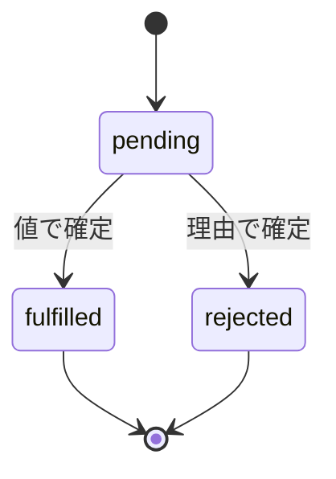
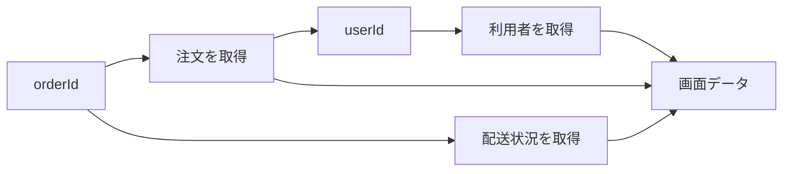

`then` の中で `return` を書き忘れて、次の行に `undefined` が流れてくる。

私はこれを、たぶん10回以上やっています。そのたびに「非同期って難しいな」と思っていたんですが、原因は非同期の難しさではありませんでした。Promiseが何なのかを、ふわっとしか掴んでいなかっただけです。

Promiseは、非同期処理そのものではありません。**後で届く1回分の結果**を受け渡すための、ただのオブジェクトです。

この区別がつくと、`return` 忘れも、`catch` によるエラーの握りつぶしも、いらない逐次実行も、目で見つけられるようになります。この記事では注文画面のデータ取得を題材に、値とエラーがどう流れていくかを追いかけます。

## 一度確定したら、もう変わらない

Promiseの状態は3つ。`pending` から `fulfilled` か `rejected` に移ったら、その結果は二度と変わりません。



| 状態 | 意味 | 利用側で受け取るもの |
| --- | --- | --- |
| `pending` | 結果がまだない | 待機中 |
| `fulfilled` | 成功した | 値 |
| `rejected` | 失敗した | エラーや失敗理由 |

実際に通信しているのはFetch APIですし、時間を測っているのはブラウザーやNode.jsです。Promiseはそれらの結果を、共通の形で扱うための契約にすぎません。

## `then` は元のPromiseに手を出さない

`then` が返すのは、新しいPromiseです。何を返したかで、その状態が決まります。

| コールバックの結果 | 次のPromise |
| --- | --- |
| 通常の値を `return` | その値で `fulfilled` |
| Promiseを `return` | そのPromiseの結果を引き継ぐ |
| 例外を `throw` | `rejected` |
| `return` しない | `undefined` で `fulfilled` |

注文と利用者を順に取ってくる例で見てみます。

```js
function fetchJson(url, label, { signal } = {}) {
  return fetch(url, { signal }).then((response) => {
    if (!response.ok) {
      throw new Error(`${label}の取得に失敗しました: HTTP ${response.status}`);
    }
    return response.json();
  });
}

function fetchOrderSummary(orderId) {
  return fetchJson(`/api/orders/${orderId}`, "注文")
    .then((order) =>
      fetchJson(`/api/users/${order.userId}`, "利用者")
        .then((user) => ({ order, user })),
    )
    .then(({ order, user }) => ({
      orderId: order.id,
      customerName: user.name,
      total: order.total,
    }));
}
```

利用者IDは注文の中にあるので、この2つの通信には順序があります。内側のPromiseを `return` しているから、次の `then` は利用者の取得完了まで待ってくれます。

1段ずつばらすと、何が受け渡されているかが見えます。

1. 最初の `fetchJson` は注文を表すPromiseを返す。
2. 1つ目の `then` は確定した注文を `order` として受け取る。
3. そのコールバックは利用者取得のPromiseを `return` するため、次のPromiseは利用者取得の完了までpendingになる。
4. 内側の `then` が `{ order, user }` を返し、2つ目の `then` の入力になる。
5. 最後のコールバックが画面用の要約を返し、`fetchOrderSummary` 全体の成功値になる。

ここで、途中のPromiseを `return` する意味を捉え直しておきたいです。あれは値を返しているだけではありません。「この処理の完了を、連鎖全体の完了条件に入れてくれ」という宣言です。

だから `return` を外すと、利用者の取得は裏で普通に走り続けます。外側の連鎖だけが、それを待たずに先へ行く。

```js
fetchJson("/api/orders/order-42", "注文")
  .then((order) => {
    fetchJson(`/api/users/${order.userId}`, "利用者"); // returnがない
  })
  .then((user) => {
    console.log(user); // undefined
  });
```

連鎖の途中で始めた非同期処理は、必ず `return` するか `await` する。Promiseを読むときの最重要チェックです。

## `async` / `await` でも、流れているものは同じ

`async` 関数は必ずPromiseを返します。値を `return` すれば `fulfilled`、例外を `throw` すれば `rejected`。`await` は、その関数の続きだけを結果が出るまで止めます。

```js
async function fetchOrderSummary(orderId, { signal } = {}) {
  const order = await fetchJson(
    `/api/orders/${orderId}`,
    "注文",
    { signal },
  );
  const user = await fetchJson(
    `/api/users/${order.userId}`,
    "利用者",
    { signal },
  );

  return {
    orderId: order.id,
    customerName: user.name,
    total: order.total,
  };
}
```

`then` と `async` / `await` は、別々の非同期モデルではありません。同じ値とエラーの流れを、連鎖で書くか、上から下に書くか。それだけの違いです。

## `catch` は、うっかり成功に変えてしまう

`catch` の中で何も `throw` せずに終わると、その `catch` が返すPromiseは `fulfilled` になります。

代替値を返したいなら正しい挙動です。でも「ログだけ残して上に投げたい」つもりだったなら、事故です。

```js
async function loadOrderPage(orderId, options = {}) {
  try {
    return await fetchOrderSummary(orderId, options);
  } catch (error) {
    console.error("[order:load-failed]", { orderId, error });
    throw error;
  }
}
```

エラーを書くときは、自分がどちらをやっているのかをはっきりさせてください。

- 回復する：代替値を返し、呼び出し側は処理を続ける。
- 伝播する：文脈を記録・追加し、`throw` して上位へ渡す。

何層でも同じエラーを記録すると、1回の失敗が5回起きたように見えます。利用者向けの表示や運用ログを決める境界で、一度だけ処理する。そのほうが追えます。

## 順番に待つ必要、本当にありますか

注文と配送状況が、どちらも `orderId` だけで取れるなら、この2つは独立しています。1つずつ `await` していると、要らない待ち時間が生まれます。

```js
async function fetchOrderPage(orderId) {
  const [order, shipping] = await Promise.all([
    fetchJson(`/api/orders/${orderId}`, "注文"),
    fetchJson(`/api/shipping/${orderId}`, "配送状況"),
  ]);

  // userIdが必要なので、利用者の取得は注文の後
  const user = await fetchJson(`/api/users/${order.userId}`, "利用者");
  return { order, shipping, user };
}
```

依存関係を図にすると、並行にできる場所がはっきりします。



ただし、無制限に並べればいいわけでもありません。大量の通信を一斉に投げると、APIも端末も苦しくなります。並行化するときは、依存関係と同時実行数をセットで設計してください。全部同時が最速、とは限りません。

## 4つのまとめ方は、成功条件で選ぶ

| API | 成功する条件 | 失敗する条件 | 向いている場面 |
| --- | --- | --- | --- |
| `Promise.all` | 全部成功 | 1つでも失敗 | 全結果が必須 |
| `Promise.allSettled` | 全処理が確定 | 通常 `reject` しない | 成否を個別表示 |
| `Promise.any` | 1つでも成功 | 全部失敗 | 最初の成功だけ必要 |
| `Promise.race` | 最初に確定 | 最初が失敗なら失敗 | 成否を問わず最初の結果 |

`race` に注意してください。これは「最速の成功」を選ぶAPIではありません。最初に確定したものが失敗なら、その失敗がそのまま返ります。

選ぶ前に、必要な成功条件を日本語の文にしてみる。API名の雰囲気で決めるより確実です。

## 404でも500でも、Fetchは成功扱い

Fetch APIは、HTTPレスポンスを受け取れたなら404でも500でも `fulfilled` になります。中身の良し悪しは `response.ok` で判定します。

冒頭の `fetchJson` が `response.ok` を見て、必要なら `AbortSignal` も渡しているのはこのためです。HTTPエラーの判定を呼び出し側にばらまかないよう、以降の例でも共通で使っています。

ネットワークエラー、中止、壊れたJSON。これらは全部、別の失敗です。画面に出すメッセージは同じでも、再試行の条件や運用ログでは区別できるようにしておいてください。

## `cancel()` はありません

Promise自体に、汎用的なキャンセル機能はありません。結果が要らなくなっても、裏の通信は勝手に止まってくれない。Fetch APIなら `AbortSignal` を渡します。

```js
const controller = new AbortController();

loadOrderPage("order-42", { signal: controller.signal })
  .catch((error) => {
    if (error.name !== "AbortError") renderError(error);
  });

// 画面を離れたとき
controller.abort();
```

キャンセルできるようにする責任は、実処理を持っているAPI側にあります。Promiseを返しただけでは、何も止まりません。自作の関数でも、シグナルを下位まで運んで、途中で止まったときの後始末まで決めておきます。

## 実行順は「どのキューに入ったか」で決まる

Promiseコンストラクターのexecutorは同期的に走ります。一方、`then`、`catch`、`finally` のコールバックはマイクロタスクとして後回しになります。

```js
console.log("A");

Promise.resolve().then(() => console.log("B"));
setTimeout(() => console.log("C"), 0);

console.log("D");
// A, D, B, C
```

まず、いま動いているスクリプトというタスクが `A` と `D` を出して終わります。次に、そのタスク中に積まれたマイクロタスクを空になるまで処理するので `B`。最後にタイマーが登録した次のタスクへ進んで `C` です。

マイクロタスクの処理中にさらにマイクロタスクを足した場合も、基本は同じ地点で続けて処理されます。だから大量に連鎖させると、タイマーや画面描画の開始が後ろへずれていきます。

ここで「Promiseは常に `setTimeout` より先」と暗記するのは危険です。**どのタスク中に、どのキューへ登録されたか**まで見てください。

## 詰まったときに見る順番

1. 関数が通常値とPromiseのどちらを返すか確認する。
2. 始めた非同期処理を `return` または `await` しているか確認する。
3. `catch` が失敗を意図せず成功へ変えていないか確認する。
4. 処理同士が依存しているか、独立しているかを図にする。
5. NetworkパネルでHTTP状態と応答を確認する。
6. キャンセル用シグナルが下位APIまで届いているか確認する。
7. 呼び出し側に、待つ・失敗を扱う・止める責任があるか確認する。

そもそもPromiseが向くのは、後で1回だけ確定する結果です。クリックの連続、WebSocketの複数メッセージ、流れ続ける位置情報。これらにはイベント、非同期イテレーター、`ReadableStream` のほうが合います。

---

冒頭の `return` 忘れに戻ります。あれは不注意ではなく、「この処理の完了を待つ」という宣言を書き落としていただけでした。

Promiseを設計するときに決めることは、3つです。誰が `await` するか。誰が失敗を処理するか。要らなくなったら誰が止めるか。

ここさえ決まっていれば、`then` で書いても `async` / `await` で書いても、処理はちゃんと追えます。

## 参考資料

- [ECMAScript: Promise Objects](https://tc39.es/ecma262/multipage/control-abstraction-objects.html#sec-promise-objects)
- [ECMAScript: Async Function Definitions](https://tc39.es/ecma262/multipage/ecmascript-language-functions-and-classes.html#sec-async-function-definitions)
- [HTML Standard: Event loops](https://html.spec.whatwg.org/multipage/webappapis.html#event-loops)
- [Fetch Standard](https://fetch.spec.whatwg.org/)
- [DOM Standard: AbortController](https://dom.spec.whatwg.org/#interface-abortcontroller)
