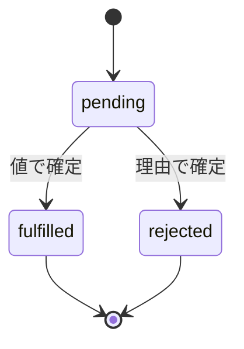
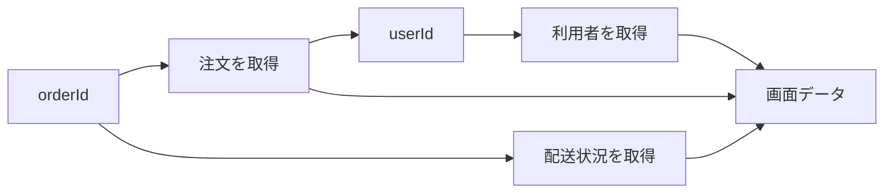

Promiseは、非同期処理そのものではありません。「後で届く1回分の結果」を受け渡すためのオブジェクトです。

この区別が分かると、`then` の `return` 忘れ、`catch` によるエラーの握りつぶし、不要な逐次実行を見つけやすくなります。この記事では、注文画面のデータ取得を1つの例として、値とエラーがどう流れるかを追います。

## Promiseは1回だけ成功か失敗へ確定する

Promiseの状態は3つです。`pending` から `fulfilled` または `rejected` へ移ると、その結果は変わりません。



| 状態 | 意味 | 利用側で受け取るもの |
| --- | --- | --- |
| `pending` | 結果がまだない | 待機中 |
| `fulfilled` | 成功した | 値 |
| `rejected` | 失敗した | エラーや失敗理由 |

通信はFetch API、タイマーはブラウザーやNode.jsが実行します。Promiseは、その処理の結果を共通の形で扱うための契約です。

## `then` は元のPromiseを変えず、次のPromiseを返す

`then` の戻り値によって、次のPromiseの状態が決まります。

| コールバックの結果 | 次のPromise |
| --- | --- |
| 通常の値を `return` | その値で `fulfilled` |
| Promiseを `return` | そのPromiseの結果を引き継ぐ |
| 例外を `throw` | `rejected` |
| `return` しない | `undefined` で `fulfilled` |

注文と利用者を順番に取得する例で見てみます。

```js
function fetchJson(url, label, { signal } = {}) {
  return fetch(url, { signal }).then((response) => {
    if (!response.ok) {
      throw new Error(`${label}の取得に失敗しました: HTTP ${response.status}`);
    }
    return response.json();
  });
}

function fetchOrderSummary(orderId) {
  return fetchJson(`/api/orders/${orderId}`, "注文")
    .then((order) =>
      fetchJson(`/api/users/${order.userId}`, "利用者")
        .then((user) => ({ order, user })),
    )
    .then(({ order, user }) => ({
      orderId: order.id,
      customerName: user.name,
      total: order.total,
    }));
}
```

利用者IDは注文から得るため、この2つの通信には順序があります。内側のPromiseを `return` しているので、次の `then` は利用者の取得完了を待てます。

連鎖を1段ずつ分解すると、受け渡している値が見えます。

1. 最初の `fetchJson` は注文を表すPromiseを返す。
2. 1つ目の `then` は確定した注文を `order` として受け取る。
3. そのコールバックは利用者取得のPromiseを `return` するため、次のPromiseは利用者取得の完了までpendingになる。
4. 内側の `then` が `{ order, user }` を返し、2つ目の `then` の入力になる。
5. 最後のコールバックが画面用の要約を返し、`fetchOrderSummary` 全体の成功値になる。

途中のPromiseを `return` することは、単に値を返すだけではありません。「この処理の完了を、連鎖全体の完了条件に含める」という宣言です。`return` を外すと利用者取得は背後で続きますが、外側の連鎖は待たずに次へ進みます。

次のように `return` を忘れると、次へ渡る値は `undefined` です。

```js
fetchJson("/api/orders/order-42", "注文")
  .then((order) => {
    fetchJson(`/api/users/${order.userId}`, "利用者"); // returnがない
  })
  .then((user) => {
    console.log(user); // undefined
  });
```

連鎖の途中で始めた非同期処理は、必ず `return` するか `await` します。これがPromiseを読むときの最重要チェックです。

## `async` / `await` でも流れているものは同じ

`async` 関数は必ずPromiseを返します。通常の値を `return` すれば `fulfilled`、例外を `throw` すれば `rejected` です。`await` は、その関数の続きだけを結果が出るまで中断します。

```js
async function fetchOrderSummary(orderId, { signal } = {}) {
  const order = await fetchJson(
    `/api/orders/${orderId}`,
    "注文",
    { signal },
  );
  const user = await fetchJson(
    `/api/users/${order.userId}`,
    "利用者",
    { signal },
  );

  return {
    orderId: order.id,
    customerName: user.name,
    total: order.total,
  };
}
```

`then` と `async` / `await` は、別の非同期モデルではありません。値とエラーの流れを、連鎖として書くか、上から下へ書くかの違いです。

## `catch` は失敗を回復させることがある

`catch` の中で何も `throw` せずに終えると、その `catch` が返すPromiseは `fulfilled` になります。回復値を返すなら意図どおりですが、記録だけして上位へ伝えたい場合は再 `throw` が必要です。

```js
async function loadOrderPage(orderId, options = {}) {
  try {
    return await fetchOrderSummary(orderId, options);
  } catch (error) {
    console.error("[order:load-failed]", { orderId, error });
    throw error;
  }
}
```

エラー処理では、次のどちらを行っているかを明確にします。

- 回復する：代替値を返し、呼び出し側は処理を続ける。
- 伝播する：文脈を記録・追加し、`throw` して上位へ渡す。

何層でも同じエラーを記録すると、1回の失敗が複数回起きたように見えます。利用者向け表示や運用ログを決める境界で、一度だけ処理する方が追いやすくなります。

## 独立した処理は先に開始する

注文と配送状況が、どちらも `orderId` だけで取得できるなら独立しています。1つずつ `await` すると、不要な待ち時間が生まれます。

```js
async function fetchOrderPage(orderId) {
  const [order, shipping] = await Promise.all([
    fetchJson(`/api/orders/${orderId}`, "注文"),
    fetchJson(`/api/shipping/${orderId}`, "配送状況"),
  ]);

  // userIdが必要なので、利用者の取得は注文の後
  const user = await fetchJson(`/api/users/${order.userId}`, "利用者");
  return { order, shipping, user };
}
```

処理の関係を図にすると、並行化できる場所が見えます。



大量の通信を無制限に並行化すると、APIや端末を圧迫します。並行化では、処理同士の依存関係と同時実行数を設計します。「全部同時にすれば速い」とは限りません。

## 複数の結果は、必要な成功条件でまとめる

| API | 成功する条件 | 失敗する条件 | 向いている場面 |
| --- | --- | --- | --- |
| `Promise.all` | 全部成功 | 1つでも失敗 | 全結果が必須 |
| `Promise.allSettled` | 全処理が確定 | 通常 `reject` しない | 成否を個別表示 |
| `Promise.any` | 1つでも成功 | 全部失敗 | 最初の成功だけ必要 |
| `Promise.race` | 最初に確定 | 最初が失敗なら失敗 | 成否を問わず最初の結果 |

`race` は「最速の成功」を選ぶAPIではありません。最初に確定したPromiseが失敗なら、その失敗を返します。選択前に、必要な成功条件を文章にしてください。API名だけで決めるより誤解を防げます。

## Fetchは404や500だけでは `reject` しない

Fetch APIは、HTTPレスポンスを受信できた場合、404や500でも通常は `fulfilled` になります。ステータスは `response.ok` で判定します。

冒頭で定義した `fetchJson` は `response.ok` を検査し、必要なら `AbortSignal` も `fetch` へ渡します。HTTPエラーの判定を各利用側へ散らさないため、以降の例でもこの関数を共通して使います。

ネットワークエラー、中止、不正なJSONは別の失敗です。画面では同じメッセージを出すとしても、再試行条件や運用ログでは区別できるようにします。

## キャンセルは実処理へ `AbortSignal` を渡す

Promise自体には汎用的な `cancel()` がありません。結果が不要になっても、背後の通信は自動停止しません。Fetch APIでは `AbortSignal` を渡します。

```js
const controller = new AbortController();

loadOrderPage("order-42", { signal: controller.signal })
  .catch((error) => {
    if (error.name !== "AbortError") renderError(error);
  });

// 画面を離れたとき
controller.abort();
```

キャンセル可能にする責任は、実処理を提供するAPI側にあります。Promiseを返しただけでは処理は止まりません。自作関数でもシグナルを下位APIまで渡し、処理中の後始末を決めます。

## Promiseの反応処理は現在の処理より後に動く

Promiseコンストラクターのexecutorは同期的に動きますが、`then`、`catch`、`finally` のコールバックはマイクロタスクとして後から実行されます。

```js
console.log("A");

Promise.resolve().then(() => console.log("B"));
setTimeout(() => console.log("C"), 0);

console.log("D");
// A, D, B, C
```

この例では、まず現在実行中のスクリプトというタスクが `A` と `D` を出力して終了します。続いて、そのタスク中に登録されたマイクロタスクを空になるまで処理するため `B` が出ます。その後で、タイマーが登録した次のタスクへ進み、`C` が出ます。

マイクロタスクの処理中に新しいマイクロタスクを追加した場合も、基本的には同じ確認点で続けて処理されます。そのため、大量のマイクロタスクを連鎖させると、タイマーや画面描画が始まるまでの時間が延びます。ただし「Promiseは常に `setTimeout` より先」とだけ暗記するのは危険です。どのタスク中に、どのキューへ登録されたかを含めて追ってください。

## 不具合を追うときの確認順

1. 関数が通常値とPromiseのどちらを返すか確認する。
2. 始めた非同期処理を `return` または `await` しているか確認する。
3. `catch` が失敗を意図せず成功へ変えていないか確認する。
4. 処理同士が依存しているか、独立しているかを図にする。
5. NetworkパネルでHTTP状態と応答を確認する。
6. キャンセル用シグナルが下位APIまで届いているか確認する。
7. 呼び出し側に、待つ・失敗を扱う・止める責任があるか確認する。

Promiseが向くのは、後で1回だけ確定する結果です。クリックの連続、WebSocketの複数メッセージ、継続的な位置情報には、イベント、非同期イテレーター、`ReadableStream` などが向いています。

Promiseを設計するときは、「誰が `await` するか」「誰が失敗を処理するか」「不要になったら誰が止めるか」を決めてください。この3つが明確なら、`then` と `async` / `await` のどちらで書いても処理を追えます。

## 参考資料

- [ECMAScript: Promise Objects](https://tc39.es/ecma262/multipage/control-abstraction-objects.html#sec-promise-objects)
- [ECMAScript: Async Function Definitions](https://tc39.es/ecma262/multipage/ecmascript-language-functions-and-classes.html#sec-async-function-definitions)
- [HTML Standard: Event loops](https://html.spec.whatwg.org/multipage/webappapis.html#event-loops)
- [Fetch Standard](https://fetch.spec.whatwg.org/)
- [DOM Standard: AbortController](https://dom.spec.whatwg.org/#interface-abortcontroller)
