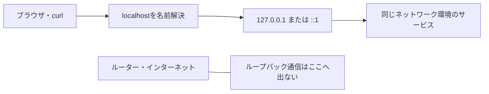
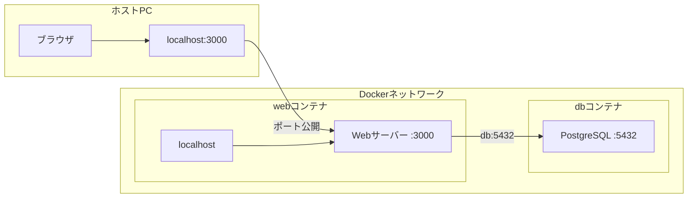

Web開発を始めると、ブラウザで次のようなURLを開く機会が増えます。

```text
http://localhost:3000
```

手元のPCで開発サーバーを動かしている間は、深く考えなくてもアクセスできます。ところが、Dockerコンテナから`localhost:3000`へ接続すると失敗したり、スマートフォンから同じURLを開いても画面が表示されなかったりします。

`localhost`は、特定のPCや開発サーバーに付いた名前ではありません。**通信を始めたプログラムが属するネットワーク環境自身**を指す名前です。ネットワークにおける「ここ」と考えると、実行場所によって接続先が変わる理由が見えてきます。

この記事では、localhostと`127.0.0.1`の関係、ポート番号の役割、`0.0.0.0`との違いを整理します。DockerやSSHで接続できない場合も、同じ考え方から原因を探します。

## localhostはネットワークにおける「ここ」

`localhost`は、自分自身を指すために予約された特別なホスト名です。ブラウザやcurlなどがlocalhostへ接続すると、そのプログラムが動いているネットワーク環境へ通信が戻ってきます。

「ここ」という言葉が場所によって指す地点を変えるのと同じです。自宅での「ここ」は自宅、駅での「ここ」は駅を指します。localhostも、PC上のブラウザから使えばそのPC、リモートサーバー上のcurlから使えばそのリモートサーバーを指します。

| 通信を始めるプログラム | localhostが指す場所 |
| --- | --- |
| PC上のブラウザ | そのPC |
| SSH先で実行したcurl | SSH先のサーバー |
| Dockerコンテナ内のアプリ | そのコンテナのネットワーク環境 |
| 仮想マシン内のアプリ | 仮想マシン自身 |
| スマートフォンのブラウザ | スマートフォン自身 |

判断するときに見るのは、接続されるサーバーではなく、接続しようとしているクライアントの実行場所です。`http://localhost:3000`を見たら、最初に「このHTTPリクエストを送るプログラムはどこで動いているか」を確認します。

## localhostへの通信はループバックで自分へ戻る

ホスト名は、そのままでは通信先の住所として使えません。localhostへ接続するときも、プログラムは名前からIPアドレスを求めます。この処理を名前解決と呼びます。

localhostは、通常、次のいずれかのIPアドレスへ名前解決されます。

| 通信方式 | ループバックアドレス |
| --- | --- |
| IPv4 | `127.0.0.1` |
| IPv6 | `::1` |

これらはループバックアドレスと呼ばれます。ループバック宛ての通信は、LANやインターネットへ出てから戻ってくるわけではありません。OSのネットワーク処理の中で自分自身へ戻ります。



[RFC 6761](https://www.rfc-editor.org/rfc/rfc6761.html#section-6.3)では、`localhost.`とその配下の名前に対するIPv4・IPv6の問い合わせは、それぞれのループバックアドレスを返すものとされています。IPv4の127から始まるアドレスについても、[RFC 1122](https://www.rfc-editor.org/rfc/rfc1122.html#section-3.2.1.3)でホスト内部のループバック用とされ、ホストの外へ出してはいけないと定められています。

`localhost`、`127.0.0.1`、`::1`は密接に関係していますが、同じ文字列の別表記ではありません。localhostは名前で、残りの2つはIPアドレスです。環境によってlocalhostから得られるアドレスの順序も異なります。

この違いは、接続トラブルとして現れることがあります。サーバーが`127.0.0.1`だけで待ち受けているのに、クライアントがlocalhostを`::1`として先に試すと、IPv6側では接続できません。`localhost`では失敗するのに`127.0.0.1`では成功する場合は、IPv4とIPv6の待ち受け状況を確認します。

## `localhost:3000`の3000が接続するサービスを選ぶ

localhostが示すのは接続先のネットワーク環境までです。その中でどのプログラムへ接続するかは、ポート番号で指定します。

```text
http://localhost:3000/users
│      │         │    └ パス
│      │         └ ポート番号
│      └ ホスト名
└ 通信方式
```

1台のPCでは、開発サーバー、データベース、メール確認ツールなど、複数のプログラムが同時に通信を待ち受けています。ポート番号は、それらを区別する受付番号のような役割を持ちます。

```text
localhost:3000  フロントエンドの開発サーバー
localhost:4000  APIサーバー
localhost:5432  PostgreSQL
```

同じlocalhostでも、ポートが違えば接続するサービスは異なります。反対に、指定したポートで何も待ち受けていなければ、localhost自体が正しくても接続は失敗します。

URLでポートを省略した場合は、通信方式に応じた標準ポートが使われます。HTTPは通常`80`、HTTPSは通常`443`です。`http://localhost`は、明示しなくても`localhost:80`への接続を試みます。

## サーバーの待ち受けアドレスが接続できる範囲を決める

サーバーを起動するときは、ポートだけでなく、どのIPアドレス宛ての通信を受け付けるかも指定できます。この操作をバインド、通信を待つ状態をリッスンと呼びます。

IPv4でよく使う指定を比べると、次のようになります。

| 待ち受けアドレス | 主な意味 |
| --- | --- |
| `127.0.0.1:3000` | 同じネットワーク環境からのIPv4通信を受け付ける |
| `192.168.1.20:3000` | そのIPアドレス宛ての通信を受け付ける |
| `0.0.0.0:3000` | 利用できるすべてのIPv4インターフェースで待ち受ける |

たとえばNode.jsのHTTPサーバーを`127.0.0.1`へバインドすると、同じ環境からだけ接続できます。

```js
import { createServer } from "node:http";

const server = createServer((_request, response) => {
  response.end("hello");
});

server.listen(3000, "127.0.0.1");
```

スマートフォンなど、同じLANにいる別端末から接続させたい場合は、LAN側のIPアドレスまたは`0.0.0.0`で待ち受ける必要があります。ただし、待ち受け範囲を広げるだけでは足りません。OSのファイアウォールやネットワーク側の設定も通信を許可する必要があります。

`0.0.0.0`はlocalhostの別名ではありません。サーバー側で「すべてのIPv4インターフェースから受け付ける」と指定するときに使う特別なアドレスです。クライアントが接続先として使うアドレスではないため、ブラウザには`localhost`、LAN内のIPアドレス、ドメイン名など、実際の接続先を指定します。

外部から接続できるようにすると、同じネットワーク上の意図しない相手からも開発サーバーへ到達できる場合があります。認証のない管理画面やデバッグ機能を`0.0.0.0`で公開するときは、接続できる範囲を確認してください。

## Dockerではコンテナごとにlocalhostがある

Dockerで混乱しやすいのは、ホストPCとコンテナが、標準では別のネットワーク環境を持つためです。コンテナ内で動くアプリがlocalhostへ接続すると、そのコンテナ自身へ戻ります。ホストPCには届きません。

たとえば、Webアプリとデータベースを別々のコンテナで動かしているとします。



Webコンテナから`localhost:5432`へ接続しても、dbコンテナには届きません。Webコンテナ自身の5432番ポートを探すからです。同じDockerネットワークに参加しているコンテナ同士なら、コンテナ名やDocker Composeのサービス名を使います。

```text
# webコンテナからdbコンテナへ接続する例
postgresql://db:5432/app
```

[Dockerのネットワーク仕様](https://docs.docker.com/engine/network/#user-defined-networks)では、同じユーザー定義ネットワークに接続したコンテナ同士は、コンテナ名またはIPアドレスで通信できます。IPアドレスは作り直すと変わるため、通常は名前で接続します。

### ホストからコンテナへはポートを公開する

ホストPCのブラウザからコンテナ内のWebサーバーへ接続するには、コンテナのポートをホスト側へ公開します。

```sh
docker run --publish 3000:3000 my-web-app
```

最初の`3000`はホスト側、後ろの`3000`はコンテナ側のポートです。ブラウザが`http://localhost:3000`へ接続すると、Dockerがコンテナの3000番ポートへ転送します。Docker公式ドキュメントでも、外部からコンテナのポートを利用するには`--publish`または`-p`を使うと説明されています。

ここでも、コンテナ内のサーバーが`127.0.0.1`だけで待ち受けていると、ポートを公開しても転送された通信を受け取れない場合があります。コンテナ外から接続させるサーバーは、コンテナ内で`0.0.0.0`へバインドするのが一般的です。

### コンテナからホストへは別の接続先を使う

Docker Desktopでは、コンテナからホストPC上のサービスへ接続するために`host.docker.internal`という特別な名前を利用できます。

```sh
curl http://host.docker.internal:8000
```

これは、コンテナ内のlocalhostをホストへ置き換える機能ではありません。ホストへ到達する別の名前と経路をDockerが用意しています。Docker Engineを直接使うLinux環境などでは追加設定が必要な場合があるため、利用環境の[Docker公式手順](https://docs.docker.com/desktop/features/networking/networking-how-tos/#connect-to-a-service-on-the-host)を確認します。

## SSH先のlocalhostはリモートサーバーを指す

SSHでサーバーへログインした後、次のcurlを実行したとします。

```sh
ssh user@app.example.com
curl http://localhost:3000
```

curlはSSH先で動いているため、このlocalhostは`app.example.com`自身です。手元のPCでブラウザへ`http://localhost:3000`と入力した場合は、手元のPCを指します。文字列が同じでも、通信を始めるプログラムの場所が違います。

リモートサーバーでしか公開されていないサービスを、手元のブラウザから確認したい場合は、SSHのローカルポートフォワーディングを利用できます。

```sh
ssh -L 8080:localhost:3000 user@app.example.com
```

このコマンドを実行している間、手元の`localhost:8080`へ届いた通信が、SSH接続を通ってリモート側の`localhost:3000`へ転送されます。

```text
手元のブラウザ
    ↓ localhost:8080
手元のSSHクライアント
    ↓ SSH接続
リモートサーバーのlocalhost:3000
```

localhostがリモートサーバーへ変化したわけではありません。手元とリモートにそれぞれlocalhostがあり、SSHが両者のポートをつないでいます。

## スマートフォンのlocalhostはスマートフォン自身を指す

PCで開発サーバーを起動し、スマートフォンから動作確認したい場面もあります。スマートフォンで`http://localhost:3000`を開いても、PCには接続しません。このlocalhostはスマートフォン自身です。

同じLANからPCへ接続する場合は、PCのLAN内IPアドレスを使います。

```text
http://192.168.1.20:3000
```

この場合も、開発サーバーが`127.0.0.1`だけでなくLAN側からの通信を受け付けていること、PCのファイアウォールが通信を許可していることが必要です。IPアドレスは環境によって異なるため、`ipconfig`、`ifconfig`、`ip addr`などで確認します。

## 接続できないときは4つの場所を順に確認する

localhostへの接続が失敗したとき、名前だけを何度も書き換えても原因は分かりません。通信の始点から順に確認します。

### 1. クライアントはどこで動いているか

ブラウザ、curl、アプリケーションが動いている場所を確認します。ホストPC、コンテナ、仮想マシン、SSH先のどれなのかでlocalhostの指す環境が決まります。

### 2. サーバーはどこで動いているか

接続したい開発サーバーやデータベースが、クライアントと同じ環境にあるとは限りません。別コンテナならサービス名、別端末ならIPアドレスなど、その環境へ到達できる名前やアドレスが必要です。

### 3. どのアドレスとポートで待ち受けているか

macOSやLinuxで3000番ポートの待ち受けを確認する例です。

```sh
lsof -nP -iTCP:3000 -sTCP:LISTEN
```

Linuxで`ss`を使える場合は、次のように確認できます。

```sh
ss -ltnp
```

`127.0.0.1:3000`、`[::1]:3000`、`0.0.0.0:3000`では、受け付ける通信の範囲が異なります。アプリケーションの起動ログにも、待ち受けアドレスとポートが表示される場合があります。

### 4. 環境の境界を越える経路があるか

Dockerのポート公開、SSHポートフォワーディング、LANのファイアウォールなどを確認します。サービスが正しいポートで待っていても、環境の境界を越える経路がなければ接続できません。

実際のHTTP接続は、curlの詳細表示で追えます。

```sh
curl -v http://localhost:3000
```

出力には、localhostがどのIPアドレスへ解決され、どのアドレスとポートへ接続を試したかが表示されます。`Connection refused`は、接続先まで到達したものの、そのポートでサービスが待っていない場合などに発生します。localhostという名前が壊れたと決めつけず、表示されたIPアドレスと待ち受け状況を照らし合わせます。

## localhostを見たら「誰から見たここか」を考える

localhostは、通信を始めたプログラムが属するネットワーク環境自身を指します。通常は`127.0.0.1`または`::1`へ名前解決され、通信はループバックによって同じ環境へ戻ります。

普段のPCでは「自分自身」と「このPC」が一致するため、localhostをPCの名前だと考えても問題が表面化しません。Docker、仮想マシン、SSHを使うと、それぞれに「自分自身」があるため、同じ理解では接続先を見失います。

接続できないときは、次の順番で考えてください。

1. 通信を始めるプログラムはどこにいるか
2. 接続したいサービスはどこにいるか
3. サービスはどのアドレスとポートで待っているか
4. 2つの環境をつなぐ公開・転送経路があるか

localhostはネットワーク上の「ここ」です。「自分のPC」に固定された名前ではありません。この基準があれば、実行環境が増えても接続先を一つずつ整理できます。

## 参考資料

- [RFC 6761: Special-Use Domain Names](https://www.rfc-editor.org/rfc/rfc6761.html#section-6.3)
- [RFC 1122: Requirements for Internet Hosts -- Communication Layers](https://www.rfc-editor.org/rfc/rfc1122.html#section-3.2.1.3)
- [RFC 4291: IP Version 6 Addressing Architecture](https://www.rfc-editor.org/rfc/rfc4291.html#section-2.5.3)
- [Docker Docs: Networking overview](https://docs.docker.com/engine/network/)
- [Docker Docs: Explore networking how-tos on Docker Desktop](https://docs.docker.com/desktop/features/networking/networking-how-tos/)
