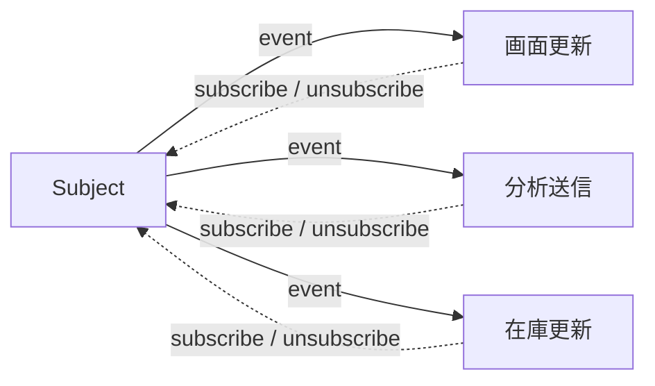
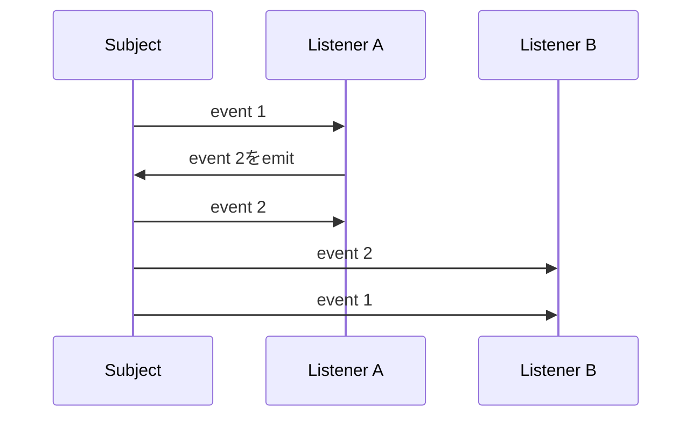

ある状態が変わったとき、複数の処理へ知らせたい場面があります。注文確定後に画面を更新し、分析イベントを送り、在庫表示も更新する、といったケースです。

変更元が利用側をすべて直接呼ぶと、新しい反応を追加するたびに変更元を編集します。Observerパターンは、通知を受けたい側が先に購読し、変更元は登録済みのリスナーへイベントを配る仕組みです。

実装は短くても、通知順、例外、非同期処理、購読解除を決めなければ安全には使えません。この記事では、その契約を順に整理します。

以下のコードは通知契約を説明するための抜粋です。注文モデルや画面更新処理の詳細ではなく、登録・通知・解除の流れへ注目してください。

## 直接呼び出す設計では変更元が利用側を知りすぎる

```ts
class OrderService {
  async complete(order: Order): Promise<void> {
    await this.repository.save(order);
    this.orderPage.refresh(order);
    this.analytics.track("order_completed", order.id);
    this.inventoryView.reload(order.items);
  }
}
```

注文保存という中心処理が、画面、分析、在庫表示の具体的な都合まで知っています。反応を増やすほど `constructor` 引数と呼び出しが増え、OrderServiceの変更理由も増えます。

Observerでは、変更を通知する側をSubject、通知を受けて反応する側をObserverと呼びます。この記事の実装では、Observerとして登録する関数をリスナーと呼びます。



変更元は「誰が購読しているか」を個別には知りません。ただし、イベントの意味と通知規則には責任を持ちます。

## 最小実装でも解除方法を最初から返す

```ts
type Listener<T> = (event: T) => void;

class Subject<T> {
  private readonly listeners = new Set<Listener<T>>();

  subscribe(listener: Listener<T>): () => void {
    this.listeners.add(listener);

    return () => {
      this.listeners.delete(listener);
    };
  }

  emit(event: T): void {
    for (const listener of [...this.listeners]) {
      listener(event);
    }
  }
}
```

`subscribe` が解除関数を返すため、利用側は登録時に得た値だけで購読を終えられます。別途 `unsubscribe(listener)` を呼ぶ方式では、同じ関数参照を保持する必要があり、無名関数の解除でつまずきやすくなります。

`emit` ではSetを配列へコピーしています。リスナーが通知中に自分や別のリスナーを解除しても、現在の通知対象を安定させるためです。この選択には意味があります。「通知開始時に登録されていたリスナーへ1回ずつ送る」という規則です。

## イベント名ではなく、利用側が必要な事実を渡す

文字列だけのイベントは小さく始められますが、イベントごとのデータを安全に表しにくくなります。discriminated union（判別可能なユニオン型）は、共通の判別項目によって複数の型を見分ける書き方です。ここでは `type` が判別項目になり、ペイロード、つまりイベントと一緒に渡すデータの形を種類ごとに固定します。

```ts
type OrderEvent =
  | { type: "order.completed"; orderId: string; total: number }
  | { type: "order.cancelled"; orderId: string; reason: string };

const orderEvents = new Subject<OrderEvent>();

const unsubscribe = orderEvents.subscribe((event) => {
  switch (event.type) {
    case "order.completed":
      console.log(event.orderId, event.total);
      break;
    case "order.cancelled":
      console.log(event.orderId, event.reason);
      break;
  }
});
```

イベントは「関数を呼んだ」という命令より、「注文が完了した」という過去の事実として命名すると、複数の利用側が自分の責務を判断しやすくなります。

ペイロードを大きなOrderオブジェクトのまま渡すと、利用側が内部構造へ依存します。イベントとして長く残したい情報だけを選びます。ただし、同じデータを何度も再取得する負担が大きい場合は、必要な読み取りモデルを含める判断もあります。

## リスナーの例外をどう扱うか決める

同期的な `emit` でリスナーが例外を投げると、単純なfor文ではそこで通知が止まります。後続リスナーへ通知するかどうかは、Subjectの契約です。

| 方針 | 長所 | 注意点 |
| --- | --- | --- |
| 最初の例外で停止 | 失敗がすぐ呼び出し元へ伝わる | 後続リスナーは実行されない |
| 例外を集めて最後に投げる | 全リスナーを試せる | 複数エラーの表現が必要 |
| 例外を記録して続行 | 中心処理を止めにくい | 失敗を見落としやすい |
| リスナーごとに失敗処理を委ねる | Subjectが単純 | 規則がばらつきやすい |

注文保存後の分析イベントなら、分析送信の失敗で注文完了を取り消したくない場合があります。一方、ドメイン内の必須検証をObserverへ置くのは危険です。失敗してはいけない中心ルールは、通知の外側で同期的に実行する方が明確です。

## 非同期リスナーは別の契約にする

`async` 関数もJavaScript上はリスナーとして登録できますが、同期 `emit` は返されたPromiseを待ちません。拒否が未処理になる可能性があります。

```ts
type AsyncListener<T> = (event: T) => Promise<void>;

class AsyncSubject<T> {
  private readonly listeners = new Set<AsyncListener<T>>();

  subscribe(listener: AsyncListener<T>): () => void {
    this.listeners.add(listener);
    return () => this.listeners.delete(listener);
  }

  async emit(event: T): Promise<PromiseSettledResult<void>[]> {
    return Promise.allSettled(
      [...this.listeners].map((listener) =>
        Promise.resolve().then(() => listener(event)),
      ),
    );
  }
}
```

この実装は全リスナーをマイクロタスクで開始し、同期的な例外も拒否へ変えて、すべての成否を返します。順番に実行したいならforループで `await` します。`Promise.all` を使うと返されるPromiseは最初の失敗で `reject` しますが、すでに始まった他のリスナーを停止するわけではありません。

つまり、`async emit` と書くだけでは設計は終わりません。並行か逐次か、全件成功が必要か、タイムアウトやキャンセルをどう扱うかまで決める必要があります。

## 再入と通知中の変更を仕様にする

リスナーが `emit` の途中で、同じSubjectへ再び `emit` することを再入と呼びます。



単純な同期実装では、上のように通知が入れ子になります。これが正しいケースもありますが、状態更新の順序が追いにくくなります。再入を禁止する、キューへ積んで現在の通知後に処理する、許可してテストで順序を固定する、のいずれかを選びます。

同じく、通知中に新しいリスナーを登録した場合、そのリスナーへ現在のイベントを送るかも決めます。配列へスナップショットを取る実装なら、次回のイベントから参加します。

## 購読の寿命は利用側の寿命と揃える

Observerで起きやすい問題は、登録したまま解除しないことです。Subjectがリスナーを参照し続けると、リスナーが閉じ込めた画面や大きなデータも解放されません。

| 利用場面 | 解除のタイミング |
| --- | --- |
| UI component | unmount / destroy |
| 1回だけ待つ処理 | 最初の通知直後 |
| リクエストスコープ | リクエスト終了時 |
| アプリケーション全体 | アプリケーション終了時 |

AbortSignalを購読APIへ受け取る設計もできます。既存の処理キャンセルと購読解除を同じライフサイクルへそろえられるためです。

## EventEmitterやRxJSとは扱える範囲が違う

Node.jsの `EventEmitter` は、イベント名ごとのリスナー管理、once購読、リスナー数の警告などを提供します。同期的にリスナーを呼ぶ点や、`error` イベントの特別扱いを理解して使います。

RxJSのObservableは、値の列、完了、失敗、演算子による変換、キャンセルを扱います。単純な通知より広いモデルです。値の結合、debounce、再試行などが必要ならRxJSが適しますが、画面内の小さな通知に導入すると学習コストが上回ることがあります。

| 選択肢 | 向いている規模 |
| --- | --- |
| 直接呼び出し | 利用側が1つで関係が固定 |
| コールバック | 1つの結果を呼び出し元へ返す |
| 小さなSubject | 複数リスナーへの単純な通知 |
| EventEmitter | Node.jsで名前付きイベントを管理 |
| RxJS Observable | 時間に沿った複数値を変換・合成 |

## Observer導入前に通知契約を6点決める

1. イベントは何が起きた事実を表すか。
2. リスナーは同期か非同期か。
3. 1つの失敗で通知を止めるか。
4. 通知順を保証するか。
5. 再入を許すか。
6. 誰がいつ購読を解除するか。

Observerは、変更元から利用側の具体名を外すには有効です。しかし、処理の流れがコード上の直接呼び出しから見えにくくなる代償があります。反応が1つしかないなら直接呼び出す方が明快です。複数の独立した反応が増え、変更元を一緒に変えたくないときに、通知契約を明示して導入します。

## 参考資料

- [Refactoring.Guru: Observer](https://refactoring.guru/design-patterns/observer)
- [Node.js: Events](https://nodejs.org/api/events.html)
- [RxJS: Observable](https://rxjs.dev/guide/observable)
- [MDN: AbortSignal](https://developer.mozilla.org/ja/docs/Web/API/AbortSignal)
