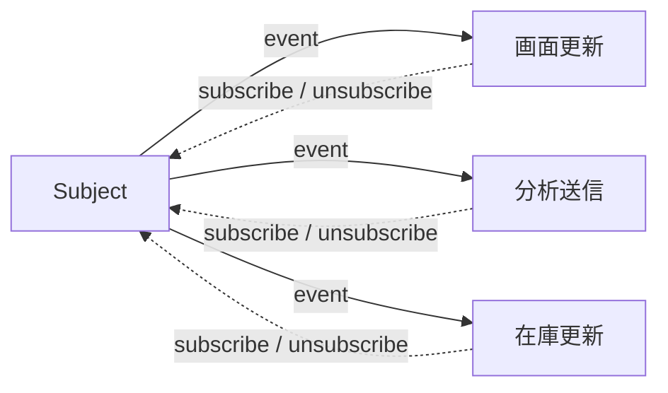
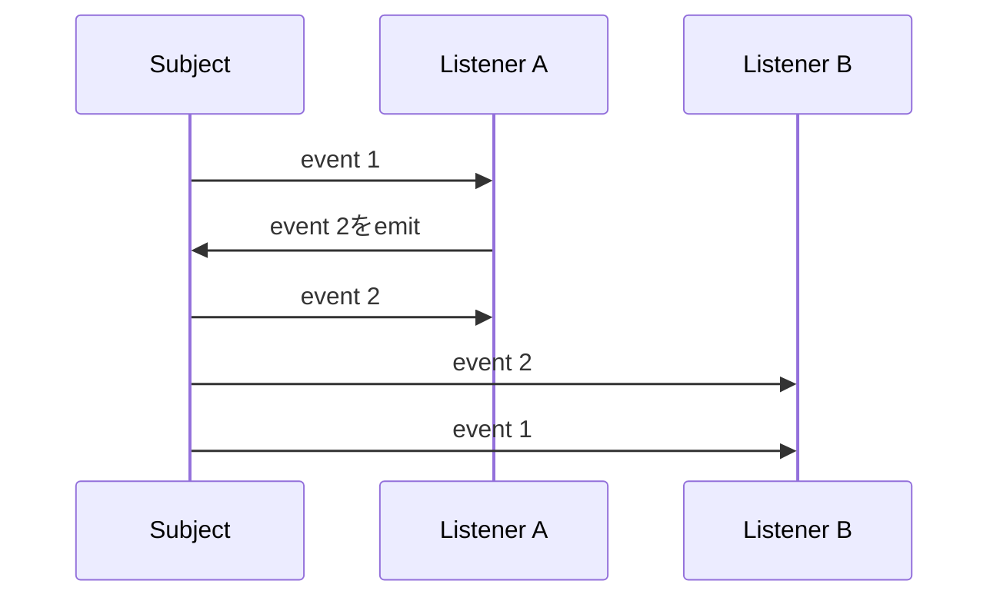

注文が確定したら、画面を更新して、分析イベントを送って、在庫表示も直したい。

反応が3つあります。そして、この先も増えます。

変更元が全部を直接呼ぶ形にすると、反応が1つ増えるたびに変更元を開くことになります。Observerパターンは、この向きをひっくり返します。通知を受けたい側が先に手を挙げて登録しておき、変更元は登録済みのリスナーへイベントを配るだけ。

実装は驚くほど短いです。ただ、短いのは実装だけでした。通知順、例外、非同期、購読解除。この4つを決めないと安全には使えません。

以下のコードは通知契約に絞った抜粋です。注文モデルや画面更新の中身は飛ばして、登録・通知・解除の流れを見てください。

## 変更元が、知りすぎている

```ts
class OrderService {
  async complete(order: Order): Promise<void> {
    await this.repository.save(order);
    this.orderPage.refresh(order);
    this.analytics.track("order_completed", order.id);
    this.inventoryView.reload(order.items);
  }
}
```

注文を保存するという中心の仕事に対して、このクラスは画面と分析と在庫表示の都合まで抱えています。反応が増えるほど `constructor` の引数が伸び、`OrderService` を変更する理由も増えていきます。

用語を整理しておきます。変更を通知する側がSubject、通知を受けて反応する側がObserverです。この記事の実装では、Observerとして登録する関数をリスナーと呼びます。



変更元は、誰が購読しているかを個別には知りません。ただし、イベントの意味と通知の規則には責任を持ちます。ここは手放せません。

## 解除の手段を、最初に渡しておく

```ts
type Listener<T> = (event: T) => void;

class Subject<T> {
  private readonly listeners = new Set<Listener<T>>();

  subscribe(listener: Listener<T>): () => void {
    this.listeners.add(listener);

    return () => {
      this.listeners.delete(listener);
    };
  }

  emit(event: T): void {
    for (const listener of [...this.listeners]) {
      listener(event);
    }
  }
}
```

`subscribe` が解除用の関数を返しています。利用側は、登録したときに受け取った値だけで購読を終えられる。

`unsubscribe(listener)` を別に用意する方式もありますが、あれは同じ関数参照を持ち続ける必要があって、無名関数を登録した瞬間に解除できなくなります。私はこれで一度ハマりました。

`emit` でSetを配列にコピーしているのにも理由があります。通知の途中でリスナーが自分や他人を解除しても、いま配っている対象を揺らさないため。これは単なる実装の都合ではなく、**通知開始時に登録されていたリスナーへ1回ずつ送る**という規則の表明です。

## イベント名だけでは足りない

文字列イベントは手軽に始められます。ただ、イベントごとに違うデータを安全に表せません。

そこでdiscriminated union（判別可能なユニオン型）を使います。共通の判別項目で複数の型を見分ける書き方で、ここでは `type` が目印になり、一緒に渡すデータの形を種類ごとに固定できます。

```ts
type OrderEvent =
  | { type: "order.completed"; orderId: string; total: number }
  | { type: "order.cancelled"; orderId: string; reason: string };

const orderEvents = new Subject<OrderEvent>();

const unsubscribe = orderEvents.subscribe((event) => {
  switch (event.type) {
    case "order.completed":
      console.log(event.orderId, event.total);
      break;
    case "order.cancelled":
      console.log(event.orderId, event.reason);
      break;
  }
});
```

名前の付け方にもコツがあります。「関数を呼んだ」という命令口調をやめて、「注文が完了した」という**過去の事実**として名付ける。そうすると、受け取った側が自分の責務を自分で判断できます。

ペイロードにOrderオブジェクトを丸ごと入れるのは避けたいところです。利用側が内部構造に依存してしまいます。イベントとして長く残したい情報だけを選ぶ。とはいえ、同じデータを何度も取り直すコストが重いなら、必要な読み取りモデルを含める判断もありです。

## リスナーがこけたら、どうする

同期の `emit` でリスナーが例外を投げると、素朴なforループはそこで止まります。後ろのリスナーに通知するのかしないのか。これはSubjectが決める契約です。

| 方針 | 長所 | 注意点 |
| --- | --- | --- |
| 最初の例外で停止 | 失敗がすぐ呼び出し元へ伝わる | 後続リスナーは実行されない |
| 例外を集めて最後に投げる | 全リスナーを試せる | 複数エラーの表現が必要 |
| 例外を記録して続行 | 中心処理を止めにくい | 失敗を見落としやすい |
| リスナーごとに失敗処理を委ねる | Subjectが単純 | 規則がばらつきやすい |

注文保存後の分析イベントなら、分析の送信に失敗したくらいで注文完了を取り消したくはないはずです。

一方で、絶対に失敗してはいけないドメインの検証をObserverに置くのは危ないです。中心のルールは、通知の外側で同期的に走らせる。そのほうがずっと明確です。

## `async` を付けただけでは終わらない

`async` 関数もリスナーとして登録できます。ただし、同期の `emit` は返ってきたPromiseを待ちません。拒否が未処理のまま消えることがあります。

```ts
type AsyncListener<T> = (event: T) => Promise<void>;

class AsyncSubject<T> {
  private readonly listeners = new Set<AsyncListener<T>>();

  subscribe(listener: AsyncListener<T>): () => void {
    this.listeners.add(listener);
    return () => this.listeners.delete(listener);
  }

  async emit(event: T): Promise<PromiseSettledResult<void>[]> {
    return Promise.allSettled(
      [...this.listeners].map((listener) =>
        Promise.resolve().then(() => listener(event)),
      ),
    );
  }
}
```

この実装は、全リスナーをマイクロタスクで開始し、同期的な例外も拒否に変換して、すべての成否を返します。順番に実行したければforループで `await` してください。

`Promise.all` を選ぶと、返るPromiseは最初の失敗で `reject` します。でも、すでに走り出した他のリスナーが止まるわけではありません。ここは誤解しやすいところです。

つまり `async emit` と書いた時点では、まだ何も決まっていません。並行か逐次か、全件成功が必要か、タイムアウトとキャンセルをどうするか。決めるのはこちらです。

## 通知の途中で、また通知が来たら

リスナーが `emit` の最中に、同じSubjectへもう一度 `emit` する。これを再入と呼びます。



素朴な同期実装だと、こうやって通知が入れ子になります。図の最後、`event 1` が `event 2` より後に届いているのが見えるでしょうか。

これで正しい場合もあります。ただ、状態更新の順序はかなり追いにくくなる。禁止する、キューに積んで現在の通知が終わってから流す、許可したうえでテストで順序を固定する。どれかを選んでください。

同じく、通知中に新しいリスナーが登録されたとき、そのリスナーへ今回のイベントを送るのかも決めておきます。配列にスナップショットを取る実装なら、参加は次回からです。

## 解除を忘れると、消えないものが残る

Observerでいちばん起きやすい事故が、登録しっぱなしです。Subjectがリスナーを掴んだままだと、そのリスナーが閉じ込めている画面や大きなデータも解放されません。

| 利用場面 | 解除のタイミング |
| --- | --- |
| UI component | unmount / destroy |
| 1回だけ待つ処理 | 最初の通知直後 |
| リクエストスコープ | リクエスト終了時 |
| アプリケーション全体 | アプリケーション終了時 |

購読APIで `AbortSignal` を受け取る設計にする手もあります。処理のキャンセルと購読解除を、同じライフサイクルに乗せられます。

## EventEmitterやRxJSとの距離感

Node.jsの `EventEmitter` は、イベント名ごとのリスナー管理、once購読、リスナー数の警告あたりを面倒見てくれます。同期的にリスナーを呼ぶことと、`error` イベントが特別扱いされることは押さえておいてください。

RxJSのObservableは、もっと広い世界です。値の列、完了、失敗、演算子による変換、キャンセル。debounceや再試行、複数ストリームの結合が要るならRxJSが強い。ただ、画面内の小さな通知のために持ち込むと、学習コストのほうが上回ります。

| 選択肢 | 向いている規模 |
| --- | --- |
| 直接呼び出し | 利用側が1つで関係が固定 |
| コールバック | 1つの結果を呼び出し元へ返す |
| 小さなSubject | 複数リスナーへの単純な通知 |
| EventEmitter | Node.jsで名前付きイベントを管理 |
| RxJS Observable | 時間に沿った複数値を変換・合成 |

## 入れる前に決める6つ

1. イベントは何が起きた事実を表すか。
2. リスナーは同期か非同期か。
3. 1つの失敗で通知を止めるか。
4. 通知順を保証するか。
5. 再入を許すか。
6. 誰がいつ購読を解除するか。

---

冒頭の3つの反応に戻ります。

Observerは、変更元から利用側の名前を消すのにはよく効きます。ただし代償もあって、**処理の流れがコードを追うだけでは見えなくなります**。どこで何が起きるのか、grepしても出てこない。

だから反応が1つしかないなら、素直に直接呼んでください。独立した反応が増えてきて、そのたびに変更元を触りたくなくなったとき。そこが、通知契約を明示してObserverを入れるタイミングです。

## 参考資料

- [Refactoring.Guru: Observer](https://refactoring.guru/design-patterns/observer)
- [Node.js: Events](https://nodejs.org/api/events.html)
- [RxJS: Observable](https://rxjs.dev/guide/observable)
- [MDN: AbortSignal](https://developer.mozilla.org/ja/docs/Web/API/AbortSignal)
