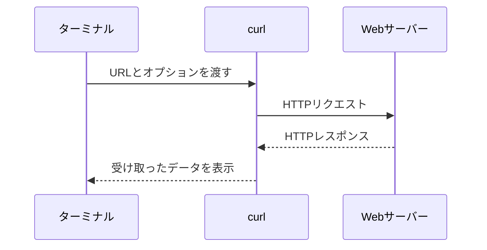

READMEやAPIドキュメントを読んでいると、`curl`から始まる長いコマンドをよく見かけます。オプションを含めてそのまま実行できても、何を送信しているのか分からないままでは、URLやデータを少し変えるだけで迷ってしまいます。

curlは、**URLを指定してサーバーとデータを送受信するコマンドラインツール**です。Web開発では、HTTPリクエストを送り、APIのレスポンスを確認する用途でよく使われます。

この記事ではHTTPとHTTPSに範囲を絞り、curlが何を送信し、何を表示しているのかを整理します。最後まで読むと、APIドキュメントに載っているcurlコマンドを分解して読めるようになります。

## curlはURLを受け取り、サーバーとデータをやり取りする

curlの基本形は、`curl`の後ろへURLを書くものです。

```sh
curl https://example.com
```

このコマンドを実行すると、curlは`example.com`へHTTPリクエストを送り、返ってきたレスポンスボディをターミナルへ表示します。レスポンスボディとは、HTMLやJSON、画像など、サーバーから返されるデータ本体です。



ブラウザも、URLをもとにHTTPリクエストを送る点では同じです。ただし、ブラウザは受け取ったHTML、CSS、JavaScriptなどを解釈して画面を描画します。curlの場合、受け取ったデータは基本的に解釈されず、そのまま出力されます。

curlはHTTP以外の通信にも対応しています。たとえば、FTPはファイル転送、SMTPはメール送信、SFTPはSSHを使ったファイル転送に使うプロトコルです。この記事では扱いませんが、利用できるプロトコルや機能はcurlがどのようにビルドされたかによって変わります。手元の環境は次のコマンドで確認できます。

```sh
curl --version
```

バージョン番号に続いて、`Protocols:`や`Features:`が表示されます。

## 引数がURLだけならGETリクエストになる

HTTP通信は、クライアントがリクエストを送り、サーバーがレスポンスを返す流れで進みます。引数にHTTPまたはHTTPSのURLだけを渡した場合、curlはGETリクエストを送ります。

```sh
curl https://example.com
```

概念的には、次のようなリクエストです。

```http
GET / HTTP/1.1
Host: example.com
```

`GET`は、指定したリソースの取得を依頼するHTTPメソッドです。`/`はURLのパス、`Host`は接続先のホスト名を表します。コマンドで渡したURLから、curlがHTTPリクエストに必要な情報を組み立てます。

サーバーからは、次の要素を持つレスポンスが返ります。

| 要素 | 役割 | 例 |
| --- | --- | --- |
| ステータスコード | 処理結果を示す | `200`、`404`、`500` |
| レスポンスヘッダー | データの種類やキャッシュなどの付加情報 | `Content-Type: text/html` |
| レスポンスボディ | 返されたデータ本体 | HTML、JSON、画像 |

オプションを付けないcurlは、主にレスポンスボディを標準出力へ書きます。標準出力は、コマンドが通常の結果を書き出す先です。ターミナルで実行すれば画面に表示され、リダイレクトやパイプを使えばファイルや別のコマンドへ渡せます。

## HTTPリクエストの4要素をオプションで指定する

APIを呼び出すときは、URL以外の情報も必要になります。まず、HTTPリクエストを次の4要素に分けると、curlのオプションを読みやすくなります。

| HTTPリクエストの要素 | curlでの指定方法 | 例 |
| --- | --- | --- |
| URL | コマンドの引数 | `https://api.example.com/users` |
| HTTPメソッド | オプションからcurlが選ぶ、または`-X` | `GET`、`POST`、`DELETE` |
| リクエストヘッダー | `-H` | `Content-Type: application/json` |
| リクエストボディ | `-d`や`--json` | `{"name":"Taro"}` |

この記事中の`example.com`とそのサブドメインは、コマンドの形を示すために使っています。トップページへのGET以外を試すときは、利用するAPIやファイルのURLへ置き換えてください。

## クエリ文字列を含むURLは引用符で囲む

GETリクエストでは、URLの末尾へ検索条件などを付けることがあります。`?`以降に付ける部分をクエリ文字列と呼びます。

```sh
curl "https://api.example.com/users?limit=10&active=true"
```

URL全体を引用符で囲んでいるのは、`&`や`?`をシェルに解釈させないためです。たとえば`&`を引用符なしで書くと、多くのシェルではコマンドをバックグラウンドで実行する記号として扱われます。URLにクエリ文字列があるときは、URL全体を引用符で囲む習慣を付けておくと安全です。

## `-i`を付けるとステータスコードとヘッダーも見える

通常の出力だけでは、レスポンスボディしか見えません。ステータスコードとレスポンスヘッダーも確認したい場合は、`-i`を付けます。

```sh
curl -i https://example.com
```

出力の先頭に、次のような情報が加わります。HTTPのバージョンやヘッダーの内容は、接続先や実行環境によって変わります。

```http
HTTP/2 200
content-type: text/html
content-length: 1256

<!doctype html>
...
```

空行より上がレスポンスのステータス行とヘッダー、その下がレスポンスボディです。`200`はリクエストが正常に処理されたことを示します。

似たオプションに`-I`があります。小文字の`-i`はヘッダーとボディの両方を表示しますが、大文字の`-I`はHTTPのHEADリクエストを送り、ヘッダーだけを取得します。

```sh
curl -I https://example.com
```

ファイルをダウンロードせず、種類や更新日時などの情報だけを確認したい場合に使えます。ただし、サーバーがHEADリクエストへ適切に対応していることが前提です。

## `-H`でリクエストヘッダーを追加する

APIでは、受け取りたいデータ形式や認証情報をリクエストヘッダーで渡します。ヘッダーを追加するオプションが`-H`です。

```sh
curl \
  -H "Accept: application/json" \
  -H "Authorization: Bearer $API_TOKEN" \
  https://api.example.com/users
```

この例では、2つのヘッダーを送っています。

- `Accept: application/json`は、JSON形式のレスポンスを希望すると伝える
- `Authorization: Bearer ...`は、APIトークンを使って認証情報を渡す

`-H`は複数回指定できます。同じ名前のヘッダーを指定した場合は、curlが自動で用意する値を上書きすることがあります。`Host`や`Content-Length`などを理由なく変更すると、正しいリクエストにならないため注意してください。

## `-d`を付けるとデータをPOSTできる

サーバーへデータを送るには、`-d`または`--data`を使います。

```sh
curl \
  -d "name=Taro&role=reader" \
  https://api.example.com/users
```

HTTPのURLに`-d`を付けると、curlはPOSTリクエストを選び、データをリクエストボディへ入れます。このときの`Content-Type`は、標準では`application/x-www-form-urlencoded`です。HTMLフォームに近い`名前=値`の形式を送る用途に合います。

`-d`がPOSTを選ぶため、次のように`-X POST`を重ねる必要はありません。

```sh
# -X POSTはなくてもPOSTになる
curl -X POST -d "name=Taro" https://api.example.com/users

# 同じ目的ならこちらで足りる
curl -d "name=Taro" https://api.example.com/users
```

`-X`は、HTTPリクエストで使うメソッド名を明示するオプションです。たとえばDELETEリクエストは次のように書けます。

```sh
curl -X DELETE https://api.example.com/users/42
```

ただし、`-X`はメソッド名を変えるだけです。データの形式や送信方法まで自動で整えるわけではありません。GET、HEAD、POSTなどは、URLだけ、`-I`、`-d`といった専用の指定からcurlに選ばせる方が意図を読み取りやすくなります。

## JSONはContent-Typeとボディをセットで送る

Web APIでは、JSON形式のデータを送る場面がよくあります。幅広いcurlバージョンで使える書き方は、`-H`と`-d`の組み合わせです。

```sh
curl \
  -H "Content-Type: application/json" \
  -d '{"name":"Taro","role":"reader"}' \
  https://api.example.com/users
```

`Content-Type: application/json`は、リクエストボディがJSONであることをサーバーへ伝えます。ヘッダーを付けずにJSONらしい文字列だけを`-d`へ渡しても、サーバーはフォームデータとして解釈するかもしれません。

curl 7.82.0以降では、同じ目的に`--json`を使えます。

```sh
curl \
  --json '{"name":"Taro","role":"reader"}' \
  https://api.example.com/users
```

`--json`は、JSONをデータとして送り、`Content-Type: application/json`と`Accept: application/json`を設定するための短縮形です。ただし、渡した文字列が正しいJSONかどうかまでは検証しません。クォートやカンマを間違えれば、そのまま不正なデータが送られます。

## `-o`を付けるとレスポンスをファイルへ保存できる

受け取ったデータの出力先は、標準では標準出力です。ファイルとして保存したい場合は、`-o`の後ろに保存先を指定します。

```sh
curl -o example.html https://example.com
```

このコマンドは、レスポンスボディを`example.html`へ保存します。保存中の進捗はターミナルに表示されますが、HTML本体は表示されません。

URLの末尾にあるファイル名をそのまま使う場合は、`-O`も利用できます。

```sh
curl -O https://example.com/files/manual.pdf
```

この例では、カレントディレクトリへ`manual.pdf`として保存します。`-o`は自分で保存名を決め、`-O`はURLのファイル名を使う、と区別できます。

## `-L`を付けるとリダイレクト先までたどる

サーバーは、要求されたURLから別のURLへ移動するよう、`301`や`302`などのステータスコードと`Location`ヘッダーを返すことがあります。これがHTTPリダイレクトです。

標準では、リダイレクト先へ自動で移動しません。移動先へ続けてリクエストを送るには、`-L`または`--location`を使います。

```sh
curl -L https://example.com
```

`-i`と組み合わせると、途中で受け取ったレスポンスヘッダーも表示されます。

```sh
curl -iL https://example.com
```

リダイレクトを含むAPIを調べるときは、最初から`-L`を付ける前に`-i`だけで応答を見ると、「どこへ移動するよう指示されたか」を確認できます。

## 期待した応答がないときは`-v`で通信内容を見る

APIから想定外のレスポンスが返ったときは、`-v`または`--verbose`を付けると、接続と通信の詳細を確認できます。

```sh
curl -v -o response.html https://example.com
```

詳細出力には、行頭の記号ごとに意味があります。

| 記号 | 表している内容 |
| --- | --- |
| `>` | curlからサーバーへ送ったヘッダー |
| `<` | サーバーからcurlへ返ったヘッダー |
| `*` | 接続先やTLSなど、curlの補足情報 |

たとえば、次のように送信したメソッドとヘッダーを確認できます。

```text
> GET / HTTP/1.1
> Host: example.com
> User-Agent: curl/...
> Accept: */*

< HTTP/1.1 200 OK
< Content-Type: text/html
```

`-i`がレスポンスヘッダーを見るためのオプションなのに対し、`-v`は送信したリクエストヘッダーや接続過程まで調べるためのオプションです。

詳細出力には、認証ヘッダー、Cookie、送信データなどの秘密情報が含まれる場合があります。ログを共有する前に、トークンや個人情報が残っていないか確認してください。

## HTTPエラーを終了コードへ反映するには明示的な指定が必要

curlにとって、HTTPの`404 Not Found`や`500 Internal Server Error`を受信できたこと自体は、通信の成功です。そのため、標準では4xxや5xxのレスポンスでも終了コードが`0`になる場合があります。

シェルスクリプトやCIでHTTPエラーを失敗として扱いたい場合は、curl 7.76.0以降で使える`--fail-with-body`が便利です。

```sh
curl --fail-with-body https://api.example.com/users/999
```

このオプションを付けると、ステータスコードが400以上の場合にcurlが非ゼロの終了コードを返します。APIが返したエラーメッセージのボディは表示されるため、失敗理由も確認できます。

進捗表示を消しつつ、エラーメッセージは残したい場合は`-sS`を組み合わせます。

```sh
curl -sS --fail-with-body https://api.example.com/users/999
```

小文字の`-s`は進捗とエラーメッセージを非表示にし、大文字の`-S`は`-s`と一緒に使ったときだけエラーメッセージを戻します。自動処理では、不要な進捗表示を抑えながら失敗を見落としにくくなります。

## curlを安全に使うための3つの注意

### URLやJSONは引用符で囲む

シェルにとって、`&`、`?`、`*`などは特別な意味を持つ場合があります。URLやJSONを引用符なしで書くと、curlへ届く前に内容が変わるかもしれません。

URLはダブルクォート、固定のJSONはシングルクォートで囲むと扱いやすくなります。

```sh
curl \
  --json '{"name":"Taro"}' \
  "https://api.example.com/users?notify=true"
```

### トークンをコードや共有ログへ残さない

APIトークンやパスワードをコマンドへ直接書くと、シェルの履歴、プロセス一覧、CIログなどに残る可能性があります。記事やリポジトリへ貼り付ける例では、実際の値を`YOUR_TOKEN`などへ置き換えてください。

`-v`の出力を共有するときも、`Authorization`ヘッダーやCookieを削除します。一度公開したトークンは、文字を隠すだけで済ませず、無効化して再発行するのが安全です。

### 証明書エラーを`-k`で放置しない

HTTPS接続では、curlがサーバー証明書を検証します。`-k`または`--insecure`を付けると検証を省略できますが、接続先が正しいサーバーか確認できなくなります。

```sh
# 原因を理解しないまま常用しない
curl -k https://example.com
```

証明書エラーが出たら、URLのホスト名、端末の時刻、社内CAの設定、証明書の有効期限などを調べます。`-k`はエラーの原因を直すオプションではありません。

## よく使うオプションは目的から選ぶ

| オプション | 目的 |
| --- | --- |
| `-i` | レスポンスヘッダーとボディを表示する |
| `-I` | HEADリクエストでヘッダーだけを取得する |
| `-H` | リクエストヘッダーを追加または変更する |
| `-d` | データを送り、HTTPではPOSTリクエストにする |
| `--json` | JSONと必要なヘッダーをまとめて指定する |
| `-X` | HTTPメソッド名を明示する |
| `-L` | HTTPリダイレクトをたどる |
| `-o` | 指定したファイル名でレスポンスを保存する |
| `-O` | URL末尾の名前でレスポンスを保存する |
| `-v` | リクエスト、レスポンス、接続情報を詳しく表示する |
| `-sS` | 進捗を消し、失敗時のエラーは表示する |
| `--fail-with-body` | 400以上を失敗扱いにし、エラーボディは残す |

短いオプションはまとめて書けます。たとえば`-i -L`は`-iL`と同じです。ただし、初めて読む人がいるスクリプトでは、目的ごとに分けた方が変更しやすい場合もあります。

## curlコマンドは4要素へ分解すると読める

要するに、curlはURLを指定してサーバーとデータを送受信するツールです。HTTPでは、リクエストのURL、メソッド、ヘッダー、ボディをコマンドとオプションで組み立てます。

長いcurlコマンドを見つけたら、左から暗記するのではなく、次の4つへ分けてください。

1. どのURLへ送るのか
2. どのHTTPメソッドを使うのか
3. どのリクエストヘッダーを付けるのか
4. どのリクエストボディを送るのか

返ってきた結果は、ステータスコード、レスポンスヘッダー、レスポンスボディに分けて確認します。普段は短いコマンドで十分です。問題が起きたときだけ`-i`や`-v`を足せば、送った内容と返った内容を同じ仕組みで追えるようになります。

## 参考資料

- [curl man page](https://curl.se/docs/manpage.html)
- [everything curl: HTTP basics](https://everything.curl.dev/protocols/http.html)
- [everything curl: Customize headers](https://everything.curl.dev/http/modify/headers.html)
- [everything curl: Verbose](https://everything.curl.dev/usingcurl/verbose/index.html)
