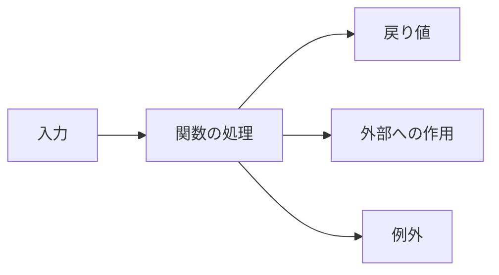

JavaScriptには、関数宣言、関数式、アロー関数、メソッド、`async` 関数など、似た書き方がいくつもあります。最初に構文を暗記すると、どれを選べばよいのか分からなくなりがちです。

選ぶ順序を逆にします。まず関数の役割を決め、その役割に必要な性質を持つ書き方を選びます。

## 最初に決めるのは「何を受け取り、何を返すか」

関数は、入力を受け取り、処理し、結果を呼び出し元へ返します。書き方が違っても、この契約は共通です。



良い関数名だけでは契約を説明しきれません。引数の条件、戻り値、失敗方法、副作用まで確認します。

```js
function calculateSubtotal(items) {
  if (!Array.isArray(items)) {
    throw new TypeError("itemsには配列が必要です");
  }

  return items.reduce(
    (total, item) => total + item.price * item.quantity,
    0,
  );
}
```

この関数は配列を受け取り、数値を返します。外部状態を変更しないため、同じ入力なら同じ結果になります。構文より先に、この契約を読めることが大切です。

呼び出し側から見ると、正常系では `items` の各要素に `price` と `quantity` があり、戻り値を小計として使えることが前提です。配列以外を渡した場合は数値を返さず、`TypeError` で契約違反を知らせます。関数を読むときは本体の計算式だけでなく、「どの入力を拒否し、失敗を何で伝えるか」まで含めて1つの契約として確認します。

実務では、要素の形や負数を許すかも決める必要があります。すべての検証をこの関数へ詰め込むという意味ではありません。外部入力の形式検証を別の境界で済ませるなら、この関数は検証済みの明細だけを受け取る、と型や名前で示せます。どの層が何を保証するかを決めると、重複した検証も不足した検証も減らせます。

## 4つの書き方は性質で使い分ける

| 書き方 | 主な性質 | 向いている場面 |
| --- | --- | --- |
| 関数宣言 | 宣言より前から呼び出せる | 名前のある主要処理・補助関数 |
| 関数式 | 関数を値として変数へ代入 | 条件による差し替え、関数の受け渡し |
| アロー関数 | 自分の `this` と `arguments` を持たない | 短いコールバック、外側の `this` を使う処理 |
| メソッド構文 | オブジェクトを受け手として呼ぶ | 状態の所有者に属する操作 |

同じ計算でも、置かれる文脈によって自然な書き方が変わります。

```js
// ファイル内の主要な処理
function calculateTax(price) {
  return price * 0.1;
}

// 関数を値として選ぶ
const formatPrice = locale === "ja-JP"
  ? (amount) => `${amount.toLocaleString("ja-JP")}円`
  : (amount) => `$${amount.toLocaleString("en-US")}`;

// 配列の各要素を変換する短いコールバック
const totals = orders.map((order) => order.total);

// 状態の所有者に属する操作
const cart = {
  items: [],
  add(item) {
    this.items.push(item);
  },
};
```

アロー関数は「短く書ける関数宣言」ではありません。コンストラクターとして `new` で呼べず、自分の `this` も持ちません。オブジェクトの状態へ `this` で触れるメソッドには、通常のメソッド構文を使う方が意図に合います。

上の例では、`calculateTax` はファイル内で名前を付けて再利用する計算なので、関数宣言にしています。`formatPrice` は実行時にどちらか1つの関数を選び、その後は同じ関数として呼ぶため、関数を値として変数へ入れています。`map` へ渡す処理は「各注文から合計だけを取り出す」という短いコールバックなので、外側の文脈を読みやすく保てるアロー関数が合います。

最後の `add` はカート自身の `items` を変更する操作です。`cart.add(item)` という呼び出し方と `this.items` の関係が設計上の意味を持つため、メソッド構文が自然です。同じ処理をどの構文でも書けるかより、利用側がどう呼ぶと意図を読み取れるかを基準にしてください。

## 引数は少なさより、意味のまとまりを優先する

引数が増えると、呼び出し側で値の意味が分かりにくくなります。

```js
createOrder("user-1", "item-9", 2, 1200, true);
```

オプションオブジェクトにすると、各値のラベルが呼び出し側にも現れます。

```js
createOrder({
  userId: "user-1",
  itemId: "item-9",
  quantity: 2,
  unitPrice: 1_200,
  expedited: true,
});
```

ただし、引数が2つあるだけで機械的にオブジェクト化する必要はありません。`divide(total, count)` のように順序と意味が明らかな場合は、位置引数の方が簡潔です。

デフォルト引数も、`undefined` のときだけ使われます。`null`、`0`、空文字列は渡された値として扱われる点に注意してください。

## `return` は値だけでなく、処理の終了も伝える

`return` は結果を返すと同時に、その関数の実行を終えます。異常条件を先に返す早期 `return` を使うと、主要な処理を深い入れ子から出せます。

```js
function applyCoupon(order, coupon) {
  if (!coupon) return order;
  if (coupon.expiresAt < Date.now()) return order;
  if (order.total < coupon.minimum) return order;

  return {
    ...order,
    total: Math.max(0, order.total - coupon.discount),
  };
}
```

戻り値の型が経路ごとに変わると、呼び出し側が扱いにくくなります。成功時はオブジェクト、失敗時は `false`、別の失敗では例外という混在を避け、契約を揃えます。

## コールバックは「いつ、誰が、何を渡して呼ぶか」が契約

コールバックは後で呼ばれる関数というだけではありません。呼び出す側が、タイミング、引数、回数、失敗の扱いを決めます。

```js
function processOrders(orders, onProcessed) {
  for (const order of orders) {
    const result = { id: order.id, total: order.total };
    onProcessed(result, order);
  }
}

processOrders(orders, (result) => {
  console.log(result.id, result.total);
});
```

標準APIでも契約は異なります。`map` は各要素の戻り値を新しい配列に集めますが、`forEach` は戻り値を使いません。イベントリスナーは何度も呼ばれ、解除しない限り残ることがあります。関数だけを見ず、呼び出す側の仕様を読みます。

## 純粋な計算と副作用を分ける

テストしやすいコードでは、計算と外部I/Oの境界が見えます。

```js
function calculateTotal(items) {
  return items.reduce(
    (sum, item) => sum + item.price * item.quantity,
    0,
  );
}

async function submitOrder(input, api) {
  const total = calculateTotal(input.items);
  return api.save({ ...input, total });
}
```

`calculateTotal` は入力だけで結果が決まり、単体で検証できます。`submitOrder` は通信という副作用を担います。すべてを純粋関数にする必要はありません。副作用がどこにあるかを、名前と境界から見つけられることが重要です。

## `async` 関数とgeneratorは戻り値の形が違う

通常の関数と同じように見えても、宣言により呼び出し側の契約が変わります。

| 種類 | 呼び出し結果 | 向いている処理 |
| --- | --- | --- |
| 通常関数 | 値 | すぐ確定する1回の結果 |
| `async` 関数 | Promise | 後で確定する1回の結果 |
| ジェネレーター関数 | `Iterator` | 複数の値を段階的に生成 |
| 非同期ジェネレーター | `AsyncIterator` | 時間をかけて複数の値を生成 |

`async` を付けると、通常の値を `return` してもPromiseに包まれます。呼び出し側は `await` またはPromise連鎖で扱う必要があります。同期的に終わる計算へ理由なく `async` を付けると、不要な非同期契約を増やします。

## 読みやすい関数かを確認する5つの質問

1. 名前から、行うことを1つに絞れるか。
2. 引数の意味と許容値が呼び出し側から分かるか。
3. すべての経路で戻り値と失敗方法が揃っているか。
4. 外部状態を変更する場所が見つけやすいか。
5. コールバックやPromiseの所有者が明確か。

関数が長いこと自体より、複数の抽象度が混ざっていることが問題です。業務判断、文字列整形、HTTP通信、DOM更新が1つの関数に並んでいたら、責務の境界を探します。

JavaScriptの関数は柔軟です。だからこそ、書き方から選ぶと判断軸を失います。入力、戻り値、副作用、呼び出され方を先に決めれば、関数宣言・アロー関数・メソッドのどれが合うかは後から自然に決まります。

## 参考資料

- [MDN: Functions](https://developer.mozilla.org/ja/docs/Web/JavaScript/Guide/Functions)
- [MDN: Arrow 関数 expressions](https://developer.mozilla.org/ja/docs/Web/JavaScript/Reference/Functions/Arrow_functions)
- [ECMAScript: Function Definitions](https://tc39.es/ecma262/multipage/ecmascript-language-functions-and-classes.html)
- [MDN: async 関数](https://developer.mozilla.org/ja/docs/Web/JavaScript/Reference/Statements/async_function)
- [MDN: 関数*](https://developer.mozilla.org/ja/docs/Web/JavaScript/Reference/Statements/function*)
