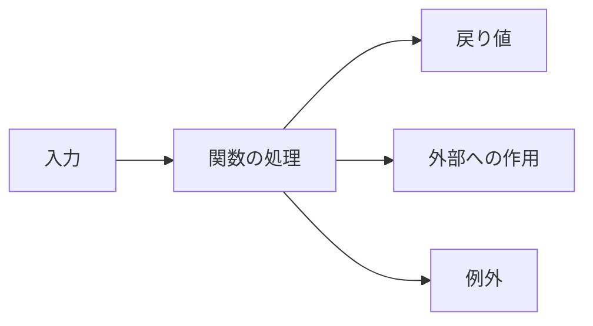

関数宣言、関数式、アロー関数、メソッド、`async` 関数。

書き方がありすぎませんか。私は最初、この一覧を丸ごと覚えようとして失敗しました。構文は覚えられたのに、いざ書く段になると「で、どれ使うんだっけ」で手が止まる。

順序が逆だったんです。

構文から選ぶのをやめて、**先に関数の役割を決める**。役割が決まれば、必要な性質が決まって、書き方は自動的に残ります。

## 最初に決めるのは、受け取るものと返すもの

関数は、入力を受け取って、処理して、結果を返します。書き方が違っても、この契約は同じです。



いい名前を付ければ契約が伝わる、というものでもありません。引数の条件、戻り値、失敗のしかた、副作用。ここまで含めて契約です。

```js
function calculateSubtotal(items) {
  if (!Array.isArray(items)) {
    throw new TypeError("itemsには配列が必要です");
  }

  return items.reduce(
    (total, item) => total + item.price * item.quantity,
    0,
  );
}
```

配列を受け取って、数値を返す。外部の状態はいじらないので、同じ入力なら必ず同じ結果になります。構文より先に、こういう契約が読めることのほうが大事です。

呼び出し側の視点で言い直すと、こうなります。正常系では `items` の各要素に `price` と `quantity` があって、戻り値を小計として使える。配列以外を渡したら数値は返ってこず、`TypeError` で契約違反を知らされる。

本体の計算式だけを読んで終わりにしないでください。**どの入力を拒否して、失敗を何で伝えるか**まで含めて、ひとつの契約です。

実務では、要素の形や負数を許すかも決める必要が出てきます。といって、検証を全部この関数に詰め込めという話ではありません。外部入力の形式チェックを別の境界で済ませるなら、この関数は「検証済みの明細だけを受け取る」と型や名前で示せます。どの層が何を保証するのか。ここを決めておくと、二重の検証も抜けた検証も減ります。

## 4つの書き方、それぞれの性質

| 書き方 | 主な性質 | 向いている場面 |
| --- | --- | --- |
| 関数宣言 | 宣言より前から呼び出せる | 名前のある主要処理・補助関数 |
| 関数式 | 関数を値として変数へ代入 | 条件による差し替え、関数の受け渡し |
| アロー関数 | 自分の `this` と `arguments` を持たない | 短いコールバック、外側の `this` を使う処理 |
| メソッド構文 | オブジェクトを受け手として呼ぶ | 状態の所有者に属する操作 |

同じ計算でも、置かれる場所によって自然な書き方は変わります。

```js
// ファイル内の主要な処理
function calculateTax(price) {
  return price * 0.1;
}

// 関数を値として選ぶ
const formatPrice = locale === "ja-JP"
  ? (amount) => `${amount.toLocaleString("ja-JP")}円`
  : (amount) => `$${amount.toLocaleString("en-US")}`;

// 配列の各要素を変換する短いコールバック
const totals = orders.map((order) => order.total);

// 状態の所有者に属する操作
const cart = {
  items: [],
  add(item) {
    this.items.push(item);
  },
};
```

ここで強調しておきたいことがあります。**アロー関数は「短く書ける関数宣言」ではありません。** `new` で呼べませんし、自分の `this` も持ちません。オブジェクトの状態に `this` で触るメソッドには、素直にメソッド構文を使うほうが意図に合います。

上の例を1つずつ見ると、`calculateTax` はファイル内で名前を付けて使い回す計算なので関数宣言。`formatPrice` は実行時にどちらか一方を選んで、その後はずっと同じ関数として呼ぶので、関数を値として変数に入れています。`map` に渡す処理は「各注文から合計を取り出す」だけの短い仕事なので、外側の文脈を邪魔しないアロー関数。

最後の `add` は、カート自身の `items` を書き換える操作です。`cart.add(item)` という呼び方と `this.items` の関係そのものに設計上の意味があるので、メソッド構文が自然になります。

判断基準は「どの構文でも書けるか」ではありません。**利用側がどう呼ぶと意図が伝わるか**です。

## 引数は、少なさより意味のまとまり

引数が増えると、呼び出し側で何が何だか分からなくなります。

```js
createOrder("user-1", "item-9", 2, 1200, true);
```

最後の `true` は何でしょう。定義を見に行かないと分かりません。

```js
createOrder({
  userId: "user-1",
  itemId: "item-9",
  quantity: 2,
  unitPrice: 1_200,
  expedited: true,
});
```

オブジェクトにすると、ラベルが呼び出し側にも現れます。

ただ、引数が2つあれば機械的にオブジェクト化、というのも違います。`divide(total, count)` のように順序と意味が明らかなら、位置引数のほうが簡潔です。

デフォルト引数についても一点。あれが効くのは `undefined` のときだけです。`null`、`0`、空文字列は「渡された値」として扱われます。

## `return` は、終了の合図でもある

`return` は結果を返すと同時に、その関数を終わらせます。異常な条件を先に返してしまえば、主要な処理を深い入れ子から救い出せます。

```js
function applyCoupon(order, coupon) {
  if (!coupon) return order;
  if (coupon.expiresAt < Date.now()) return order;
  if (order.total < coupon.minimum) return order;

  return {
    ...order,
    total: Math.max(0, order.total - coupon.discount),
  };
}
```

気をつけたいのは、経路ごとに戻り値の型が変わる関数です。成功するとオブジェクト、ある失敗では `false`、別の失敗では例外。これをやられると、呼び出し側は毎回3通りの受け止め方を用意することになります。契約は揃えてください。

## コールバックの契約は、呼ぶ側が持っている

コールバックは「あとで呼ばれる関数」というだけではありません。タイミング、引数、回数、失敗の扱い。全部、呼び出す側が決めています。

```js
function processOrders(orders, onProcessed) {
  for (const order of orders) {
    const result = { id: order.id, total: order.total };
    onProcessed(result, order);
  }
}

processOrders(orders, (result) => {
  console.log(result.id, result.total);
});
```

標準APIでも契約はバラバラです。`map` は各要素の戻り値を集めますが、`forEach` は戻り値を捨てます。イベントリスナーは何度も呼ばれて、解除しない限り居座ります。

渡す関数だけ見ていても分かりません。呼ぶ側の仕様を読んでください。

## 計算と副作用に、線を引く

テストしやすいコードには、計算と外部I/Oの境界が見えています。

```js
function calculateTotal(items) {
  return items.reduce(
    (sum, item) => sum + item.price * item.quantity,
    0,
  );
}

async function submitOrder(input, api) {
  const total = calculateTotal(input.items);
  return api.save({ ...input, total });
}
```

`calculateTotal` は入力だけで結果が決まるので、単体でそのまま検証できます。`submitOrder` は通信という副作用を引き受けています。

全部を純粋関数にする必要はありません。副作用が**どこにあるか**を、名前と境界から見つけられること。それが目的です。

## `async` を付けると、契約が変わる

見た目は同じ関数でも、宣言のしかたで呼び出し側の契約が変わります。

| 種類 | 呼び出し結果 | 向いている処理 |
| --- | --- | --- |
| 通常関数 | 値 | すぐ確定する1回の結果 |
| `async` 関数 | Promise | 後で確定する1回の結果 |
| ジェネレーター関数 | `Iterator` | 複数の値を段階的に生成 |
| 非同期ジェネレーター | `AsyncIterator` | 時間をかけて複数の値を生成 |

`async` を付けた時点で、通常の値を `return` してもPromiseに包まれます。呼び出し側は `await` かPromise連鎖で受けることになる。

同期で終わる計算に、なんとなく `async` を付けないでください。要らない非同期契約が一つ増えます。

## 読みやすいかを確かめる5問

1. 名前から、行うことを1つに絞れるか。
2. 引数の意味と許容値が呼び出し側から分かるか。
3. すべての経路で戻り値と失敗方法が揃っているか。
4. 外部状態を変更する場所が見つけやすいか。
5. コールバックやPromiseの所有者が明確か。

関数が長いこと自体は、実はそこまで問題ではありません。まずいのは、**抽象度が混ざっている**ことです。業務判断と文字列整形とHTTP通信とDOM更新が同じ深さに並んでいたら、そこに境界が隠れています。

---

冒頭の「どれ使うんだっけ」に戻ります。

あれで止まっていたのは、構文の知識が足りなかったからではありませんでした。役割を決める前に書き方を選ぼうとしていたからです。

入力、戻り値、副作用、呼ばれ方。この4つを先に決めてしまえば、関数宣言かアロー関数かメソッドかは、あとから勝手に決まります。

## 参考資料

- [MDN: Functions](https://developer.mozilla.org/ja/docs/Web/JavaScript/Guide/Functions)
- [MDN: Arrow 関数 expressions](https://developer.mozilla.org/ja/docs/Web/JavaScript/Reference/Functions/Arrow_functions)
- [ECMAScript: Function Definitions](https://tc39.es/ecma262/multipage/ecmascript-language-functions-and-classes.html)
- [MDN: async 関数](https://developer.mozilla.org/ja/docs/Web/JavaScript/Reference/Statements/async_function)
- [MDN: 関数*](https://developer.mozilla.org/ja/docs/Web/JavaScript/Reference/Statements/function*)
