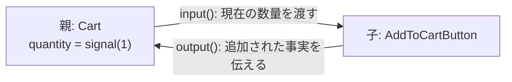
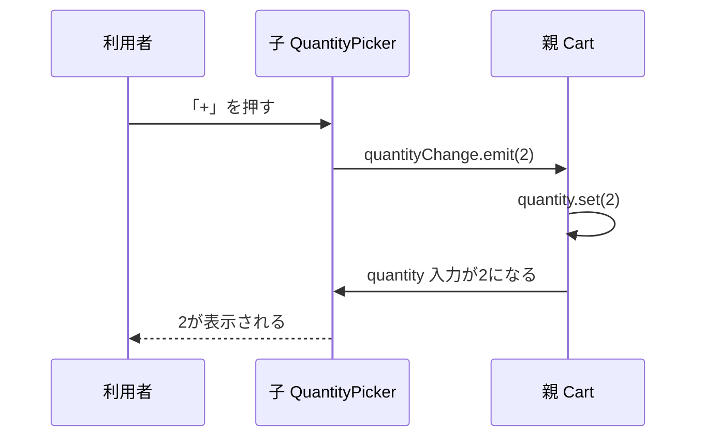
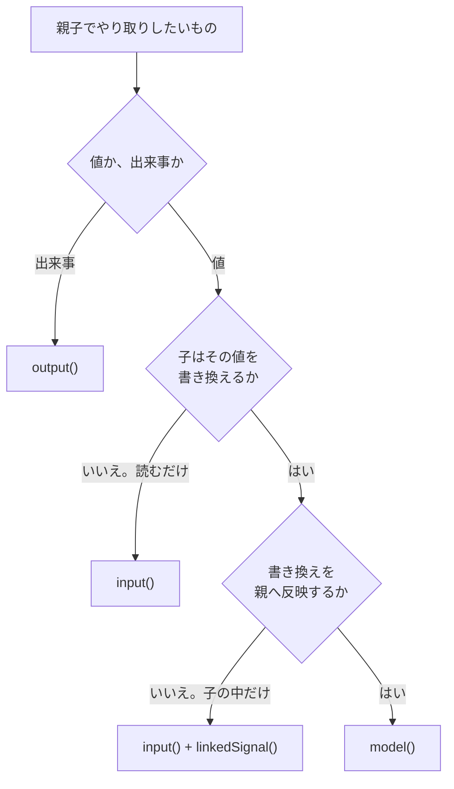

Angularで親子のコンポーネントがデータを受け渡すとき、長いあいだこう書いていました。

```ts
@Input() price = 0;
@Output() added = new EventEmitter<number>();
```

いまは関数で書きます。

```ts
readonly price = input(0);
readonly added = output<number>();
```

デコレーターが関数になっただけ。私は最初、そう受け取りました。

違いました。変わったのは受け渡しの仕組みそのものです。

`input()`が返すのはSignalです。テンプレートで`price()`と読めば、Angularは「この表示は`price`に依存している」と記録します。`computed()`の中からも読める。値がいつ届いたかを`ngOnChanges`で見張る必要が、まるごと消えました。

そしてもうひとつ、デコレーター時代には存在しなかった関数があります。`model()`です。ひとつの値を親子の両方が書き換える場面のために用意されています。

つまり、親子でやり取りする手段は3つに増えました。`input()`、`output()`、`model()`です。増えたぶん、どれを選ぶかで迷います。判断の軸はひとつだけ考えれば足ります。**その値は誰のもので、どちらへ流れるのか**。

この記事では、Angular 22を前提に3つを順に見ていきます。題材は買い物カゴです。価格を表示する`PriceTag`、数量を選ぶ`QuantityPicker`、カゴへの追加を親へ知らせるボタンを作りながら進めます。読み終えると、目の前のやり取りをどの関数で書くべきか、迷わず決められるようになります。

なお、Signal自体の基本については別記事『Angular Signals完全入門――signal・computed・effectの正しい使い分け』で扱っています。`signal()`や`computed()`が初めてなら、そちらを先に読んでください。

## `input()`は親から子へ流れる値を受け取る

もっとも使う機会が多いのが`input()`です。親が持っている値を、子が受け取って表示する。この一方通行を表します。

単価と数量から金額を表示する`PriceTag`を作ります。

```ts:src/app/price-tag.ts
import { Component, computed, input } from '@angular/core';

@Component({
  selector: 'app-price-tag',
  template: `<p>{{ label() }}</p>`,
})
export class PriceTag {
  readonly price = input(0);
  readonly quantity = input(1);

  protected readonly label = computed(
    () => `${this.price() * this.quantity()}円`,
  );
}
```

`input(0)`と書くと、初期値`0`を持つ入力ができます。初期値から型が推論されるため、`input<number>(0)`と書く必要はありません。フィールドは`readonly`です。入力という入れ物を差し替えることはなく、中身は親から流れてくるだけだからです。

親のテンプレートからは、プロパティ束縛で値を渡します。

```html
<app-price-tag [price]="500" [quantity]="quantity()" />
```

読むときは`()`を付けます。`this.price()`です。ここが従来の`@Input`との一番の違いです。値がSignalとして届くので、`computed()`の依存にそのまま置けます。上の例では`label`が`price`と`quantity`の両方に依存しています。どちらが変わっても、金額の表示は自動で更新されます。

`ngOnChanges`で変化を拾って再計算する、という手順は要りません。派生値の求め方を`computed()`に一度書いておけば済みます。

### 子からは、書き換えられない

`input()`が返すのは`InputSignal`です。公式ドキュメントはこう書いています。「`input`関数で作られたSignalは読み取り専用である」。

つまり、子から書き換える手段がありません。

```ts
this.price.set(800);    // 型エラー。set() は存在しない
this.price.update(...); // 同じく型エラー
```

不便に見えて、これは境界の宣言です。

`price`の値を決めるのは親だけ。子は表示に使うだけ。誰が値を持っているのかが、型で固定されます。おかげで、金額がおかしいときに調べる場所は親の1か所に決まります。

### 束縛を必須にするなら`input.required()`

初期値を持たせず、親からの束縛を必須にできます。

```ts
readonly productId = input.required<string>();
```

`input.required()`で宣言した入力を親が束縛し忘れると、ビルド時にエラーになります。実行してから`undefined`に気付く、という流れを避けられます。

型の面でも扱いが楽です。公式ドキュメントの言葉を借りると、「必須入力は型引数へ`undefined`を自動的に含めない」。`productId()`の戻り値は`string`です。`?? ''`のような防御を書かずに使えます。

商品IDやユーザーIDのように、渡されなければコンポーネントが成り立たない値には`input.required()`を使ってください。

### `transform`で受け取った値を整える

テンプレートから渡される値の形をそろえたいときは、`transform`オプションを使います。

```ts
import { booleanAttribute, input, numberAttribute } from '@angular/core';

readonly soldOut = input(false, { transform: booleanAttribute });
readonly stock = input(0, { transform: numberAttribute });
```

`booleanAttribute`は、HTMLの属性のように書かれた値を真偽値へ変換します。`<app-price-tag soldOut />`のような属性形式の指定を受け取れます。`numberAttribute`は文字列を数値へ変換します。どちらもAngularが用意している変換関数です。

自分で変換関数を渡すこともできます。ただし条件があります。変換関数は純粋で、静的に解析できる形にしてください。外部の状態を読んだり、副作用を起こしたりする関数は向きません。

### テンプレート上の名前を変えるなら`alias`

フィールド名と、親から束縛するときの名前を分けられます。

```ts
readonly value = input(0, { alias: 'sliderValue' });
```

親側は`[sliderValue]="50"`と書きます。既存のテンプレートを壊さずにフィールド名を整理したいときに使います。ただし、名前が2つあると読む人が対応を追う手間が増えます。理由があるときだけ使ってください。

### 入力から先へ進むなら`computed()`か`linkedSignal()`

入力は読み取り専用です。それでも、受け取った値を加工したり、子の内側で書き換えたりしたい場面はあります。行き先は2つに分かれます。

入力から値を導くだけなら`computed()`です。上の`PriceTag`の`label`がその例です。入力が変われば派生値も変わり、子が書き換えることはありません。

入力に連動しつつ、子の中でも書き換えたいなら`linkedSignal()`です。たとえば、親から渡された配送方法の一覧のうち先頭を既定で選んでおき、利用者が選び直せるようにする場合です。`linkedSignal()`は入力が変わると計算をやり直し、それ以外のときは`set()`で入れた値を保ちます。ただし、この書き換えは子の中で完結します。親へは伝わりません。書き換えを親へ返したいなら、この記事の後半で扱う`output()`か`model()`の出番です。

## `output()`は子で起きたことを親へ知らせる

`input()`が親から子への流れなら、`output()`は逆向きです。子で何かが起きたことを親へ伝えます。

「カゴに入れる」ボタンを子として切り出します。

```ts:src/app/add-to-cart-button.ts
import { Component, input, output } from '@angular/core';

@Component({
  selector: 'app-add-to-cart-button',
  template: `<button (click)="add()">カゴに入れる</button>`,
})
export class AddToCartButton {
  readonly quantity = input(1);
  readonly added = output<number>();

  protected add(): void {
    this.added.emit(this.quantity());
  }
}
```

親側はイベント束縛で受けます。

```html
<app-add-to-cart-button [quantity]="quantity()" (added)="onAdded($event)" />
```

`output<number>()`の型引数は、流す値の型です。`emit()`へ渡した値は、親のテンプレートで`$event`として受け取れます。値を伴わないなら`output<void>()`と宣言し、`emit()`を引数なしで呼びます。

### 出力は、値を覚えていない

`input()`と`model()`がSignalを返すのに対して、`output()`が返すのは`OutputEmitterRef`です。Signalではありません。

違いは、値を保持しないことです。`OutputEmitterRef`はイベントを流す口だけを持ちます。「最後に流した値」を後から読み取る手段はありません。`this.added()`のように読もうとしても、そういうAPIではないのです。

この性質は、`output()`が何を表すかをよく示しています。出力が運ぶのは状態ではなく出来事です。「カゴに追加された」という事実は、起きた瞬間に意味があります。あとから参照する現在値ではありません。現在値として持ちたいなら、それは親側の`signal()`が担うものです。

親子のあいだで、値と出来事はこう流れます。



数量という値は親が持ち続けます。子はそれを読み、押されたことだけを親へ返します。値の持ち主が動かない点に注目してください。

### 名前は起きた出来事で決める

出力の名前は、命令ではなく出来事として付けます。公式ドキュメントの例は`panelClosed`や`valueChanged`です。動詞の過去形が中心です。

`closePanel`のような命令形の名前を付けると、子が親へ指示を出しているように読めます。実際に起きているのは逆です。子は「パネルが閉じられた」と報告するだけで、それを受けて何をするかは親が決めます。名前を過去形にしておくと、この関係が読み手に伝わります。

上の例で`added`としたのも同じ理由です。`add`ではありません。カゴへ実際に入れるのは親の仕事です。

### 名前を変えるなら`alias`

`output()`のオプションは`alias`だけです。

```ts
readonly changed = output({ alias: 'valueChanged' });
```

親側は`(valueChanged)="..."`で受けます。`input()`と違って`transform`はありません。流す値は`emit()`を呼ぶ側で整えてください。

### 動的に生成した子は購読で受ける

テンプレートを介さず、プログラムから子を生成する場合もあります。このときはイベント束縛が書けないので、購読します。

```ts
const subscription = componentRef.instance.added.subscribe((quantity) => {
  console.log(quantity);
});
```

返るのは`OutputRefSubscription`で、`unsubscribe()`で購読を終えられます。通常のテンプレート束縛では、この後始末はAngularが引き受けます。自分で`subscribe()`したときだけ、解除の責任も自分で持ちます。

## 親が値を持ち、子は変更だけを要求する

`input()`と`output()`は組み合わせて使えます。この組み合わせが、双方向のやり取りの土台になります。

数量を選ぶ`QuantityPicker`を、まずは`input()`と`output()`だけで書いてみます。

```ts:src/app/quantity-picker.ts
import { Component, input, output } from '@angular/core';

@Component({
  selector: 'app-quantity-picker',
  template: `
    <button (click)="change(-1)">-</button>
    <span>{{ quantity() }}</span>
    <button (click)="change(+1)">+</button>
  `,
})
export class QuantityPicker {
  readonly quantity = input(1);
  readonly quantityChange = output<number>();

  protected change(amount: number): void {
    this.quantityChange.emit(this.quantity() + amount);
  }
}
```

親は値を持ち、子からの要求を受けて書き換えます。

```ts:src/app/cart.ts
import { Component, signal } from '@angular/core';
import { QuantityPicker } from './quantity-picker';

@Component({
  selector: 'app-cart',
  imports: [QuantityPicker],
  template: `
    <app-quantity-picker
      [quantity]="quantity()"
      (quantityChange)="updateQuantity($event)"
    />
    <p>{{ quantity() }}個をカゴに入れます</p>
  `,
})
export class Cart {
  protected readonly quantity = signal(1);

  updateQuantity(next: number): void {
    this.quantity.set(Math.max(1, next));
  }
}
```

ここで起きていることを追ってみます。



大事なのは、子が自分の表示を直接書き換えていない点です。子は「2にしてほしい」と要求し、親が受け入れて`set()`し、その結果が入力として子へ戻ってきます。値の持ち主は親のままです。

この形の利点は、親が要求を検査できることです。上の`updateQuantity()`は`Math.max(1, next)`で下限を守っています。子が`0`を要求しても、親が`1`に留めます。在庫数を超える要求を却下する、といった制御も同じ場所に書けます。

一方で、書く量は多めです。入力と出力を1組ずつ宣言し、親側にもハンドラーを用意します。「値を検査したいわけではなく、ただ子の操作を親へ同期したい」だけなら、この定型は繰り返しになります。

ここを短く書くための関数が`model()`です。

## `model()`は入力と出力のペアをひとつにまとめる

`model()`は、公式ドキュメントの表現では「入力と出力のペアとして公開される書き込み可能なSignal」です。さきほど手書きした`quantity`と`quantityChange`の組を、1行で宣言できます。

```ts:src/app/quantity-picker.ts
import { Component, model } from '@angular/core';

@Component({
  selector: 'app-quantity-picker',
  template: `
    <button (click)="change(-1)">-</button>
    <span>{{ quantity() }}</span>
    <button (click)="change(+1)">+</button>
  `,
})
export class QuantityPicker {
  readonly quantity = model(1);

  protected change(amount: number): void {
    this.quantity.update((current) => current + amount);
  }
}
```

`output()`の宣言も、`emit()`の呼び出しも消えました。代わりに子が自分で`update()`します。`model()`が返すのは`ModelSignal`で、`set()`と`update()`を持つ書き込み可能なSignalです。

親のテンプレートは`[()]`で束縛します。バナナを箱に入れた形に見えるので、banana-in-a-boxと呼ばれます。

```ts:src/app/cart.ts
import { Component, signal } from '@angular/core';
import { QuantityPicker } from './quantity-picker';

@Component({
  selector: 'app-cart',
  imports: [QuantityPicker],
  template: `
    <app-quantity-picker [(quantity)]="quantity" />
    <p>{{ quantity() }}個をカゴに入れます</p>
  `,
})
export class Cart {
  protected readonly quantity = signal(1);
}
```

親のコードからハンドラーが消えました。子で`update()`が呼ばれると、親の`quantity`も新しい値になります。

### バナナの箱に、魔法はない

`[(quantity)]`という記法は、新しい種類の束縛ではありません。プロパティ束縛`[]`とイベント束縛`()`を並べて書いたものです。

`model()`は、入力と同時に出力も定義します。出力の名前は自動的に決まります。公式ドキュメントの説明では「入力名の末尾に`Change`を付けた名前が出力名になる」。`quantity`なら`quantityChange`です。

つまり`[(quantity)]="quantity"`は、`[quantity]="quantity()"`と`(quantityChange)="quantity.set($event)"`をまとめた書き方に相当します。前の節で手書きしたものと同じ構造です。子が`set()`や`update()`を呼ぶと`quantityChange`が発火し、親へ届きます。

だからこそ、`model()`を「魔法の双方向束縛」として覚える必要はありません。中身は入力と出力の組です。

### 親側はプレーンなプロパティでも束縛できる

親が束縛する相手はSignalでなくてもかまいません。公式の双方向束縛ガイドの例では、親のフィールドがただの数値です。

```ts
export class App {
  initialCount = 18;
}
```

テンプレートは`[(count)]="initialCount"`です。子が値を更新すると、親のプロパティにも代入されます。

書き込み可能なSignalを束縛すると、そのSignalが子と同期します。子の`set()`が親のSignalへ届き、親が`set()`した値は入力として子へ届きます。Signal中心で状態を組んでいるなら、こちらを使ってください。親側の`computed()`からも同じ値を読めるようになります。

### 3つの宣言の形

`model()`にも`input()`と同じく3つの形があります。

```ts
readonly a = model<number>();          // 省略可能。既定は undefined
readonly b = model(1);                 // 初期値あり
readonly c = model.required<number>(); // 束縛が必須
```

`model.required()`で宣言した値を親が束縛しないと、コンパイルエラーになります。子が値の書き換えを前提にしているのに親が受け取らない、という組み合わせを防げます。

### `transform`だけは使えない

ここは覚えておいてください。`model()`は`transform`オプションを持ちません。公式ドキュメントの記述は「モデル入力は入力変換をサポートしない」です。

`alias`は使えます。使えないのは`transform`だけです。

理由は流れの向きを考えるとわかります。`model()`の値は親から子へも、子から親へも流れます。片方向の入力なら「入ってくるときに変換する」で筋が通りますが、双方向では変換をどちらに掛けるのかが定まりません。

`booleanAttribute`のような変換が必要なら、その値は`model()`に向いていません。`input()`で受け取ってください。

## 使い分けは値の所有者と書く人で決まる

3つそろいました。選び方は2つの問いで決まります。やり取りするものが値か出来事か。値なら、それを書くのは誰か。



表にすると次のようになります。

| やり取りするもの | 使う関数 | 返るもの | 子から書けるか | 例 |
| --- | --- | --- | --- | --- |
| 親が持つ値を子が表示する | `input()` | `InputSignal` | 書けない | 単価、商品名、在庫数 |
| 子で起きた出来事を親へ伝える | `output()` | `OutputEmitterRef` | ― | カゴへの追加、削除の確認 |
| 同じ値を親子の両方が書く | `model()` | `ModelSignal` | 書ける | 数量、チェック状態、開閉、ページ番号 |
| 値の所有は親、変更は親が検査する | `input()` + `output()` | 上の2つ | 要求のみ | 上限つきの数量、権限つきの編集 |

迷ったら`input()`から始めてください。読むだけの入力は、いちばん壊れにくい形です。親と子の関係が「渡す」と「読む」だけに収まり、値の出どころが1か所に固定されます。

双方向は結合を強めます。`model()`を選ぶと、子は値を保持するだけでなく、書き換える責任まで持ちます。親から見れば、自分の状態を子に触らせることになります。これを選ぶのは「子が値を書き換えるのがUIとして本質である」ときだけにしてください。数量選択、チェックボックス、アコーディオンの開閉、ページネーションが典型です。どれも、操作したその場で値が変わることが部品の役目です。

逆に、変更の内容を親が検査したいなら`input()`と`output()`の組に戻ります。上限や権限のチェックを挟む余地が生まれます。`model()`では、子の`set()`がそのまま通ります。

## `@Input`と`@Output`は使い続けてもよい

ここまで関数APIを勧めてきましたが、デコレーターが使えなくなったわけではありません。公式ドキュメントはこう書いています。「Angularチームは新規プロジェクトではSignalベースの`input`関数を推奨するが、元のデコレーターベースの`@Input` APIは完全にサポートされ続ける」。`@Output`と`EventEmitter`についても同じ記述があります。

非推奨ではありません。ですから、既存プロジェクトを一気に書き換える必要はありません。ひとつのコンポーネントの中でデコレーターと関数が混在しても動きます。新しく足す入出力から関数で書き、触る機会が来たコンポーネントを順に移していく進め方で十分です。

まとめて移したいときは、公式のマイグレーションが2つ用意されています。

```bash
ng generate @angular/core:signal-input-migration
ng generate @angular/core:output-migration
```

`signal-input-migration`は`@Input`を`input()`へ変換します。宣言だけではありません。テンプレート、hostバインディング、TypeScript内の参照も、Signal呼び出しの形へ書き換わります。`this.price`が`this.price()`になる、という変更が自動で入ります。

`output-migration`は`@Output`を`output()`へ変換します。`event.next()`は`event.emit()`へ書き換わり、`event.complete()`の呼び出しは削除されます。`output()`が返すのはSignalでもObservableでもないので、完了の概念がないためです。

どちらもVS Codeのリファクタリングアクションから実行できます。ファイル単位で試したいときは、こちらのほうが手軽です。

移行後は差分に目を通してください。特に、テンプレート以外の場所で入力を参照していたコードは、`()`の追加が正しく入っているか確認する価値があります。

## 症状別のつまずきどころ

### 入力に代入できないと言われる

`input()`で宣言したフィールドへ`set()`や`update()`を呼ぶと、型エラーになります。`InputSignal`は読み取り専用だからです。

対処は、何をしたいのかで分かれます。値を加工したいだけなら`computed()`を足します。子の中だけで書き換えたいなら`linkedSignal()`を使います。書き換えを親へ返したいなら、`input()`を`model()`へ変えるか、`output()`を足して変更を要求する形にします。

読み取り専用は不便な仕様ではありません。「この値は自分のものではない」と型が教えてくれている状態です。

### `[( )]`の束縛がコンパイルできない

`[(quantity)]`と書いてテンプレートのコンパイルが通らないときは、子側の宣言を確認します。よくある原因は2つです。

ひとつは、子が`input()`のままになっていることです。`model()`へ変えるか、`quantityChange`という名前の出力を自分で足す必要があります。もうひとつは、出力名が規則から外れていることです。`[(quantity)]`が探すのは`quantityChange`です。`onQuantityChange`や`quantityChanged`では対応しません。

`alias`を使っているときも注意してください。`[()]`が見るのはテンプレート上の名前です。フィールド名ではありません。

### `transform`が効かない

`transform`を指定したのに変換されないなら、その宣言が`model()`かどうかを確かめてください。`model()`は入力変換をサポートしません。

変換が必要な値は`input()`で受けます。双方向にしたいなら、変換を親側で済ませてから渡す形に組み替えてください。

### 子で`set()`したのに親の値が変わらない

`model()`で宣言し、子で`set()`も呼んでいるのに親が追随しないときは、親のテンプレートを見てください。`[quantity]="quantity()"`のように片方向で束縛していると、子から出た`quantityChange`を誰も受け取りません。`[(quantity)]="quantity"`へ直します。

`model()`は片方向でも束縛できます。エラーになりません。子の内側では値が変わり、表示も更新されます。ただし親へは戻りません。エラーが出ないぶん、原因に気付くまで時間がかかりやすい部分です。

### 必須の入力を渡し忘れる

`input.required()`や`model.required()`で宣言した値を親が束縛していないと、ビルドが失敗します。子を新しく置いたときや、`alias`で名前を変えたときに起きやすいエラーです。

実行時に`undefined`で落ちるより、ビルド時に止まるほうが安全です。必須の入力は、そのために必須と宣言してあります。

## まとめ

- `input()`は親から子への一方通行です。返るのは読み取り専用の`InputSignal`で、`computed()`の依存に置けます
- `output()`は子で起きた出来事を親へ伝えます。返るのは`OutputEmitterRef`で、Signalではなく値を保持しません
- `model()`は「入力＋`xChange`出力」のペアで、書き込み可能な`ModelSignal`を返します。親は`[(x)]`で束縛します
- 変更内容を親が検査したいなら、`model()`ではなく`input()`と`output()`の組に分けます
- `@Input`と`@Output`は非推奨ではありません。混在させたまま、2つのマイグレーションで順に移せます
- `model()`に`transform`はありません。変換が必要な値は`input()`で受けてください

冒頭の「関数になっただけ」に戻ります。

変わったのは書き方ではなく、**値の持ち主が型に書かれるようになったこと**でした。`InputSignal`は読み取り専用。`ModelSignal`は書き込み可能。この違いが、そのまま設計の宣言になっています。

だから迷ったときの問いも、ひとつで済みます。

**この値は誰のもので、どちらへ流れるのか。**

親のものなら`input()`。値ではなく出来事なら`output()`。両方が書くなら`model()`。それだけ決めておけば、コンポーネントの境界はほとんど自動的に引けます。

## 参考資料

- [Angular: Accepting data with input properties](https://angular.dev/guide/components/inputs)
- [Angular: Custom events with outputs](https://angular.dev/guide/components/outputs)
- [Angular: Two-way binding](https://angular.dev/guide/templates/two-way-binding)
- [Angular: input](https://angular.dev/api/core/input)
- [Angular: output](https://angular.dev/api/core/output)
- [Angular: model](https://angular.dev/api/core/model)
- [Angular: Migration to signal inputs](https://angular.dev/reference/migrations/signal-inputs)
- [Angular: Migration to outputs](https://angular.dev/reference/migrations/outputs)
