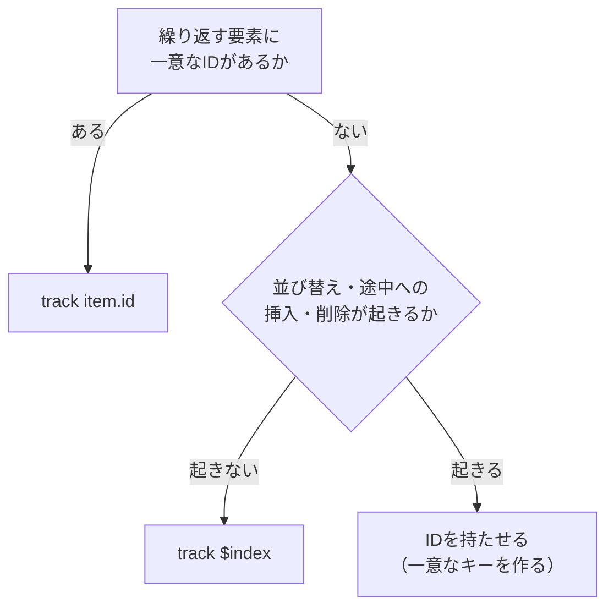

同じ条件分岐を、2つの書き方で並べてみます。

```html
<!-- 以前の書き方 -->
<p *ngIf="isLoggedIn(); else loginBlock">こんにちは</p>
<ng-template #loginBlock>
  <button (click)="login()">ログイン</button>
</ng-template>
```

```html
<!-- いまの書き方 -->
@if (isLoggedIn()) {
  <p>こんにちは</p>
} @else {
  <button (click)="login()">ログイン</button>
}
```

新しい構文は分岐の対応関係を追いやすくなっています。ただし、変更点は読みやすさだけではありません。

`*ngIf`はAngular 20で非推奨になりました。APIリファレンスにはっきり書いてあります。「`@if`ブロックを使ってください。将来のメジャーリリースで削除する予定です」。

とはいえ、日本語で検索して出てくる情報は、いまだに`*ngIf`が大半です。だから移行の判断に必要な材料を、ここにまとめておきます。Angular 22を前提に、`@if`・`@for`・`@switch`の書き方と、`@for`で必須になった`track`を扱います。

先に言っておくと、`track`は記法の変更ではありません。**指定を間違えると、画面が壊れます。** この記事の半分はその話です。

## 非推奨になったのは3つだけ

まず範囲をはっきりさせます。非推奨になったのは`NgIf`・`NgFor`・`NgSwitch`の3つです。

| 状態 | 対象 |
| --- | --- |
| 非推奨 | `NgIf`、`NgFor`、`NgSwitch`（および`NgSwitchCase`・`NgSwitchDefault`） |
| 非推奨ではない | 構造Directiveという仕組みそのもの、`NgClass`、`NgStyle`、各種Pipe |

構造Directiveが使えなくなるわけではありません。自作の構造Directiveも、`ng-template`も、`ngTemplateOutlet`もそのまま使えます。廃止されるのは、組み込み構文で置き換えられる3つだけです。

削除の時期も確認しておきます。Angular 20で非推奨になった時点では、v22での削除が見込まれていました。実際にはv22でも引き続き動作します。いま使っているコードが明日壊れることはありません。

ただし、非推奨のAPIは新機能の対象外になります。実際、後述する`@for`の差分更新の改善は`*ngFor`には入っていません。急ぐ必要はありませんが、いずれ移行する前提で考えておくのが現実的です。

なお、組み込みの制御フロー自体はAngular 17で導入され、18で安定版になりました。すでに枯れた機能です。

## `@if` — 条件分岐

基本の形はJavaScriptの`if`とほぼ同じです。

```html
@if (status() === 'loading') {
  <p>読み込み中です</p>
} @else if (status() === 'error') {
  <p>エラーが発生しました</p>
} @else {
  <p>{{ data() }}</p>
}
```

`*ngIf`との違いが一番出るのは`@else`です。旧来の書き方では、`else`の行き先を`ng-template`として別に用意し、テンプレート参照変数で名前を付けて指すしかありませんでした。

```html
<!-- 以前の書き方：分岐が2か所に散る -->
<p *ngIf="loading; else loaded">読み込み中です</p>
<ng-template #loaded>
  <p>{{ data }}</p>
</ng-template>
```

条件とその結果が離れた場所に置かれるため、分岐が3つ以上になると追いきれなくなります。`@if`では、分岐がひとつのブロックにまとまります。

### `as`で結果に名前を付ける

条件式の結果をブロックの中で使うときは、`as`で別名を付けられます。

```html
@if (user(); as u) {
  <p>{{ u.name }}（{{ u.email }}）</p>
}
```

`user()`の呼び出しが1回で済みます。Signalを条件に使う場合、`as`を使わないとブロックの中で何度も呼ぶことになり、読みにくくなります。

型の面でも効きます。`user()`の型が`User | null`なら、`u`の型は`User`に絞り込まれます。ブロックの中で`u.name`と書いても、テンプレートの型チェックを通ります。

## `@for` — 繰り返し

`@for`の基本形です。`track`が必須で、省略するとコンパイルエラーになります。

```html
@for (product of products(); track product.id) {
  <app-product-card [product]="product" />
} @empty {
  <p>商品がありません</p>
}
```

`@empty`は、配列が空のときに表示されるブロックです。旧来は「一覧が空かどうか」を`*ngIf`で別に判定する必要がありました。

繰り返しの状態は、コンテキスト変数として読めます。

| 変数 | 意味 |
| --- | --- |
| `$index` | 0から始まる位置 |
| `$count` | 要素の総数 |
| `$first` / `$last` | 最初／最後の要素か |
| `$even` / `$odd` | 位置が偶数／奇数か |

そのまま使えますが、`let`で別名を付けることもできます。`@for`を入れ子にしたとき、内側から外側の変数を読むために必要になります。

```html
@for (group of groups(); track group.id; let groupIndex = $index) {
  @for (item of group.items; track item.id) {
    <p>{{ groupIndex }}-{{ $index }}: {{ item.name }}</p>
  }
}
```

内側の`$index`は内側のループを指すため、外側の位置を使いたければ別名が要ります。

## `track`はなぜ必須になったのか

ここからが本題です。`track`は`*ngFor`の`trackBy`に相当しますが、`trackBy`は任意で、`track`は必須です。この違いには理由があります。

### `track`が何をしているか

配列が変わったとき、Angularは既存のDOMを全部作り直すことはしません。前回の配列と今回の配列を突き合わせ、増えたものは追加、消えたものは削除、動いたものは移動、という差分だけを反映します。

その突き合わせに使う「見分けるための鍵」が`track`です。

```html
@for (todo of todos(); track todo.id) {
  <li>{{ todo.title }}</li>
}
```

この場合、Angularは`todo.id`で行を識別します。`id`が同じなら同じ行だと判断し、対応するDOMノードを使い回します。

### `trackBy`を省略するとどうなっていたか

`*ngFor`で`trackBy`を書かない場合、Angularはオブジェクトの参照で比較していました。

これが問題になるのは、サーバーから配列を取り直したときです。中身が前回とまったく同じでも、`fetch`で得たオブジェクトは別のインスタンスです。参照で比べれば全要素が「別物」になり、リスト全体のDOMが破棄されて作り直されます。

`trackBy`は任意だったため、多くのプロジェクトで書かれないまま放置されていました。`track`を必須にしたのは、この落とし穴を仕様の側で塞ぐためです。

### 何を`track`に指定するか

判断は3択です。



原則は`track item.id`です。残りの2つには、それぞれ固有の壊れ方があります。

### `track item` は、毎回ぜんぶ作り直す

オブジェクトそのものを指定すると、参照で比較されます。`trackBy`を省略したときと同じ状態です。

```html
<!-- 避けたい -->
@for (todo of todos(); track todo) {
  <li>{{ todo.title }}</li>
}
```

Signalやイミュータブルな更新では、配列を書き換えるたびに新しいオブジェクトを作ります。参照はそのつど変わるため、Angularから見れば毎回すべてが別物です。リスト全体のDOMが破棄され、作り直されます。

これは開発時に検知され、`NG0956: Tracking expression caused re-creation of the DOM structure`という警告が出ます。公式ドキュメントは「イミュータブルなデータ構造を扱うときによく起きる、非常に高くつく操作」と説明しています。

DOMが作り直されると、遅いというだけでは済みません。フォーカス、テキストの選択範囲、`iframe`の中身、Componentが内部に抱えている状態。全部消えます。

一覧の入力欄に文字を打っている最中に配列が更新されたら、その文字も消えます。

### 打ち込んだ文字が、隣の行へ移る

`$index`は位置です。位置は要素に固有の値ではありません。ここに落とし穴があります。

一覧が`[A, B, C]`だとします。`track $index`なら、鍵は`0`・`1`・`2`です。

```html
@for (todo of todos(); track $index) {
  <li>
    <input [placeholder]="todo.title" />
  </li>
}
```

ユーザーが2行目（B）の入力欄に「メモ」と打ち込んだとします。この文字はDOMの中にあるだけで、`todos()`には入っていません。

ここでAを削除します。配列は`[B, C]`になり、鍵は`0`・`1`です。

Angularから見ると、鍵`0`と`1`は前回も存在していました。だから対応するDOMノードをそのまま使い、中身のバインディングだけを更新します。鍵`2`のノードだけが削除されます。

結果はこうなります。

| 位置 | 削除前の表示 | 削除前に打ち込んだ文字 | 削除後の表示 |
| --- | --- | --- | --- |
| 0 | A | — | B |
| 1 | B | メモ | C |
| 2 | C | — | （削除） |

「メモ」と打ち込んだDOMノードは位置1のままで、そこに表示されるデータだけがBからCへ入れ替わりました。ユーザーには、自分が書いた文字が別の行へ移ったように見えます。

`track todo.id`なら、こうはなりません。鍵は`A`・`B`・`C`です。Aを削除すれば、Angularは鍵`A`のDOMノードだけを取り除き、BとCのノードには手を触れません。「メモ」はBの行に残ります。

同じ壊れ方は、フォーカス、チェックボックスの状態、アニメーション、子Componentが内部に持つ状態でも起きます。

`track $index`が安全なのは、並び替えも途中への挿入・削除も起きない一覧に限られます。追記しかしないログの表示などが該当します。

### 鍵が重複したとき

`track`に指定した値が重複すると、`NG0955: The provided track expression resulted in duplicated keys for a given collection`という警告が出ます。

```html
<!-- タグ名が重複しうる -->
@for (tag of tags(); track tag.name) {
  <span>{{ tag.name }}</span>
}
```

同じ鍵を持つ行が2つあると、Angularはそれらを区別できません。移動や削除の際にどちらのDOMノードを操作するかが不定になり、`track $index`と同じ種類のずれが起きます。

対処は、鍵として使える値を選び直すことです。一意なIDがなければ、データ側にIDを持たせるか、並び替えが起きない前提を確認したうえで`track $index`にします。

### `@for`は`*ngFor`より賢く更新する

`track`に指定したプロパティが変わり、オブジェクトの参照は同じままだった場合、`*ngFor`はその要素を破棄して作り直していました。`@for`は、DOMノードを維持したままバインディングだけを更新します。

この改善は`@for`だけのものです。`*ngFor`のまま使い続けても、恩恵は受けられません。

## `@switch` — 値による分岐

とりうる値が決まっている分岐には`@switch`が向きます。

```html
@switch (role()) {
  @case ('admin') {
    <app-admin-panel />
  }
  @case ('member') {
    <app-member-view />
  }
  @default {
    <app-guest-view />
  }
}
```

比較は`===`です。JavaScriptの`switch`と違い、フォールスルーがないので`break`にあたるものは要りません。複数の値を同じブロックに割り当てたいときは、`@case`を続けて並べます。

旧来の`*ngSwitch`は、分岐の指定が3つの属性に分かれていました。

```html
<!-- 以前の書き方 -->
<div [ngSwitch]="role()">
  <app-admin-panel *ngSwitchCase="'admin'" />
  <app-member-view *ngSwitchCase="'member'" />
  <app-guest-view *ngSwitchDefault />
</div>
```

分岐先の要素それぞれに属性を付けるため、全体像が見えにくくなります。`@switch`ならブロックとしてまとまります。

### 網羅チェック

Angular 21.2から、すべての値を処理したかをコンパイル時に検査できるようになりました。`@default`を`never`にします。

```html
@let currentRole = role();

@switch (currentRole) {
  @case ('admin') { <app-admin-panel /> }
  @case ('member') { <app-member-view /> }
  @case ('guest') { <app-guest-view /> }
  @default never;
}
```

`role`のユニオン型に`'owner'`を足したのに`@case`を書き忘れると、`Type '"owner"' is not assignable to type 'never'.`というエラーになります。分岐の追加漏れがビルド時に見つかります。

ひとつ制約があります。この検査はTypeScriptの型の絞り込みに依存しており、絞り込みは変数にしか効きません。`@switch (role())`のように関数呼び出しやSignalを直接書くと機能しません。上の例で`@let`を挟んでいるのはそのためです。`@let`はテンプレート内で変数を宣言する構文で、Angular 18.1から使えます。

## 旧来の書き方との対応

まとめて対応関係を示します。

| 以前 | いま |
| --- | --- |
| `*ngIf="cond"` | `@if (cond) { }` |
| `*ngIf="cond; else tpl"` + `ng-template` | `@if (cond) { } @else { }` |
| `*ngIf="value as v"` | `@if (value; as v) { }` |
| `*ngFor="let x of xs"` | `@for (x of xs; track x.id) { }` |
| `*ngFor` + `trackBy: fn`（クラスに関数を定義） | `track x.id`（式を直接書く） |
| 空配列の判定を`*ngIf`で別途 | `@empty { }` |
| `[ngSwitch]` + `*ngSwitchCase` + `*ngSwitchDefault` | `@switch { @case { } @default { } }` |

`trackBy`の消滅は地味に効きます。旧来はComponentのクラス側に関数を書く必要がありました。

```ts
// 以前：この関数のためだけにクラスが太る
protected trackById(index: number, todo: Todo): number {
  return todo.id;
}
```

`track todo.id`と書けるようになり、この定型文が要らなくなりました。

### 移行は自動化できる

既存プロジェクトは、公式の移行ツールで一括変換できます。

```bash
ng generate @angular/core:control-flow
```

`*ngIf`・`*ngFor`・`*ngSwitch`を対応する構文へ書き換え、`trackBy`関数も`track`式へ移し替えます。`ng update`でAngularを更新する際にも、実行するかどうかを聞かれます。

変換後は、テンプレートの型チェックとテストを通してください。とくに`@else`の`ng-template`が絡む複雑な分岐は、目視での確認をおすすめします。

### `imports`の掃除は慎重に

`*ngIf`と`*ngFor`は`CommonModule`をimportして初めて使える機能でした。組み込み構文はimportなしで動くため、移行後は`imports: [CommonModule]`を消せる場合があります。

ただし、`CommonModule`が提供しているのはこの3つだけではありません。

| 分類 | 例 |
| --- | --- |
| 非推奨になった | `NgIf`、`NgFor`、`NgSwitch` |
| そのまま使う | `NgClass`、`NgStyle`、`NgTemplateOutlet` |
| Pipe | `AsyncPipe`、`DatePipe`、`CurrencyPipe`、`JsonPipe` |

`{{ data$ | async }}`や`{{ date | date }}`を使っているテンプレートで`CommonModule`を消すと、テンプレートの型チェックでエラーになります。

いまの推奨は、`CommonModule`をまとめてimportせず、使うものだけを個別に指定する形です。

```ts
imports: [AsyncPipe, DatePipe],
```

必要なものが明示され、使われていないものはビルド時に取り除けます。

## 構文になったことの意味

なぜDirectiveをやめて構文にしたのか。読みやすさ以外の理由を挙げておきます。

### `*`はもともと省略記法だった

`*ngIf`は`ng-template`の短縮形で、コンパイラは内部で次のように展開していました。

```html
<!-- *ngIf="cond" は実際にはこう解釈される -->
<ng-template [ngIf]="cond">
  <p>本文</p>
</ng-template>
```

便利な省略記法でしたが、裏で何が起きているかを知らないと、`ng-template`が絡んだ途端に読めなくなります。組み込み構文には、この二段構えがありません。

### 同じ要素に2つ付けられない制約が消えた

`*ngIf`と`*ngFor`は、同じ要素に並べて付けられませんでした。`<ng-container>`で挟むのが定石です。

```html
<!-- 以前：ng-containerが必要だった -->
<ng-container *ngFor="let item of items">
  <li *ngIf="item.visible">{{ item.name }}</li>
</ng-container>
```

制御フローなら、素直に入れ子で書けます。

```html
@for (item of items(); track item.id) {
  @if (item.visible) {
    <li>{{ item.name }}</li>
  }
}
```

### コンパイラが直接扱える

Directiveは実行時に解決される部品でした。構文なら、コンパイラが構造を把握したうえでコードを生成できます。`@for`の差分更新が改善されたのは、この土台があるからです。

## つまずきやすいところ

### `@`をテキストとして書きたい

メールアドレスなどでテンプレートに`@`を出したい場合、そのまま書くとブロックの開始と解釈されることがあります。`&#64;`と書くか、補間で`{{ '@' }}`と書きます。`{`と`}`も同様に特別な意味を持ちます。

### `track`を書き忘れる

コンパイルエラーになるので、実行前に気付けます。エラーが出たら、まず一意なIDがないかを探してください。

### `@if`の中でSignalを何度も呼ぶ

動きますが読みにくくなります。`as`で名前を付けてください。

### `ng-template`が全部不要になったと思う

制御フローの`@else`のためには要らなくなっただけです。`ngTemplateOutlet`でテンプレートを差し込む、自作の構造Directiveを書く、といった用途では今も使います。

## まとめ

- `NgIf`・`NgFor`・`NgSwitch`はAngular 20で非推奨になりました。構造Directiveという仕組み自体は非推奨ではありません
- v22の時点でも動作しますが、新機能は組み込み構文にしか入りません
- `@if`は`as`で結果に名前を付けられ、型も絞り込まれます
- `@for`の`track`は必須です。原則は`track item.id`を指定します
- `track item`はイミュータブルな更新でリスト全体を作り直します（`NG0956`）
- `track $index`は並び替えや削除でDOMの状態がずれます。追記しかしない一覧でのみ安全です
- 移行は`ng generate @angular/core:control-flow`で自動化できます
- `CommonModule`を消す前に、Pipeや`NgClass`を使っていないか確認してください

`track`の指定を誤ったときに起きる代表例が、`track $index`による行ずれと`track item`による全再生成です。

この2つを避ける鍵は、**一覧に出すデータが一意なIDを持つかどうか**です。

IDを持たせる。それだけで、この記事で挙げた不具合はほとんど起きません。

## 参考資料

- [Angular: Control flow](https://angular.dev/guide/templates/control-flow)
- [Angular: @switch](https://angular.dev/api/core/@switch)
- [Angular: NgIf](https://angular.dev/api/common/NgIf)
- [Angular: Control flow migration](https://angular.dev/reference/migrations/control-flow)
- [Angular: NG0955 Track expression resulted in duplicated keys](https://angular.dev/errors/NG0955)
- [Angular: NG0956 Tracking expression caused re-creation of the DOM structure](https://angular.dev/errors/NG0956)
- [Angular: @let](https://angular.dev/api/core/@let)
