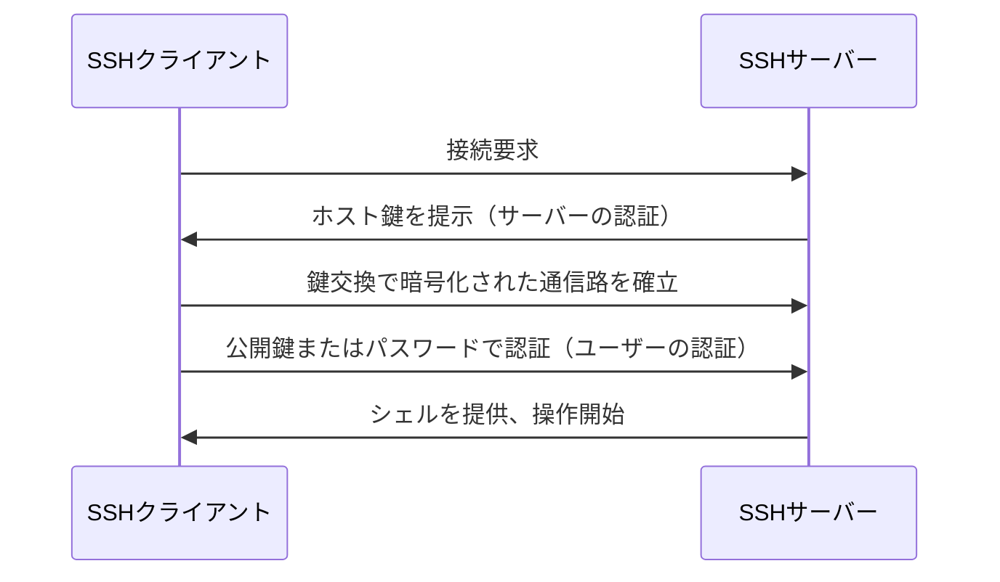

サーバーの構築手順を調べると、ほぼ必ず「SSHで接続します」という一文が出てきます。GitHubのリポジトリをcloneするときも、「HTTPSとSSHのどちらを使うか」を選ばされます。名前はよく見るのに、何をしているのかは意外と説明されません。

この記事では、SSHが何を守っていて、どうやって接続し、どう設定すれば安全に使えるのかを順に説明します。読み終わる頃には、次の疑問に自分で答えられるようになっているはずです。

- 「サーバーに接続する」とは、具体的に何が起きているのか
- パスワードを入力していないのに接続できるのはなぜか
- 初回接続時に出る `Are you sure you want to continue connecting?` は何を確認しているのか

## SSHとは — 別のコンピューターを安全に遠隔操作する仕組み

SSHはSecure Shellの略で、ネットワーク越しに別のコンピューターを安全に操作するためのプロトコルです。手元のパソコンからコマンドを送ると、遠くのサーバーがそれを実行して結果を返してくれます。通信の中身はすべて暗号化されるため、途中の経路を誰かに覗かれても、パスワードや実行結果を読み取られることはありません。

```text
自分のパソコン
    ↓↑ 暗号化された通信
リモートサーバー（AWSのEC2、VPS、社内サーバーなど）
```

もっとも典型的な使い方は、Linuxサーバーへのリモートログインです。

```bash
ssh user@example.com
```

これだけでサーバーのシェルが手元のターミナルに現れ、あとはローカルと同じ感覚で `ls` や `cd` を打てます。ログインせずにコマンドを1つだけ実行して結果を受け取ることもできます。

```bash
ssh user@example.com "ls -la"
```

SSHの用途はリモート操作だけではありません。同じ仕組みの上に、いくつもの機能が乗っています。

- **ファイル転送**: `scp`・`sftp`・`rsync` はSSHの通信路を使ってファイルを送受信します
- **Gitリポジトリへの接続**: `git clone git@github.com:user/repo.git` のSSH形式のURLは、GitHubへのSSH接続です
- **ポートフォワーディング（SSHトンネル）**: 直接届かないデータベースなどへ、SSH経由の暗号化された経路を作れます

トンネルは踏み台サーバー経由の接続などで使う応用機能なので、この記事では「こういうこともできる」と知っておけば十分です。まずはリモートログインとファイル転送を押さえましょう。

## SSHの仕組み — 暗号化・サーバー認証・ユーザー認証の3つで守る

「SSHは通信を暗号化する」とだけ覚えると、仕組みの半分しか見えていません。SSHが提供する保護は3つあり、それぞれ守っているものが違います。

1. **通信の暗号化** — 経路上の盗聴から内容を守る
2. **サーバーの認証** — 接続先が偽物にすり替わっていないか確認する
3. **ユーザーの認証** — 接続してきた人が本人か確認する

接続時には、この3つが次の順序で処理されます。



2番目の「サーバーの認証」は見落とされがちですが、重要な工程です。暗号化がどれだけ強固でも、接続した相手が攻撃者の偽サーバーだったら意味がありません。そこでSSHサーバーは自分の身分証にあたる**ホスト鍵**を提示し、クライアントはそれを過去の記録（`~/.ssh/known_hosts` ファイル）と照合して、前回と同じサーバーであることを確かめます。初回接続時に出る確認メッセージの正体はこれで、詳しくは基本操作の章で説明します。

用語の整理もここでしておきます。接続する側のソフトウェアが**SSHクライアント**（Windows・macOS・Linuxに標準搭載されているOpenSSH Clientの `ssh` コマンドや、PuTTY・Tera Termなど）、接続を受け付ける側が**SSHサーバー**です。Linuxではサーバー側のプログラムが `sshd`（SSH daemon）という名前で動いています。`ssh` は接続しに行くコマンド、`sshd` は待ち受けるサービス。名前が似ているので混同しやすいのですが、役割は正反対です。

## まず接続してみる — 基本の使い方

SSH接続に必要な情報は4つです。接続先のIPアドレスまたはホスト名、ユーザー名、ポート番号、そして認証情報（パスワードまたは秘密鍵）。レンタルサーバーやクラウドの管理画面で確認できます。

手元にSSHクライアントが入っているかは、バージョン表示で確認できます。Windows 10以降・macOS・主要なLinuxディストリビューションなら、追加インストールなしで動くはずです。

```bash
ssh -V
# OpenSSH_9.6p1 などと表示されればOK
```

接続は `ユーザー名@接続先` の形で指定します。

```bash
ssh username@192.168.1.100
```

初回接続では、次のような確認が表示されます。

```text
The authenticity of host '192.168.1.100' can't be established.
ED25519 key fingerprint is SHA256:xxxxxxxxxxxxxxxxxxxxxxxxxxxxxxxxxxxxxxxxxxx.
Are you sure you want to continue connecting (yes/no/[fingerprint])?
```

これは前章で触れたサーバー認証の入口です。「このサーバーとは初対面なので、本物かどうか記録がありません。このフィンガープリント（ホスト鍵の要約値）を信頼しますか？」と聞いています。本来はサーバー管理者から知らされた値と照合すべきものですが、自分で立てたサーバーなら `yes` で進めて問題ありません。`yes` と答えるとホスト鍵が `~/.ssh/known_hosts` に記録され、次回からは自動で照合されます。

接続できたら、抜けるときは `exit` を実行するか `Ctrl + D` を押します。

ポート番号について補足します。SSHのデフォルトポートは22番で、省略すれば22番につながります。攻撃botの機械的なスキャンを減らす目的でポートを変更しているサーバーも多く、その場合は `-p` で指定します。

```bash
ssh -p 2222 username@192.168.1.100
```

なお、ポート変更は自動スキャンのノイズを減らす効果はあるものの、狙った攻撃者にはポートスキャンで見つかります。「変更したから安全」ではなく、後述する公開鍵認証などと組み合わせる前提の小技と捉えてください。

## 認証方式 — パスワード認証と公開鍵認証

サーバーに「あなたは誰か」を証明する方法は、大きく2つあります。

ひとつめの**パスワード認証**は、ユーザー名とパスワードでログインする素朴な方式です。設定不要ですぐ使える反面、インターネットに公開されたサーバーでは総当たり攻撃の標的になります。実際、SSHポートを公開したサーバーのログを見ると、世界中から毎日何千件ものログイン試行が飛んできます。パスワードが弱ければいつか破られる、という前提で考えるべき方式です。ひとつ実務的な注意として、パスワード入力中は画面に何も表示されません。`*` すら出ないので入力できていないように見えますが、そのまま打ってEnterを押せば通ります。

**公開鍵認証**は、数学的にペアになった2つの鍵——**公開鍵**と**秘密鍵**——を使う方式です。実務ではこちらが標準で、AWSのEC2など最初からパスワード認証を無効にしているサービスも珍しくありません。

鍵の配置はこうなります。

```text
自分のパソコン
├── 秘密鍵（絶対に外へ出さない）
└── 公開鍵

サーバー
└── 公開鍵（事前に登録しておく）
```

認証の流れを平たく言うと、サーバーは登録済みの公開鍵で「解けるかどうか」を試す問題を出し、クライアントは対応する秘密鍵でそれを解いてみせます。ここで大事なのは、**秘密鍵そのものは一度もネットワークに流れない**ことです。送信するのは「秘密鍵を持っている証拠」だけ。だから経路を盗聴されても秘密鍵は盗まれませんし、公開鍵から秘密鍵を逆算することも現実的には不可能です。公開鍵は名前のとおり、他人に見られても問題ありません。

総当たり攻撃が通用せず、パスワードのように「弱い文字列を設定してしまう」余地もない。これが公開鍵認証が推奨される理由です。

## 公開鍵認証を設定する

ここが今日の本題です。鍵の作成からサーバーへの登録まで、実際に手を動かしていきます。

### 鍵ペアを作成する

`ssh-keygen` コマンドで鍵ペアを作ります。`-t ed25519` は鍵の方式の指定で、現在はこのEd25519が第一候補です（古い解説記事にある `-t rsa` より高速で、鍵も短くて済みます）。

```bash
ssh-keygen -t ed25519
```

実行すると保存先を聞かれます。そのままEnterを押せば既定の場所に保存されます。

```text
~/.ssh/id_ed25519      ← 秘密鍵
~/.ssh/id_ed25519.pub  ← 公開鍵（.pub が付いているほう）
```

続いてパスフレーズを聞かれます。これは秘密鍵ファイル自体にかける暗号化パスワードで、万一秘密鍵が盗まれても即座には悪用されないための保険です。ログインパスワードとは別物です。空のままでも鍵は作れますが、設定しておくことを勧めます（毎回の入力が面倒になる問題は、後述のSSH Agentで解決できます）。

### 公開鍵をサーバーへ登録する

いちばん簡単なのは `ssh-copy-id` です。パスワード認証で一度ログインし、公開鍵の登録まで自動でやってくれます。

```bash
ssh-copy-id username@example.com
```

`ssh-copy-id` が使えない環境（Windowsなど）では手動で登録します。やることは単純で、公開鍵（`.pub` ファイル）の中身を、サーバー側の `~/.ssh/authorized_keys` というファイルに1行追記するだけです。

```bash
# サーバー側で実行
mkdir -p ~/.ssh
echo "ssh-ed25519 AAAA...（公開鍵の中身）" >> ~/.ssh/authorized_keys
chmod 700 ~/.ssh
chmod 600 ~/.ssh/authorized_keys
```

最後の `chmod` 2行を省略しないでください。OpenSSHは「他人が読み書きできる鍵ファイル」を危険とみなして**無視する**ため、権限が緩いと公開鍵を正しく登録していても認証に失敗します。公開鍵認証がうまく動かない原因の定番です。

登録が済んだら、パスワードを聞かれずにログインできることを確認しましょう。

```bash
ssh username@example.com
```

## もっと便利に使う

毎日使うものなので、入力の手間を減らす仕組みがそろっています。

### 接続情報は ~/.ssh/config に書く

ホスト名・ユーザー名・鍵の場所を毎回打つ代わりに、設定ファイルにまとめられます。

```text:~/.ssh/config
Host my-server
    HostName 192.168.1.100
    User developer
    Port 2222
    IdentityFile ~/.ssh/id_ed25519
```

これで接続コマンドは2語になります。

```bash
ssh my-server
```

`scp` や `rsync`、後述のGitからも同じ名前で参照できるので、接続先が2つ以上になったら書いておいて損はありません。

### パスフレーズ入力はSSH Agentに任せる

SSH Agentは、復号済みの秘密鍵をメモリ上に保持してくれる常駐プログラムです。一度 `ssh-add` で鍵を登録すれば、以降の接続ではパスフレーズを聞かれなくなります。

```bash
ssh-add ~/.ssh/id_ed25519   # 鍵を登録（ここで一度だけパスフレーズを入力）
ssh-add -l                  # 登録済みの鍵を確認
```

「パスフレーズは設定したいが毎回打つのは嫌だ」という当然の要求への答えがこれです。

### ファイル転送は scp・sftp・rsync

SSHの通信路をそのまま使うので、追加の設定は要りません。

```bash
# ローカル → サーバー
scp sample.txt username@example.com:/home/username/

# サーバー → ローカル
scp username@example.com:/home/username/sample.txt ./

# ディレクトリ同期（差分だけ転送される）
rsync -av ./dist/ username@example.com:/var/www/app/
```

使い分けの目安は、単発のファイルコピーなら `scp`、対話的にディレクトリを行き来しながら操作したいなら `sftp`、デプロイのように同じディレクトリを繰り返し同期するなら差分転送できる `rsync` です。

### GitHubへの接続にも同じ鍵が使える

GitHubに公開鍵を登録（Settings → SSH and GPG keys）すると、`git@github.com:...` 形式のURLでpush/pullのたびに認証情報を入力する必要がなくなります。仕組みはサーバーへのSSH接続とまったく同じで、`authorized_keys` への追記をGitHubの画面上でやっているだけです。

登録できたかは次のコマンドで確認できます。

```bash
ssh -T git@github.com
# Hi username! You've successfully authenticated... と出れば成功
```

## トラブルシューティング — つながらないときに見る場所

SSHのエラーは種類が少なく、メッセージごとに疑う場所がほぼ決まっています。

**`Permission denied (publickey)`** — サーバーには届いたが、認証で弾かれています。ユーザー名の間違い、公開鍵の登録漏れ、使う秘密鍵の指定違い（`-i ~/.ssh/id_ed25519` で明示してみる）、そして前述の `~/.ssh` の権限を順に確認します。

**`Connection refused`** — サーバーのマシンには届いたが、そのポートで誰も待っていません。sshdが起動しているか、ポート番号が合っているか、ファイアウォールが拒否していないかを見ます。

**`Connection timed out`** — そもそもサーバーに届いていません。IPアドレスの間違い、ネットワーク不通、クラウドならセキュリティグループで22番（または変更後のポート）が許可されているかを疑います。

**`WARNING: REMOTE HOST IDENTIFICATION HAS CHANGED!`** — `known_hosts` に記録されたホスト鍵と、いま提示された鍵が一致していません。理屈のうえでは中間者攻撃の兆候ですが、実際にはサーバーを再構築してホスト鍵が作り直されたケースが大半です。「サーバーを作り直した覚えがあるか」をまず思い出し、心当たりがあれば `ssh-keygen -R ホスト名` で古い記録を削除して接続し直します。心当たりがないのに出たときだけ、管理者への確認が必要です。警告の意味を確認せず機械的に消す癖をつけないでください。

どのエラーか判然としないときは、`-v` オプションで詳細ログを見るのが早道です。

```bash
ssh -v username@example.com
```

読み込まれた設定ファイル、試行した秘密鍵、どの認証方式でどこまで進んで失敗したかが時系列で表示されます。それでも足りなければ `-vv`、`-vvv` と重ねるごとに詳しくなります。エラーメッセージだけで推理するより、ログを見たほうが確実です。

## 安全に使うためのチェックリスト

最後に、運用面の要点をまとめます。上から順に効果が大きいものです。

**やるべきこと**

- パスワード認証を無効にし、公開鍵認証だけにする（サーバー側 `/etc/ssh/sshd_config` で `PasswordAuthentication no`）
- rootでの直接ログインを禁止する（`PermitRootLogin no`）
- 秘密鍵にパスフレーズを設定する
- ファイアウォールやセキュリティグループで、接続元IPをできる範囲で絞る
- OpenSSHを最新の状態に保つ

**やってはいけないこと**

- 秘密鍵をGitリポジトリにコミットする（公開リポジトリでの鍵の流出は、いまも定番の事故です）
- 秘密鍵をチャットやメールで送る・チームで使い回す（鍵は1人1つ。誰の接続か追跡できなくなります）
- ホスト鍵の警告を、原因を確かめずに消して接続する
- 弱いパスワードのままSSHポートをインターネットへ全開放する

## よくある質問

**Q. SSHとSSL/TLSは何が違う？**
どちらも通信を暗号化する技術ですが、守備範囲が違います。SSL/TLSはHTTPS通信などの土台になる汎用的な暗号化レイヤーで、SSHはリモート操作という用途に特化した独立のプロトコルです。似た技術を使っていますが、直接の互換性はありません。

**Q. WindowsでもSSHは使える？**
使えます。Windows 10以降はOpenSSHクライアントが標準搭載されており、PowerShellやコマンドプロンプトからそのまま `ssh` コマンドが打てます。この記事のコマンドはほぼそのまま動きます。

**Q. 秘密鍵を紛失したら？**
そのサーバーには公開鍵認証でログインできなくなります。別の手段（パスワード認証、クラウドのコンソールなど）でサーバーに入り、新しい鍵ペアを作って公開鍵を登録し直します。紛失ではなく**流出**の疑いがあるなら、`authorized_keys` から古い公開鍵を削除することが先です。

**Q. ポートは22番から変えるべき？**
攻撃botのノイズが減るので、ログが読みやすくなる実益はあります。ただしセキュリティの本体は公開鍵認証とアクセス制限であって、ポート変更はおまけです。優先順位を間違えないようにしましょう。

## まとめ

SSHは、暗号化・サーバー認証・ユーザー認証の3つで通信を守りながら、遠くのコンピューターを操作する仕組みです。この記事の要点を振り返ります。

- 接続の基本形は `ssh user@host`。初回の確認メッセージはサーバーの本人確認であり、`known_hosts` がその記録先
- 認証はパスワードより公開鍵。秘密鍵はネットワークに流れず、手元から一歩も出さない
- 鍵の作成は `ssh-keygen -t ed25519`、登録は `ssh-copy-id` または `authorized_keys` への追記＋権限設定
- `~/.ssh/config` とSSH Agentで日々の接続は短くなる
- つながらないときはエラーメッセージで場所を絞り、`ssh -v` のログで確定させる

まずは手元のVPSや仮想マシンで、パスワード認証から公開鍵認証への切り替えまでを一度通してみてください。仕組みを知ったうえで手を動かすと、初回接続の確認メッセージひとつも違って見えるはずです。
