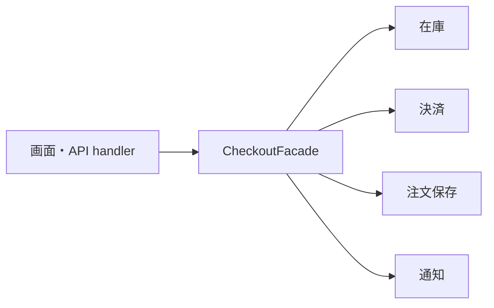
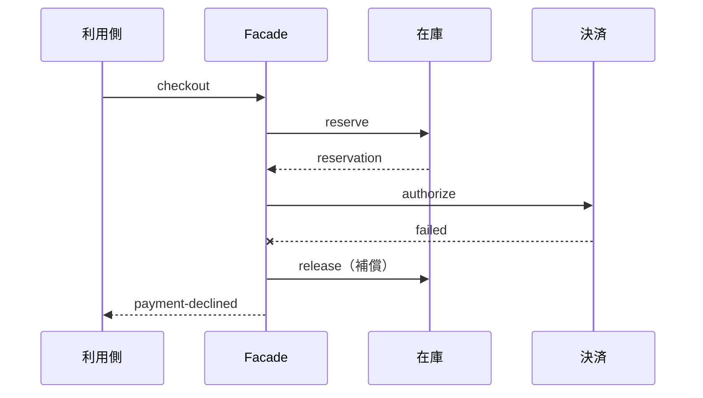

注文確定ボタンを1回押すと、裏では在庫予約、決済、保存、通知が順番に走ります。

この手順を画面のコードに直接書いても、最初はうまくいきます。読みやすいくらいです。崩れるのは、2つめの利用箇所が現れたときでした。

Facadeパターンは、複雑なサブシステムの前に、利用目的に合わせた小さな入口を置きます。ただ、目的は内部を隠すことではありません。**利用側が判断しなくていい手順を引き受けて、呼び出しの契約を安定させること**です。

コードは境界を示すための抜粋です。`Gateway` や `Repository` の型定義より、各段階で何が確定して、失敗したとき何を戻す必要があるかを見てください。

## 画面が、業務フローを持ってしまう

```ts
async function onCheckout(input: CheckoutInput) {
  const reservation = await inventory.reserve(input.items);
  const payment = await paymentGateway.authorize(input.payment, input.total);
  const order = await orderRepository.save({ input, reservation, payment });
  await mailer.sendReceipt(order);
  router.navigate(`/orders/${order.id}`);
}
```

流れが上から下に見えていて、悪くないコードに見えます。

問題は次です。管理画面でも注文確定が必要になった。APIからも呼びたい。バッチでも使う。そのたびにこの5行が複製されていきます。

そして複製されるのは、正常系だけではありません。**決済に失敗したとき在庫予約を戻す処理**を、全部の利用側が正しく書かなければならない。書き忘れた場所から、在庫が減ったまま戻らなくなります。



利用側は `checkout()` というユースケースを呼ぶだけ。順序の管理はFacadeの仕事になります。

## 契約は、利用者の目的から決める

ここで一番やりがちな失敗を先に書きます。サブシステムのAPIを、そのまま薄く転送するFacadeです。

それをやると、入口が1つ増えただけで複雑さは1ミリも減りません。

出発点は「注文を確定したい」という目的のほうです。

```ts
type CheckoutResult =
  | { ok: true; orderId: string }
  | { ok: false; reason: "out-of-stock" | "payment-declined" };

interface CheckoutFacade {
  checkout(input: CheckoutInput): Promise<CheckoutResult>;
}
```

利用側がほしいのは、在庫予約IDでも決済APIの生レスポンスでもありません。成功したときの注文IDと、失敗したときに利用者へ次の行動を促せる理由。それだけです。

内部の処理結果を全部詰め込んだデバッグ情報は、戻り値ではなく運用ログやエラーの `cause` へ回します。

## 順序と、戻し方を1か所に集める

```ts
class DefaultCheckoutFacade implements CheckoutFacade {
  constructor(
    private readonly inventory: InventoryGateway,
    private readonly payments: PaymentGateway,
    private readonly orders: OrderRepository,
  ) {}

  async checkout(input: CheckoutInput): Promise<CheckoutResult> {
    const reservation = await this.inventory.reserve(input.items);
    if (!reservation.ok) {
      return { ok: false, reason: "out-of-stock" };
    }

    let paymentId: string | undefined;

    try {
      const payment = await this.payments.authorize({
        paymentMethod: input.paymentMethod,
        amount: input.total,
        idempotencyKey: input.requestId,
      });

      if (!payment.ok) {
        await this.inventory.release(reservation.id);
        return { ok: false, reason: "payment-declined" };
      }

      paymentId = payment.id;
      const order = await this.orders.save({ input, reservation, payment });
      return { ok: true, orderId: order.id };
    } catch (error) {
      const compensations = [this.inventory.release(reservation.id)];
      if (paymentId) compensations.push(this.payments.void(paymentId));

      const results = await Promise.allSettled(compensations);
      const failures = results
        .filter((result) => result.status === "rejected")
        .map((result) => result.reason);

      if (failures.length > 0) {
        throw new AggregateError(failures, "補償処理に失敗しました", {
          cause: error,
        });
      }
      throw error;
    }
  }
}
```

このコードで頭を使うべき場所は、正常系ではありません。失敗したときのほうです。

`await` を1つ通過するたびに、システムに残る状態が変わっていきます。

| 完了した処理 | その時点で成立した状態 | 以降が失敗した場合の対応 |
| --- | --- | --- |
| `inventory.reserve` | 在庫を一時的に確保した | 予約を解放する |
| `payments.authorize` | 決済承認を確保した | 在庫解放に加えて決済を取り消す |
| `orders.save` | 注文記録を永続化した | 成功として注文IDを返す |

注文保存で例外が出た瞬間を考えてみてください。在庫予約も決済承認も、すでに成功しています。世界のどこかに、実体が2つ残っている。

だから `catch` は補償を2つ走らせて、**両方の結果を確認します**。ここで補償まで失敗したときに、元の例外だけを投げ直してはいけません。未復旧の状態が残ったという事実を `AggregateError` で上へ伝えます。

この区別があるかどうかで、運用側が「再試行すればいいのか」「人が確認しにいくのか」を判断できます。

正直に書くと、Facadeを置いても複雑さは消えません。単一プロセスのDBトランザクションと違って、複数の外部サービスをまたいだ処理を完全に巻き戻せる保証はないからです。できるのは、補償と再実行の方針を1か所に集めて、利用側から扱える形にすることだけです。

## 補償も、失敗します

在庫の解放も決済の取消も、結局は通信です。落ちます。

上の例が補償失敗を `AggregateError` として表に出しているのは、そのためでした。実運用ではここから、構造化ログ、再試行キュー、管理者アラートへつなげます。**元の処理と補償のどちらが失敗したのか**を後から追えるように。



補償を回すには、どこまで成功したかを示すIDが要ります。リクエストID、予約ID、決済ID。全部ログに残してください。手で復旧する日が来ます。

## 入口で止めるだけでは足りない

利用者はボタンを連打します。通信が切れれば再送もします。同じcheckoutが2回届く前提で考えてください。

FacadeがリクエストIDを受け取って、処理済みなら同じ結果を返す。これは有効な設計です。

ただし、それだけでは足りません。Facadeの中だけで重複を判定していると、プロセスが複数あったり再起動したりした瞬間に保証が崩れます。各境界にも仕掛けが要ります。

| 層 | 重複防止の例 |
| --- | --- |
| UI | 送信中はボタンを無効化 |
| Facade | リクエストIDを必須にする |
| 決済API | 冪等性キーを渡す |
| DB | リクエストIDへ一意制約を置く |

UIの二重クリック防止は、体験としては大事です。でもシステムの冪等性の代わりにはなりません。

## 内部のレスポンスを、そのまま返さない

Facadeがサブシステムの戻り値を素通しすると、利用側はまた内部構成に依存し始めます。

たとえば決済プロバイダーのステータスコードを、そのまま画面に渡したとします。プロバイダーを乗り換える日に、画面のコードまで直すことになります。

`payment-declined` のような、ユースケース上の意味に翻訳しておく。そうすれば内部の変更がFacadeの中で止まります。

とはいえ、隠しすぎるのも問題です。利用側が本当に必要な情報まで閉じてしまうと、結局それを取るための別APIが生えてきます。利用側の判断単位に合わせて決めてください。

## テストで見るのは、順序と補償

Facadeのテストで確認するのは、ユースケースの順序と、失敗したときの処理です。サブシステムの中身は、それぞれの単体テストと結合テストの仕事にします。

```ts
it("決済拒否時に在庫予約を解放する", async () => {
  const calls: string[] = [];
  const inventory = createInventorySpy(calls, { reserve: "ok" });
  const payments = createPaymentStub(calls, { authorize: "declined" });
  const orders = createOrderRepositorySpy(calls);
  const facade = new DefaultCheckoutFacade(inventory, payments, orders);

  await expect(facade.checkout(validInput)).resolves.toEqual({
    ok: false,
    reason: "payment-declined",
  });
  expect(calls).toEqual(["inventory.reserve", "payments.authorize", "inventory.release"]);
});
```

呼び出し順が業務的に意味を持つなら、こうやって固定します。

ただし、順序に意味のない通知処理まで厳密に並べないでください。実装をちょっと直しただけで落ちる、脆いテストになります。何を保証したいテストなのかを、テストごとに分けます。

## 万能サービスにしないこと

Facadeは入口を減らすパターンです。だから、何でもかんでも1つに集めたくなります。

注文も返金も配送も会員管理も `AppFacade` へ。そうやって出来上がるのは、名前を変えただけの巨大サービスです。

境界は、利用者が達成したいユースケースに合わせます。

| 良い入口の例 | 広すぎる入口の例 |
| --- | --- |
| `CheckoutFacade.checkout()` | `AppFacade.execute()` |
| `RefundFacade.requestRefund()` | `CommerceService.process()` |
| `AccountSetupFacade.setup()` | `SystemManager.run()` |

判断基準は、利用側の目的が1つかどうか。サブシステムをいくつ束ねていても、目的が違うなら入口を分けます。

## そもそも置くべきか

| 直接呼び出しが向く | Facadeが向く |
| --- | --- |
| 手順が1〜2個で利用箇所も1つ | 複数の利用側が同じ手順を使う |
| 失敗時の補償がない | 途中失敗の戻し方を統一したい |
| サブシステムのAPIが利用目的と一致 | 生のAPIが細かすぎる |
| 利用側が順序を知るべき | 利用側から順序を隠したい |

---

冒頭の5行に戻ります。

あれが崩れたのは、コードが汚かったからではありませんでした。**利用側が知る必要のない順序と補償を、利用側に持たせていた**からです。

Facadeは、複雑な内部をきれいに見せる化粧ではありません。その順序と失敗と補償を引き受けて、ユースケースに合う小さな契約を差し出す設計です。

そして入口を作っても、内部の失敗は消えません。だから最後まで設計してください。復旧に必要なIDと、それを追える観測手段まで。

## 参考資料

- [Refactoring.Guru: Facade](https://refactoring.guru/design-patterns/facade)
- [Microsoft: Compensating Transaction pattern](https://learn.microsoft.com/en-us/azure/architecture/patterns/compensating-transaction)
- [Stripe: Idempotent requests](https://docs.stripe.com/api/idempotent_requests)
