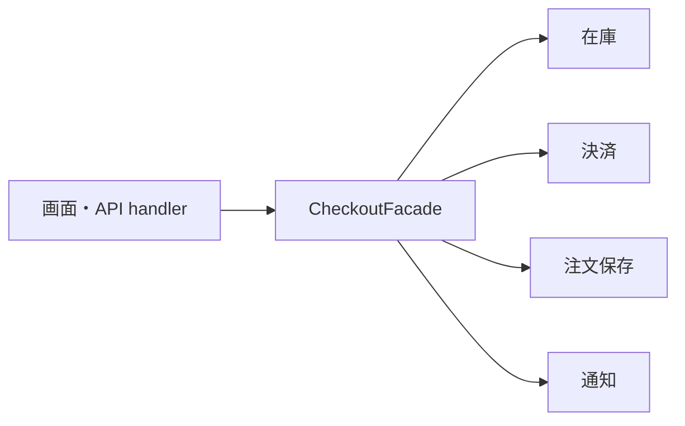
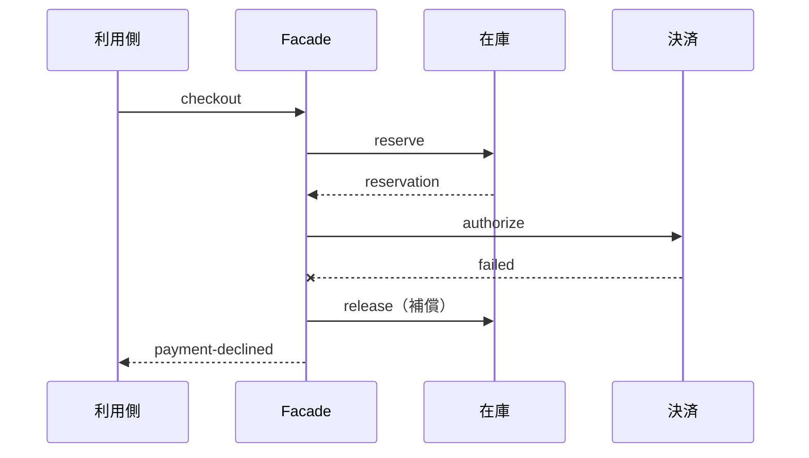

注文確定のようなユースケースは、在庫予約、決済、保存、通知など複数のサブシステムをまたぎます。画面やAPIハンドラーがその手順を直接組み立てると、同じ順序・例外処理・補償処理が利用側へ散ります。

Facadeパターンは、複雑なサブシステムの前に、利用目的に合わせた小さな入口を置きます。内部を隠すことだけが目的ではありません。利用側が判断する必要のない手順を引き受け、呼び出し契約を安定させます。

コード例は処理の境界を示すための抜粋です。`Gateway` や `Repository` の細かな型定義よりも、各段階で何が確定し、失敗時に何を戻す必要があるかへ注目してください。

## 利用側へ手順が漏れると、画面が業務フローを持つ

```ts
async function onCheckout(input: CheckoutInput) {
  const reservation = await inventory.reserve(input.items);
  const payment = await paymentGateway.authorize(input.payment, input.total);
  const order = await orderRepository.save({ input, reservation, payment });
  await mailer.sendReceipt(order);
  router.navigate(`/orders/${order.id}`);
}
```

一見すると流れが見えて読みやすいコードです。しかし、別の画面、管理API、バッチ処理でも注文確定が必要になると、同じ手順が複製されます。途中で決済に失敗した場合に在庫予約を戻す処理も、各利用側が正しく実装しなければなりません。



利用側は `checkout()` というユースケースを呼び、内部の順序はFacadeが管理します。

## Facadeの契約を利用者の目的から決める

サブシステムのAPIをすべて薄く転送すると、Facadeを追加しても複雑さは減りません。最初に「注文を確定したい」という利用目的を契約にします。

```ts
type CheckoutResult =
  | { ok: true; orderId: string }
  | { ok: false; reason: "out-of-stock" | "payment-declined" };

interface CheckoutFacade {
  checkout(input: CheckoutInput): Promise<CheckoutResult>;
}
```

利用側に必要なのは、在庫予約IDや決済APIの生レスポンスではありません。成功時の注文IDと、利用者へ次の行動を促すための失敗理由です。

Facadeの戻り値は、呼び出し側が判断できる形にします。内部の処理結果を全部詰めたデバッグ情報は、運用ログやエラーのcauseへ分けます。

## 処理の順序と失敗時の戻し方を1か所で管理する

```ts
class DefaultCheckoutFacade implements CheckoutFacade {
  constructor(
    private readonly inventory: InventoryGateway,
    private readonly payments: PaymentGateway,
    private readonly orders: OrderRepository,
  ) {}

  async checkout(input: CheckoutInput): Promise<CheckoutResult> {
    const reservation = await this.inventory.reserve(input.items);
    if (!reservation.ok) {
      return { ok: false, reason: "out-of-stock" };
    }

    let paymentId: string | undefined;

    try {
      const payment = await this.payments.authorize({
        paymentMethod: input.paymentMethod,
        amount: input.total,
        idempotencyKey: input.requestId,
      });

      if (!payment.ok) {
        await this.inventory.release(reservation.id);
        return { ok: false, reason: "payment-declined" };
      }

      paymentId = payment.id;
      const order = await this.orders.save({ input, reservation, payment });
      return { ok: true, orderId: order.id };
    } catch (error) {
      const compensations = [this.inventory.release(reservation.id)];
      if (paymentId) compensations.push(this.payments.void(paymentId));

      const results = await Promise.allSettled(compensations);
      const failures = results
        .filter((result) => result.status === "rejected")
        .map((result) => result.reason);

      if (failures.length > 0) {
        throw new AggregateError(failures, "補償処理に失敗しました", {
          cause: error,
        });
      }
      throw error;
    }
  }
}
```

このコードで厚く考えるべき部分は、正常系より失敗時です。在庫予約後に決済が失敗したら予約を解放します。注文保存に失敗した場合、決済を取り消せるか、後続処理で復旧するかも決めなければなりません。

各 `await` の後では、システムに残っている状態が変わります。

| 完了した処理 | その時点で成立した状態 | 以降が失敗した場合の対応 |
| --- | --- | --- |
| `inventory.reserve` | 在庫を一時的に確保した | 予約を解放する |
| `payments.authorize` | 決済承認を確保した | 在庫解放に加えて決済を取り消す |
| `orders.save` | 注文記録を永続化した | 成功として注文IDを返す |

たとえば注文保存で例外が起きたとき、在庫予約と決済承認はすでに成功しています。そこで `catch` は2つの補償を開始し、両方の結果を確認します。補償まで失敗した場合は元の例外だけを投げ直さず、未復旧の状態が残ったことを `AggregateError` で上位へ知らせます。この区別があると、運用側は再試行すべき処理と手動確認が必要な処理を判断できます。

単一プロセスのDBトランザクションと違い、複数の外部サービスをまたぐ処理を完全に元へ戻せるとは限りません。Facadeを置いても複雑さは消えません。補償と再実行の方針を1か所へ集め、利用側から扱いやすくします。

## 補償処理は失敗する前提で設計する

在庫の解放や決済取消自体も通信なので失敗します。上の例は補償失敗を `AggregateError` として表面化させています。実運用では、さらに構造化ログ、再試行キュー、管理者向けアラートへつなげ、元の処理と補償のどちらが失敗したかを追えるようにします。



補償が必要な処理には、どこまで成功したかを示すIDが欠かせません。ログにもリクエストID、予約ID、決済IDを残し、手動復旧できるようにします。

## 冪等性はFacadeの入口だけでは完結しない

利用者がボタンを連打したり、通信切断後に再送したりすると、同じcheckoutが複数回届く可能性があります。FacadeがリクエストIDを受け取り、処理済み結果を返す設計は有効です。

ただし、Facade内で重複を判定するだけでは、複数プロセスや再起動をまたいで保証できません。在庫、決済、注文保存の各境界にも、冪等性キーや一意制約が必要です。

| 層 | 重複防止の例 |
| --- | --- |
| UI | 送信中はボタンを無効化 |
| Facade | リクエストIDを必須にする |
| 決済API | 冪等性キーを渡す |
| DB | リクエストIDへ一意制約を置く |

UIの二重クリック防止は利用者体験を改善しますが、システム上の冪等性の代わりにはなりません。

## Facadeは内部モデルをそのまま返さない

Facadeがサブシステムのレスポンスをそのまま返すと、利用側は内部構成へ再び依存します。

たとえば決済プロバイダーのステータスコードを画面へ渡すと、プロバイダーを変更したときに画面も修正が必要です。Facadeで `payment-declined` のようなユースケース上の意味へ変換すれば、内部変更を局所化できます。

ただし、利用側が本当に必要とする情報まで隠すと、結局別の取得APIが増えます。利用側の判断単位に合わせて、公開する情報を決めます。

## テストでは手順と補償を観測する

Facadeのテストでは、ユースケースの順序と失敗時の処理を確認します。各サブシステムの実装詳細は、それぞれの単体・結合テストへ任せます。

```ts
it("決済拒否時に在庫予約を解放する", async () => {
  const calls: string[] = [];
  const inventory = createInventorySpy(calls, { reserve: "ok" });
  const payments = createPaymentStub(calls, { authorize: "declined" });
  const orders = createOrderRepositorySpy(calls);
  const facade = new DefaultCheckoutFacade(inventory, payments, orders);

  await expect(facade.checkout(validInput)).resolves.toEqual({
    ok: false,
    reason: "payment-declined",
  });
  expect(calls).toEqual(["inventory.reserve", "payments.authorize", "inventory.release"]);
});
```

呼び出し順が業務上重要なら順序を固定します。順序に意味がない通知処理まで厳密に並べると、実装変更へ弱いテストになります。何を保証したいテストかを分けてください。

## 巨大な万能サービスにしない

Facadeは入口を減らすパターンなので、何でも1つへ集めたくなります。しかし、注文、返金、配送、会員管理を `AppFacade` へ集約すれば、名前だけを変えた巨大なサービスになります。

Facadeの境界は、利用者が達成したいユースケースへ合わせます。

| 良い入口の例 | 広すぎる入口の例 |
| --- | --- |
| `CheckoutFacade.checkout()` | `AppFacade.execute()` |
| `RefundFacade.requestRefund()` | `CommerceService.process()` |
| `AccountSetupFacade.setup()` | `SystemManager.run()` |

利用側の目的が1つかどうかで切ります。サブシステムの数が多くても、目的が異なるなら入口を分けます。

## Facadeを置くべきか判断する

| 直接呼び出しが向く | Facadeが向く |
| --- | --- |
| 手順が1〜2個で利用箇所も1つ | 複数の利用側が同じ手順を使う |
| 失敗時の補償がない | 途中失敗の戻し方を統一したい |
| サブシステムのAPIが利用目的と一致 | 生のAPIが細かすぎる |
| 利用側が順序を知るべき | 利用側から順序を隠したい |

Facadeは複雑な内部をきれいに見せるための化粧ではありません。利用側が知る必要のない順序、失敗、補償を引き受け、ユースケースに合う小さな契約を提供する設計です。入口を作った後も、内部の失敗が消えるわけではないため、復旧に必要なIDと観測可能性まで設計してください。

## 参考資料

- [Refactoring.Guru: Facade](https://refactoring.guru/design-patterns/facade)
- [Microsoft: Compensating Transaction pattern](https://learn.microsoft.com/en-us/azure/architecture/patterns/compensating-transaction)
- [Stripe: Idempotent requests](https://docs.stripe.com/api/idempotent_requests)
