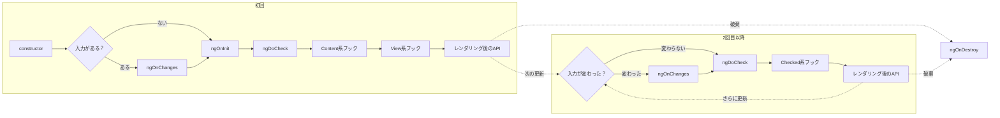
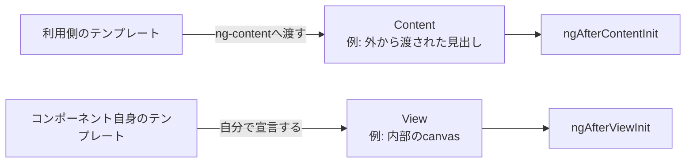
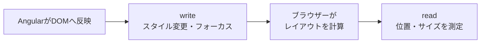
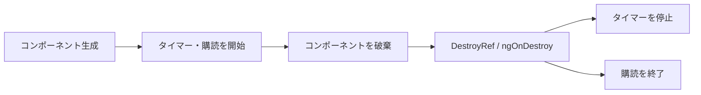

Angularのライフサイクルは、「必要なデータがいつそろうか」と「処理を何回動かすか」の2点から理解できます。フックの名前を順番に暗記する必要はありません。

初期入力を使うなら`ngOnInit`、入力の変化を追うなら`ngOnChanges`、DOMへ触れるならレンダリング後のAPIを選びます。この記事ではAngular 22を前提に、よく使う場面へ絞って整理します。

## ライフサイクルの全体像

コンポーネントが作られ、画面へ表示され、最後に破棄されるまでの流れをライフサイクルと呼びます。Angularは変更検知によってコンポーネントを調べ、その途中でライフサイクルフックを呼びます。



初回の主な実行順は次のとおりです。

| 順番 | API | 回数 | 主な用途 |
| --- | --- | --- | --- |
| 1 | `constructor` | 1回 | 依存の取得、クラスの初期化 |
| 2 | `ngOnChanges` | 入力変更ごと | 入力の変更前後を使う |
| 3 | `ngOnInit` | 1回 | 初期入力を使う |
| 4 | `ngDoCheck` | 検査ごと | 独自の差分検査 |
| 5 | `ngAfterContentInit` | 1回 | 投影された子を読む |
| 6 | `ngAfterContentChecked` | 検査ごと | 投影された子を確認する |
| 7 | `ngAfterViewInit` | 1回 | 自分のView内の子を読む |
| 8 | `ngAfterViewChecked` | 検査ごと | View内の子を確認する |
| 9 | レンダリング後のAPI | APIによる | DOMを読み書きする |
| 10 | `ngOnDestroy` | 1回 | タイマーや購読を終了する |

入力が設定される場合、最初の`ngOnChanges`は`ngOnInit`より先に動きます。入力がなければ`ngOnChanges`は呼ばれません。

2回目以降は、`ngOnInit`や`ngAfterViewInit`のような初期化用フックを飛ばし、検査ごとに動くフックだけが呼ばれます。

なお、Angular 22では`OnPush`が既定の変更検知戦略です。ここでいう「検査ごと」とは、そのコンポーネントがチェック対象になった場合を指します。すべてのコンポーネントが、あらゆるイベントのたびに検査されるわけではありません。[Advanced component configuration](https://angular.dev/guide/components/advanced-configuration)

## 入力を読むタイミングは3つに分ける

`constructor`が呼ばれる時点では、親からの入力はまだそろっていません。入力に依存しない初期化や、依存性注入で使う場所だと考えます。

`ngOnInit`では初期入力がそろっています。ただし、実行は1回だけです。入力があとから変わる処理には向きません。

`ngOnChanges`は入力が変わるたびに呼ばれます。変更前の値、現在の値、初回かどうかを`SimpleChanges`から確認できます。

```ts
import {
  Component,
  input,
  OnChanges,
  OnInit,
  SimpleChanges,
} from '@angular/core';

@Component({
  selector: 'app-user-card',
  template: `<p>ユーザーID: {{ userId() }}</p>`,
})
export class UserCard implements OnChanges, OnInit {
  readonly userId = input.required<string>();

  ngOnChanges(changes: SimpleChanges<UserCard>): void {
    const change = changes.userId;
    if (!change) return;

    console.log('変更前', change.previousValue);
    console.log('変更後', change.currentValue);
  }

  ngOnInit(): void {
    console.log('初期入力がそろった', this.userId());
  }
}
```

入力から表示用の値を計算するだけなら、フックは不要です。たとえば税込価格は`computed(() => this.price() * 1.1)`のように表せます。値の導出と副作用を分けると、フックの数を減らせます。

## ContentとViewは書いた人で区別する

After系のフックを理解する鍵は、ContentとViewの違いです。



| 種類 | どこに書かれた要素か | 参照できる時点 |
| --- | --- | --- |
| Content | コンポーネントを使う側から`ng-content`へ渡された要素 | `ngAfterContentInit` |
| View | コンポーネント自身のテンプレートに書かれた要素 | `ngAfterViewInit` |

たとえば、カードの利用側が渡した見出しはContent、カード自身が持つ`canvas`はViewです。画面上の位置に関係なく、どちらのテンプレートに書かれたかで判断します。

現在は`contentChild()`や`viewChild()`がSignalを返します。子要素の変化へ継続的に追従したい場合は、初期値をAfter系フックで別のフィールドへコピーするより、Signal Queryをそのまま使うほうが簡潔です。[Signal Queryの公式ガイド](https://angular.dev/guide/components/queries)

`ngAfterContentChecked`と`ngAfterViewChecked`は、対象コンポーネントの検査ごとに動きます。重い計算や外部ライブラリの作り直しを置くと、性能問題になりやすいので注意してください。

## DOM操作はレンダリング後に行う

`ngAfterViewInit`ではView内の要素を参照できます。しかし、アプリケーション全体のDOM反映が終わった時点ではありません。直接DOMを操作するときは、レンダリング後のAPIを使います。[Using DOM APIs](https://angular.dev/guide/components/dom-apis)

次の例は、初回レンダリング後に検索欄へフォーカスします。

```ts
import {
  afterNextRender,
  Component,
  ElementRef,
  viewChild,
} from '@angular/core';

@Component({
  selector: 'app-search-box',
  template: `<input #queryInput type="search" />`,
})
export class SearchBox {
  private readonly queryInput =
    viewChild.required<ElementRef<HTMLInputElement>>('queryInput');

  constructor() {
    afterNextRender({
      write: () => {
        this.queryInput().nativeElement.focus();
      },
    });
  }
}
```

レンダリング後のAPIは、必要な回数で選びます。

| API | 実行されるタイミング |
| --- | --- |
| `afterNextRender` | 登録後の次のレンダリングで1回 |
| `afterEveryRender` | レンダリングのたび |
| `afterRenderEffect` | 初回と、参照したSignalが変わったあと |

DOMの書き込みと測定を両方行う場合は、`write`フェーズでスタイルを変更し、`read`フェーズでサイズを測ります。読み書きを分けることで、ブラウザーの余計なレイアウト計算を減らせます。



これらのAPIはSSRやビルド時の事前レンダリングでは動きません。ブラウザー専用のDOM処理に使い、サーバーでも必要なデータ取得は別の場所へ置きます。

## 後片付けは開始した処理の近くに置く

コンポーネントが消えても、タイマーや完了しないObservableは残ることがあります。終了処理には`ngOnDestroy`または`DestroyRef`を使います。

`DestroyRef`なら、処理を始めるコードと終了するコードを近くに置けます。RxJSの購読には`takeUntilDestroyed`が便利です。



```ts
import { Component, DestroyRef, inject } from '@angular/core';
import { takeUntilDestroyed } from '@angular/core/rxjs-interop';

@Component({
  selector: 'app-notifications',
  template: `<p>通知を監視中</p>`,
})
export class Notifications {
  private readonly destroyRef = inject(DestroyRef);
  private readonly notifications = inject(NotificationService);

  constructor() {
    const timerId = setInterval(() => {
      console.log('working');
    }, 1000);

    this.destroyRef.onDestroy(() => clearInterval(timerId));

    this.notifications.messages$
      .pipe(takeUntilDestroyed())
      .subscribe((message) => console.log(message));
  }
}
```

`takeUntilDestroyed()`の引数を省略できるのは、上の例のように注入コンテキスト内で呼ぶ場合です。別のメソッドで使うなら`takeUntilDestroyed(this.destroyRef)`と書きます。

なお、通常の`HttpClient`リクエストは応答後に完了します。イベントやストリームのように長く続くObservableでは、購読の終了方法を確認してください。

## やりたいことからAPIを選ぶ

迷ったときは、実現したい目的から選びます。

| やりたいこと | 第一候補 |
| --- | --- |
| 依存するサービスを取得する | `inject`／`constructor` |
| 初期入力を使って1回処理する | `ngOnInit` |
| 入力の変更前後を比較する | `ngOnChanges` |
| 入力から表示値を計算する | `computed` |
| 投影された子を参照する | `contentChild`／`ngAfterContentInit` |
| 自分のView内の子を参照する | `viewChild`／`ngAfterViewInit` |
| DOM反映後に1回処理する | `afterNextRender` |
| Signalに応じてDOMを更新する | `afterRenderEffect` |
| RxJSの購読を終了する | `takeUntilDestroyed` |
| タイマーや外部インスタンスを破棄する | `DestroyRef`／`ngOnDestroy` |

`ngDoCheck`やChecked系のフックは頻繁に動きます。ほかのAPIで表せない独自の差分検査が必要な場合だけ検討します。

## よくある失敗

- `constructor`で入力を読む：入力がまだ設定されていません。`ngOnInit`か`ngOnChanges`へ移します。

- After系フックで画面の状態を書き換える：変更検知で確認済みの値を同じ走査中に変えると、`ExpressionChangedAfterItHasBeenCheckedError`（NG0100）が発生することがあります。表示値を導けるなら`computed`を使います。

- NG0100を`setTimeout`で隠す：エラーが出る処理を遅らせているだけです。DOM処理ならレンダリング後のAPIへ移します。

- `ngAfterViewChecked`で重い処理を繰り返す：グラフなどの更新は、依存するSignalへ処理を限定するか、外部ライブラリの差分更新APIを使います。

## テストでは必要な結果だけを確かめる

`TestBed.createComponent()`でインスタンスを作っただけでは、初期化フックはまだ動きません。`fixture.detectChanges()`で変更検知を進め、`fixture.destroy()`で破棄を起こせます。[Angular Testing Utility APIs](https://angular.dev/guide/testing/utility-apis)

すべてのフックの順番をテストへ固定すると、実装詳細に強く依存します。初期表示が正しいか、入力変更へ追従したか、破棄後にタイマーや購読が止まったかを確認するほうが、変更に強いテストになります。

## 3つの基準でフックを選ぶ

ライフサイクルフックを選ぶときは、次の3点を確認します。

1. 必要な入力、Content、Viewはそろっているか
2. DOM反映の前か、あとか
3. 1回だけか、変更のたびか

初期入力には`ngOnInit`、入力の履歴には`ngOnChanges`、DOM操作にはレンダリング後のAPI、後片付けには`DestroyRef`を使います。値の導出を`computed`へ任せれば、フック自体を使わずに済む場面もあります。

フックを増やす前に、専用のAPIで表現できないかを確認する。これが現在のAngularでライフサイクルを扱う基本です。

## 参考資料

- [Component Lifecycle - Angular](https://angular.dev/guide/components/lifecycle)
- [Advanced component configuration - Angular](https://angular.dev/guide/components/advanced-configuration)
- [Using DOM APIs - Angular](https://angular.dev/guide/components/dom-apis)
- [Referencing component children with queries - Angular](https://angular.dev/guide/components/queries)
- [afterRenderEffect - Angular](https://angular.dev/api/core/afterRenderEffect)
- [Unsubscribing with takeUntilDestroyed - Angular](https://angular.dev/ecosystem/rxjs-interop/take-until-destroyed)
- [Testing Utility APIs - Angular](https://angular.dev/guide/testing/utility-apis)
