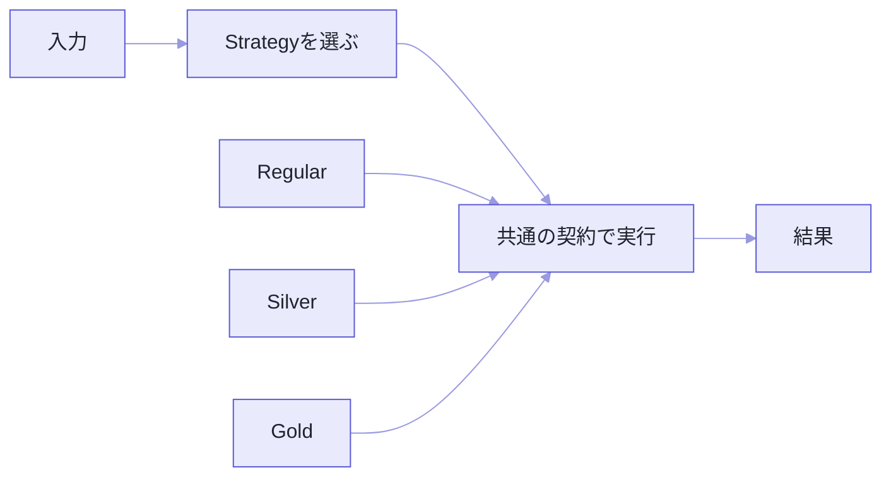

料金計算の `if` が3本になったとき、私はまだ何とも思っていませんでした。

半年後、その関数は80行になっていました。会員ランク、キャンペーン、初回限定、地域別。しかも増えたのは分岐の数だけではありません。それぞれの中に、有効期間と上限と対象商品の判定が入り込んでいました。

Strategyパターンは、差し替えたい処理を同じ契約に揃えて、利用側から具体的な計算を切り離します。ただし、クラスを増やすこと自体には何の意味もありません。分けるのは**「選ぶ処理」と「選ばれた後に実行する処理」**です。

コードは選択と計算の境界が見える範囲に絞っています。金額型や入力検証など、説明に関係ない定義は省きました。

## 問題は分岐の数ではなかった

会員ランクごとの割引を1つの関数に書くと、こうなります。

```ts
type Customer = {
  rank: "regular" | "silver" | "gold";
};

function calculatePrice(customer: Customer, subtotal: number): number {
  if (customer.rank === "regular") {
    return subtotal;
  }
  if (customer.rank === "silver") {
    return subtotal * 0.95;
  }
  if (customer.rank === "gold") {
    return subtotal * 0.9;
  }
  throw new Error(`Unknown rank: ${customer.rank}`);
}
```

3種類だけなら、これで十分です。**条件分岐があるというだけで、Strategyに変える理由にはなりません。**

苦しくなるのは、割引ごとに有効期間、上限、対象商品、外部設定の参照が生えてきたときでした。規則を1つ足すたびに同じ関数を開いて、ついでに既存の規則が壊れていないかを毎回見直すことになります。

理由ははっきりしていて、**どのランクを使うかという選択と、各ランクの計算規則が、同じ場所にくっついている**からです。



## まずは関数を、同じ型に揃える

状態を持たない計算なら、クラスを持ち出すまでもありません。関数で足ります。

```ts
type PricingStrategy = (subtotal: number) => number;

const regularPricing: PricingStrategy = (subtotal) => subtotal;

const silverPricing: PricingStrategy = (subtotal) => subtotal * 0.95;

const goldPricing: PricingStrategy = (subtotal) =>
  Math.max(0, subtotal * 0.9 - 500);

const pricingByRank: Record<Customer["rank"], PricingStrategy> = {
  regular: regularPricing,
  silver: silverPricing,
  gold: goldPricing,
};

function calculatePrice(customer: Customer, subtotal: number): number {
  return pricingByRank[customer.rank](subtotal);
}
```

責務が2つに割れました。`pricingByRank` はランクから計算方法を選ぶ係。各関数は価格を計算する係。goldの規則をいじるとき、silverの関数を開く必要がなくなります。

正直に言っておくと、分岐が消えたわけではありません。オブジェクトのキーによる選択に、形を変えただけです。

Strategyの取り柄は、そこにはありません。**選択ロジックが1か所に集まって、個別の規則を独立して読めるようになる**ことです。

## 型が同じでも、契約が同じとは限らない

引数と戻り値の型が揃っていても、失敗のしかたや端数処理が違えば、安全には差し替えられません。

| 契約に含める項目 | 例 |
| --- | --- |
| 入力の単位 | 円か、最小通貨単位か |
| 戻り値の意味 | 割引額か、割引後価格か |
| 端数処理 | 切り捨て、四捨五入 |
| 許容範囲 | 0未満を許すか |
| 失敗方法 | 例外、Result、代替値 |

`PricingStrategy = (subtotal: number) => number` という型は、この表のどれも表現していません。

だから名前、型エイリアス、テスト、必要なら値オブジェクト。使えるものを総動員して意味を固定します。

この例では「すべてのStrategyは有限の非負値を返す」と決めます。整数の円しか許さないなら、入力検証と端数処理も契約に足す。そこまでやっておくと、新しいStrategyを追加したときに同じ契約テストを通すだけで済み、利用側に個別の例外処理が増えません。

## 設定を持つなら、factoryへ

キャンペーン期間や割引上限のように、Strategyが設定を抱えることがあります。グローバル変数に置きたくなりますが、生成時に渡してください。

```ts
function createCampaignPricing(options: {
  rate: number;
  maxDiscount: number;
  now: () => Date;
  endsAt: Date;
}): PricingStrategy {
  return (subtotal) => {
    if (options.now() >= options.endsAt) return subtotal;

    const discount = Math.min(
      subtotal * options.rate,
      options.maxDiscount,
    );
    return Math.floor(subtotal - discount);
  };
}
```

`now` を関数で受け取っているのは、テストで時刻を固定するためです。

この形にすると、Strategyが何に依存しているかがコードの表に出ます。おまけに、同じ計算を違う設定で何個でも作れます。

状態と操作が増えて、識別子や監査情報まで必要になったら、そこで初めてクラスを検討します。関数かクラスかは、Strategyが抱える状態と振る舞いの大きさで決めてください。どちらを選んでも、パターンの意図は変わりません。

## 選択ロジックが散り始めたら黄信号

Strategyに分けたのに、各画面が勝手に `if (rank === ...)` で選び始めたら、分岐の重複はそのまま残ります。

```ts
function selectPricingStrategy(
  customer: Customer,
  campaign: Campaign | undefined,
): PricingStrategy {
  if (campaign?.eligibleRanks.includes(customer.rank)) {
    return createCampaignPricing(campaign);
  }
  return pricingByRank[customer.rank];
}
```

利用側は選択結果を受け取って、同じ契約で実行するだけ。選択条件そのものが業務ルールなら、この関数もテスト対象です。

ひとつ補足すると、選択と実行を必ず別ファイルにしろ、という話ではありません。小さな機能なら同じモジュールでいい。大事なのは、読み手が「どこで種類を決めて、どこで計算しているか」を区別できることです。

## 非同期なら、失敗の形も揃える

送料見積もりのように、外部APIを叩くStrategyもあります。

```ts
type ShippingQuote = {
  provider: string;
  amount: number;
  estimatedDays: number;
};

interface ShippingStrategy {
  quote(input: ShippingInput, signal?: AbortSignal): Promise<ShippingQuote>;
}
```

全実装がPromiseを返す。キャンセルは `AbortSignal`。エラー分類も同じ。ここまで決めます。

ある実装だけ `null` を返して、別の実装は例外を投げる。そうなった時点で、利用側は実装ごとの事情を知る必要が出てきます。それはもう、差し替え可能とは呼べません。

複数社へ並列に見積もりを投げるなら、まとめ方も変わります。最安値がほしいのか、最初の成功でいいのか、全社の比較が要るのか。

Strategyは、個別のアルゴリズムだけを揃えても機能しません。利用側とのエラー契約まで揃えて、はじめて回ります。

## テストを2層に分ける

```ts
describe.each([
  ["regular", regularPricing],
  ["silver", silverPricing],
  ["gold", goldPricing],
] as const)("%s pricing", (_name, strategy) => {
  it("負の価格を返さない", () => {
    expect(strategy(0)).toBeGreaterThanOrEqual(0);
  });

  it("有限の数値を返す", () => {
    expect(Number.isFinite(strategy(10_000))).toBe(true);
  });
});
```

共通契約テストは、全Strategyが守るべき最低条件だけを見ます。goldの500円追加割引みたいな固有ルールは、gold専用のテストへ。

分けておくと、新しい実装を足すときに何を確認すればいいかが最初から決まっています。

## で、分けるべきか

| 単純な分岐が向く | Strategyが向く |
| --- | --- |
| 種類が2〜3個でほぼ増えない | 種類や規則が継続的に増える |
| 各分岐が1〜2行 | 各規則に独自の計算・依存がある |
| 選択条件と処理が同時に変わる | 選択条件と処理が別々に変わる |
| 個別テストの価値が低い | 実装ごとに契約を検証したい |

早すぎるStrategy化は、2行の `if` を5つのファイルにばらまく作業でしかありません。

合図になるのは分岐の数ではありません。**変更理由が分かれてきたとき**です。

## こうなったら失敗

- Strategyごとに引数や戻り値の意味が違う。
- 利用側が具体的なStrategyの型を判定している。
- 選択ロジックが複数の画面やサービスへ散っている。
- 1つのStrategyが内部でさらに巨大な条件分岐を持つ。
- 変更予定のない2行の分岐までクラスへ分けている。

---

冒頭の80行に戻ります。

あれが読めなくなった原因は、分岐が多かったことではありませんでした。選択と計算が同じ場所に居座っていたことです。

Strategyパターンは、増え続ける `if` を隠す魔法ではありません。同じ目的の処理に共通の契約を与えて、選択と実行を別々に変更できるようにする設計です。

始め方も重い必要はなくて、まずは関数とマップから。状態や依存が要るようになったら、そこでfactoryやクラスへ広げる。この順番なら、パターンのためだけのコードは増えません。

## 参考資料

- [Refactoring.Guru: Strategy](https://refactoring.guru/design-patterns/strategy)
- [TypeScript Handbook: Functions](https://www.typescriptlang.org/docs/handbook/2/functions.html)
- [TypeScript Handbook: Interfaces](https://www.typescriptlang.org/docs/handbook/2/objects.html)
