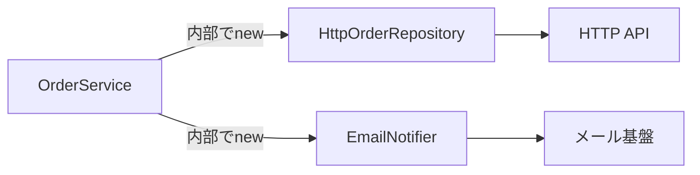
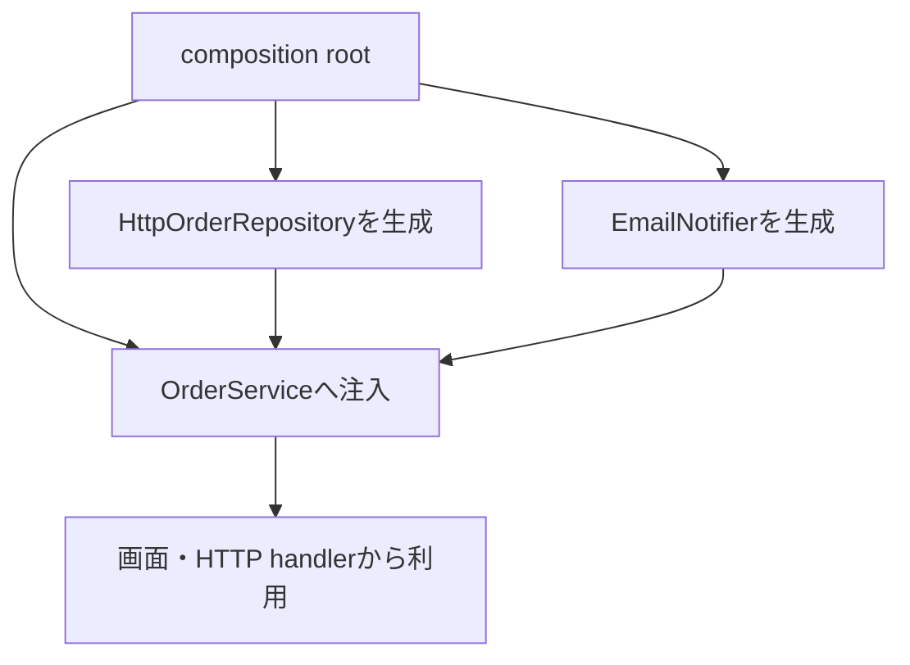

DI（Dependency Injection）は、クラスを増やすための仕組みでも、DIコンテナを使うことでもありません。ある処理が必要とする機能を、その処理の中で作らず、外から渡す設計です。

コード例は依存の向きを示すための抜粋です。注文の型やサーバー起動処理など、説明に直接関係しない定義は省略しています。

外から渡すと、業務ルールと通信・DB・時刻などを分けられます。差し替えやテストが目的というより、依存関係をコード上で見える形にすることが中心です。

## 内部で依存を作ると、変更箇所が結び付く

```ts
class OrderService {
  async placeOrder(input: OrderInput): Promise<Order> {
    const repository = new HttpOrderRepository("/api");
    const notifier = new EmailNotifier();

    const order = createOrder(input);
    await repository.save(order);
    await notifier.send(order.userId, "注文を受け付けました");
    return order;
  }
}
```

`OrderService` がHTTP通信とメール送信の具体的な作り方まで知っています。保存先を変えるだけでも、このクラスを編集しなければなりません。テストでも本物の通信を避けにくくなります。



ここで問題になるのは、業務処理が具体的なインフラの生成責務まで抱えていることです。`new` は、アプリケーションの入口で実装を組み立てるためにも使います。

## 必要な振る舞いを契約にして外から渡す

TypeScriptでは、必要な操作だけをインターフェースとして定義できます。

```ts
interface OrderRepository {
  save(order: Order): Promise<void>;
}

interface Notifier {
  send(userId: string, message: string): Promise<void>;
}

class OrderService {
  constructor(
    private readonly repository: OrderRepository,
    private readonly notifier: Notifier,
  ) {}

  async placeOrder(input: OrderInput): Promise<Order> {
    const order = createOrder(input);
    await this.repository.save(order);
    await this.notifier.send(order.userId, "注文を受け付けました");
    return order;
  }
}
```

`OrderService` が知るのは、「注文を保存できる」「通知を送れる」という振る舞いだけです。HTTPやメールの詳細は実装側へ移りました。

ここでインターフェースを作る視点も重要です。`OrderService` が実際に必要とする操作は `save` だけなので、それだけを契約にしています。`HttpOrderRepository` が提供できる全機能を並べる必要はありません。契約を利用側から定義すると、インフラの都合が業務処理へ逆流しません。

依存を抽象化する対象は、将来差し替わるものだけではありません。時刻、乱数、ファイル、ネットワークのように、実行環境によって結果が変わるものを境界へ出すと、どの処理が外部状態へ触れるか分かります。反対に、単純な文字列整形までインターフェースにすると、追う型だけが増えます。

| 変更 | 主に触る場所 |
| --- | --- |
| 注文ルールを変える | `OrderService` / `createOrder` |
| 保存先をHTTPからDBへ変える | `OrderRepository` の実装 |
| メールを通知APIへ変える | `Notifier` の実装 |
| 業務ルールだけテストする | テスト ダブルを注入 |

## 組み立てはコンポジションルートへ集める

依存を外から渡すと、「では誰が作るのか」という仕事が残ります。アプリケーションの入口で一度だけ組み立てます。この場所をコンポジションルートと呼びます。

```ts
const repository = new HttpOrderRepository({
  baseUrl: process.env.API_BASE_URL!,
});
const notifier = new EmailNotifier({
  apiKey: process.env.EMAIL_API_KEY!,
});

const orderService = new OrderService(repository, notifier);

startServer({ orderService });
```



生成コードが各機能へ散らばらないため、実行時にどの実装を使うかを入口から追えます。

1件のHTTPリクエストが届いたときの経路を追うと、各要素の役割がつながります。

1. 起動時にコンポジションルートが `HttpOrderRepository` と `EmailNotifier` を生成する。
2. それらを `OrderService` へ渡し、完成したサービスをHTTPハンドラーへ渡す。
3. リクエストを受けたハンドラーが、保持している `orderService.placeOrder(input)` を呼ぶ。
4. `OrderService` は `OrderRepository` インターフェースの `save` を呼ぶ。
5. 実際に注入されている `HttpOrderRepository` がHTTP APIへ保存要求を送る。

インターフェースは呼び出し側が必要とする契約、`HttpOrderRepository` はその具体的な実装、コンポジションルートは両者を結び付ける場所です。起動時に作った関係をリクエスト処理でも使うため、どのコードが本番通信へ到達するかを入口から確認できます。

コンポジションルートは、業務処理を書く場所ではありません。環境変数を読み、具体実装を選び、依存の寿命を決めてアプリケーションへ渡す場所です。ここに生成が集まっていれば、「本番環境ではHTTP、テストではメモリ」という違いも、機能コードを開かずに確認できます。

## テストでは業務ルールに必要な振る舞いだけ用意する

依存を注入できれば、テストで小さな代替実装を渡せます。

```ts
class InMemoryOrderRepository implements OrderRepository {
  saved: Order[] = [];

  async save(order: Order): Promise<void> {
    this.saved.push(order);
  }
}

class SpyNotifier implements Notifier {
  calls: Array<{ userId: string; message: string }> = [];

  async send(userId: string, message: string): Promise<void> {
    this.calls.push({ userId, message });
  }
}

const repository = new InMemoryOrderRepository();
const notifier = new SpyNotifier();
const service = new OrderService(repository, notifier);

const order = await service.placeOrder(validInput);

expect(repository.saved).toEqual([order]);
expect(notifier.calls).toHaveLength(1);
```

テスト ダブルは、本物に似せた巨大な偽物である必要はありません。テストしたい契約に必要な振る舞いだけを持たせます。

このテストが速いのは副次的な利点です。より大きな価値は、失敗したときに注文規則の問題なのか、ネットワークやメール基盤の問題なのかを切り分けられることです。インフラ実装は別の結合テストで検証し、業務処理のテストへ両方の責任を背負わせません。

## コンストラクター注入だけがDIではない

依存の渡し方は、寿命と必須性で選びます。

| 渡し方 | 向いている依存 | 注意点 |
| --- | --- | --- |
| コンストラクター注入 | オブジェクトの全操作で必須 | 引数が多いなら責務過多を疑う |
| 関数引数 | 1回の処理だけで必要 | 最も単純で依存が見えやすい |
| Factory引数 | 生成時に実装を選ぶ | Factory自体が巨大化しないようにする |
| プロパティ注入 | 任意・後付けの依存 | 未設定状態を作りやすい |

純粋な関数なら、引数として渡すだけで十分です。

```ts
function calculateDeadline(
  startedAt: Date,
  businessDays: number,
  calendar: BusinessCalendar,
): Date {
  return calendar.addBusinessDays(startedAt, businessDays);
}
```

すべてをクラスと `constructor` へ変換する必要はありません。

## DI・DIP・IoCを区別する

似た言葉ですが、見ている層が違います。

| 用語 | 要点 |
| --- | --- |
| DI | 依存する値やオブジェクトを外から渡す手段 |
| DIP | 上位の方針を下位の具体実装へ直接依存させない原則 |
| IoC | 処理や生成の主導権を外側の仕組みへ移す広い考え方 |

DIはDIPを実現する手段としてよく使われますが、インターフェースを増やせば自動的に良い設計になるわけではありません。変更したい境界がどこかを先に決めます。

## TypeScriptのインターフェースは実行時に消える

TypeScriptのインターフェースは型検査用で、JavaScriptへ変換すると残りません。そのため、DIコンテナが `constructor` の型だけを見て自動解決するには、トークンやデコレーターメタデータなど別の仕組みが必要です。

小規模なアプリケーションでは、コンポジションルートで明示的に `new` する方が簡単です。コンテナは次の条件が揃ってから検討できます。

- 組み立てる依存が多く、手作業の重複が目立つ。
- スコープやライフサイクルを統一して管理したい。
- 実装選択に規則があり、明示的な生成だけでは追いにくい。

コンテナを入れると、設定を見ないと生成経路が分からない負担も増えます。

## サービスロケーターは依存を隠す

```ts
class OrderService {
  async placeOrder(input: OrderInput) {
    const repository = container.get<OrderRepository>("OrderRepository");
    // ...
  }
}
```

この形では、`constructor` を見ても必要な依存が分かりません。コンテナというグローバルな検索機構へ依存しています。必要なものは入口で解決し、明示的に渡す方が関係を追いやすくなります。

## スコープとライフサイクルも依存の契約

同じインターフェースでも、毎回新しく作るか、アプリ全体で共有するか、リクエストごとに分けるかで挙動が変わります。

| スコープ | 例 | 注意点 |
| --- | --- | --- |
| transient（毎回生成） | 軽量な変換器 | 生成回数が増える |
| リクエスト | 認証情報、トランザクション | リクエスト間で共有しない |
| アプリケーション | 接続プール、設定 | 変更可能な利用者状態を置かない |

SSRで利用者情報をアプリケーション スコープへ置くと、別のリクエストへ漏れる危険があります。型だけでなく、誰といつまで共有する依存かを決めます。

## DIを導入する前の判断

1. 変更理由の異なる処理が直接結び付いているか。
2. 依存は関数引数で渡すだけでは足りないか。
3. インターフェースは利用側が本当に必要とする最小の操作か。
4. 生成場所をコンポジションルートへ集められるか。
5. スコープと破棄の責任を説明できるか。

DIの価値は、何でも差し替え可能にすることではありません。業務処理が何を必要とし、実行時に何を使うかを、コードから追えるようにすることです。まず引数や `constructor` で明示的に渡し、組み立てが本当に複雑になったときだけコンテナを検討すると、仕組みが目的化しません。

## 参考資料

- [TypeScript Handbook: Interfaces](https://www.typescriptlang.org/docs/handbook/2/objects.html)
- [TypeScript Handbook: Classes](https://www.typescriptlang.org/docs/handbook/2/classes.html)
- [Martin Fowler: Inversion of Control Containers and the Dependency Injection pattern](https://martinfowler.com/articles/injection.html)
- [Martin Fowler: Composition Root](https://blog.ploeh.dk/2011/07/28/CompositionRoot/)
