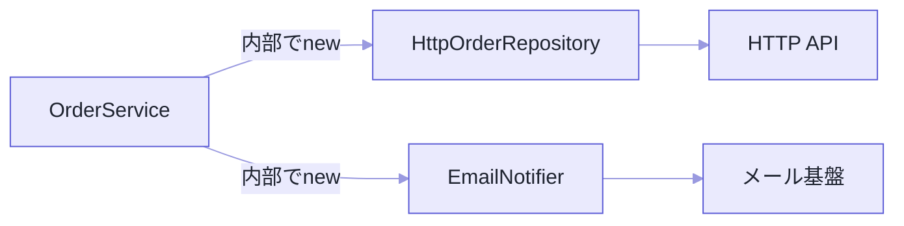
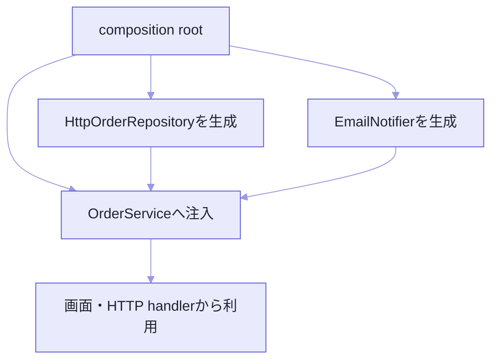

「DIを入れましょう」と言われて、私が最初にやったのは、DIコンテナのライブラリを探すことでした。

順番が逆でした。DIは、クラスを増やす作法でも、コンテナを導入することでもありません。

**ある処理が必要とする機能を、その処理の中で作らずに、外から渡す。** それだけです。

外から渡せると、業務ルールと通信・DB・時刻を切り離せます。ただ、差し替えやテストのため、というのは少し狭い言い方かもしれません。本題は、**依存関係をコードの上で見える形にする**ことにあります。

コードは依存の向きを示すための抜粋です。注文の型やサーバー起動処理など、関係ない定義は省いています。

## 中で `new` した瞬間に、縛られる

```ts
class OrderService {
  async placeOrder(input: OrderInput): Promise<Order> {
    const repository = new HttpOrderRepository("/api");
    const notifier = new EmailNotifier();

    const order = createOrder(input);
    await repository.save(order);
    await notifier.send(order.userId, "注文を受け付けました");
    return order;
  }
}
```

`OrderService` が、HTTP通信とメール送信の作り方まで知っています。

保存先をDBへ変えたい。それだけで、このクラスを開くことになります。テストで本物の通信を避けるのも難しい。



問題は `new` を書いたことではありません。**業務処理が、インフラを生成する責務まで抱えている**ことです。`new` 自体は、アプリの入口で実装を組み立てるために必要な道具です。

## 必要な振る舞いだけを、契約にする

```ts
interface OrderRepository {
  save(order: Order): Promise<void>;
}

interface Notifier {
  send(userId: string, message: string): Promise<void>;
}

class OrderService {
  constructor(
    private readonly repository: OrderRepository,
    private readonly notifier: Notifier,
  ) {}

  async placeOrder(input: OrderInput): Promise<Order> {
    const order = createOrder(input);
    await this.repository.save(order);
    await this.notifier.send(order.userId, "注文を受け付けました");
    return order;
  }
}
```

`OrderService` が知っているのは、「注文を保存できる」「通知を送れる」の2つだけになりました。HTTPやメールの事情は、実装側へ引っ越しています。

ここでインターフェースの作り方にも一言あります。

`OrderService` が実際に使うのは `save` だけなので、契約もそれだけにしました。`HttpOrderRepository` が持っている機能を全部並べる必要はありません。**契約は利用側から定義する。** そうしないと、インフラの都合が業務処理へ逆流してきます。

抽象化する対象も、将来差し替わるものだけとは限りません。時刻、乱数、ファイル、ネットワーク。実行環境で結果が変わるものを境界に出しておくと、どの処理が外部状態に触れているかが一目で分かります。

逆に、単純な文字列整形までインターフェースにすると、追いかける型が増えるだけです。

| 変更 | 主に触る場所 |
| --- | --- |
| 注文ルールを変える | `OrderService` / `createOrder` |
| 保存先をHTTPからDBへ変える | `OrderRepository` の実装 |
| メールを通知APIへ変える | `Notifier` の実装 |
| 業務ルールだけテストする | テストダブルを注入 |

## じゃあ、誰が作るのか

外から渡すことにすると、この仕事が残ります。答えは、アプリの入口で一度だけ組み立てる。この場所をコンポジションルートと呼びます。

```ts
const repository = new HttpOrderRepository({
  baseUrl: process.env.API_BASE_URL!,
});
const notifier = new EmailNotifier({
  apiKey: process.env.EMAIL_API_KEY!,
});

const orderService = new OrderService(repository, notifier);

startServer({ orderService });
```



生成コードが1か所にまとまるので、実行時にどの実装が使われるのかを入口から追えます。

1件のHTTPリクエストが届いたときの経路を、最後まで追ってみます。

1. 起動時にコンポジションルートが `HttpOrderRepository` と `EmailNotifier` を生成する。
2. それらを `OrderService` へ渡し、完成したサービスをHTTPハンドラーへ渡す。
3. リクエストを受けたハンドラーが、保持している `orderService.placeOrder(input)` を呼ぶ。
4. `OrderService` は `OrderRepository` インターフェースの `save` を呼ぶ。
5. 実際に注入されている `HttpOrderRepository` がHTTP APIへ保存要求を送る。

役割を並べ直すと、インターフェースは呼び出し側が必要とする契約。`HttpOrderRepository` はその具体的な実装。コンポジションルートは、両者を結ぶ場所。

起動時に組んだ関係がリクエスト処理でもそのまま使われるので、**どのコードが本番の通信に到達するのか**を入口から確認できます。

そしてコンポジションルートは、業務処理を書く場所ではありません。環境変数を読み、実装を選び、依存の寿命を決めて渡す。それだけの場所です。ここに生成が集まっていれば、「本番はHTTP、テストはメモリ」という違いも、機能コードを一切開かずに確認できます。

## テストダブルは、小さくていい

```ts
class InMemoryOrderRepository implements OrderRepository {
  saved: Order[] = [];

  async save(order: Order): Promise<void> {
    this.saved.push(order);
  }
}

class SpyNotifier implements Notifier {
  calls: Array<{ userId: string; message: string }> = [];

  async send(userId: string, message: string): Promise<void> {
    this.calls.push({ userId, message });
  }
}

const repository = new InMemoryOrderRepository();
const notifier = new SpyNotifier();
const service = new OrderService(repository, notifier);

const order = await service.placeOrder(validInput);

expect(repository.saved).toEqual([order]);
expect(notifier.calls).toHaveLength(1);
```

本物そっくりの巨大な偽物を作る必要はありません。テストしたい契約に必要な振る舞いだけ。

このテストが速いのは、ただのおまけです。本当にありがたいのは、失敗したときに**注文規則の問題なのか、ネットワークやメール基盤の問題なのか**が即座に切り分けられることでした。インフラの検証は別の結合テストに任せて、業務処理のテストに両方の責任を背負わせません。

## `constructor` に押し込まなくていい

渡し方は、依存の寿命と必須性で選びます。

| 渡し方 | 向いている依存 | 注意点 |
| --- | --- | --- |
| コンストラクター注入 | オブジェクトの全操作で必須 | 引数が多いなら責務過多を疑う |
| 関数引数 | 1回の処理だけで必要 | 最も単純で依存が見えやすい |
| Factory引数 | 生成時に実装を選ぶ | Factory自体が巨大化しないようにする |
| プロパティ注入 | 任意・後付けの依存 | 未設定状態を作りやすい |

純粋な関数なら、引数で渡すだけで十分です。

```ts
function calculateDeadline(
  startedAt: Date,
  businessDays: number,
  calendar: BusinessCalendar,
): Date {
  return calendar.addBusinessDays(startedAt, businessDays);
}
```

全部をクラスと `constructor` に変換する必要はありません。これもDIです。

## DIとDIPとIoC

似た略語が並びますが、見ている層が違います。

| 用語 | 要点 |
| --- | --- |
| DI | 依存する値やオブジェクトを外から渡す手段 |
| DIP | 上位の方針を下位の具体実装へ直接依存させない原則 |
| IoC | 処理や生成の主導権を外側の仕組みへ移す広い考え方 |

DIはDIPを実現する手段としてよく使われます。ただ、インターフェースを増やせば自動的に良い設計になる、ということではありません。変えたい境界がどこなのかを、先に決めてください。

## TypeScriptのインターフェースは、実行時に消える

これは知っておく価値があります。TypeScriptのインターフェースは型検査のためのもので、JavaScriptに変換した時点で跡形もなくなります。

だからDIコンテナが `constructor` の型を見て自動解決するには、トークンやデコレーターメタデータといった別の仕掛けが要ります。

小規模なら、コンポジションルートで素直に `new` するほうが簡単です。コンテナを検討するのは、こうなってからで足ります。

- 組み立てる依存が多く、手作業の重複が目立つ。
- スコープやライフサイクルを統一して管理したい。
- 実装選択に規則があり、明示的な生成だけでは追いにくい。

コンテナを入れると、設定ファイルを見ないと生成経路が分からないという別の負担が生まれます。そこは天秤にかけてください。

## これはDIではありません

```ts
class OrderService {
  async placeOrder(input: OrderInput) {
    const repository = container.get<OrderRepository>("OrderRepository");
    // ...
  }
}
```

サービスロケーターと呼ばれる形です。

一見よく似ています。でも `constructor` を見ても、このクラスが何を必要としているのか分かりません。コンテナというグローバルな検索窓口に依存しているだけで、依存は隠れたままです。

必要なものは入口で解決して、明示的に渡す。そのほうが関係を追えます。

## いつまで、誰と共有するのか

同じインターフェースでも、毎回作るのか、アプリ全体で共有するのか、リクエストごとに分けるのかで挙動が変わります。

| スコープ | 例 | 注意点 |
| --- | --- | --- |
| transient（毎回生成） | 軽量な変換器 | 生成回数が増える |
| リクエスト | 認証情報、トランザクション | リクエスト間で共有しない |
| アプリケーション | 接続プール、設定 | 変更可能な利用者状態を置かない |

SSRで利用者情報をアプリケーションスコープに置くと、別の人のリクエストへ漏れます。型を合わせるだけでなく、**誰といつまで共有する依存なのか**まで決めてください。

## 入れる前に自問する5つ

1. 変更理由の異なる処理が直接結び付いているか。
2. 依存は関数引数で渡すだけでは足りないか。
3. インターフェースは利用側が本当に必要とする最小の操作か。
4. 生成場所をコンポジションルートへ集められるか。
5. スコープと破棄の責任を説明できるか。

---

冒頭の「まずライブラリを探した」に戻ります。

あのとき私が求めていたのは仕組みでしたが、DIが与えてくれるのは仕組みではありませんでした。**業務処理が何を必要としていて、実行時に何を使うのか。それをコードから追えるようにすること**です。

だから始め方も軽くていい。まず引数か `constructor` で明示的に渡す。組み立てが本当に苦しくなってから、コンテナを考える。

この順番なら、手段が目的にすり替わりません。

## 参考資料

- [TypeScript Handbook: Interfaces](https://www.typescriptlang.org/docs/handbook/2/objects.html)
- [TypeScript Handbook: Classes](https://www.typescriptlang.org/docs/handbook/2/classes.html)
- [Martin Fowler: Inversion of Control Containers and the Dependency Injection pattern](https://martinfowler.com/articles/injection.html)
- [Martin Fowler: Composition Root](https://blog.ploeh.dk/2011/07/28/CompositionRoot/)
