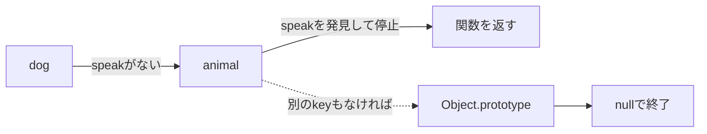
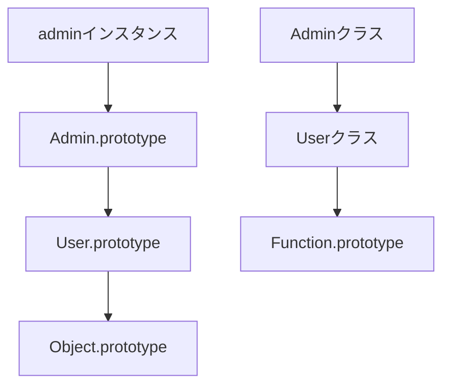

`object.method()` が動いた。

だからそのメソッドは `object` の中にある。私はずっとそう思っていました。半分だけ正解です。オブジェクト自身に無ければ、JavaScriptは親にあたるオブジェクトを順にたどって探しにいきます。

この探索経路が `prototype` 連鎖です。

そして `class`、継承、`instanceof`、メソッド共有。これらを別々に暗記する必要はありませんでした。全部、この1本の探索規則から説明がつきます。

## 自分になければ、親を見る

まず `Object.create` で、いちばん小さい関係を作ります。

```js
const animal = {
  speak() {
    return `${this.name} makes a sound`;
  },
};

const dog = Object.create(animal);
dog.name = "Pochi";

console.log(dog.name);    // dog自身にある
console.log(dog.speak()); // animalから見つかる
```

`dog.speak` を読んだとき、こう探されます。



ポイントは、**最初に見つかったところで止まる**ことです。

もう少し丁寧に追うと、まず `dog` 自身が `speak` を持っているかを確認します。無いので `Object.getPrototypeOf(dog)` にあたる `animal` へ。ここで関数が見つかったので、それを結果として返して終わり。`Object.prototype` や `null` まで毎回歩いているわけではありません。

ここで大事なのは、**親のプロパティを子にコピーしているのではない**ということです。

`animal.speak` を後から差し替えれば、`dog` が同名のプロパティを持たない限り、次の探索では新しい関数が見つかります。共有されているのは探索先であって、子の中の複製ではない。そう考えると、変更の影響範囲が読めるようになります。

```js
dog.speak = function () {
  return `${this.name} barks`;
};

console.log(dog.speak()); // "Pochi barks"
delete dog.speak;
console.log(dog.speak()); // "Pochi makes a sound"
```

親の値を書き換えたわけではありません。自分のところに同じ名前を置いて、探索の結果を変えただけです。

## `.prototype` と `[[Prototype]]` は別物

名前が似すぎていて、私はここで何度も混乱しました。役割を分けます。

| 名前 | 所有者 | 役割 |
| --- | --- | --- |
| `Constructor.prototype` | 関数・クラス | `new` で作るオブジェクトの親候補 |
| `object` の `[[Prototype]]` | すべての通常オブジェクト | プロパティ探索で次に見るオブジェクト |

内部スロットの `[[Prototype]]` は、`Object.getPrototypeOf()` で覗きます。

```js
function User(name) {
  this.name = name;
}

User.prototype.greet = function () {
  return `Hello, ${this.name}`;
};

const user = new User("Aki");

console.log(Object.getPrototypeOf(user) === User.prototype); // true
console.log(user.greet()); // "Hello, Aki"
```

`new User()` が作ったオブジェクトの `[[Prototype]]` に、`User.prototype` が入る。だから各インスタンスへ `greet` をコピーしなくても共有できます。

## `class` も、中身は同じ

`class` は `prototype` を隠して別の継承方式を用意した構文ではありません。メソッドは、ちゃんとクラスの `.prototype` に置かれています。

```js
class Cart {
  items = [];

  add(item) {
    this.items.push(item);
  }
}

const first = new Cart();
const second = new Cart();

console.log(first.add === second.add);     // true: メソッドは共有
console.log(first.items === second.items); // false: fieldは各自に作られる
```

同じクラスから作ったのに、片方は `true` で片方は `false`。

| 定義場所 | 保存先 | インスタンス間で共有 |
| --- | --- | --- |
| クラスメソッド | `Cart.prototype` | する |
| インスタンスフィールド | 各インスタンス | しない |
| フィールドのアロー関数 | 各インスタンス | しない |
| `static` メソッド | `Cart` 自身 | インスタンスからは使わない |

`first.add === second.add` が `true` なのは、どちらの探索も同じ `Cart.prototype.add` に着地するからです。一方 `items` は、インスタンスが作られるたびに新しく用意されます。だから片方のカートに商品を入れても、もう片方は空のまま。

**振る舞いは共有して、個体ごとの状態は分ける。** クラスの基本構造が、この2行の比較にそのまま出ています。

ちなみに、フィールドにアロー関数を置くと `this` を固定できて便利ですが、インスタンスごとに関数が作られます。通常のメソッドを機械的に置き換えると、共有という `prototype` の取り柄を捨てることになります。

## `this` は、見つけた場所では決まらない

親でメソッドを見つけても、`dog.speak()` と呼んだなら `this` は `dog` です。メソッドが置いてある `animal` ではありません。

```js
const base = {
  getLabel() {
    return this.label;
  },
};

const item = Object.create(base);
item.label = "item-42";

console.log(item.getLabel()); // "item-42"
```

段階が2つあると考えてください。探索は「どの関数を使うか」を決める。呼び出し方は「その関数の `this` を何にするか」を決める。

この2つを分けて考えられるようになると、getterや継承先でのメソッド呼び出しも追えるようになります。

## 「ある」にも種類がある

プロパティが「ある」と言うとき、実は何を聞きたいのかで使うAPIが変わります。

| 確認したいこと | 書き方 | `prototype` 連鎖を見るか |
| --- | --- | --- |
| 自身が所有するか | `Object.hasOwn(obj, key)` | 見ない |
| どこかに存在するか | `key in obj` | 見る |
| 値を読みたい | `obj[key]` | 見る |
| 自身の列挙可能なキー | `Object.keys(obj)` | 見ない |

設定値が上書きされたかの判定や、外部入力の検証では、この違いが効いてきます。`obj[key] !== undefined` という書き方だと、「値が `undefined` なのか」「そもそも無いのか」を区別できません。

```js
const defaults = { theme: "light" };
const settings = Object.create(defaults);
settings.language = "ja";

console.log(Object.hasOwn(settings, "theme")); // false
console.log("theme" in settings);              // true
console.log(settings.theme);                    // "light"
```

同じ `theme` について聞いているのに、答えが3種類あります。

## 継承すると、連鎖が2本になる

`class Admin extends User` と書いたとき、作られる関係は1本ではありません。インスタンスメソッド用と `static` メンバー用で、2本できます。



基底クラスのインスタンスメソッドは `admin.method()` から。`static` メソッドは `Admin.method()` から見つかります。

1本の連鎖として考えようとすると、`static` 継承の説明で必ず行き詰まります。

## `instanceof` が見ているもの

`value instanceof Constructor` は、概念としては `Constructor.prototype` が `value` の `prototype` 連鎖に含まれるかを調べています。

```js
class User {}
const user = new User();

console.log(user instanceof User);   // true
console.log(user instanceof Object); // true
```

ただ、過信は禁物です。別のiframeやRealmで作られた値、`Symbol.hasInstance` を定義したクラス、実行中に `prototype` を差し替えたコード。こういう場面では直感と違う答えが返ります。

外部データの種類を検証する目的で、`instanceof` だけに頼らないでください。

## 辞書がほしいだけなら `Map`

任意の文字列をキーにする辞書だと、`Object.prototype` 由来のプロパティが邪魔になることがあります。`Object.create(null)` で `prototype` を持たないオブジェクトも作れますが、今度は通常のオブジェクト用メソッドが使えません。

キーの追加・削除・反復が中心なら、素直に `Map` です。目的がコードに現れます。

`prototype` を理解することと、なんでも通常オブジェクトに詰め込むことは別の話です。

## おかしいときに見る順番

1. `Object.hasOwn()` で、自身のプロパティか確認する。
2. `Object.getPrototypeOf()` で親を1段ずつ見る。
3. 同名プロパティが途中で探索を止めていないか確認する。
4. メソッドを取り出して、`this` との関係を失っていないか確認する。
5. 実行中に `prototype` を変更していないか探す。

---

冒頭の勘違いに戻ります。

`object.method()` が動いたからといって、それが `object` の中にあるとは限りませんでした。`prototype` は、複雑な継承のための特殊機能ではなく、**普段のプロパティ読み取りを支えている探索規則**です。

覚えることは2つだけです。自分になければ親を見る。最初に見つかった場所で止まる。

ここから、`class` もメソッド共有も `instanceof` も、全部同じ説明で通せます。

## 参考資料

- [ECMAScript: OrdinaryGet](https://tc39.es/ecma262/multipage/ordinary-and-exotic-objects-behaviours.html#sec-ordinary-object-internal-methods-and-internal-slots-get-p-receiver)
- [ECMAScript: instanceof](https://tc39.es/ecma262/multipage/ecmascript-language-expressions.html#sec-relational-operators-runtime-semantics-evaluation)
- [MDN: Inheritance and the prototype chain](https://developer.mozilla.org/ja/docs/Web/JavaScript/Inheritance_and_the_prototype_chain)
- [MDN: Object.hasOwn()](https://developer.mozilla.org/ja/docs/Web/JavaScript/Reference/Global_Objects/Object/hasOwn)
