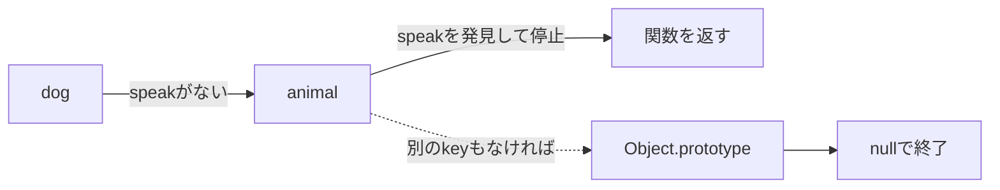
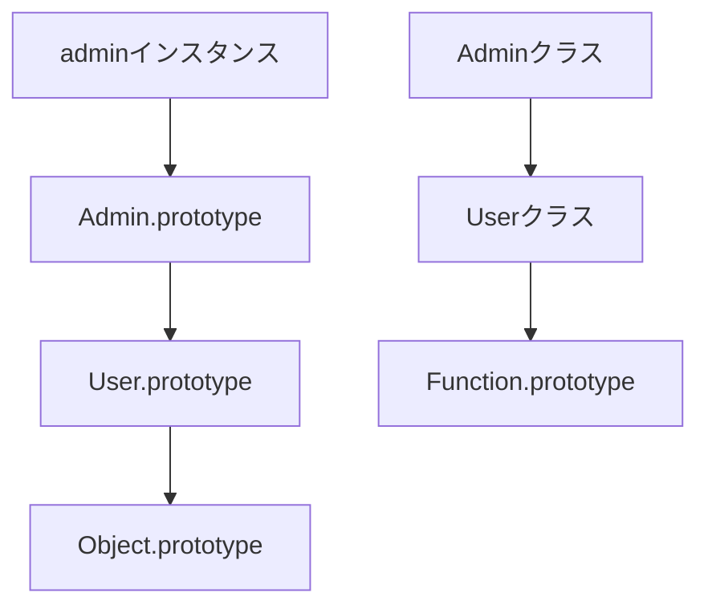

JavaScriptで `object.method()` が動くとき、そのメソッドが `object` 自身に保存されているとは限りません。オブジェクトになければ、JavaScriptは親にあたるオブジェクトを順にたどって探します。

この探索経路が `prototype` 連鎖です。`class`、継承、`instanceof`、メソッド共有を別々に暗記せず、1本の探索規則として理解します。

## プロパティは自分から親へ順番に探される

まず `Object.create` で最小の関係を作ります。

```js
const animal = {
  speak() {
    return `${this.name} makes a sound`;
  },
};

const dog = Object.create(animal);
dog.name = "Pochi";

console.log(dog.name);    // dog自身にある
console.log(dog.speak()); // animalから見つかる
```

`dog.speak` を読むと、次の順に探索されます。



探索は最初に見つかったプロパティで止まります。`dog` 自身へ同名の `speak` を追加すると、親のメソッドは隠れます。

`dog.speak` を評価する場面では、まず `dog` 自身が `speak` を所有しているかを確認します。見つからなければ `Object.getPrototypeOf(dog)` にあたる `animal` へ進み、そこで見つけた関数を読み取り結果として返します。`Object.prototype` や `null` まで必ず進むわけではなく、見つかった時点で探索は終了します。

この仕組みは、親のプロパティを子へコピーしているのではありません。`animal.speak` を後から差し替えれば、`dog` が同名プロパティを持たない限り、次の探索では新しい関数が見つかります。共有されているのは探索先であり、子オブジェクト内の複製ではないと考えると、変更の影響範囲を予測しやすくなります。

```js
dog.speak = function () {
  return `${this.name} barks`;
};

console.log(dog.speak()); // "Pochi barks"
delete dog.speak;
console.log(dog.speak()); // "Pochi makes a sound"
```

親の値を変更したのではありません。自分に同名プロパティを置き、探索結果を変えています。

## `.prototype` と内部の `[[Prototype]]` は別物

名前が似ている2つを混同しやすいため、役割を分けます。

| 名前 | 所有者 | 役割 |
| --- | --- | --- |
| `Constructor.prototype` | 関数・クラス | `new` で作るオブジェクトの親候補 |
| `object` の `[[Prototype]]` | すべての通常オブジェクト | プロパティ探索で次に見るオブジェクト |

内部スロット `[[Prototype]]` は通常、`Object.getPrototypeOf()` で確認します。

```js
function User(name) {
  this.name = name;
}

User.prototype.greet = function () {
  return `Hello, ${this.name}`;
};

const user = new User("Aki");

console.log(Object.getPrototypeOf(user) === User.prototype); // true
console.log(user.greet()); // "Hello, Aki"
```

`new User()` が作るオブジェクトの `[[Prototype]]` に、`User.prototype` が設定されます。その結果、各インスタンスへ `greet` をコピーしなくても共有できます。

## `class` も同じ仕組みを使う

`class` は `prototype` を隠して別の継承方式を作る構文ではありません。メソッドはクラスの `.prototype` に置かれます。

```js
class Cart {
  items = [];

  add(item) {
    this.items.push(item);
  }
}

const first = new Cart();
const second = new Cart();

console.log(first.add === second.add);     // true: メソッドは共有
console.log(first.items === second.items); // false: fieldは各自に作られる
```

| 定義場所 | 保存先 | インスタンス間で共有 |
| --- | --- | --- |
| クラスメソッド | `Cart.prototype` | する |
| インスタンスフィールド | 各インスタンス | しない |
| フィールドのアロー関数 | 各インスタンス | しない |
| `static` メソッド | `Cart` 自身 | インスタンスからは使わない |

フィールドのアロー関数は `this` を固定しやすい一方、インスタンスごとに新しい関数を作ります。通常のメソッドを機械的に置き換えると、共有という `prototype` の利点を失います。

`first.add === second.add` が `true` になるのは、どちらの探索も同じ `Cart.prototype.add` へ到達するためです。一方、`items` は各インスタンスの初期化時にそれぞれ作られるので、片方のカートへ商品を追加しても、もう片方へは入りません。振る舞いは共有し、個体ごとの状態は分けるというクラスの基本構造が、この2つの比較に現れています。

## `this` は見つけた場所ではなく、呼び出し方で決まる

親からメソッドを見つけても、`dog.speak()` と呼べば `this` は `dog` です。メソッドが保存されている `animal` ではありません。

```js
const base = {
  getLabel() {
    return this.label;
  },
};

const item = Object.create(base);
item.label = "item-42";

console.log(item.getLabel()); // "item-42"
```

探索は「どの関数を使うか」を決め、呼び出し方は「その関数の `this` を何にするか」を決めます。2つの段階を分けると、getterや継承先でのメソッド呼び出しも追いやすくなります。

## 所有・存在・列挙を別の質問として扱う

あるプロパティが「ある」と言うとき、何を確認したいかでAPIが変わります。

| 確認したいこと | 書き方 | `prototype` 連鎖を見るか |
| --- | --- | --- |
| 自身が所有するか | `Object.hasOwn(obj, key)` | 見ない |
| どこかに存在するか | `key in obj` | 見る |
| 値を読みたい | `obj[key]` | 見る |
| 自身の列挙可能なキー | `Object.keys(obj)` | 見ない |

設定値の上書き判定や、外部入力の検証では、この違いが重要です。`obj[key] !== undefined` では、「値が `undefined` なのか」「プロパティがないのか」を区別できません。

```js
const defaults = { theme: "light" };
const settings = Object.create(defaults);
settings.language = "ja";

console.log(Object.hasOwn(settings, "theme")); // false
console.log("theme" in settings);              // true
console.log(settings.theme);                    // "light"
```

## 継承ではインスタンス側とクラス側に2本の連鎖ができる

`class Admin extends User` では、インスタンスメソッド用と `static` メンバー用の関係が作られます。



そのため、基底クラスのインスタンスメソッドは `admin.method()` から、`static` メソッドは `Admin.method()` から見つかります。両者を1本の連鎖として考えると、`static` 継承の説明が合わなくなります。

## `instanceof` は `prototype` 連鎖を確認する

`value instanceof Constructor` は、概念上 `Constructor.prototype` が `value` の `prototype` 連鎖に含まれるかを調べます。

```js
class User {}
const user = new User();

console.log(user instanceof User);   // true
console.log(user instanceof Object); // true
```

異なるiframeやRealmで作られた値、`Symbol.hasInstance` を定義したクラス、実行中に `prototype` を差し替えたコードでは、直感と違う結果になることがあります。外部データの種類を検証する目的で、`instanceof` だけへ依存しない方が安全です。

## 辞書用途では `Map` も検討する

任意の文字列をキーとして受け取る辞書では、`Object.prototype` 由来のプロパティが邪魔になる場合があります。`Object.create(null)` なら `prototype` を持たないオブジェクトを作れますが、通常のオブジェクト用メソッドも使えません。

キーの追加・削除・反復が中心なら、`Map` の方が目的を明確に表します。`prototype` を理解した上で、すべてを通常オブジェクトへ詰め込まない判断も大切です。

## 挙動がおかしいときの確認順

1. `Object.hasOwn()` で、自身のプロパティか確認する。
2. `Object.getPrototypeOf()` で親を1段ずつ見る。
3. 同名プロパティが途中で探索を止めていないか確認する。
4. メソッドを取り出して、`this` との関係を失っていないか確認する。
5. 実行中に `prototype` を変更していないか探す。

`prototype` は、複雑な継承専用の機能ではありません。普段のプロパティ読み取りを支える探索規則です。「自分になければ親を見る」「最初に見つかった場所で止まる」という2点から考えれば、`class`、メソッド共有、`instanceof` まで一貫して説明できます。

## 参考資料

- [ECMAScript: OrdinaryGet](https://tc39.es/ecma262/multipage/ordinary-and-exotic-objects-behaviours.html#sec-ordinary-object-internal-methods-and-internal-slots-get-p-receiver)
- [ECMAScript: instanceof](https://tc39.es/ecma262/multipage/ecmascript-language-expressions.html#sec-relational-operators-runtime-semantics-evaluation)
- [MDN: Inheritance and the prototype chain](https://developer.mozilla.org/ja/docs/Web/JavaScript/Inheritance_and_the_prototype_chain)
- [MDN: Object.hasOwn()](https://developer.mozilla.org/ja/docs/Web/JavaScript/Reference/Global_Objects/Object/hasOwn)
