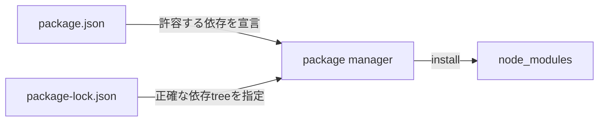
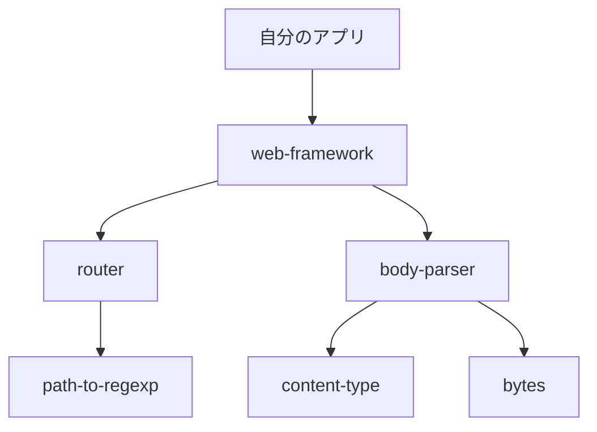
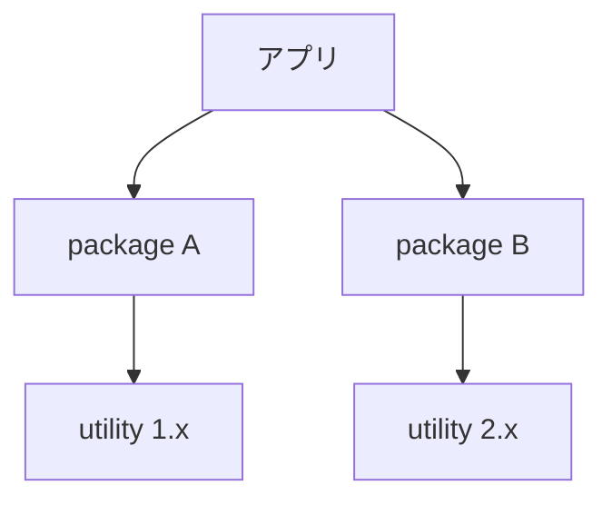
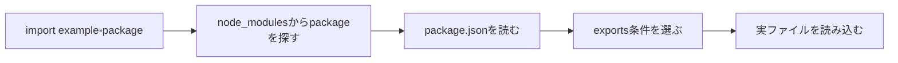

`node_modules` は、インストールしたパッケージのファイルを置くディレクトリです。自分で `package.json` へ追加した数よりはるかに多くのパッケージが入り、数百MBになることもあります。

大きくなる主な理由は、パッケージがさらに別のパッケージへ依存すること、互換範囲が合わないバージョンを複数保持すること、ビルドツールや型定義も含むことです。構造を理解すれば、見覚えのないパッケージがあっても、削除してよいかを根拠を持って判断できます。

## `package.json`・ロックファイル・`node_modules` は役割が違う



| 対象 | 役割 | Gitへコミット |
| --- | --- | --- |
| `package.json` | 直接依存とバージョン範囲を宣言 | する |
| `package-lock.json` | 解決したバージョンと依存ツリーを記録 | 通常する |
| `node_modules` | 実行・ビルドに使う実ファイル | 通常しない |

`package.json` だけでは、実際にどのバージョンを選んだか、推移的依存まで含むツリーは固定できません。ロックファイルが解決結果を記録し、`node_modules` はその結果をファイルとして展開したものです。

## 直接依存の下に推移的依存がある

たとえば自分が `web-framework` だけを追加しても、そのパッケージがルーター、パーサー、utilityへ依存していれば、すべてインストールされます。



自分が `package.json` へ書いたものを直接依存、その先から入るものを推移的依存と呼びます。`node_modules` に見覚えのないパッケージがあるのは、この構造のためです。

推移的依存も実行に必要です。名前を知らないからといって、ディレクトリを個別に削除すると、上位パッケージが `import` できなくなります。

## 中身にはコード以外も入る

パッケージディレクトリには、JavaScriptだけでなく次のようなファイルが含まれます。

```text
node_modules/
├── example-package/
│   ├── package.json
│   ├── dist/
│   ├── src/
│   ├── index.d.ts
│   ├── README.md
│   └── LICENSE
├── @scope/
│   └── scoped-package/
└── .bin/
```

| 内容 | 入る理由 |
| --- | --- |
| 実行時コード | Node.jsやバンドラーが実行・取込する |
| 複数モジュール形式 | CommonJS / ES Modulesなどへ対応 |
| 型定義 | TypeScriptが型検査に使う |
| ソースマップ | デバッグ時に元ソースへ対応付ける |
| README・LICENSE | 利用方法とlicense情報 |
| プラットフォームバイナリ | 高速化、画像処理、コンパイラーなど |

パッケージ公開者が `files` や除外設定で配布物を絞っていなければ、ソースやテスト用fixtureが含まれることもあります。利用側から不要に見えても、パッケージ単位で配布された内容です。

## `.bin` はCLIコマンドへの入口

`node_modules/.bin` には、依存パッケージが公開するCLIへのリンクや、実行方法の差を吸収するラッパーが作られます。

```sh
./node_modules/.bin/eslint .
```

通常は直接パスを書かず、npm scripts経由で呼びます。

```json
{
  "scripts": {
    "lint": "eslint ."
  }
}
```

`npm run lint` の実行中は、npmが `node_modules/.bin` を `PATH` へ加えるため、グローバルインストールしなくてもプロジェクトで指定したeslintを使えます。開発者ごとに別バージョンが動く問題を減らせます。

## 巨大になる5つの理由

### 1. 依存ツリーが深く、枝も多い

1つのフレームワークが数十のパッケージへ依存し、それぞれがさらに依存を持ちます。直接依存の数と、実際のパッケージ数は一致しません。

```sh
npm ls --all
```

出力が大きい場合はパッケージ名を指定するか、`npm explain` で1つの経路に絞ります。

### 2. 同じパッケージの複数バージョンが必要

パッケージAが `utility@^1`、パッケージBが `utility@^2` を必要とするなら、1つのバージョンへまとめられません。両方を保持します。



互換範囲が重なる依存は上位へ配置して共有できますが、範囲が合わなければ別の場所へインストールされます。重複は必ずしも異常ではなく、互換性を守るための結果です。

### 3. 開発ツールも含まれる

TypeScript、テストランナー、バンドラー、リンターは本番コードから直接 `import` しなくても、開発とビルドに必要です。特にコンパイラーやバンドラーは、多数のプラグインとパーサーへ依存します。

本番用イメージを小さくしたい場合は、マルチステージビルドで成果物だけを最終イメージへ移す、本番用の依存パッケージだけをインストールするなど、デプロイ方法で分けます。開発用 `node_modules` を手作業で削る方法は再現性がありません。

### 4. 同じパッケージが複数形式を配布する

CommonJS、ES Modules、ブラウザー向け、Node.js向け、型定義、ソースマップを同時に含むパッケージがあります。利用環境に応じてツールが適切なエントリーを選ぶためです。

手元のプロジェクトで1形式しか使わなくても、`node_modules` から他形式を個別削除すると、ビルドツールの解決や更新時の整合性を壊します。

### 5. ネイティブバイナリやブラウザーバイナリが大きい

画像処理、ヘッドレスブラウザー、データベースドライバーなどは、プラットフォーム向けバイナリやダウンロード済みランタイムを含むことがあります。パッケージ数が少なくても、数個の大きなパッケージが容量の大半を占める場合があります。

容量を調べるときは、パッケージ数だけでなくディレクトリごとのサイズを見ます。

```sh
du -sh node_modules/* 2>/dev/null | sort -h | tail
```

スコープ付き パッケージは1段下にあるため、必要なら `node_modules/@scope/*` も確認します。

## npmは共有できる依存を上へ置く

npmは、互換性を保てる範囲で依存を上位の `node_modules` へ配置し、複数パッケージから共有できるようにします。これを一般にhoistingやdeduplicationと呼びます。

```text
node_modules/
├── package-a/
├── package-b/
└── shared-utility/
```

パッケージAとBが同じ互換性のあるバージョンを使えるなら、上のように1つを共有できます。バージョン範囲が違えば、パッケージ内部にも別バージョンを置きます。

```text
node_modules/
├── package-a/
│   └── node_modules/
│       └── shared-utility/  # 1.x
├── package-b/
└── shared-utility/          # 2.x
```

配置はパッケージマネージャーとバージョン、依存ツリーによって変わります。特定の物理パスへ直接依存せず、通常のモジュール解決へ任せます。

## `import` 時はパッケージの入口を解決する

```js
import { parse } from "example-package";
```

bare specifierと呼ばれるパッケージ名を使うと、ランタイムやバンドラーは `node_modules` からパッケージを探し、そのパッケージの `exports` や `main` などに従って入口を決めます。



`./example-package` は現在のファイルからの相対パスです。パッケージ名 `example-package` とは別物です。

ブラウザーは通常、デプロイ先の `node_modules` を直接探しません。Viteやwebpackなどのバンドラーが依存を解析してブラウザー向けの成果物へ組み込むか、開発サーバーが変換して配信します。

## `node_modules` をGitへコミットしない理由

`node_modules` は大きいだけでなく、`package.json` とロックファイルから再生成できます。さらにOSやCPU、Node.jsのバージョン、任意の依存パッケージの条件によって内容が変わる場合があります。

```gitignore
node_modules/
```

Gitへコミットすると、次の問題が起きます。

- ファイル数が多く、cloneや差分確認が遅くなる。
- バイナリや生成物の差分をレビューしにくい。
- OS固有ファイルが別環境で動かない。
- ロックファイルとの整合性が崩れる。
- パッケージの更新差分へ自作コードが埋もれる。

依存の再現に必要なのは、`node_modules` 本体より、マニフェスト、ロックファイル、利用するパッケージマネージャーとランタイムのバージョンです。

## 削除してよいが、原因解決とは限らない

`node_modules` は生成物なので、開発サーバーを止めた上で削除し、再インストールできます。

```sh
rm -rf node_modules
npm ci
```

`npm ci` はロックファイルどおりにクリーンインストールするため、現在の依存ツリーを再現したい場合に向きます。

削除で直ることがあるのは、中断されたインストール、古いファイル、ロックファイルと実体のずれなどを作り直せるためです。ただし、設定ミス、互換性のないバージョン、アプリコードの不具合は直りません。「困ったら毎回削除」では原因が残ります。

### ロックファイルまで削除する判断は別

`node_modules` だけを削除して `npm ci` すれば、同じ依存ツリーを再構築します。`package-lock.json` まで削除して `npm install` すると、`package.json` の範囲からツリーを解決し直すため、多数のバージョンが変わる可能性があります。

| 操作 | 意味 |
| --- | --- |
| `node_modules` 削除 + `npm ci` | 現在のロックファイルを再現 |
| `node_modules` とロックファイル削除 + `npm install` | 依存ツリーを再解決 |

ロックファイル削除は、原因を理解し、依存更新として差分をレビューできる場合に行います。

## `node_modules` を直接編集しない

一時的にパッケージコードを編集すると、その場では直ったように見えます。しかし再インストールで消え、他の開発者やCIには共有されません。

修正が必要なら、上流へ報告する、修正版へ更新する、フォークを使う、パッチ管理ツールを使うなど、再現可能な方法を選びます。デバッグ目的の一時編集をした場合も、最終的な修正方法と混同しないようにします。

## npm・pnpm・Yarnでは物理構造が違う

npmは一般に、共有できる依存を上位へ配置した `node_modules` を作ります。pnpmは内容アドレス方式のストアとリンクを使い、重複する実体を減らします。Yarnには `node_modules` を使う方式のほか、Plug'n'Playのように別の解決方式もあります。

物理構造が違っても、マニフェストとロックファイルから依存を解決し、パッケージの入口を提供する目的は共通です。ツールを切り替えるときは、`node_modules` の見た目だけでなく、ロックファイル、CI、キャッシュ、editor対応を合わせて移行します。

## 見覚えのないパッケージを調べる順序

1. パッケージ名を `npm explain` へ渡し、依存経路を見る。
2. `npm ls package-name` で複数バージョンを確認する。
3. パッケージの `package.json` でバージョン、license、入口を確認する。
4. 容量が問題ならディレクトリサイズを測る。
5. 不要に見える場合は、直接削除せず上位依存を見直す。

```sh
npm explain package-name
npm ls package-name
npm dedupe --dry-run
```

`npm dedupe` は共有できる依存を整理できる場合がありますが、実行前にドライランとロックファイル差分を確認します。

`node_modules` が巨大なのは、単にnpmが無駄なファイルを集めているからではありません。依存ツリー、複数バージョン、開発ツール、複数形式、バイナリという複数の理由が重なっています。個別ファイルを消すのではなく、`npm explain` で「なぜ入ったか」を上位からたどると、安全に整理できます。

## 参考資料

- [npm Docs: folders](https://docs.npmjs.com/cli/configuring-npm/folders)
- [npm Docs: package-lock.json](https://docs.npmjs.com/cli/configuring-npm/package-lock-json)
- [npm Docs: npm explain](https://docs.npmjs.com/cli/commands/npm-explain)
- [Node.js: Modules](https://nodejs.org/api/modules.html)
- [Node.js: Packages](https://nodejs.org/api/packages.html)
- [pnpm: Symlinked node_modules structure](https://pnpm.io/symlinked-node-modules-structure)
