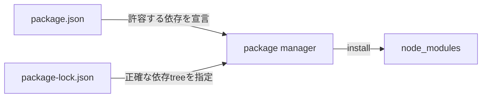
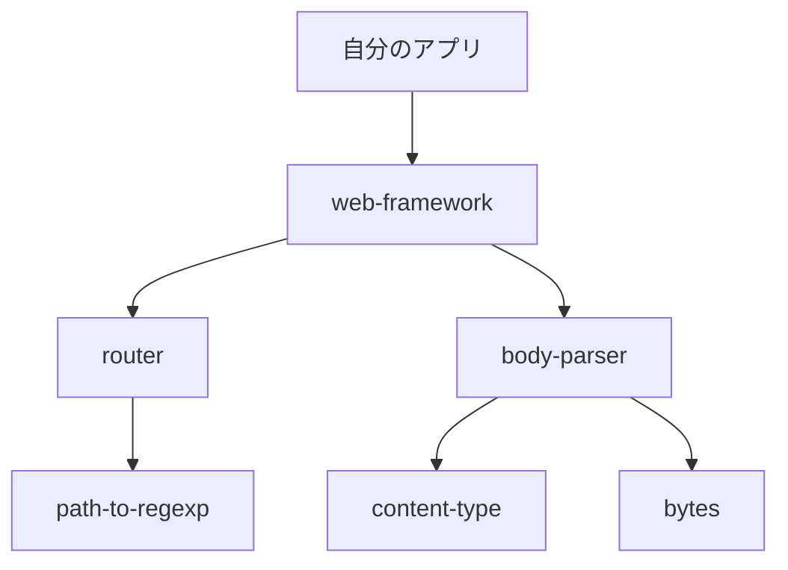
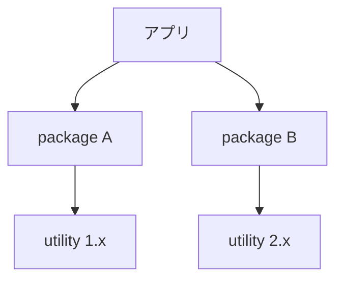
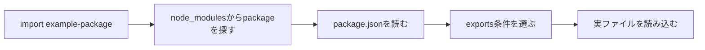

`package.json`に書いた依存は5個なのに、`node_modules`には1200個、容量は430MB。このように、直接追加した依存の数と実際のファイル数・容量は大きく異なることがあります。

理由は3つあります。パッケージがさらに別のパッケージへ依存すること。互換範囲が合わないバージョンを両方とも抱えること。そしてビルドツールや型定義まで入っていること。

構造さえ分かれば、見覚えのないディレクトリが出てきても「これは消していいのか」を根拠つきで判断できます。

## 3つのファイルの、役割の違い



| 対象 | 役割 | Gitへコミット |
| --- | --- | --- |
| `package.json` | 直接依存とバージョン範囲を宣言 | する |
| `package-lock.json` | 解決したバージョンと依存ツリーを記録 | 通常する |
| `node_modules` | 実行・ビルドに使う実ファイル | 通常しない |

`package.json` に書いてあるのは希望であって、結果ではありません。実際にどのバージョンが選ばれて、その下にどんなツリーが伸びたかは固定できない。

その解決結果を記録するのがロックファイルで、記録どおりにファイルを展開したものが `node_modules` です。

## 5個が1200個になる仕組み

`web-framework` を1つ入れたとします。それがルーターとパーサーとユーティリティに依存していれば、当然そちらも入ってきます。



自分が書いたものが直接依存。その先から芋づる式に入るのが推移的依存です。見覚えのない名前が並んでいる正体は、これです。

そして推移的依存も、実行に必要です。**知らない名前だからという理由でディレクトリを消すと、上位のパッケージが `import` できなくなります。**

## 中身はコードだけじゃない

```text
node_modules/
├── example-package/
│   ├── package.json
│   ├── dist/
│   ├── src/
│   ├── index.d.ts
│   ├── README.md
│   └── LICENSE
├── @scope/
│   └── scoped-package/
└── .bin/
```

| 内容 | 入る理由 |
| --- | --- |
| 実行時コード | Node.jsやバンドラーが実行・取込する |
| 複数モジュール形式 | CommonJS / ES Modulesなどへ対応 |
| 型定義 | TypeScriptが型検査に使う |
| ソースマップ | デバッグ時に元ソースへ対応付ける |
| README・LICENSE | 利用方法とlicense情報 |
| プラットフォーム バイナリ | 高速化、画像処理、コンパイラーなど |

公開者が `files` で配布物を絞っていなければ、ソースやテスト用のfixtureまで入ります。こちらから見て不要でも、パッケージ単位で配られた中身なので、勝手に間引くものではありません。

## `.bin` の正体

`node_modules/.bin` には、依存パッケージが公開するCLIへのリンクが作られます。

```sh
./node_modules/.bin/eslint .
```

普段このパスを直接書くことはないと思います。npm scripts経由で呼ぶからです。

```json
{
  "scripts": {
    "lint": "eslint ."
  }
}
```

`npm run lint` を実行しているあいだ、npmは `node_modules/.bin` を `PATH` に足してくれます。だからグローバルにインストールしなくても、プロジェクトが指定したバージョンのeslintが動く。

「私の環境では通るのに」を減らしてくれているのは、この仕組みです。

## 巨大になる5つの理由

### 1. ツリーが深くて、枝も多い

フレームワーク1つが数十のパッケージに依存し、その全部がさらに依存を持っています。直接依存の数と、実際のパッケージ数は一致しません。

```sh
npm ls --all
```

出力が滝のように流れたら、パッケージ名を指定するか、`npm explain` で1経路に絞ってください。

### 2. 同じパッケージが、2つ入る

パッケージAが`utility@^1`を、パッケージBが`utility@^2`を要求している場合、どちらか一方には寄せられません。



範囲が重なる依存は上位へ置いて共有できますが、重ならなければ別々の場所に入ります。

**重複はバグではありません。** 互換性を守った結果です。

### 3. 開発ツールも住んでいる

TypeScript、テストランナー、バンドラー、リンター。本番のコードから `import` しなくても、開発とビルドには要ります。とくにコンパイラーとバンドラーは、大量のプラグインとパーサーを連れてきます。

本番イメージを軽くしたいなら、マルチステージビルドで成果物だけ移すか、本番用の依存だけインストールする。デプロイの方法で分けてください。

開発用の `node_modules` を手で削る。これだけはやめたほうがいいです。再現性がありません。

### 4. 1つのパッケージが、何形式も配る

CommonJS、ES Modules、ブラウザー向け、Node.js向け、型定義、ソースマップ。これらを全部同梱しているパッケージがあります。利用環境に応じて、ツールが適切な入口を選べるようにするためです。

自分のプロジェクトで1形式しか使わないとしても、他形式を消さないでください。ビルドツールの解決と、更新時の整合性が壊れます。

### 5. 大物が数個で、容量を持っていく

画像処理、ヘッドレスブラウザー、データベースドライバー。この手のパッケージは、プラットフォーム向けバイナリやダウンロード済みランタイムを抱えています。

**パッケージ数が少なくても重いことがある。** だから容量を調べるときは、数ではなくサイズを見ます。

```sh
du -sh node_modules/* 2>/dev/null | sort -h | tail
```

スコープ付きパッケージは1段下にいるので、必要なら `node_modules/@scope/*` も。

## 共有できるものは、上へ

npmは、互換性を保てる範囲で依存を上位の `node_modules` へ置いて、複数のパッケージから共有させます。hoistingやdeduplicationと呼ばれる動きです。

```text
node_modules/
├── package-a/
├── package-b/
└── shared-utility/
```

AとBが同じバージョンで足りるなら、1つで済みます。範囲が違えば、こうなります。

```text
node_modules/
├── package-a/
│   └── node_modules/
│       └── shared-utility/  # 1.x
├── package-b/
└── shared-utility/          # 2.x
```

この配置は、パッケージマネージャーとバージョンと依存ツリーで変わります。だから特定の物理パスを直接書かないでください。通常のモジュール解決に任せます。

## `import` したとき、何が起きているか

```js
import { parse } from "example-package";
```

このパッケージ名はbare specifierと呼ばれます。ランタイムやバンドラーは `node_modules` からパッケージを探して、そのパッケージの `exports` や `main` に従って入口を決めます。



`./example-package` と書いたら、それは現在のファイルからの相対パスです。名前が同じでも、まったく別のものを指しています。

なお、ブラウザーがデプロイ先の `node_modules` を直接漁ることはありません。Viteやwebpackが依存を解析して成果物に組み込むか、開発サーバーが変換して配信しています。

## コミットしない理由

`node_modules` は大きい。それも理由ですが、本質は別です。**`package.json` とロックファイルから再生成できる**からです。しかも、OSやCPU、Node.jsのバージョンによって中身が変わることまであります。

```gitignore
node_modules/
```

コミットすると、こうなります。

- ファイル数が多く、cloneや差分確認が遅くなる。
- バイナリや生成物の差分をレビューしにくい。
- OS固有ファイルが別環境で動かない。
- ロックファイルとの整合性が崩れる。
- パッケージの更新差分へ自作コードが埋もれる。

依存を再現するために本当に必要なのは、`node_modules` 本体ではありません。マニフェストと、ロックファイルと、使うパッケージマネージャーとランタイムのバージョンです。

## 消していい。でも、それで直ったとは限らない

生成物なので、開発サーバーを止めてから消して、入れ直せます。

```sh
rm -rf node_modules
npm ci
```

`npm ci` はロックファイルどおりにクリーンインストールするので、いまのツリーをそのまま再現したいときに向いています。

削除で直ることがあるのは事実です。中断されたインストール、古いファイル、ロックファイルと実体のずれ。これらは作り直せば消えます。

ただし、設定ミスも、互換性のないバージョンも、自分のコードのバグも直りません。**「困ったら削除」を儀式にすると、原因はずっと残ります。**

### ロックファイルまで消すのは、別の行為

`node_modules` だけ消して `npm ci` なら、同じツリーが戻ってきます。`package-lock.json` まで消して `npm install` すると、`package.json` の範囲から解決し直すので、大量のバージョンが動く可能性があります。

| 操作 | 意味 |
| --- | --- |
| `node_modules` 削除 + `npm ci` | 現在のロックファイルを再現 |
| `node_modules` とロックファイル削除 + `npm install` | 依存ツリーを再解決 |

ロックファイルの削除は、原因を分かっていて、依存更新として差分をレビューできるときだけにしてください。

## 直接編集したくなったら

一時的にパッケージのコードを書き換えると、その場では直ります。気持ちよく直ります。

でも再インストールで消えますし、他の開発者にもCIにも共有されません。

再現できる方法を選んでください。上流へ報告する、修正版へ上げる、フォークを使う、パッチ管理ツールを使う。デバッグのための一時編集をしたときも、それを修正方法と混同しないように。

## npm・pnpm・Yarnは、形が違う

npmは共有できる依存を上位に置いた `node_modules` を作ります。pnpmは内容アドレス方式のストアとリンクで、実体の重複を減らします。Yarnには `node_modules` 方式のほか、Plug'n'Playという別の解決方式もあります。

物理的な形は違っても、やろうとしていることは同じです。マニフェストとロックファイルから依存を解決して、パッケージの入口を提供する。

ツールを乗り換えるときは、`node_modules` の見た目だけ見ないでください。ロックファイル、CI、キャッシュ、エディタ対応。まとめて移します。

## 知らない名前を見つけたら

1. パッケージ名を `npm explain` へ渡し、依存経路を見る。
2. `npm ls package-name` で複数バージョンを確認する。
3. パッケージの `package.json` でバージョン、license、入口を確認する。
4. 容量が問題ならディレクトリサイズを測る。
5. 不要に見える場合は、直接削除せず上位依存を見直す。

```sh
npm explain package-name
npm ls package-name
npm dedupe --dry-run
```

`npm dedupe` で整理できることもありますが、実行前にドライランとロックファイルの差分は必ず見てください。

---

430MBという容量は、npmが無駄なファイルをため込んだ結果とは限りません。依存ツリー、複数バージョン、開発ツール、複数形式、バイナリという5つの要因が重なって生じます。

だから減らしたいときも、ファイルを消しにいってはいけません。`npm explain` で「なぜこれが入ったのか」を上からたどる。それが唯一、安全な入口です。

## 参考資料

- [npm Docs: folders](https://docs.npmjs.com/cli/configuring-npm/folders)
- [npm Docs: package-lock.json](https://docs.npmjs.com/cli/configuring-npm/package-lock-json)
- [npm Docs: npm explain](https://docs.npmjs.com/cli/commands/npm-explain)
- [Node.js: Modules](https://nodejs.org/api/modules.html)
- [Node.js: Packages](https://nodejs.org/api/packages.html)
- [pnpm: Symlinked node_modules structure](https://pnpm.io/symlinked-node-modules-structure)
